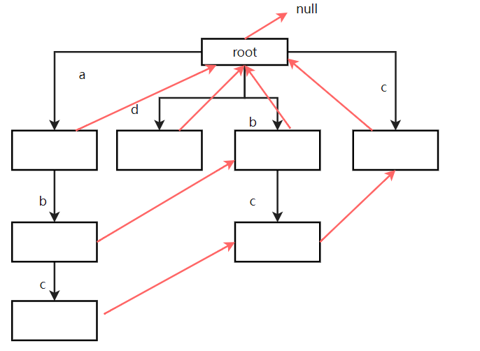

# 算法

## algorithmbasic2020

### class01

#### selectSort

- 链接：暂无

- 内容：

  > 将指定的数组排序

- 思路：

  >第一轮，查找1~N的最小值与0位置交换
  >
  >第二轮，查找2~N的最小值与1位置交换
  >
  >...
  >
  >第n-1轮，查找n-1~N的最小值与n-2位置交换

- 代码：

  ```java
  // 选择排序
      public static void selectSort(int[] arr){
          if(arr == null || arr.length < 2)
              return;
  
          for (int i = 0; i < arr.length-1; i++) {
               int minIndex = i;
              for (int j = minIndex+1; j < arr.length; j++) {
                  minIndex = arr[j] < arr[minIndex] ? j : minIndex;
              }
              swap(arr,minIndex,i);
          }
      }
      public static void swap(int[] arr,int i,int j){
          int temp = arr[i];
          arr[i] = arr[j];
          arr[j] = temp;
      }
  ```

  

#### bubbleSort

- 链接：暂无

- 内容：

  > 将指定数组排序

- 思路：

  > 第一轮：从0~N-1,当i<i+1 且num[i]>num[i+1] 时,i与j对应的值相交换
  >
  > ....

- 代码：

  ```java
  // 冒泡排序
  public static void bubbleSort(int[] arr) {
  		if (arr == null || arr.length < 2) {
  			return;
  		}
  		// 0 ~ N-1
  		// 0 ~ N-2
  		// 0 ~ N-3
  		for (int e = arr.length - 1; e > 0; e--) { // 0 ~ e
  			for (int i = 0; i < e; i++) {
  				if (arr[i] > arr[i + 1]) {
  					swap(arr, i, i + 1);
  				}
  			}
  		}
  	}
  ```

  

#### insertSort

- 链接：暂无

- 内容：

  > 将指定数组排序

- 思路：

  > 将当前数据与前面已经排好序的数据进行处理，插入进指定位置

- 代码：

  ```java
  public static void insertionSort(int[] arr) {
  		if (arr == null || arr.length < 2) {
  			return;
  		}
  		// 不只1个数
  		for (int i = 1; i < arr.length; i++) { // 0 ~ i 做到有序
  			for (int j = i - 1; j >= 0 && arr[j] > arr[j + 1]; j--) {
  				swap(arr, j, j + 1);
  			}
  		}
  	}
  ```

  

#### BSExist

- 链接：暂无

- 内容：

  > 有序数组中是否存在num

- 思路：

  > 迭代搜索查找

- 代码：

  ```java
  public static boolean exist(int[] sortedArr, int num) {
  		if (sortedArr == null || sortedArr.length == 0) {
  			return false;
  		}
  		int L = 0;
  		int R = sortedArr.length - 1;
  		int mid = 0;
  		// L..R
  		while (L < R) { // L..R 至少两个数的时候
  			mid = L + ((R - L) >> 1);
  			if (sortedArr[mid] == num) {
  				return true;
  			} else if (sortedArr[mid] > num) {
  				R = mid - 1;
  			} else {
  				L = mid + 1;
  			}
  		}
  		return sortedArr[L] == num;
  	}
  ```

  

#### BSNearLeft

- 链接：暂无

- 内容：

  > 在有序arr上，找满足>=value的最左位置

- 思路：

  > 迭代遍历

- 代码：

  ```java
  	public static int nearestIndex(int[] arr, int value) {
  		int L = 0;
  		int R = arr.length - 1;
  		int index = -1; // 记录最左的对号
  		while (L <= R) { // 至少一个数的时候
  			int mid = L + ((R - L) >> 1);
  			if (arr[mid] >= value) {
  				index = mid;
  				R = mid - 1;
  			} else {
  				L = mid + 1;
  			}
  		}
  		return index;
  	}
  ```

  

#### BSNearRight

- 链接：暂无

- 内容：

  > 在有序arr上，找满足<=value的最右位置

- 思路：

  > 迭代遍历

- 代码：

  ```java
  	public static int nearestIndex(int[] arr, int value) {
  		int L = 0;
  		int R = arr.length - 1;
  		int index = -1; // 记录最右的对号
  		while (L <= R) {
  			int mid = L + ((R - L) >> 1);
  			if (arr[mid] <= value) {
  				index = mid;
  				L = mid + 1;
  			} else {
  				R = mid - 1;
  			}
  		}
  		return index;
  	}
  ```

  

#### BSAwesome

- 链接：暂无

- 内容：

  > 返回局部最小值所在的下标，此下标的值小于左右值（存在）

- 思路：

  > 判断两端是否存在，若存在则返回
  >
  > 对左右进行迭代遍历，取得当前的mid
  >
  > ​	若【mid】> 【mid-1】则【L,mid-1】一定有局部最小值
  >
  > ​	若【mid】> 【mid+1】则【mid+1,R】一定有局部最小值
  >
  > ​    否则【mid】< 【mid-1】且【mid】<【mid+1】,返回mid

- 代码：

  ```java
  public static int getLessIndex(int[] arr) {
  		if (arr == null || arr.length == 0) {
  			return -1;
  		}
  		if (arr.length == 1 || arr[0] < arr[1]) {
  			return 0;
  		}
  		if (arr[arr.length - 1] < arr[arr.length - 2]) {
  			return arr.length - 1;
  		}
  		int left = 1;
  		int right = arr.length - 2;
  		int mid = 0;
  		while (left < right) {
  			mid = (left + right) / 2;
  			if (arr[mid] > arr[mid - 1]) {
  				right = mid - 1;
  			} else if (arr[mid] > arr[mid + 1]) {
  				left = mid + 1;
  			} else {
  				return mid;
  			}
  		}
  		return left;
  	}
  ```


### class02

#### swap

- 链接：暂无

- 内容：

  > 给两个数字a与b,要求a与b的值相互交换

- 思路：

  > 思路1：使用临时变量
  >
  > 思路2：异或
  >
  > ​	原a,b
  >
  > ​	a = a^b
  >
  > ​	b = a^b=(a^b)^b=a
  >
  > ​	a = a^b=(a^b)^(a^b^b)=b

- 代码：

  ```java
  public static void swap (int[] arr, int i, int j) {
  		// arr[0] = arr[0] ^ arr[0];
  		int temp  = arr[j];
  		arr[j]  = arr[i];
  		arr[i]  = temp;
  	}
  public static void swap (int[] arr, int i, int j) {
  		// arr[0] = arr[0] ^ arr[0];
  		arr[i]  = arr[i] ^ arr[j];
  		arr[j]  = arr[i] ^ arr[j];
  		arr[i]  = arr[i] ^ arr[j];
  	}
  ```

  

#### evenTimesOddTimes

##### oneOdd

- 链接：暂无

- 内容

  > arr中，只有一种数，出现奇数次，求这个数字

- 思路：

  > 异或，异或的性质为同为0，且无关顺序

- 代码：

  ```java
  public static void printOddTimesNum1(int[] arr) {
  		int eor = 0;
  		for (int i = 0; i < arr.length; i++) {
  			eor ^= arr[i];
  		}
  		System.out.println(eor);
  	}
  ```

  

##### twoOdd

- 链接：暂无

- 内容

  > arr中，只有两种数，出现奇数次，求这两个数字

- 思路：

  > 异或，异或的性质为同为0，且无关顺序
  >
  > ​	遍历整个数组，异或后的结果实际上等价于这两个出现奇数次的数字异或的结果
  >
  > ​	这个结果肯定不等于0（两种数），那么这个数的32位上肯定有等于1的存在
  >
  > ​	把某一位上是否等于1的数字可以把arr划分成两组，且这两组刚好各包含一个不同的出现奇数次的数字
  >
  > ​	把问题转化为了oneOdd

- 代码：

  ```java
  // arr中，有两种数，出现奇数次
  	public static void printOddTimesNum2(int[] arr) {
  		int eor = 0;
  		for (int i = 0; i < arr.length; i++) {
  			eor ^= arr[i];
  		}
  		// a 和 b是两种数
  		// eor != 0
  		// eor最右侧的1，提取出来
  		// eor :     00110010110111000
  		// rightOne :00000000000001000
  		int rightOne = eor & (-eor); // 提取出最右的1
  		int onlyOne = 0; // eor'
  		for (int i = 0 ; i < arr.length;i++) {
  			//  arr[1] =  111100011110000
  			// rightOne=  000000000010000
  			if ((arr[i] & rightOne) != 0) {
  				onlyOne ^= arr[i];
  			}
  		}
  		System.out.println(onlyOne + " " + (eor ^ onlyOne));
  	}
  ```

#### KM

- 链接：暂无

- 内容：

  >  输入一定能够保证，数组中所有的数都出现了M次，只有一种数出现了K次，且1 <= K < M
  >
  >  返回这种数

- 思路：

  > 遍历数组，把数组中的数字对应位数值为1的数据+1
  >
  > 任意位数数值%M不等于0的表明要返回的这种数在这个位置上有1这个值
  >
  > 统计32位所有的数据，返回

- 代码：

  ```java
  	public static int km(int[] arr, int k, int m) {
  		int[] help = new int[32];
  		for (int num : arr) {
  			for (int i = 0; i < 32; i++) {
  				help[i] += (num >> i) & 1;
  			}
  		}
  		int ans = 0;
  		for (int i = 0; i < 32; i++) {
  			help[i] %= m;
  			if (help[i] != 0) {
  				ans |= 1 << i;
  			}
  		}
  		return ans;
  	}
  
  ```


### class03

#### reverseList

- 链接：暂无

- 内容：

  >反转单（双）链表

- 思路：

  > 对于任意一个节点，我们都可以通过这种方式来进行加节点。
  >
  > 所谓的反转链表，无非是使用头插法添加节点数据。
  >
  > 

  ```java
  // 链表节点
  	public static class Node {
  		public int value;
  		public Node next;
  		public Node(int data) {value = data;}
  	}
  	public static class DoubleNode {
  		public int value;
  		public DoubleNode last;
  		public DoubleNode next;
  		public DoubleNode(int data) {value = data;}
  	}
  ```

- 代码：

  ```java
  // 单链表 头插法
  	public static Node reverseLinkedList(Node head) {
  		Node pre = null;
  		Node next = null;
  		while (head != null) {
  			next = head.next;
  			head.next = pre;
  			pre = head;
  			head = next;
  		}
  		return pre;
  	}
  // 双链表 头插法
  	public static DoubleNode reverseDoubleList(DoubleNode head) {
  		DoubleNode pre = null;
  		DoubleNode next = null;
  		while (head != null) {
  			next = head.next;
  			head.next = pre;
  			head.last = next;
  			pre = head;
  			head = next;
  		}
  		return pre;
  	}
  ```

  

#### deleteGivenValue

- 链接：暂无 

- 内容：

  > 删除值为给定value的节点（可能有多个）

- 思路：

  > 先找到第一个值不为value的节点，以此为head
  >
  > pre.next = cur.next (删除cur节点，cur.val = value)

- 代码：

  ```java
  	public static class Node {
  		public int value;
  		public Node next;
  		public Node(int data) {this.value = data;}
  	}
  	// head = removeValue(head, 2);
  	public static Node removeValue(Node head, int num) {
  		// head来到第一个不需要删的位置
  		while (head != null) {
  			if (head.value != num) {
  				break;
  			}
  			head = head.next;
  		}
  		// 1 ) head == null
  		// 2 ) head != null
  		Node pre = head;
  		Node cur = head;
  		while (cur != null) {
  			if (cur.value == num) {
  				pre.next = cur.next;
  			} else {
  				pre = cur;
  			}
  			cur = cur.next;
  		}
  		return head;
  	}
  ```


#### doubleEndsQueueToStackAndQueue

- 链接：暂无

- 内容：

  > 使用双端队列实现栈与队列

- 思路：

  >栈是先进后出，队列是先进后出

  ```java
  public static class Node<T> {
  		public T value;
  		public Node<T> last;
  		public Node<T> next;
  		public Node(T data) {value = data;}
  	}
  
  	public static class DoubleEndsQueue<T> {
  		public Node<T> head;
  		public Node<T> tail;
  
  		public void addFromHead(T value) { // 头插法
  			Node<T> cur = new Node<T>(value);
  			if (head == null) {
  				head = cur;
  				tail = cur;
  			} else {
  				cur.next = head;
  				head.last = cur;
  				head = cur;
  			}
  		}
  
  		public void addFromBottom(T value) { // 尾插法
  			Node<T> cur = new Node<T>(value);
  			if (head == null) {
  				head = cur;
  				tail = cur;
  			} else {
  				cur.last = tail;
  				tail.next = cur;
  				tail = cur;
  			}
  		}
  
  		public T popFromHead() { // 头删法
  			if (head == null) {
  				return null;
  			}
  			Node<T> cur = head;
  			if (head == tail) {
  				head = null;
  				tail = null;
  			} else {
  				head = head.next;
  				cur.next = null;
  				head.last = null;
  			}
  			return cur.value;
  		}
  
  		public T popFromBottom() { // 尾删法
  			if (head == null) {
  				return null;
  			}
  			Node<T> cur = tail;
  			if (head == tail) {
  				head = null;
  				tail = null;
  			} else {
  				tail = tail.last;
  				tail.next = null;
  				cur.last = null;
  			}
  			return cur.value;
  		}
  
  		public boolean isEmpty() { // 判断是否为空
  			return head == null;
  		}
  
  	}
  
  ```

  

- 代码：

  ```java
  	public static class MyStack<T> { // 自定义栈
  		private DoubleEndsQueue<T> queue;
  
  		public MyStack() {
  			queue = new DoubleEndsQueue<T>();
  		}
  
  		public void push(T value) {
  			queue.addFromHead(value);
  		}
  
  		public T pop() {
  			return queue.popFromHead();
  		}
  
  		public boolean isEmpty() {
  			return queue.isEmpty();
  		}
  
  	}
  
  	public static class MyQueue<T> { // 自定义队列
  		private DoubleEndsQueue<T> queue;
  
  		public MyQueue() {
  			queue = new DoubleEndsQueue<T>();
  		}
  
  		public void push(T value) {
  			queue.addFromHead(value);
  		}
  
  		public T poll() {
  			return queue.popFromBottom();
  		}
  
  		public boolean isEmpty() {
  			return queue.isEmpty();
  		}
  
  	}
  ```

  

#### ringArray

- 链接：暂无 

- 内容：

  > 实现一个环形队列

- 思路：

  > 使用首尾index，及size大小判断环是否满

- 代码：

  ```java
  public static class MyQueue {
  		private int[] arr;
  		private int pushi;// end
  		private int polli;// begin
  		private int size;
  		private final int limit;
  
  		public MyQueue(int limit) {
  			arr = new int[limit];
  			pushi = 0;
  			polli = 0;
  			size = 0;
  			this.limit = limit;
  		}
  
  		public void push(int value) {
  			if (size == limit) {
  				throw new RuntimeException("队列满了，不能再加了");
  			}
  			size++;
  			arr[pushi] = value;
  			pushi = nextIndex(pushi);
  		}
  
  		public int pop() {
  			if (size == 0) {
  				throw new RuntimeException("队列空了，不能再拿了");
  			}
  			size--;
  			int ans = arr[polli];
  			polli = nextIndex(polli);
  			return ans;
  		}
  
  		public boolean isEmpty() {
  			return size == 0;
  		}
  
  		// 如果现在的下标是i，返回下一个位置
  		private int nextIndex(int i) {
  			return i < limit - 1 ? i + 1 : 0;
  		}
  
  	}
  ```

  

#### getMinStack

- 链接：暂无

- 内容：

  > 实现一个数据结构，在O(1)时间内返回当前栈的最小值

- 思路：

  > 使用两个栈来存储数据，一个存储值，一个存储最小值

- 代码：

  ```java
  	public static class MyStack1 {
  		private Stack<Integer> stackData;
  		private Stack<Integer> stackMin;
  		public MyStack1() {stackData = new Stack<Integer>();stackMin = new Stack<Integer>();}
  
  		public void push(int newNum) {
  			if (stackMin.isEmpty() || newNum <= this.getmin()) {
  				stackMin.push(newNum);
  			}
  			stackData.push(newNum);
  		}
  
  		public int pop() {
  			if (stackData.isEmpty()) {
  				throw new RuntimeException("Your stack is empty.");
  			}
  			int value = stackData.pop();
  			if (value == getmin()) {
  				stackMin.pop();
  			}
  			return value;
  		}
  
  		public int getmin() {
  			if (stackMin.isEmpty()) {
  				throw new RuntimeException("Your stack is empty.");
  			}
  			return stackMin.peek();
  		}
  	}
  ```

  

#### twoStacksImplementQueue

- 链接：https://leetcode.cn/problems/implement-queue-using-stacks/submissions

- 内容：

  > 使用两个栈实现一个队列

- 思路：

  > 两个栈，一个用来添加值，一个用来弹出值
  >
  > 无论添加还是弹出，都要保证另一个栈是空的。

- 代码：

  ```java
  	class MyQueue {
          Stack<Integer> s1,s2;
          public MyQueue() {
              s1 = new Stack<>();
              s2 = new Stack<>();
          }
  
          public void push(int x) {
              while (!s2.isEmpty()){
                  s1.push(s2.pop());
              }
              s1.push(x);
          }
  
          public int pop() {
              while (!s1.isEmpty()) {
                  s2.push(s1.pop());
              }
             return s2.pop();
          }
  
          public int peek() {
              while (!s1.isEmpty()) {
                  s2.push(s1.pop());
              }
              return s2.peek();
          }
  
          public boolean empty() {
              return s1.isEmpty() && s2.isEmpty();
          }
      }
  ```

  

#### twoQueueImplementStack

- 链接：暂无

- 内容：

  > 使用两个队列实现一个栈

- 思路：

  > 两个队列
  >
  > 添加元素时q2添加后，将q1的元素全部添加，再把q2与q1互换
  >
  > 删除元素或top时，都是对q1进行操作。

- 代码：

  ```java
  class MyStack {
      Queue<Integer> queue1 = new LinkedList<>();
      Queue<Integer> queue2 = new LinkedList<>();
      public MyStack() {
  
      }
      public void push(int x) {
          queue2.offer(x);
          while(!queue1.isEmpty()){
              queue2.offer(queue1.poll());
          }
          Queue<Integer> temp = queue1;
          queue1 = queue2;
          queue2 = temp;
      }
      public int pop() {
          return queue1.poll();
      }
      public int top() {
          return queue1.peek();
      }
      public boolean empty() {
          return queue1.isEmpty();
      }
  }
  ```

  

#### getMax

- 链接：暂无

- 内容：

  > 获取数组的最大值

- 思路：

  > 分治(递归)

- 代码：

  ```java
  	// 求arr中的最大值
  	public static int getMax(int[] arr) {
  		return process(arr, 0, arr.length - 1);
  	}
  
  	// arr[L..R]范围上求最大值  L ... R   N
  	public static int process(int[] arr, int L, int R) {
  		// arr[L..R]范围上只有一个数，直接返回，base case
  		if (L == R) { 
  			return arr[L];
  		}
  		// L...R 不只一个数
  		// mid = (L + R) / 2
  		int mid = L + ((R - L) >> 1); // 中点   	1
  		int leftMax = process(arr, L, mid);
  		int rightMax = process(arr, mid + 1, R);
  		return Math.max(leftMax, rightMax);
  	}
  ```

  

### class04

- 链接：暂无

- 内容：

  > 将一个数组进行排序

- 思路：

  > 归并排序（递归，迭代）

- 代码：

  ```java
  	// 递归方法实现
  	public static void mergeSort1(int[] arr) {
  		if (arr == null || arr.length < 2) {
  			return;
  		}
  		process(arr, 0, arr.length - 1);
  	}
  
  	// 请把arr[L..R]排有序
  	// l...r N
  	// T(N) = 2 * T(N / 2) + O(N)
  	// O(N * logN)
  	public static void process(int[] arr, int L, int R) {
  		if (L == R) { // base case
  			return;
  		}
  		int mid = L + ((R - L) >> 1);
  		process(arr, L, mid);
  		process(arr, mid + 1, R);
  		merge(arr, L, mid, R);
  	}
  
  	public static void merge(int[] arr, int L, int M, int R) {
  		int[] help = new int[R - L + 1];
  		int i = 0;
  		int p1 = L;
  		int p2 = M + 1;
  		while (p1 <= M && p2 <= R) {
  			help[i++] = arr[p1] <= arr[p2] ? arr[p1++] : arr[p2++];
  		}
  		// 要么p1越界了，要么p2越界了
  		while (p1 <= M) {
  			help[i++] = arr[p1++];
  		}
  		while (p2 <= R) {
  			help[i++] = arr[p2++];
  		}
  		for (i = 0; i < help.length; i++) {
  			arr[L + i] = help[i];
  		}
  	}
  	// 非递归方法实现(步长控制)
  	public static void mergeSort2(int[] arr) {
  		if (arr == null || arr.length < 2) {
  			return;
  		}
  		int N = arr.length;
  		// 步长
  		int mergeSize = 1;
  		while (mergeSize < N) { // log N
  			// 当前左组的，第一个位置
  			int L = 0;
  			while (L < N) {
  				if (mergeSize >= N - L) {
  					break;
  				}
  				int M = L + mergeSize - 1;
  				int R = M + Math.min(mergeSize, N - M - 1);
  				merge(arr, L, M, R);
  				L = R + 1;
  			}
  			// 防止溢出
  			if (mergeSize > N / 2) {
  				break;
  			}
  			mergeSize <<= 1;
  		}
  	}
  ```

  

#### smallSum

- 链接：暂无

- 内容：

  > 将一个数组进行排序，并返回小和的数量。
  >
  > 小和： 134  ->  13 14 34有2 * 1+3 * 1

- 思路：

  > 归并排序（递归）

- 代码：

  ```java
  	public static int smallSum(int[] arr) {
  		if (arr == null || arr.length < 2) {
  			return 0;
  		}
  		return process(arr, 0, arr.length - 1);
  	}
  
  	// arr[L..R]既要排好序，也要求小和返回
  	// 所有merge时，产生的小和，累加
  	// 左 排序   merge
  	// 右 排序  merge
  	// merge
  	public static int process(int[] arr, int l, int r) {
  		if (l == r) {
  			return 0;
  		}
  		// l < r
  		int mid = l + ((r - l) >> 1);
  		return 
  				process(arr, l, mid) 
  				+ 
  				process(arr, mid + 1, r) 
  				+ 
  				merge(arr, l, mid, r);
  	}
  
  	public static int merge(int[] arr, int L, int m, int r) {
  		int[] help = new int[r - L + 1];
  		int i = 0;
  		int p1 = L;
  		int p2 = m + 1;
  		int res = 0;
  		while (p1 <= m && p2 <= r) {
  			res += arr[p1] < arr[p2] ? (r - p2 + 1) * arr[p1] : 0;
  			help[i++] = arr[p1] < arr[p2] ? arr[p1++] : arr[p2++];
  		}
  		while (p1 <= m) {
  			help[i++] = arr[p1++];
  		}
  		while (p2 <= r) {
  			help[i++] = arr[p2++];
  		}
  		for (i = 0; i < help.length; i++) {
  			arr[L + i] = help[i];
  		}
  		return res;
  	}
  ```

  

#### reversePair

- 链接：暂无

- 内容：

  > 将一个数组进行排序，并返回逆序对的数量。
  >
  > 逆序对： 134  ->  共有0个逆序对
  >
  > ​				214  -> 21 一个逆序对

- 思路：

  > 归并排序（递归）

- 代码：

  ```java
  public static int reverPairNumber(int[] arr) {
  		if (arr == null || arr.length < 2) {
  			return 0;
  		}
  		return process(arr, 0, arr.length - 1);
  	}
  
  	// arr[L..R]既要排好序，也要求逆序对数量返回
  	// 所有merge时，产生的逆序对数量，累加，返回
  	// 左 排序 merge并产生逆序对数量
  	// 右 排序 merge并产生逆序对数量
  	public static int process(int[] arr, int l, int r) {
  		if (l == r) {
  			return 0;
  		}
  		// l < r
  		int mid = l + ((r - l) >> 1);
  		return process(arr, l, mid) + process(arr, mid + 1, r) + merge(arr, l, mid, r);
  	}
  
  	public static int merge(int[] arr, int L, int m, int r) {
  		int[] help = new int[r - L + 1];
  		int i = help.length - 1;
  		int p1 = m;
  		int p2 = r;
  		int res = 0;
  		while (p1 >= L && p2 > m) {
  			res += arr[p1] > arr[p2] ? (p2 - m) : 0;
  			help[i--] = arr[p1] > arr[p2] ? arr[p1--] : arr[p2--];
  		}
  		while (p1 >= L) {
  			help[i--] = arr[p1--];
  		}
  		while (p2 > m) {
  			help[i--] = arr[p2--];
  		}
  		for (i = 0; i < help.length; i++) {
  			arr[L + i] = help[i];
  		}
  		return res;
  	}
  
  ```

  

#### biggerThanRightTwice

- 链接：https://leetcode.cn/problems/reverse-pairs/

- 内容：

  > 将一个数组进行排序，并返回大于2 * 右侧值的数量。

- 思路：

  > 归并排序（递归）

- 代码：

  ```java
  public static int reversePairs(int[] arr) {
  		if (arr == null || arr.length < 2) {
  			return 0;
  		}
  		return process(arr, 0, arr.length - 1);
  	}
  
  	public static int process(int[] arr, int l, int r) {
  		if (l == r) {
  			return 0;
  		}
  		// l < r
  		int mid = l + ((r - l) >> 1);
  		return process(arr, l, mid) + process(arr, mid + 1, r) + merge(arr, l, mid, r);
  	}
  
  	public static int merge(int[] arr, int L, int m, int r) {
  		// [L....M] [M+1....R]
  		int ans = 0;
  		// 目前囊括进来的数，是从[M+1, windowR)
  		int windowR = m + 1;
  		for (int i = L; i <= m; i++) {
  			while (windowR <= r && (long) arr[i] > (long) arr[windowR] * 2) {
  				windowR++;
  			}
  			ans += windowR - m - 1;
  		}
  		int[] help = new int[r - L + 1];
  		int i = 0;
  		int p1 = L;
  		int p2 = m + 1;
  		while (p1 <= m && p2 <= r) {
  			help[i++] = arr[p1] <= arr[p2] ? arr[p1++] : arr[p2++];
  		}
  		while (p1 <= m) {
  			help[i++] = arr[p1++];
  		}
  		while (p2 <= r) {
  			help[i++] = arr[p2++];
  		}
  		for (i = 0; i < help.length; i++) {
  			arr[L + i] = help[i];
  		}
  		return ans;
  	}
  ```

  

### class05

#### countOfRangeSum

- 链接：https://leetcode.cn/problems/count-of-range-sum/

- 内容：

  > 返回所有子数组的值在[ lower, upper]内的数量

- 思路：

  > 归并排序（递归）+ 前缀和加速

- 代码：

  ```java
  public static int countRangeSum(int[] nums, int lower, int upper) {
  		if (nums == null || nums.length == 0) {
  			return 0;
  		}
  		long[] sum = new long[nums.length];
  		sum[0] = nums[0];
  		for (int i = 1; i < nums.length; i++) {
  			sum[i] = sum[i - 1] + nums[i];
  		}
  		return process(sum, 0, sum.length - 1, lower, upper);
  	}
  
  	public static int process(long[] sum, int L, int R, int lower, int upper) {
  		if (L == R) {
  			return sum[L] >= lower && sum[L] <= upper ? 1 : 0;
  		}
  		int M = L + ((R - L) >> 1);
  		return process(sum, L, M, lower, upper) + process(sum, M + 1, R, lower, upper)
  				+ merge(sum, L, M, R, lower, upper);
  	}
  
  	public static int merge(long[] arr, int L, int M, int R, int lower, int upper) {
  		int ans = 0;
  		int windowL = L;
  		int windowR = L;
  		// [windowL, windowR)
  		for (int i = M + 1; i <= R; i++) {
  			long min = arr[i] - upper;
  			long max = arr[i] - lower;
  			while (windowR <= M && arr[windowR] <= max) {
  				windowR++;
  			}
  			while (windowL <= M && arr[windowL] < min) {
  				windowL++;
  			}
  			ans += windowR - windowL;
  		}
  		long[] help = new long[R - L + 1];
  		int i = 0;
  		int p1 = L;
  		int p2 = M + 1;
  		while (p1 <= M && p2 <= R) {
  			help[i++] = arr[p1] <= arr[p2] ? arr[p1++] : arr[p2++];
  		}
  		while (p1 <= M) {
  			help[i++] = arr[p1++];
  		}
  		while (p2 <= R) {
  			help[i++] = arr[p2++];
  		}
  		for (i = 0; i < help.length; i++) {
  			arr[L + i] = help[i];
  		}
  		return ans;
  	}
  ```

  

#### partitionAndQuickSort

- 链接：https://leetcode.cn/problems/count-of-range-sum/

- 内容：

  > 快速排序

- 思路：

  > 快速排序，使用最右侧作划分值
  >
  > 快速排序+荷兰国旗
  >
  > 快速排序+荷兰国旗+随机数

- 代码：

  ```java
  	public static void quickSort1(int[] arr) {
  		if (arr == null || arr.length < 2) {
  			return;
  		}
  		process1(arr, 0, arr.length - 1);
  	}
  
  	public static void process1(int[] arr, int L, int R) {
  		if (L >= R) {
  			return;
  		}
  		// L..R partition arr[R] [ <=arr[R] arr[R] >arr[R] ]
  		int M = partition(arr, L, R);
  		process1(arr, L, M - 1);
  		process1(arr, M + 1, R);
  	}
  	// arr[L..R]上，以arr[R]位置的数做划分值
  	// <= X > X
  	// <= X X
  	public static int partition(int[] arr, int L, int R) {
  		if (L > R) {
  			return -1;
  		}
  		if (L == R) {
  			return L;
  		}
  		int lessEqual = L - 1;
  		int index = L;
  		while (index < R) {
  			if (arr[index] <= arr[R]) {
  				swap(arr, index, ++lessEqual);
  			}
  			index++;
  		}
  		swap(arr, ++lessEqual, R);
  		return lessEqual;
  	}
  	public static void swap(int[] arr, int i, int j) {
  		int tmp = arr[i];
  		arr[i] = arr[j];
  		arr[j] = tmp;
  	}
  
  // 2
  	public static void quickSort2(int[] arr) {
  		if (arr == null || arr.length < 2) {
  			return;
  		}
  		process2(arr, 0, arr.length - 1);
  	}
  
  	// arr[L...R] 排有序，快排2.0方式
  	public static void process2(int[] arr, int L, int R) {
  		if (L >= R) {
  			return;
  		}
  		// [ equalArea[0]  ,  equalArea[0]]
  		int[] equalArea = netherlandsFlag(arr, L, R);
  		process2(arr, L, equalArea[0] - 1);
  		process2(arr, equalArea[1] + 1, R);
  	}
  	// arr[L...R] 玩荷兰国旗问题的划分，以arr[R]做划分值
  	// <arr[R] ==arr[R] > arr[R]
  	public static int[] netherlandsFlag(int[] arr, int L, int R) {
  		if (L > R) { // L...R L>R
  			return new int[] { -1, -1 };
  		}
  		if (L == R) {
  			return new int[] { L, R };
  		}
  		int less = L - 1; // < 区 右边界
  		int more = R; // > 区 左边界
  		int index = L;
  		while (index < more) { // 当前位置，不能和 >区的左边界撞上
  			if (arr[index] == arr[R]) {
  				index++;
  			} else if (arr[index] < arr[R]) {
  //				swap(arr, less + 1, index);
  //				less++;
  //				index++;						
  				swap(arr, index++, ++less);
  			} else { // >
  				swap(arr, index, --more);
  			}
  		}
  		swap(arr, more, R); // <[R]   =[R]   >[R]
  		return new int[] { less + 1, more };
  	}
  
  	public static void quickSort3(int[] arr) {
  		if (arr == null || arr.length < 2) {
  			return;
  		}
  		process3(arr, 0, arr.length - 1);
  	}
  
  	public static void process3(int[] arr, int L, int R) {
  		if (L >= R) {
  			return;
  		}
  		swap(arr, L + (int) (Math.random() * (R - L + 1)), R);
  		int[] equalArea = netherlandsFlag(arr, L, R);
  		process3(arr, L, equalArea[0] - 1);
  		process3(arr, equalArea[1] + 1, R);
  	}
  ```

### class06

#### comparator

- 略，java的比较器

#### heapSort

- 链接：暂无

- 内容：

  > 堆排序

- 思路：

  > 先让堆从下到上调整，再让头与最后一个数据更换后，再在这个堆上进行调整
  >
  > 1，先让整个数组都变成大根堆结构，建立堆的过程:
  >
  > ​	1)从上到下的方法，时间复杂度为O(N * logN)
  >
  >  	2)从下到上的方法，时间复杂度为O(N)
  > 2，把堆的最大值和堆末尾的值交换，然后减少堆的大小之后，再去调整堆，一直周而复始,时间复杂度为O(N * logN)
  >
  > 3，堆的大小减小成0之后，排序完成

- 代码：

	```java
        // 堆排序额外空间复杂度O(1)
        public static void heapSort(int[] arr) {
            if (arr == null || arr.length < 2) {
                return;
            }
            // O(N*logN)
    //		for (int i = 0; i < arr.length; i++) { // O(N)
    //			heapInsert(arr, i); // O(logN)
    //		}
            // O(N)
            for (int i = arr.length - 1; i >= 0; i--) {
                heapify(arr, i, arr.length);
            }
            int heapSize = arr.length;
            swap(arr, 0, --heapSize);
            // O(N*logN)
            while (heapSize > 0) { // O(N)
                heapify(arr, 0, heapSize); // O(logN)
                swap(arr, 0, --heapSize); // O(1)
            }
        }
	
        // arr[index]刚来的数，往上
        public static void heapInsert(int[] arr, int index) {
            while (arr[index] > arr[(index - 1) / 2]) {
                swap(arr, index, (index - 1) / 2);
                index = (index - 1) / 2;
            }
        }
	
        // arr[index]位置的数，能否往下移动
        public static void heapify(int[] arr, int index, int heapSize) {
            int left = index * 2 + 1; // 左孩子的下标
            while (left < heapSize) { // 下方还有孩子的时候
                // 两个孩子中，谁的值大，把下标给largest
                // 1）只有左孩子，left -> largest
                // 2) 同时有左孩子和右孩子，右孩子的值<= 左孩子的值，left -> largest
                // 3) 同时有左孩子和右孩子并且右孩子的值> 左孩子的值， right -> largest
                int largest = left + 1 < heapSize && arr[left + 1] > arr[left] ? left + 1 : left;
                // 父和较大的孩子之间，谁的值大，把下标给largest
                largest = arr[largest] > arr[index] ? largest : index;
                if (largest == index) {
                    break;
                }
                swap(arr, largest, index);
                index = largest;
                left = index * 2 + 1;
            }
        }
	```


#### sortArrayDistanceLessK

- 链接：暂无

- 内容：

  > 已知一个几乎有序的数组。
  >
  > 几乎有序是指，如果把数组排好顺序的话，每个元素移动的距离一定不超过k，
  >
  > 并且k相对于数组长度来说是比较小的。
  >
  > 请选择一个合适的排序策略，对这个数组进行排序。

- 思路：

  > 【0，k】个元素确定第0个值，【1，k+1】确定第1个值...
  >
  > 创建一个长度为k的小根堆，每次堆满就pop一个值放入数组中，再添加一个值到小根堆中
  >
  > 最后若小根堆中还有值，则依次添加入数组中。

- 代码：

  ```java
  	public static void sortedArrDistanceLessK(int[] arr, int k) {
  		if (k == 0) {
  			return;
  		}
  		// 默认小根堆
  		PriorityQueue<Integer> heap = new PriorityQueue<>();
  		int index = 0;
  		// 0...K-1
  		for (; index <= Math.min(arr.length - 1, k - 1); index++) {
  			heap.add(arr[index]);
  		}
  		int i = 0;
  		for (; index < arr.length; i++, index++) {
  			heap.add(arr[index]);
  			arr[i] = heap.poll();
  		}
  		while (!heap.isEmpty()) {
  			arr[i++] = heap.poll();
  		}
  	}
  
  ```

  

### class07

#### coverMax

- 链接：暂无

- 内容：

  > 最大线段重合问题（用堆的实现)
  >
  > 给定很多线段，每个线段都有两个数[start, end],表示线段开始位置和结束位置，左右都是闭区间
  >
  > 规定︰
  > 	1）线段的开始和结束位置一定都是整数值
  >
  > ​	2）线段重合区域的长度必须>=1
  >
  > 返回线段最多重合区域中，包含了几条线段。

- 思路：

  > 思路一：使用x + 0.5这个位置，任一线段的区间内包含x+0.5则一定有一条线段，把所有的x+0.5的最大值返回
  >
  > 思路二：排序（辅助类）+小根堆 当来到的新的线段，当堆顶<=起始位置时，说明要把堆中符合的数据弹出，再把当前线段的结尾加入，当前的最多重合区域包含的线段数即是堆的大小 
  >
  > 思路三：排序（二维数组）+小根堆 同思路二。

- 代码：

  ```java
  	public static int maxCover1(int[][] lines) {
  		int min = Integer.MAX_VALUE;
  		int max = Integer.MIN_VALUE;
  		for (int i = 0; i < lines.length; i++) {
  			min = Math.min(min, lines[i][0]);
  			max = Math.max(max, lines[i][1]);
  		}
  		int cover = 0;
  		for (double p = min + 0.5; p < max; p += 1) {
  			int cur = 0;
  			for (int i = 0; i < lines.length; i++) {
  				if (lines[i][0] < p && lines[i][1] > p) {
  					cur++;
  				}
  			}
  			cover = Math.max(cover, cur);
  		}
  		return cover;
  	}
  
  	public static int maxCover2(int[][] m) {
  		Line[] lines = new Line[m.length];
  		for (int i = 0; i < m.length; i++) {
  			lines[i] = new Line(m[i][0], m[i][1]);
  		}
  		Arrays.sort(lines, new StartComparator());
  		// 小根堆，每一条线段的结尾数值，使用默认的
  		PriorityQueue<Integer> heap = new PriorityQueue<>();
  		int max = 0;
  		for (int i = 0; i < lines.length; i++) {
  			// lines[i] -> cur 在黑盒中，把<=cur.start 东西都弹出
  			while (!heap.isEmpty() && heap.peek() <= lines[i].start) {
  				heap.poll();
  			}
  			heap.add(lines[i].end);
  			max = Math.max(max, heap.size());
  		}
  		return max;
  	}
  
  	public static class Line {
  		public int start;
  		public int end;
  
  		public Line(int s, int e) {
  			start = s;
  			end = e;
  		}
  	}
  
  	public static class EndComparator implements Comparator<Line> {
  
  		@Override
  		public int compare(Line o1, Line o2) {
  			return o1.end - o2.end;
  		}
  
  	}
  
  	// 和maxCover2过程是一样的
  	// 只是代码更短
  	// 不使用类定义的写法
  	public static int maxCover3(int[][] m) {
  		// m是二维数组，可以认为m内部是一个一个的一维数组
  		// 每一个一维数组就是一个对象，也就是线段
  		// 如下的code，就是根据每一个线段的开始位置排序
  		// 比如, m = { {5,7}, {1,4}, {2,6} } 跑完如下的code之后变成：{ {1,4}, {2,6}, {5,7} }
  		Arrays.sort(m, (a, b) -> (a[0] - b[0]));
  		// 准备好小根堆，和课堂的说法一样
  		PriorityQueue<Integer> heap = new PriorityQueue<>();
  		int max = 0;
  		for (int[] line : m) {
  			while (!heap.isEmpty() && heap.peek() <= line[0]) {
  				heap.poll();
  			}
  			heap.add(line[1]);
  			max = Math.max(max, heap.size());
  		}
  		return max;
  	}
  ```

  

#### everyStepShowBoss

- 链接：暂无

- 内容：

  > - 给定一个整型数组, int[] arr;和一个布尔类型数组, boolean[] op。
  >   两个数组一定等长，假设长度为N, arr[i]表示客户编号，op[i]表示客户操作
  >
  > - arr = [ 3,3,1,2,1,2,5…
  >   op =  [T,T, T,T,F,T,F…
  >   依次表示∶3用户购买了一件商品，3用户购买了一件商品，1用户购买了一件商品，2用户购买了一件商品，1用户退货了一件商品，2用户购买了一件商品，5用户退货了一件商品…
  >
  > - 得奖系统的规则︰
  >   - 1，如果某个用户购买商品数为0，但是又发生了退货事件，
  >     则认为该事件无效，得奖名单和上一个事件发生后一致，例子中的5用户
  >
  >   - 2，某用户发生购买商品事件，购买商品数+1，发生退货事件，购买商品数-1
  >
  >   - 3，每次都是最多K个用户得奖，K也为传入的参数
  >
  >   - 4，得奖系统分为得奖区和候选区，任何用户只要购买数>0，一定在这两个区域中的一个
  >
  >   - 5，购买数最大的前K名用户进入得奖区，在最初时如果得奖区没有到达K个用户，那么新来的用户直接进入得奖区
  >
  >   - 6，如果购买数不足以进入得奖区的用户，进入候选区，如果根据全部规则，得奖人数确实不够K个，那就以不够的情况输出结果
  >
  >   - 7，如果候选区购买数最多的用户，已经足以进入得奖区，该用户就会替换得奖区中购买数最少的用户(大于才能替换)，如果得奖区中购买数最少的用户有多个，就替换最早进入得奖区的用户。如果候选区中购买数最多的用户有多个，机会会给最早进入候选区的用户
  >
  >   - 8，候选区和得奖区是两套时间，因用户只会在其中一个区域，所以只会有一个区域的时间，另一个没有从得奖区出来进入候选区的用户，得奖区时间删除，进入候选区的时间就是当前事件的时间(可以理解为arr[i]和op[i]中的i)从候选区出来进入得奖区的用户，候选区时间删除，进入得奖区的时间就是当前事件的时间（可以理解为arr[i]和op[i]中的i)
  >
  >   - 9，如果某用户购买数==0，不管在哪个区域都离开，区域时间删除。离开是指彻底离开，哪个区域也不会找到该用户。如果下次该用户又发生购买行为，产生>0的购买数，会再次根据之前规则回到某个区域中，进入区域的时间重记

- 思路：

  > 如流程表述，使用两个加强堆，一个是得将区指定长度为k为小根堆，一个是候选区无限长度为大根堆
  >
  > 当大根堆peek>得奖区peek，进行替换操作
  >
  > 触发**当大根堆peek>得奖区peek**条件的有这几个，得奖区退货，候选区买货

- 代码：（几乎全是业务上的，主要运用了**加强堆**）

  ```java
  public static class Customer {
  		public int id;
  		public int buy;
  		public int enterTime;
  
  		public Customer(int v, int b, int o) {
  			id = v;
  			buy = b;
  			enterTime = 0;
  		}
  	}
  
  	public static class CandidateComparator implements Comparator<Customer> {
  
  		@Override
  		public int compare(Customer o1, Customer o2) {
  			return o1.buy != o2.buy ? (o2.buy - o1.buy) : (o1.enterTime - o2.enterTime);
  		}
  
  	}
  
  	public static class DaddyComparator implements Comparator<Customer> {
  
  		@Override
  		public int compare(Customer o1, Customer o2) {
  			return o1.buy != o2.buy ? (o1.buy - o2.buy) : (o1.enterTime - o2.enterTime);
  		}
  
  	}
  
  	public static class WhosYourDaddy {
  		private HashMap<Integer, Customer> customers;
  		private HeapGreater<Customer> candHeap;
  		private HeapGreater<Customer> daddyHeap;
  		private final int daddyLimit;
  
  		public WhosYourDaddy(int limit) {
  			customers = new HashMap<Integer, Customer>();
  			candHeap = new HeapGreater<>(new CandidateComparator());
  			daddyHeap = new HeapGreater<>(new DaddyComparator());
  			daddyLimit = limit;
  		}
  
  		// 当前处理i号事件，arr[i] -> id,  buyOrRefund
  		public void operate(int time, int id, boolean buyOrRefund) {
  			if (!buyOrRefund && !customers.containsKey(id)) {
  				return;
  			}
  			if (!customers.containsKey(id)) {
  				customers.put(id, new Customer(id, 0, 0));
  			}
  			Customer c = customers.get(id);
  			if (buyOrRefund) {
  				c.buy++;
  			} else {
  				c.buy--;
  			}
  			if (c.buy == 0) {
  				customers.remove(id);
  			}
  			if (!candHeap.contains(c) && !daddyHeap.contains(c)) {
  				if (daddyHeap.size() < daddyLimit) {
  					c.enterTime = time;
  					daddyHeap.push(c);
  				} else {
  					c.enterTime = time;
  					candHeap.push(c);
  				}
  			} else if (candHeap.contains(c)) {
  				if (c.buy == 0) {
  					candHeap.remove(c);
  				} else {
  					candHeap.resign(c);
  				}
  			} else {
  				if (c.buy == 0) {
  					daddyHeap.remove(c);
  				} else {
  					daddyHeap.resign(c);
  				}
  			}
  			daddyMove(time);
  		}
  
  		public List<Integer> getDaddies() {
  			List<Customer> customers = daddyHeap.getAllElements();
  			List<Integer> ans = new ArrayList<>();
  			for (Customer c : customers) {
  				ans.add(c.id);
  			}
  			return ans;
  		}
  
  		private void daddyMove(int time) {
  			if (candHeap.isEmpty()) {
  				return;
  			}
  			if (daddyHeap.size() < daddyLimit) {
  				Customer p = candHeap.pop();
  				p.enterTime = time;
  				daddyHeap.push(p);
  			} else {
  				if (candHeap.peek().buy > daddyHeap.peek().buy) {
  					Customer oldDaddy = daddyHeap.pop();
  					Customer newDaddy = candHeap.pop();
  					oldDaddy.enterTime = time;
  					newDaddy.enterTime = time;
  					daddyHeap.push(newDaddy);
  					candHeap.push(oldDaddy);
  				}
  			}
  		}
  
  	}
  
  	public static List<List<Integer>> topK(int[] arr, boolean[] op, int k) {
  		List<List<Integer>> ans = new ArrayList<>();
  		WhosYourDaddy whoDaddies = new WhosYourDaddy(k);
  		for (int i = 0; i < arr.length; i++) {
  			whoDaddies.operate(i, arr[i], op[i]);
  			ans.add(whoDaddies.getDaddies());
  		}
  		return ans;
  	}
  
  	// 干完所有的事，模拟，不优化
  	public static List<List<Integer>> compare(int[] arr, boolean[] op, int k) {
  		HashMap<Integer, Customer> map = new HashMap<>();
  		ArrayList<Customer> cands = new ArrayList<>();
  		ArrayList<Customer> daddy = new ArrayList<>();
  		List<List<Integer>> ans = new ArrayList<>();
  		for (int i = 0; i < arr.length; i++) {
  			int id = arr[i];
  			boolean buyOrRefund = op[i];
  			if (!buyOrRefund && !map.containsKey(id)) {
  				ans.add(getCurAns(daddy));
  				continue;
  			}
  			// 没有发生：用户购买数为0并且又退货了
  			// 用户之前购买数是0，此时买货事件
  			// 用户之前购买数>0， 此时买货
  			// 用户之前购买数>0, 此时退货
  			if (!map.containsKey(id)) {
  				map.put(id, new Customer(id, 0, 0));
  			}
  			// 买、卖
  			Customer c = map.get(id);
  			if (buyOrRefund) {
  				c.buy++;
  			} else {
  				c.buy--;
  			}
  			if (c.buy == 0) {
  				map.remove(id);
  			}
  			// c
  			// 下面做
  			if (!cands.contains(c) && !daddy.contains(c)) {
  				if (daddy.size() < k) {
  					c.enterTime = i;
  					daddy.add(c);
  				} else {
  					c.enterTime = i;
  					cands.add(c);
  				}
  			}
  			cleanZeroBuy(cands);
  			cleanZeroBuy(daddy);
  			cands.sort(new CandidateComparator());
  			daddy.sort(new DaddyComparator());
  			move(cands, daddy, k, i);
  			ans.add(getCurAns(daddy));
  		}
  		return ans;
  	}
  
  	public static void move(ArrayList<Customer> cands, ArrayList<Customer> daddy, int k, int time) {
  		if (cands.isEmpty()) {
  			return;
  		}
  		// 候选区不为空
  		if (daddy.size() < k) {
  			Customer c = cands.get(0);
  			c.enterTime = time;
  			daddy.add(c);
  			cands.remove(0);
  		} else { // 等奖区满了，候选区有东西
  			if (cands.get(0).buy > daddy.get(0).buy) {
  				Customer oldDaddy = daddy.get(0);
  				daddy.remove(0);
  				Customer newDaddy = cands.get(0);
  				cands.remove(0);
  				newDaddy.enterTime = time;
  				oldDaddy.enterTime = time;
  				daddy.add(newDaddy);
  				cands.add(oldDaddy);
  			}
  		}
  	}
  
  	public static void cleanZeroBuy(ArrayList<Customer> arr) {
  		List<Customer> noZero = new ArrayList<Customer>();
  		for (Customer c : arr) {
  			if (c.buy != 0) {
  				noZero.add(c);
  			}
  		}
  		arr.clear();
  		for (Customer c : noZero) {
  			arr.add(c);
  		}
  	}
  
  	public static List<Integer> getCurAns(ArrayList<Customer> daddy) {
  		List<Integer> ans = new ArrayList<>();
  		for (Customer c : daddy) {
  			ans.add(c.id);
  		}
  		return ans;
  	}
  ```

  

#### headGreater

- 链接：暂无

- 内容：

  > 加强堆

- 思路：

  > 实现一个加强堆。
  >
  > heap 堆
  >
  > indexMap 堆的反向索引表
  >
  > heapSize 堆的长度
  >
  > comp 泛型T的比较器
  >
  > 

- 代码：

  ```java
  public class HeapGreater<T> {
  
  	private ArrayList<T> heap;
  	private HashMap<T, Integer> indexMap;
  	private int heapSize;
  	private Comparator<? super T> comp;
  
  	public HeapGreater(Comparator<? super T> c) {
  		heap = new ArrayList<>();
  		indexMap = new HashMap<>();
  		heapSize = 0;
  		comp = c;
  	}
  
  	public boolean isEmpty() {
  		return heapSize == 0;
  	}
  
  	public int size() {
  		return heapSize;
  	}
  
  	public boolean contains(T obj) { // 是否包含这个T，直接用map判断
  		return indexMap.containsKey(obj);
  	}
   
  	public T peek() { // 堆顶，一直是list[0]
  		return heap.get(0);
  	}
  
  	public void push(T obj) { 
          // list在末尾添加一个数据，并添加在反向索引表中，看此值与其父compare
          // 若成功，则一直继续直到失败。成功了，则在list中把位置互换，在反向索引表中位置互换
  		heap.add(obj);
  		indexMap.put(obj, heapSize);
  		heapInsert(heapSize++);
  	}
  
  	public T pop() { 
          // 弹出操作，先将list[0]与list[size-1]在list与索引表中互换，再在list和索引表中删除最后一个元素
          // 然后将值从上到下进行调整，最后返回删除的值
  		T ans = heap.get(0);
  		swap(0, heapSize - 1);
  		indexMap.remove(ans);
  		heap.remove(--heapSize);
  		heapify(0);
  		return ans;
  	}
  
  	public void remove(T obj) {
          // 加强功能，删除任一obj
          // 将删除的位置的值与最后的值的list与索引表中值互换，然后删除最后一个
          // 在删除的位置进行重新的添加和调整(向上向下)操作
  		T replace = heap.get(heapSize - 1);
  		int index = indexMap.get(obj);
  		indexMap.remove(obj);
  		heap.remove(--heapSize);
  		if (obj != replace) {
  			heap.set(index, replace);
  			indexMap.put(replace, index);
  			resign(replace);
  		}
  	}
  
      // obj这个位置向上调整
      // obj这个位置向下调整
  	public void resign(T obj) {
  		heapInsert(indexMap.get(obj));
  		heapify(indexMap.get(obj));
  	}
  
  	// 请返回堆上的所有元素
  	public List<T> getAllElements() {
  		List<T> ans = new ArrayList<>();
  		for (T c : heap) {
  			ans.add(c);
  		}
  		return ans;
  	}
  
      // 在指定位置进行向上调整
  	private void heapInsert(int index) {
  		while (comp.compare(heap.get(index), heap.get((index - 1) / 2)) < 0) {
  			swap(index, (index - 1) / 2);
  			index = (index - 1) / 2;
  		}
  	}
  
      // 在index位置向下调整
  	private void heapify(int index) {
  		int left = index * 2 + 1;
  		while (left < heapSize) {
  			int best = left + 1 < heapSize && comp.compare(heap.get(left + 1), heap.get(left)) < 0 ? (left + 1) : left;
  			best = comp.compare(heap.get(best), heap.get(index)) < 0 ? best : index;
  			if (best == index) {
  				break;
  			}
  			swap(best, index);
  			index = best;
  			left = index * 2 + 1;
  		}
  	}
  
      // 交换双方在list和索引表中的值
  	private void swap(int i, int j) {
  		T o1 = heap.get(i);
  		T o2 = heap.get(j);
  		heap.set(i, o2);
  		heap.set(j, o1);
  		indexMap.put(o2, i);
  		indexMap.put(o1, j);
  	}
  
  }
  
  ```

  


### class08

#### trie

- 链接：https://leetcode.cn/problems/implement-trie-ii-prefix-tree/

- 内容：

  > 前缀树。
  
- 思路：

  > 数组实现，节点只存经过此节点的数量与以此节点结尾的数量。
  >
  > 字符值存在路径中。
  
- 代码：

  ```java
  	class Trie {
  
  		class Node {
  			public int pass;
  			public int end;
  			public Node[] nexts;
  
  			public Node() {
  				pass = 0;
  				end = 0;
  				nexts = new Node[26];
  			}
  		}
  
  		private Node root;
  
  		public Trie() {
  			root = new Node();
  		}
  
  		public void insert(String word) {
  			if (word == null) {
  				return;
  			}
  			char[] str = word.toCharArray();
  			Node node = root;
  			node.pass++;
  			int path = 0;
  			for (int i = 0; i < str.length; i++) { // 从左往右遍历字符
  				path = str[i] - 'a'; // 由字符，对应成走向哪条路
  				if (node.nexts[path] == null) {
  					node.nexts[path] = new Node();
  				}
  				node = node.nexts[path];
  				node.pass++;
  			}
  			node.end++;
  		}
  
  		public void erase(String word) {
  			if (countWordsEqualTo(word) != 0) {
  				char[] chs = word.toCharArray();
  				Node node = root;
  				node.pass--;
  				int path = 0;
  				for (int i = 0; i < chs.length; i++) {
  					path = chs[i] - 'a';
  					if (--node.nexts[path].pass == 0) {
  						node.nexts[path] = null;
  						return;
  					}
  					node = node.nexts[path];
  				}
  				node.end--;
  			}
  		}
  
  		public int countWordsEqualTo(String word) {
  			if (word == null) {
  				return 0;
  			}
  			char[] chs = word.toCharArray();
  			Node node = root;
  			int index = 0;
  			for (int i = 0; i < chs.length; i++) {
  				index = chs[i] - 'a';
  				if (node.nexts[index] == null) {
  					return 0;
  				}
  				node = node.nexts[index];
  			}
  			return node.end;
  		}
  
  		public int countWordsStartingWith(String pre) {
  			if (pre == null) {
  				return 0;
  			}
  			char[] chs = pre.toCharArray();
  			Node node = root;
  			int index = 0;
  			for (int i = 0; i < chs.length; i++) {
  				index = chs[i] - 'a';
  				if (node.nexts[index] == null) {
  					return 0;
  				}
  				node = node.nexts[index];
  			}
  			return node.pass;
  		}
  	}
  
  ```

  

#### countSort

- 链接：暂无

- 内容：

  > 数量排序（非比较）。only for 0~200 value

- 思路：

  > 准备200容量的数组，每个数组arr[i]代表value为i的数量。

- 代码：

  ```java
  	// only for 0~200 value
  	public static void countSort(int[] arr) {
  		if (arr == null || arr.length < 2) {
  			return;
  		}
  		int max = Integer.MIN_VALUE;
  		for (int i = 0; i < arr.length; i++) {
  			max = Math.max(max, arr[i]);
  		}
  		int[] bucket = new int[max + 1];
  		for (int i = 0; i < arr.length; i++) {
  			bucket[arr[i]]++;
  		}
  		int i = 0;
  		for (int j = 0; j < bucket.length; j++) {
  			while (bucket[j]-- > 0) {
  				arr[i++] = j;
  			}
  		}
  	}
  ```

  

#### radixSort

- 链接：暂无

- 内容：

  > 基数（桶）排序，数据非负

- 思路：

  > 对每一位进行进桶出桶，最后的出桶顺序即是所求

- 代码：

  ```java
  // only for no-negative value
  	public static void radixSort(int[] arr) {
  		if (arr == null || arr.length < 2) {
  			return;
  		}
  		radixSort(arr, 0, arr.length - 1, maxbits(arr));
  	}
  
  	public static int maxbits(int[] arr) {
  		int max = Integer.MIN_VALUE;
  		for (int i = 0; i < arr.length; i++) {
  			max = Math.max(max, arr[i]);
  		}
  		int res = 0;
  		while (max != 0) {
  			res++;
  			max /= 10;
  		}
  		return res;
  	}
  
  	// arr[L..R]排序  ,  最大值的十进制位数digit
  	public static void radixSort(int[] arr, int L, int R, int digit) {
  		final int radix = 10;
  		int i = 0, j = 0;
  		// 有多少个数准备多少个辅助空间
  		int[] help = new int[R - L + 1];
  		for (int d = 1; d <= digit; d++) { // 有多少位就进出几次
  			// 10个空间
  		    // count[0] 当前位(d位)是0的数字有多少个
  			// count[1] 当前位(d位)是(0和1)的数字有多少个
  			// count[2] 当前位(d位)是(0、1和2)的数字有多少个
  			// count[i] 当前位(d位)是(0~i)的数字有多少个
  			int[] count = new int[radix]; // count[0..9]
  			for (i = L; i <= R; i++) {
  				// 103  1   3
  				// 209  1   9
  				j = getDigit(arr[i], d);
  				count[j]++;
  			}
              // 为了使出桶顺序是以这个d位为基础的顺序
  			for (i = 1; i < radix; i++) {
  				count[i] = count[i] + count[i - 1];
  			}
  			for (i = R; i >= L; i--) {
  				j = getDigit(arr[i], d);
  				help[count[j] - 1] = arr[i];
  				count[j]--;
  			}
  			for (i = L, j = 0; i <= R; i++, j++) {
  				arr[i] = help[j];
  			}
  		}
  	}
  
  	public static int getDigit(int x, int d) {
  		return ((x / ((int) Math.pow(10, d - 1))) % 10);
  	}
  ```

  

#### shellSort

- 链接：暂无

- 内容：

  > 希尔排序。

- 思路：

  > 以指定步长数据进行分批次处理，内部使用插入排序。
  >
  > 直到步长为1处理后结束。

- 代码：

  ```java
   //希尔排序移动法
      public static void shellSort(int[] arr) {
          int count = 0;//记录第几轮排序
          for (int gap = arr.length / 2; gap > 0; gap /= 2) {//gap为增量
              for (int i = gap; i < arr.length; i++) {//按增量分组进行插入排序
                  int index = i;
                  int temp = arr[i];
                  if (arr[index] < arr[index - gap]) {
                      while (index - gap >= 0 && temp < arr[index - gap]) {
                          arr[index] = arr[index - gap];
                          index -= gap;
                      }
                      arr[index] = temp;
                  }
              }
          }
      }
  ```

  

- 排序算法总结

  > 1不基于比较的排序，对样本数据有严格要求，不易改写
  > 2基于比较的排序，只要规定好两个样本怎么比大小就可以直接复用
  > 3基于比较的排序，时间复杂度的极限是O(N*logN)
  > 4时间复杂度O(N+logN)、额外空间复杂度低于O(N)、且稳定的基于比较的排序是不存在的。
  > 5为了绝对的速度选快排、为了省空间选堆排、为了稳定性选归并

### class09

- 面试时链表解题的方法论

  > 1)对于笔试，不用太在乎空间复杂度，一切为了时间复杂度
  > 2)对于面试，时间复杂度依然放在第一位，但是一定要找到空间最省的方法

- 链表面试题常用数据结构和技巧

  > 1)使用容器(哈希表、数组等)
  > 2)快慢指针

#### LinkedListMid

- 链接：暂无

- 内容：

  > 1)输入链表头节点，奇数长度返回中点，偶数长度返回上中点 midOrUpMidNode
  > 2)输入链表头节点，奇数长度返回中点，偶数长度返回下中点 midOrDownMidNode
  > 3)输入链表头节点，奇数长度返回中点前一个，偶数长度返回上中点前一个 midOrUpMidPreNode
  > 4)输入链表头节点，奇数长度返回中点前一个，偶数长度返回下中点前一个 midOrDownMidPreNode

- 思路：

  > 快慢指针
  
- 代码：

  ```java
  public static class Node {
  		public int value;
  		public Node next;
  
  		public Node(int v) {
  			value = v;
  		}
  	}
  
  	// head 头
  	public static Node midOrUpMidNode(Node head) {
  		if (head == null || head.next == null || head.next.next == null) {
  			return head;
  		}
  		// 链表有3个点或以上
  		Node slow = head.next;
  		Node fast = head.next.next;
  		while (fast.next != null && fast.next.next != null) {
  			slow = slow.next;
  			fast = fast.next.next;
  		}
  		return slow;
  	}
  
  	public static Node midOrDownMidNode(Node head) {
  		if (head == null || head.next == null) {
  			return head;
  		}
  		Node slow = head.next;
  		Node fast = head.next;
  		while (fast.next != null && fast.next.next != null) {
  			slow = slow.next;
  			fast = fast.next.next;
  		}
  		return slow;
  	}
  
  	public static Node midOrUpMidPreNode(Node head) {
  		if (head == null || head.next == null || head.next.next == null) {
  			return null;
  		}
  		Node slow = head;
  		Node fast = head.next.next;
  		while (fast.next != null && fast.next.next != null) {
  			slow = slow.next;
  			fast = fast.next.next;
  		}
  		return slow;
  	}
  
  	public static Node midOrDownMidPreNode(Node head) {
  		if (head == null || head.next == null) {
  			return null;
  		}
  		if (head.next.next == null) {
  			return head;
  		}
  		Node slow = head;
  		Node fast = head.next;
  		while (fast.next != null && fast.next.next != null) {
  			slow = slow.next;
  			fast = fast.next.next;
  		}
  		return slow;
  	}
  ```

  

#### IsPalindromeList

- 链接：暂无

- 内容：

  > 给定一个单链表的头节点head，请判断该链表是否为回文结构。
  > 1）哈希表方法特别简单（笔试用)
  > 2）改原链表的方法就需要注意边界了（面试用)。

- 思路：

  > hash（栈）方法：略
  >
  > 改原链表：先找上中位点，将其reverse，后比较，再reverse回，返回结果

- 代码：

  ```java
  // need n extra space
  	public static boolean isPalindrome1(Node head) {
  		Stack<Node> stack = new Stack<Node>();
  		Node cur = head;
  		while (cur != null) {
  			stack.push(cur);
  			cur = cur.next;
  		}
  		while (head != null) {
  			if (head.value != stack.pop().value) {
  				return false;
  			}
  			head = head.next;
  		}
  		return true;
  	}
  
  	// need n/2 extra space
  	public static boolean isPalindrome2(Node head) {
  		if (head == null || head.next == null) {
  			return true;
  		}
  		Node right = head.next;
  		Node cur = head;
  		while (cur.next != null && cur.next.next != null) {
  			right = right.next;
  			cur = cur.next.next;
  		}
  		Stack<Node> stack = new Stack<Node>();
  		while (right != null) {
  			stack.push(right);
  			right = right.next;
  		}
  		while (!stack.isEmpty()) {
  			if (head.value != stack.pop().value) {
  				return false;
  			}
  			head = head.next;
  		}
  		return true;
  	}	
  // need O(1) extra space
  	public static boolean isPalindrome3(Node head) {
  		if (head == null || head.next == null) {
  			return true;
  		}
  		Node n1 = head;
  		Node n2 = head;
  		while (n2.next != null && n2.next.next != null) { // find mid node
  			n1 = n1.next; // n1 -> mid
  			n2 = n2.next.next; // n2 -> end
  		}
  		// n1 中点
  		
  		n2 = n1.next; // n2 -> right part first node
  		n1.next = null; // mid.next -> null
  		Node n3 = null;
  		while (n2 != null) { // right part convert
  			n3 = n2.next; // n3 -> save next node
  			n2.next = n1; // next of right node convert
  			n1 = n2; // n1 move
  			n2 = n3; // n2 move
  		}
  		n3 = n1; // n3 -> save last node
  		n2 = head;// n2 -> left first node
  		boolean res = true;
  		while (n1 != null && n2 != null) { // check palindrome
  			if (n1.value != n2.value) {
  				res = false;
  				break;
  			}
  			n1 = n1.next; // left to mid
  			n2 = n2.next; // right to mid
  		}
  		n1 = n3.next;
  		n3.next = null;
  		while (n1 != null) { // recover list
  			n2 = n1.next;
  			n1.next = n3;
  			n3 = n1;
  			n1 = n2;
  		}
  		return res;
  	}
  
  ```

  


#### SmallerEqualBigger

- 链接：暂无

- 内容：

  > 将单向链表按某值划分成左边小、中间相等、右边大的形式
  > 1)把链表放入数组里，在数组上做partition(笔试用)
  > 2)分成小、中、大三部分，再把各个部分之间串起来(面试用)。

- 思路：

  > 数组法：略
  >
  > 三链表法：尾接头(存在)，尾接头(存在)

- 代码：

  ```java
  	public static Node listPartition1(Node head, int pivot) {
  		if (head == null) {
  			return head;
  		}
  		Node cur = head;
  		int i = 0;
  		while (cur != null) {
  			i++;
  			cur = cur.next;
  		}
  		Node[] nodeArr = new Node[i];
  		i = 0;
  		cur = head;
  		for (i = 0; i != nodeArr.length; i++) {
  			nodeArr[i] = cur;
  			cur = cur.next;
  		}
  		arrPartition(nodeArr, pivot);
  		for (i = 1; i != nodeArr.length; i++) {
  			nodeArr[i - 1].next = nodeArr[i];
  		}
  		nodeArr[i - 1].next = null;
  		return nodeArr[0];
  	}
  
  	public static void arrPartition(Node[] nodeArr, int pivot) {
  		int small = -1;
  		int big = nodeArr.length;
  		int index = 0;
  		while (index != big) {
  			if (nodeArr[index].value < pivot) {
  				swap(nodeArr, ++small, index++);
  			} else if (nodeArr[index].value == pivot) {
  				index++;
  			} else {
  				swap(nodeArr, --big, index);
  			}
  		}
  	}
  
  	public static void swap(Node[] nodeArr, int a, int b) {
  		Node tmp = nodeArr[a];
  		nodeArr[a] = nodeArr[b];
  		nodeArr[b] = tmp;
  	}
  
  	public static Node listPartition2(Node head, int pivot) {
  		Node sH = null; // small head
  		Node sT = null; // small tail
  		Node eH = null; // equal head
  		Node eT = null; // equal tail
  		Node mH = null; // big head
  		Node mT = null; // big tail
  		Node next = null; // save next node
  		// every node distributed to three lists
  		while (head != null) {
  			next = head.next;
  			head.next = null;
  			if (head.value < pivot) {
  				if (sH == null) {
  					sH = head;
  					sT = head;
  				} else {
  					sT.next = head;
  					sT = head;
  				}
  			} else if (head.value == pivot) {
  				if (eH == null) {
  					eH = head;
  					eT = head;
  				} else {
  					eT.next = head;
  					eT = head;
  				}
  			} else {
  				if (mH == null) {
  					mH = head;
  					mT = head;
  				} else {
  					mT.next = head;
  					mT = head;
  				}
  			}
  			head = next;
  		}
  		// 小于区域的尾巴，连等于区域的头，等于区域的尾巴连大于区域的头
  		if (sT != null) { // 如果有小于区域
  			sT.next = eH;
  			eT = eT == null ? sT : eT; // 下一步，谁去连大于区域的头，谁就变成eT
  		}
  		// 下一步，一定是需要用eT 去接 大于区域的头
  		// 有等于区域，eT -> 等于区域的尾结点
  		// 无等于区域，eT -> 小于区域的尾结点
  		// eT 尽量不为空的尾巴节点
  		if (eT != null) { // 如果小于区域和等于区域，不是都没有
  			eT.next = mH;
  		}
  		return sH != null ? sH : (eH != null ? eH : mH);
  	}
  ```

  


#### CopyListWithRandom

- 链接：https://leetcode.cn/problems/copy-list-with-random-pointer/

- 内容：

  > 给你一个长度为 `n` 的链表，每个节点包含一个额外增加的随机指针 `random` ，该指针可以指向链表中的任何节点或空节点。
  >
  > 构造这个链表的 **[深拷贝]**。 深拷贝应该正好由 `n` 个 **全新** 节点组成，其中每个新节点的值都设为其对应的原节点的值。新节点的 `next` 指针和 `random` 指针也都应指向复制链表中的新节点，并使原链表和复制链表中的这些指针能够表示相同的链表状态。**复制链表中的指针都不应指向原链表中的节点** 。
  >
  > 例如，如果原链表中有 `X` 和 `Y` 两个节点，其中 `X.random --> Y` 。那么在复制链表中对应的两个节点 `x` 和 `y` ，同样有 `x.random --> y` 。
  >
  > 返回复制链表的头节点。
  >
  > 用一个由 `n` 个节点组成的链表来表示输入/输出中的链表。每个节点用一个 `[val, random_index]` 表示：
  >
  > - `val`：一个表示 `Node.val` 的整数。
  > - `random_index`：随机指针指向的节点索引（范围从 `0` 到 `n-1`）；如果不指向任何节点，则为 `null` 。
  >
  > 你的代码 **只** 接受原链表的头节点 `head` 作为传入参数。。

- 思路：

  > hash法：略
  >
  > 链表法：先在每一个节点后加一个新的节点与其对应。
  >
  > 最后将每个节点的random与其后一个节点的random指向对应
  >
  > 最后断开节点之间的联系，保存新的节点链表。

- 代码：

  ```java
  	public static Node copyRandomList1(Node head) {
  		// key 老节点
  		// value 新节点
  		HashMap<Node, Node> map = new HashMap<Node, Node>();
  		Node cur = head;
  		while (cur != null) {
  			map.put(cur, new Node(cur.val));
  			cur = cur.next;
  		}
  		cur = head;
  		while (cur != null) {
  			// cur 老
  			// map.get(cur) 新
  			// 新.next ->  cur.next克隆节点找到
  			map.get(cur).next = map.get(cur.next);
  			map.get(cur).random = map.get(cur.random);
  			cur = cur.next;
  		}
  		return map.get(head);
  	}
  
  	public static Node copyRandomList2(Node head) {
  		if (head == null) {
  			return null;
  		}
  		Node cur = head;
  		Node next = null;
  		// 1 -> 2 -> 3 -> null
  		// 1 -> 1' -> 2 -> 2' -> 3 -> 3'
  		while (cur != null) {
  			next = cur.next;
  			cur.next = new Node(cur.val);
  			cur.next.next = next;
  			cur = next;
  		}
  		cur = head;
  		Node copy = null;
  		// 1 1' 2 2' 3 3'
  		// 依次设置 1' 2' 3' random指针
  		while (cur != null) {
  			next = cur.next.next;
  			copy = cur.next;
  			copy.random = cur.random != null ? cur.random.next : null;
  			cur = next;
  		}
  		Node res = head.next;
  		cur = head;
  		// 老 新 混在一起，next方向上，random正确
  		// next方向上，把新老链表分离
  		while (cur != null) {
  			next = cur.next.next;
  			copy = cur.next;
  			cur.next = next;
  			copy.next = next != null ? next.next : null;
  			cur = next;
  		}
  		return res;
  	}
  ```

  

### class10

#### FindFirstIntersectNode

- 链接：暂无

- 内容：

  > 给定两个可能有环也可能无环的单链表，头节点head1和head2。
  >
  > 请实现一个函数，如果两个链表相交，请返回相交的第一个节点。如果不相交，返回null
  >
  > 【要求】
  >
  > ​	如果两个链表长度之和为N，时间复杂度请达到O(N)，额外空间复杂度请达到O(1)。。

- 思路：

  > 两个链表是否相交，可以先判断是否有环，只有两个同时有环或无环，才可能相交。
  >
  > 1）无环，先得到各自的长度，长度长的那个先前进n-m，然后两个链表同时向后移动，当移动过程中两个链表的节点相等，则返回，直到最后都不相等则返回null。
  >
  > 2）有环，
  >
  > ​	1、得到各自到入环节点的距离，同1）思路
  >
  > ​	2、如果在入环前不存在，则在环内判断，一个在入环节点处，一个遍历其本身环内，直到一圈，若相等，则返回。最后，仍不相等，则返回null

- 代码：

  ```java
  public static Node getIntersectNode(Node head1, Node head2) {
  		if (head1 == null || head2 == null) {
  			return null;
  		}
  		Node loop1 = getLoopNode(head1);
  		Node loop2 = getLoopNode(head2);
  		if (loop1 == null && loop2 == null) {
  			return noLoop(head1, head2);
  		}
  		if (loop1 != null && loop2 != null) {
  			return bothLoop(head1, loop1, head2, loop2);
  		}
  		return null;
  	}
  
  	// 找到链表第一个入环节点，如果无环，返回null
  	public static Node getLoopNode(Node head) {
  		if (head == null || head.next == null || head.next.next == null) {
  			return null;
  		}
  		// n1 慢  n2 快
  		Node slow = head.next; // n1 -> slow
  		Node fast = head.next.next; // n2 -> fast
  		while (slow != fast) {
  			if (fast.next == null || fast.next.next == null) {
  				return null;
  			}
  			fast = fast.next.next;
  			slow = slow.next;
  		}
  		// slow fast  相遇
  		fast = head; // n2 -> walk again from head
  		while (slow != fast) {
  			slow = slow.next;
  			fast = fast.next;
  		}
  		return slow;
  	}
  
  	// 如果两个链表都无环，返回第一个相交节点，如果不想交，返回null
  	public static Node noLoop(Node head1, Node head2) {
  		if (head1 == null || head2 == null) {
  			return null;
  		}
  		Node cur1 = head1;
  		Node cur2 = head2;
  		int n = 0;
  		while (cur1.next != null) {
  			n++;
  			cur1 = cur1.next;
  		}
  		while (cur2.next != null) {
  			n--;
  			cur2 = cur2.next;
  		}
  		if (cur1 != cur2) {
  			return null;
  		}
  		// n  :  链表1长度减去链表2长度的值
  		cur1 = n > 0 ? head1 : head2; // 谁长，谁的头变成cur1
  		cur2 = cur1 == head1 ? head2 : head1; // 谁短，谁的头变成cur2
  		n = Math.abs(n);
  		while (n != 0) {
  			n--;
  			cur1 = cur1.next;
  		}
  		while (cur1 != cur2) {
  			cur1 = cur1.next;
  			cur2 = cur2.next;
  		}
  		return cur1;
  	}
  
  	// 两个有环链表，返回第一个相交节点，如果不想交返回null
  	public static Node bothLoop(Node head1, Node loop1, Node head2, Node loop2) {
  		Node cur1 = null;
  		Node cur2 = null;
  		if (loop1 == loop2) {
  			cur1 = head1;
  			cur2 = head2;
  			int n = 0;
  			while (cur1 != loop1) {
  				n++;
  				cur1 = cur1.next;
  			}
  			while (cur2 != loop2) {
  				n--;
  				cur2 = cur2.next;
  			}
  			cur1 = n > 0 ? head1 : head2;
  			cur2 = cur1 == head1 ? head2 : head1;
  			n = Math.abs(n);
  			while (n != 0) {
  				n--;
  				cur1 = cur1.next;
  			}
  			while (cur1 != cur2) {
  				cur1 = cur1.next;
  				cur2 = cur2.next;
  			}
  			return cur1;
  		} else {
  			cur1 = loop1.next;
  			while (cur1 != loop1) {
  				if (cur1 == loop2) {
  					return loop1;
  				}
  				cur1 = cur1.next;
  			}
  			return null;
  		}
  	}
  ```

  

#### recursiveTraversalBT

- 链接：暂无

- 内容：

  > 递归遍历二叉树。

- 思路：

  > 前中后序打印

- 代码：

  ```java
  	// 先序打印所有节点
  	public static void pre(Node head) {
  		if (head == null) {
  			return;
  		}
  		System.out.println(head.value);
  		pre(head.left);
  		pre(head.right);
  	}
  
  	public static void in(Node head) {
  		if (head == null) {
  			return;
  		}
  		in(head.left);
  		System.out.println(head.value);
  		in(head.right);
  	}
  
  	public static void pos(Node head) {
  		if (head == null) {
  			return;
  		}
  		pos(head.left);
  		pos(head.right);
  		System.out.println(head.value);
  	}
  ```

#### unRecursiveTraversalBT

- 链接：暂无

- 内容：

  > 非递归遍历二叉树。

- 思路：

  > 前中后序打印

- 代码：

  ```java
  public static void pre(Node head) {
  		System.out.print("pre-order: ");
  		if (head != null) {
  			Stack<Node> stack = new Stack<Node>();
  			stack.push(head);
  			while (!stack.isEmpty()) {
  				head = stack.pop();
  				System.out.print(head.value + " ");
  				if (head.right != null) {
  					stack.push(head.right);
  				}
  				if (head.left != null) {
  					stack.push(head.left);
  				}
  			}
  		}
  		System.out.println();
  	}
  
  	public static void in(Node cur) {
  		System.out.print("in-order: ");
  		if (cur != null) {
  			Stack<Node> stack = new Stack<Node>();
  			while (!stack.isEmpty() || cur != null) {
  				if (cur != null) {
  					stack.push(cur);
  					cur = cur.left;
  				} else {
  					cur = stack.pop();
  					System.out.print(cur.value + " ");
  					cur = cur.right;
  				}
  			}
  		}
  		System.out.println();
  	}
  
  	public static void pos1(Node head) {
  		System.out.print("pos-order: ");
  		if (head != null) {
  			Stack<Node> s1 = new Stack<Node>();
  			Stack<Node> s2 = new Stack<Node>();
  			s1.push(head);
  			while (!s1.isEmpty()) {
  				head = s1.pop(); // 头 右 左
  				s2.push(head);
  				if (head.left != null) {
  					s1.push(head.left);
  				}
  				if (head.right != null) {
  					s1.push(head.right);
  				}
  			}
  			// 左 右 头
  			while (!s2.isEmpty()) {
  				System.out.print(s2.pop().value + " ");
  			}
  		}
  		System.out.println();
  	}
  
  	public static void pos2(Node h) {
  		System.out.print("pos-order: ");
  		if (h != null) {
  			Stack<Node> stack = new Stack<Node>();
  			stack.push(h);
  			Node c = null;
  			while (!stack.isEmpty()) {
  				c = stack.peek();
  				if (c.left != null && h != c.left && h != c.right) {
  					stack.push(c.left);
  				} else if (c.right != null && h != c.right) {
  					stack.push(c.right);
  				} else {
  					System.out.print(stack.pop().value + " ");
  					h = c;
  				}
  			}
  		}
  		System.out.println();
  	}
  ```

  

### class11

#### levelTraversalBT

- 链接：暂无

- 内容：

  > 实现二叉树的按层遍历
  > 1)其实就是宽度优先遍历，用队列
  > 2)可以通过设置flag变量的方式，来发现某一层的结束（看题目)

- 思路：

  > 队列

- 代码：

  ```java
  	public static void level(Node head) {
  		if (head == null) {
  			return;
  		}
  		Queue<Node> queue = new LinkedList<>();
  		queue.add(head);
  		while (!queue.isEmpty()) {
  			Node cur = queue.poll();
  			System.out.println(cur.value);
  			if (cur.left != null) {
  				queue.add(cur.left);
  			}
  			if (cur.right != null) {
  				queue.add(cur.right);
  			}
  		}
  	}
  ```

  


#### serializeAndReconstructTree

- 链接：暂无

- 内容：

  > 实现二叉树的序列化和反序列化
  > 1)先序方式序列化和反序列化
  > 2)按层方式序列化和反序列化。

- 思路：

  > 先序后序序列化与反序列化
  >
  > 层序列化与反序列化

- 代码：

  ```java
  	public static Queue<String> preSerial(Node head) {
  		Queue<String> ans = new LinkedList<>();
  		pres(head, ans);
  		return ans;
  	}
  
  	public static void pres(Node head, Queue<String> ans) {
  		if (head == null) {
  			ans.add(null);
  		} else {
  			ans.add(String.valueOf(head.value));
  			pres(head.left, ans);
  			pres(head.right, ans);
  		}
  	}
  
  
  	public static Queue<String> posSerial(Node head) {
  		Queue<String> ans = new LinkedList<>();
  		poss(head, ans);
  		return ans;
  	}
  
  	public static void poss(Node head, Queue<String> ans) {
  		if (head == null) {
  			ans.add(null);
  		} else {
  			poss(head.left, ans);
  			poss(head.right, ans);
  			ans.add(String.valueOf(head.value));
  		}
  	}
  
  	public static Node buildByPreQueue(Queue<String> prelist) {
  		if (prelist == null || prelist.size() == 0) {
  			return null;
  		}
  		return preb(prelist);
  	}
  
  	public static Node preb(Queue<String> prelist) {
  		String value = prelist.poll();
  		if (value == null) {
  			return null;
  		}
  		Node head = new Node(Integer.valueOf(value));
  		head.left = preb(prelist);
  		head.right = preb(prelist);
  		return head;
  	}
  
  	public static Node buildByPosQueue(Queue<String> poslist) {
  		if (poslist == null || poslist.size() == 0) {
  			return null;
  		}
  		// 左右中  ->  stack(中右左)
  		Stack<String> stack = new Stack<>();
  		while (!poslist.isEmpty()) {
  			stack.push(poslist.poll());
  		}
  		return posb(stack);
  	}
  
  	public static Node posb(Stack<String> posstack) {
  		String value = posstack.pop();
  		if (value == null) {
  			return null;
  		}
  		Node head = new Node(Integer.valueOf(value));
  		head.right = posb(posstack);
  		head.left = posb(posstack);
  		return head;
  	}
  
  	public static Queue<String> levelSerial(Node head) {
  		Queue<String> ans = new LinkedList<>();
  		if (head == null) {
  			ans.add(null);
  		} else {
  			ans.add(String.valueOf(head.value));
  			Queue<Node> queue = new LinkedList<Node>();
  			queue.add(head);
  			while (!queue.isEmpty()) {
  				head = queue.poll(); // head 父   子
  				if (head.left != null) {
  					ans.add(String.valueOf(head.left.value));
  					queue.add(head.left);
  				} else {
  					ans.add(null);
  				}
  				if (head.right != null) {
  					ans.add(String.valueOf(head.right.value));
  					queue.add(head.right);
  				} else {
  					ans.add(null);
  				}
  			}
  		}
  		return ans;
  	}
  
  	public static Node buildByLevelQueue(Queue<String> levelList) {
  		if (levelList == null || levelList.size() == 0) {
  			return null;
  		}
  		Node head = generateNode(levelList.poll());
  		Queue<Node> queue = new LinkedList<Node>();
  		if (head != null) {
  			queue.add(head);
  		}
  		Node node = null;
  		while (!queue.isEmpty()) {
  			node = queue.poll();
  			node.left = generateNode(levelList.poll());
  			node.right = generateNode(levelList.poll());
  			if (node.left != null) {
  				queue.add(node.left);
  			}
  			if (node.right != null) {
  				queue.add(node.right);
  			}
  		}
  		return head;
  	}
  	public static Node generateNode(String val) {
  		if (val == null) {
  			return null;
  		}
  		return new Node(Integer.valueOf(val));
  	}
  ```

#### encodeNaryTreeToBinaryTree

- 链接：https://leetcode.cn/problems/encode-n-ary-tree-to-binary-tree

- 内容：

  > 将n叉树编码为二叉树。

- 思路：

  > 递归调用

- 代码：

  ```java
  class Codec {
  		// Encodes an n-ary tree to a binary tree.
  		public TreeNode encode(Node root) {
  			if (root == null) {
  				return null;
  			}
  			TreeNode head = new TreeNode(root.val);
  			head.left = en(root.children);
  			return head;
  		}
  
  		private TreeNode en(List<Node> children) {
  			TreeNode head = null;
  			TreeNode cur = null;
  			for (Node child : children) {
  				TreeNode tNode = new TreeNode(child.val);
  				if (head == null) {
  					head = tNode;
  				} else {
  					cur.right = tNode;
  				}
  				cur = tNode;
  				cur.left = en(child.children);
  			}
  			return head;
  		}
  
  		// Decodes your binary tree to an n-ary tree.
  		public Node decode(TreeNode root) {
  			if (root == null) {
  				return null;
  			}
  			return new Node(root.val, de(root.left));
  		}
  
  		public List<Node> de(TreeNode root) {
  			List<Node> children = new ArrayList<>();
  			while (root != null) {
  				Node cur = new Node(root.val, de(root.left));
  				children.add(cur);
  				root = root.right;
  			}
  			return children;
  		}
  
  	}
  ```


#### treeMaxWidth

- 链接：暂无

- 内容：

  > 求二叉树最宽的层有多少个节点。

- 思路：

  > map法：略
  >
  > 队列法：层序遍历+size flag

- 代码：

  ```java
  public static int maxWidthUseMap(Node head) {
  		if (head == null) {
  			return 0;
  		}
  		Queue<Node> queue = new LinkedList<>();
  		queue.add(head);
  		// key 在 哪一层，value
  		HashMap<Node, Integer> levelMap = new HashMap<>();
  		levelMap.put(head, 1);
  		int curLevel = 1; // 当前你正在统计哪一层的宽度
  		int curLevelNodes = 0; // 当前层curLevel层，宽度目前是多少
  		int max = 0;
  		while (!queue.isEmpty()) {
  			Node cur = queue.poll();
  			int curNodeLevel = levelMap.get(cur);
  			if (cur.left != null) {
  				levelMap.put(cur.left, curNodeLevel + 1);
  				queue.add(cur.left);
  			}
  			if (cur.right != null) {
  				levelMap.put(cur.right, curNodeLevel + 1);
  				queue.add(cur.right);
  			}
  			if (curNodeLevel == curLevel) {
  				curLevelNodes++;
  			} else {
  				max = Math.max(max, curLevelNodes);
  				curLevel++;
  				curLevelNodes = 1;
  			}
  		}
  		max = Math.max(max, curLevelNodes);
  		return max;
  	}
  
  	public static int maxWidthNoMap(Node head) {
  		if (head == null) {
  			return 0;
  		}
  		Queue<Node> queue = new LinkedList<>();
  		queue.add(head);
  		Node curEnd = head; // 当前层，最右节点是谁
  		Node nextEnd = null; // 下一层，最右节点是谁
  		int max = 0;
  		int curLevelNodes = 0; // 当前层的节点数
  		while (!queue.isEmpty()) {
  			Node cur = queue.poll();
  			if (cur.left != null) {
  				queue.add(cur.left);
  				nextEnd = cur.left;
  			}
  			if (cur.right != null) {
  				queue.add(cur.right);
  				nextEnd = cur.right;
  			}
  			curLevelNodes++;
  			if (cur == curEnd) {
  				max = Math.max(max, curLevelNodes);
  				curLevelNodes = 0;
  				curEnd = nextEnd;
  			}
  		}
  		return max;
  	}
  ```

  


#### successorNode

- 链接：暂无

- 内容：

  > 给你二叉树中的某个节点，返回该节点的后继节点。

- 思路：

  > 有右子树，一定在右子树的最左节点上
  >
  > 无右子树，其后继是 某第一个节点为根的子树，该节点为其左子树中的节点

- 代码：

  ```java
  public static class Node {
  		public int value;
  		public Node left;
  		public Node right;
  		public Node parent;
  
  		public Node(int data) {
  			this.value = data;
  		}
  	}
  
  	public static Node getSuccessorNode(Node node) {
  		if (node == null) {
  			return node;
  		}
  		if (node.right != null) {
  			return getLeftMost(node.right);
  		} else { // 无右子树
  			Node parent = node.parent;
  			while (parent != null && parent.right == node) { // 当前节点是其父亲节点右孩子
  				node = parent;
  				parent = node.parent;
  			}
  			return parent;
  		}
  	}
  
  	public static Node getLeftMost(Node node) {
  		if (node == null) {
  			return node;
  		}
  		while (node.left != null) {
  			node = node.left;
  		}
  		return node;
  	}
  ```

  

#### paperFolding

- 链接：暂无

- 内容：

  > 请把一段纸条竖着放在桌子上，然后从纸条的下边向上方对折1次，压出折痕后展开。此时折痕是凹下去的，即折痕突起的方向指向纸条的背面。
  >
  > 如果从纸条的下边向上方连续对折2次，压出折痕后展开，此时有三条折痕，从上到下依次是下折痕、下折痕和上折痕。
  >
  > 给定一个输入参数N，代表纸条都从下边向上方连续对折N次。请从上到下打印所有折痕的方向。
  >
  > 例如:N=1时，打印: down N=2时，打印: down down up。

- 思路：

  > 单纯的二叉树的中序遍历问题

- 代码：

  ```java
  public static void printAllFolds(int N) {
  		process(1, N, true);
  		System.out.println();
  	}
  
  	// 当前你来了一个节点，脑海中想象的！
  	// 这个节点在第i层，一共有N层，N固定不变的
  	// 这个节点如果是凹的话，down = T
  	// 这个节点如果是凸的话，down = F
  	// 函数的功能：中序打印以你想象的节点为头的整棵树！
  	public static void process(int i, int N, boolean down) {
  		if (i > N) {
  			return;
  		}
  		process(i + 1, N, true);
  		System.out.print(down ? "凹 " : "凸 ");
  		process(i + 1, N, false);
  	}
  ```

  

### class12

#### isCBT

- 链接：暂无

- 内容：

  > 判断一个二叉树是否为完全二叉树

- 思路：

  > 队列法 + null值
  >
  > 二叉树的递归套路

- 代码：

  ```java
  public static boolean isCBT1(Node head) {
  		if (head == null) {
  			return true;
  		}
  		LinkedList<Node> queue = new LinkedList<>();
  		// 是否遇到过左右两个孩子不双全的节点
  		boolean leaf = false;
  		Node l = null;
  		Node r = null;
  		queue.add(head);
  		while (!queue.isEmpty()) {
  			head = queue.poll();
  			l = head.left;
  			r = head.right;
  			if (
  			// 如果遇到了不双全的节点之后，又发现当前节点不是叶节点
  			    (leaf && (l != null || r != null)) 
  			    || 
  			    (l == null && r != null)
  
  			) {
  				return false;
  			}
  			if (l != null) {
  				queue.add(l);
  			}
  			if (r != null) {
  				queue.add(r);
  			}
  			if (l == null || r == null) {
  				leaf = true;
  			}
  		}
  		return true;
  	}
  
  public static boolean isCBT2(Node head) {
  		if (head == null) {
  			return true;
  		}
  		return process(head).isCBT;
  	}
  
  	// 对每一棵子树，是否是满二叉树、是否是完全二叉树、高度
  	public static class Info {
  		public boolean isFull;
  		public boolean isCBT;
  		public int height;
  
  		public Info(boolean full, boolean cbt, int h) {
  			isFull = full;
  			isCBT = cbt;
  			height = h;
  		}
  	}
  
  	public static Info process(Node X) {
  		if (X == null) {
  			return new Info(true, true, 0);
  		}
  		Info leftInfo = process(X.left);
  		Info rightInfo = process(X.right);
  		
  		
  		
  		int height = Math.max(leftInfo.height, rightInfo.height) + 1;
  		
  		
  		boolean isFull = leftInfo.isFull 
  				&& 
  				rightInfo.isFull 
  				&& leftInfo.height == rightInfo.height;
  		
  		
  		boolean isCBT = false;
  		if (isFull) {
  			isCBT = true;
  		} else { // 以x为头整棵树，不满
  			if (leftInfo.isCBT && rightInfo.isCBT) {
  				
  				
  				if (leftInfo.isCBT 
  						&& rightInfo.isFull 
  						&& leftInfo.height == rightInfo.height + 1) {
  					isCBT = true;
  				}
  				if (leftInfo.isFull 
  						&& 
  						rightInfo.isFull 
  						&& leftInfo.height == rightInfo.height + 1) {
  					isCBT = true;
  				}
  				if (leftInfo.isFull 
  						&& rightInfo.isCBT && leftInfo.height == rightInfo.height) {
  					isCBT = true;
  				}
  				
  				
  			}
  		}
  		return new Info(isFull, isCBT, height);
  	}
  ```

  


#### isBST

- 链接：暂无

- 内容：

  > 是否为搜索二叉树。

- 思路：

  > 思路一：转list
  >
  > 思路二：二叉树的递归套路

- 代码：

  ```java
  	public static boolean isBST1(Node head) {
  		if (head == null) {
  			return true;
  		}
  		ArrayList<Node> arr = new ArrayList<>();
  		in(head, arr);
  		for (int i = 1; i < arr.size(); i++) {
  			if (arr.get(i).value <= arr.get(i - 1).value) {
  				return false;
  			}
  		}
  		return true;
  	}
  
  	public static void in(Node head, ArrayList<Node> arr) {
  		if (head == null) {
  			return;
  		}
  		in(head.left, arr);
  		arr.add(head);
  		in(head.right, arr);
  	}
  
  	public static boolean isBST2(Node head) {
  		if (head == null) {
  			return true;
  		}
  		return process(head).isBST;
  	}
  
  	public static class Info {
  		public boolean isBST;
  		public int max;
  		public int min;
  
  		public Info(boolean i, int ma, int mi) {
  			isBST = i;
  			max = ma;
  			min = mi;
  		}
  
  	}
  
  	public static Info process(Node x) {
  		if (x == null) {
  			return null;
  		}
  		Info leftInfo = process(x.left);
  		Info rightInfo = process(x.right);
  		int max = x.value;
  		if (leftInfo != null) {
  			max = Math.max(max, leftInfo.max);
  		}
  		if (rightInfo != null) {
  			max = Math.max(max, rightInfo.max);
  		}
  		int min = x.value;
  		if (leftInfo != null) {
  			min = Math.min(min, leftInfo.min);
  		}
  		if (rightInfo != null) {
  			min = Math.min(min, rightInfo.min);
  		}
  		boolean isBST = true;
  		if (leftInfo != null && !leftInfo.isBST) {
  			isBST = false;
  		}
  		if (rightInfo != null && !rightInfo.isBST) {
  			isBST = false;
  		}
  		if (leftInfo != null && leftInfo.max >= x.value) {
  			isBST = false;
  		}
  		if (rightInfo != null && rightInfo.min <= x.value) {
  			isBST = false;
  		}
  		return new Info(isBST, max, min);
  	}
  ```

  

#### isBalanced

- 链接：暂无

- 内容：

  > 是否为平衡二叉树。

- 思路：

  > 思路一：递归
  >
  > 思路二：二叉树递归套路

- 代码：

  ```java
  public static boolean isBalanced1(Node head) {
  		boolean[] ans = new boolean[1];
  		ans[0] = true;
  		process1(head, ans);
  		return ans[0];
  	}
  
  	public static int process1(Node head, boolean[] ans) {
  		if (!ans[0] || head == null) {
  			return -1;
  		}
  		int leftHeight = process1(head.left, ans);
  		int rightHeight = process1(head.right, ans);
  		if (Math.abs(leftHeight - rightHeight) > 1) {
  			ans[0] = false;
  		}
  		return Math.max(leftHeight, rightHeight) + 1;
  	}
  
  	public static boolean isBalanced2(Node head) {
  		return process(head).isBalanced;
  	}
  	
  	public static class Info{
  		public boolean isBalanced;
  		public int height;
  		
  		public Info(boolean i, int h) {
  			isBalanced = i;
  			height = h;
  		}
  	}
  	
  	public static Info process(Node x) {
  		if(x == null) {
  			return new Info(true, 0);
  		}
  		Info leftInfo = process(x.left);
  		Info rightInfo = process(x.right);
  		int height = Math.max(leftInfo.height, rightInfo.height)  + 1;
  		boolean isBalanced = true;
  		if(!leftInfo.isBalanced) {
  			isBalanced = false;
  		}
  		if(!rightInfo.isBalanced) {
  			isBalanced = false;
  		}
  		if(Math.abs(leftInfo.height - rightInfo.height) > 1) {
  			isBalanced = false;
  		}
  		return new Info(isBal);
      }            
  ```

  


#### isFull

- 链接：暂无

- 内容：

  > 是否为满二叉树。

- 思路：

  > 思路一：统计高度及节点数量
  >
  > 思路二：二叉树的递归套路

- 代码：

  ```java
  // 第一种方法
  	// 收集整棵树的高度h，和节点数n
  	// 只有满二叉树满足 : 2 ^ h - 1 == n
  	public static boolean isFull1(Node head) {
  		if (head == null) {
  			return true;
  		}
  		Info1 all = process1(head);
  		return (1 << all.height) - 1 == all.nodes;
  	}
  
  	public static class Info1 {
  		public int height;
  		public int nodes;
  
  		public Info1(int h, int n) {
  			height = h;
  			nodes = n;
  		}
  	}
  
  	public static Info1 process1(Node head) {
  		if (head == null) {
  			return new Info1(0, 0);
  		}
  		Info1 leftInfo = process1(head.left);
  		Info1 rightInfo = process1(head.right);
  		int height = Math.max(leftInfo.height, rightInfo.height) + 1;
  		int nodes = leftInfo.nodes + rightInfo.nodes + 1;
  		return new Info1(height, nodes);
  	}
  
  	// 第二种方法
  	// 收集子树是否是满二叉树
  	// 收集子树的高度
  	// 左树满 && 右树满 && 左右树高度一样 -> 整棵树是满的
  	public static boolean isFull2(Node head) {
  		if (head == null) {
  			return true;
  		}
  		return process2(head).isFull;
  	}
  
  	public static class Info2 {
  		public boolean isFull;
  		public int height;
  
  		public Info2(boolean f, int h) {
  			isFull = f;
  			height = h;
  		}
  	}
  
  	public static Info2 process2(Node h) {
  		if (h == null) {
  			return new Info2(true, 0);
  		}
  		Info2 leftInfo = process2(h.left);
  		Info2 rightInfo = process2(h.right);
  		boolean isFull = leftInfo.isFull && rightInfo.isFull && leftInfo.height == rightInfo.height;
  		int height = Math.max(leftInfo.height, rightInfo.height) + 1;
  		return new Info2(isFull, height);
  	}
  ```

  

#### maxSubBSTSize

- 链接：https://leetcode.cn/problems/largest-bst-subtree

- 内容：

  > 找到最大的子树为搜索二叉树的节点数返回

- 思路：

  > 二叉树的递归套路

- 代码：

  ```java
  public static int largestBSTSubtree(TreeNode head) {
  		if (head == null) {
  			return 0;
  		}
  		return process(head).maxBSTSubtreeSize;
  	}
  
  	public static class Info {
  		public int maxBSTSubtreeSize;
  		public int allSize;
  		public int max;
  		public int min;
  
  		public Info(int m, int a, int ma, int mi) {
  			maxBSTSubtreeSize = m;
  			allSize = a;
  			max = ma;
  			min = mi;
  		}
  	}
  
  	public static Info process(TreeNode x) {
  		if (x == null) {
  			return null;
  		}
  		Info leftInfo = process(x.left);
  		Info rightInfo = process(x.right);
  		int max = x.val;
  		int min = x.val;
  		int allSize = 1;
  		if (leftInfo != null) {
  			max = Math.max(leftInfo.max, max);
  			min = Math.min(leftInfo.min, min);
  			allSize += leftInfo.allSize;
  		}
  		if (rightInfo != null) {
  			max = Math.max(rightInfo.max, max);
  			min = Math.min(rightInfo.min, min);
  			allSize += rightInfo.allSize;
  		}
  		int p1 = -1;
  		if (leftInfo != null) {
  			p1 = leftInfo.maxBSTSubtreeSize;
  		}
  		int p2 = -1;
  		if (rightInfo != null) {
  			p2 = rightInfo.maxBSTSubtreeSize;
  		}
  		int p3 = -1;
  		boolean leftBST = leftInfo == null ? true : (leftInfo.maxBSTSubtreeSize == leftInfo.allSize);
  		boolean rightBST = rightInfo == null ? true : (rightInfo.maxBSTSubtreeSize == rightInfo.allSize);
  		if (leftBST && rightBST) {
  			boolean leftMaxLessX = leftInfo == null ? true : (leftInfo.max < x.val);
  			boolean rightMinMoreX = rightInfo == null ? true : (x.val < rightInfo.min);
  			if (leftMaxLessX && rightMinMoreX) {
  				int leftSize = leftInfo == null ? 0 : leftInfo.allSize;
  				int rightSize = rightInfo == null ? 0 : rightInfo.allSize;
  				p3 = leftSize + rightSize + 1;
  			}
  		}
  		return new Info(Math.max(p1, Math.max(p2, p3)), allSize, max, min);
  	}
  ```

  

#### maxDistance

- 链接：暂无

- 内容：

  > 给定一棵二叉树的头节点head，任何两个节点之间都存在距离，返回整棵二叉树的最大距离。

- 思路：

  > 思路一：记录每个节点及其父，遍历list，找到两个节点的最大值大的返回 
  >
  > 思路二：二叉树的递归套路

- 代码：

  ```java
  	public static int maxDistance1(Node head) {
  		if (head == null) {
  			return 0;
  		}
  		ArrayList<Node> arr = getPrelist(head);
  		HashMap<Node, Node> parentMap = getParentMap(head);
  		int max = 0;
  		for (int i = 0; i < arr.size(); i++) {
  			for (int j = i; j < arr.size(); j++) {
  				max = Math.max(max, distance(parentMap, arr.get(i), arr.get(j)));
  			}
  		}
  		return max;
  	}
  
  	public static ArrayList<Node> getPrelist(Node head) {
  		ArrayList<Node> arr = new ArrayList<>();
  		fillPrelist(head, arr);
  		return arr;
  	}
  
  	public static void fillPrelist(Node head, ArrayList<Node> arr) {
  		if (head == null) {
  			return;
  		}
  		arr.add(head);
  		fillPrelist(head.left, arr);
  		fillPrelist(head.right, arr);
  	}
  
  	public static HashMap<Node, Node> getParentMap(Node head) {
  		HashMap<Node, Node> map = new HashMap<>();
  		map.put(head, null);
  		fillParentMap(head, map);
  		return map;
  	}
  
  	public static void fillParentMap(Node head, HashMap<Node, Node> parentMap) {
  		if (head.left != null) {
  			parentMap.put(head.left, head);
  			fillParentMap(head.left, parentMap);
  		}
  		if (head.right != null) {
  			parentMap.put(head.right, head);
  			fillParentMap(head.right, parentMap);
  		}
  	}
  
  	public static int distance(HashMap<Node, Node> parentMap, Node o1, Node o2) {
  		HashSet<Node> o1Set = new HashSet<>();
  		Node cur = o1;
  		o1Set.add(cur);
  		while (parentMap.get(cur) != null) {
  			cur = parentMap.get(cur);
  			o1Set.add(cur);
  		}
  		cur = o2;
  		while (!o1Set.contains(cur)) {
  			cur = parentMap.get(cur);
  		}
  		Node lowestAncestor = cur;
  		cur = o1;
  		int distance1 = 1;
  		while (cur != lowestAncestor) {
  			cur = parentMap.get(cur);
  			distance1++;
  		}
  		cur = o2;
  		int distance2 = 1;
  		while (cur != lowestAncestor) {
  			cur = parentMap.get(cur);
  			distance2++;
  		}
  		return distance1 + distance2 - 1;
  	}
  
  	public static int maxDistance2(Node head) {
  		return process(head).maxDistance;
  	}
  
  	public static class Info {
  		public int maxDistance;
  		public int height;
  
  		public Info(int m, int h) {
  			maxDistance = m;
  			height = h;
  		}
  
  	}
  
  	public static Info process(Node x) {
  		if (x == null) {
  			return new Info(0, 0);
  		}
  		Info leftInfo = process(x.left);
  		Info rightInfo = process(x.right);
  		int height = Math.max(leftInfo.height, rightInfo.height) + 1;
  		int p1 = leftInfo.maxDistance;
  		int p2 = rightInfo.maxDistance;
  		int p3 = leftInfo.height + rightInfo.height + 1;
  		int maxDistance = Math.max(Math.max(p1, p2), p3);
  		return new Info(maxDistance, height);
  	}
  ```

  

### class13

- 贪心算法

  > 1）最自然智慧的算法
  > 2）用一种局部最功利的标准，总是做出在当前看来是最好的选择
  > 3）难点在于证明局部最功利的标准可以得到全局最优解
  > 4）对于贪心算法的学习主要以增加阅历和经验为主

#### lowestLexicography

- 链接：暂无

- 内容：

  > 给定一个由字符串组成的数组strs,必须把所有的字符串拼接起来，
  > 返回所有可能的拼接结果中，字典序最小的结果。

- 思路：

  > 贪心，排序，将所有小的str放到前面
  >

- 代码：

  ```java
  public static String lowestString2(String[] strs) {
  		if (strs == null || strs.length == 0) {
  			return "";
  		}
  		Arrays.sort(strs, new MyComparator());
  		String res = "";
  		for (int i = 0; i < strs.length; i++) {
  			res += strs[i];
  		}
  		return res;
  	}
  
  	public static class MyComparator implements Comparator<String> {
  		@Override
  		public int compare(String a, String b) {
  			return (a + b).compareTo(b + a);
  		}
  	}
  
  ```

  

#### maxSubBSTHead

- 链接：暂无

- 内容：

  > 给定一棵二叉树的头节点head,
  > 返回这颗二叉树中最大的二叉搜索子树的头节点

- 思路：

  > 二叉树的递归套路

- 代码：

  ```java
  	public static Node maxSubBSTHead2(Node head) {
  		if (head == null) {
  			return null;
  		}
  		return process(head).maxSubBSTHead;
  	}
  
  	// 每一棵子树
  	public static class Info {
  		public Node maxSubBSTHead;
  		public int maxSubBSTSize;
  		public int min;
  		public int max;
  
  		public Info(Node h, int size, int mi, int ma) {
  			maxSubBSTHead = h;
  			maxSubBSTSize = size;
  			min = mi;
  			max = ma;
  		}
  	}
  
  	public static Info process(Node X) {
  		if (X == null) {
  			return null;
  		}
  		Info leftInfo = process(X.left);
  		Info rightInfo = process(X.right);
  		int min = X.value;
  		int max = X.value;
  		Node maxSubBSTHead = null;
  		int maxSubBSTSize = 0;
  		if (leftInfo != null) {
  			min = Math.min(min, leftInfo.min);
  			max = Math.max(max, leftInfo.max);
  			maxSubBSTHead = leftInfo.maxSubBSTHead;
  			maxSubBSTSize = leftInfo.maxSubBSTSize;
  		}
  		if (rightInfo != null) {
  			min = Math.min(min, rightInfo.min);
  			max = Math.max(max, rightInfo.max);
  			if (rightInfo.maxSubBSTSize > maxSubBSTSize) {
  				maxSubBSTHead = rightInfo.maxSubBSTHead;
  				maxSubBSTSize = rightInfo.maxSubBSTSize;
  			}
  		}
  		if ((leftInfo == null ? true : (leftInfo.maxSubBSTHead == X.left && leftInfo.max < X.value))
  				&& (rightInfo == null ? true : (rightInfo.maxSubBSTHead == X.right && rightInfo.min > X.value))) {
  			maxSubBSTHead = X;
  			maxSubBSTSize = (leftInfo == null ? 0 : leftInfo.maxSubBSTSize)
  					+ (rightInfo == null ? 0 : rightInfo.maxSubBSTSize) + 1;
  		}
  		return new Info(maxSubBSTHead, maxSubBSTSize, min, max);
  	}
  ```

  


#### lowestAncestor

- 链接：暂无

- 内容：

  > 给定一棵二叉树的头节点head，和另外两个节点a和b。返回a和b的最低公共祖先

- 思路：

  > map法 ，记录其父节点
  >
  > 二叉树的递归套路

- 代码：

  ```java
  public static Node lowestAncestor2(Node head, Node a, Node b) {
  		return process(head, a, b).ans;
  	}
  
  	public static class Info {
  		public boolean findA;
  		public boolean findB;
  		public Node ans;
  
  		public Info(boolean fA, boolean fB, Node an) {
  			findA = fA;
  			findB = fB;
  			ans = an;
  		}
  	}
  
  	public static Info process(Node x, Node a, Node b) {
  		if (x == null) {
  			return new Info(false, false, null);
  		}
  		Info leftInfo = process(x.left, a, b);
  		Info rightInfo = process(x.right, a, b);
  		boolean findA = (x == a) || leftInfo.findA || rightInfo.findA;
  		boolean findB = (x == b) || leftInfo.findB || rightInfo.findB;
  		Node ans = null;
  		if (leftInfo.ans != null) {
  			ans = leftInfo.ans;
  		} else if (rightInfo.ans != null) {
  			ans = rightInfo.ans;
  		} else {
  			if (findA && findB) {
  				ans = x;
  			}
  		}
  		return new Info(findA, findB, ans);
  	}
  ```

  

#### maxHappy

- 链接：暂无

- 内容：

  > 多叉树，每个节点有一个happy值，当前节点可选可不选。
  >
  > 选了后当前节点的直接子节点都不能选。
  >
  > 返回最大的happy值。

- 思路：

  > 递归
  >
  > 二叉树的递归套路

- 代码：

  ```java
  public static class Employee {
  		public int happy;
  		public List<Employee> nexts;
  
  		public Employee(int h) {
  			happy = h;
  			nexts = new ArrayList<>();
  		}
  
  	}
  
  	public static int maxHappy1(Employee boss) {
  		if (boss == null) {
  			return 0;
  		}
  		return process1(boss, false);
  	}
  
  	// 当前来到的节点叫cur，
  	// up表示cur的上级是否来，
  	// 该函数含义：
  	// 如果up为true，表示在cur上级已经确定来，的情况下，cur整棵树能够提供最大的快乐值是多少？
  	// 如果up为false，表示在cur上级已经确定不来，的情况下，cur整棵树能够提供最大的快乐值是多少？
  	public static int process1(Employee cur, boolean up) {
  		if (up) { // 如果cur的上级来的话，cur没得选，只能不来
  			int ans = 0;
  			for (Employee next : cur.nexts) {
  				ans += process1(next, false);
  			}
  			return ans;
  		} else { // 如果cur的上级不来的话，cur可以选，可以来也可以不来
  			int p1 = cur.happy;
  			int p2 = 0;
  			for (Employee next : cur.nexts) {
  				p1 += process1(next, true);
  				p2 += process1(next, false);
  			}
  			return Math.max(p1, p2);
  		}
  	}
  
  	public static int maxHappy2(Employee head) {
  		Info allInfo = process(head);
  		return Math.max(allInfo.no, allInfo.yes);
  	}
  
  	public static class Info {
  		public int no;
  		public int yes;
  
  		public Info(int n, int y) {
  			no = n;
  			yes = y;
  		}
  	}
  
  	public static Info process(Employee x) {
  		if (x == null) {
  			return new Info(0, 0);
  		}
  		int no = 0;
  		int yes = x.happy;
  		for (Employee next : x.nexts) {
  			Info nextInfo = process(next);
  			no += Math.max(nextInfo.no, nextInfo.yes);
  			yes += nextInfo.no;
  
  		}
  		return new Info(no, yes);
  	}
  ```

  

### class14

#### light

- 链接：暂无

- 内容：

  > 给定一个字符串str，只由‘X’和‘∵’两种字符构成。
  >
  > ‘X’表示墙，不能放灯，也不需要点亮
  > '.'表示居民点，可以放灯，需要点亮
  >
  > 如果灯放在i位置，可以让i-1，i和i+1三个位置被点亮
  >
  > 返回如果点亮str中所有需要点亮的位置，至少需要几盏灯。

- 思路：

  > 思路一：贪心，尽量选三个空隙中中间的位置
  >
  > 思路二：每存在一段要点亮的灯，这一段3 *  (k - 1) <   x <=3 * k时， 要放k个灯

- 代码：

  ```java
  	public static int minLight2(String road) {
  		char[] str = road.toCharArray();
  		int i = 0;
  		int light = 0;
  		while (i < str.length) {
  			if (str[i] == 'X') {
  				i++;
  			} else {
  				light++;
  				if (i + 1 == str.length) {
  					break;
  				} else { // 有i位置 i+ 1 X .
  					if (str[i + 1] == 'X') {
  						i = i + 2;
  					} else {
  						i = i + 3;
  					}
  				}
  			}
  		}
  		return light;
  	}
  
  	// 更简洁的解法
  	// 两个X之间，数一下.的数量，然后除以3，向上取整
  	// 把灯数累加
  	public static int minLight3(String road) {
  		char[] str = road.toCharArray();
  		int cur = 0;
  		int light = 0;
  		for (char c : str) {
  			if (c == 'X') {
  				light += (cur + 2) / 3;
  				cur = 0;
  			} else {
  				cur++;
  			}
  		}
  		light += (cur + 2) / 3;
  		return light;
  	}
  ```

  

#### bestArrange

- 链接：https://leetcode.com/problems/number-of-islands/

- 内容：

  > 一些项目要占用一个会议室宣讲，会议室不能同时容纳两个项目的宣讲。
  >
  > 给你每一个项目开始的时间和结束的时间
  >
  > 你来安排宣讲的日程，要求会议室进行的宣讲的场次最多。返回最多的宣讲场次。。

- 思路：

  > 贪心，尽量选开始到结束时间短的会议，开始时间尽量早的会议

- 代码：

  ```java
  	public static class Program {
  		public int start;
  		public int end;
  
  		public Program(int start, int end) {
  			this.start = start;
  			this.end = end;
  		}
  	}
  // 会议的开始时间和结束时间，都是数值，不会 < 0
  	public static int bestArrange2(Program[] programs) {
  		Arrays.sort(programs, new ProgramComparator());
  		int timeLine = 0;
  		int result = 0;
  		// 依次遍历每一个会议，结束时间早的会议先遍历
  		for (int i = 0; i < programs.length; i++) {
  			if (timeLine <= programs[i].start) {
  				result++;
  				timeLine = programs[i].end;
  			}
  		}
  		return result;
  	}
  
  	public static class ProgramComparator implements Comparator<Program> {
  
  		@Override
  		public int compare(Program o1, Program o2) {
  			return o1.end - o2.end;
  		}
  
  	}
  ```

  

#### lessMoneySplitGold

- 链接：暂无

- 内容：

  > 一块金条切成两半，是需要花费和长度数值一样的铜板的。
  >
  > 比如长度为20的金条，不管怎么切，都要花费20个铜板。
  >
  > 一群人想整分整块金条，怎么分最省铜板?
  >
  > 例如,给定数组{10,20.30}，代表一共三个人，整块金条长度为60，金条要分成10，20，30三个部分。
  >
  > 如果先把长度60的金条分成10和50，花费60;再把长度50的金条分成20和30，花费50;一共花费110铜板。
  >
  > 但如果先把长度60的金条分成30和30，花费60;再把长度30金条分成10和20，花费30;—共花费90铜板。
  >
  > 输入一个数组，返回分割的最小代价。

- 思路：

  > 贪心：逆过程，重复每次找两个小的金条，合成一个，花费的数量记录下来，直到金条只剩下一个。
  >

- 代码：

  ```java
  	public static int lessMoney2(int[] arr) {
  		PriorityQueue<Integer> pQ = new PriorityQueue<>();
  		for (int i = 0; i < arr.length; i++) {
  			pQ.add(arr[i]);
  		}
  		int sum = 0;
  		int cur = 0;
  		while (pQ.size() > 1) {
  			cur = pQ.poll() + pQ.poll();
  			sum += cur;
  			pQ.add(cur);
  		}
  		return sum;
  	}
  ```

  

#### IPO

- 链接：暂无

- 内容：

  > 输入:正数数组costs、正数数组profits、正数K、正数M
  >
  > costs[ i ]表示i号项目的花费
  >
  > profits[ i ]表示i号项目在扣除花费之后还能挣到的钱(利润)
  >
  > K表示你只能串行的最多做k个项目
  >
  > M表示你初始的资金
  >
  > 说明:每做完一个项目，马上获得的收益，可以支持你去做下一个项目。不能并行的做项目。
  >
  > 输出∶你最后获得的最大钱数。。

- 思路：

  > 贪心：尽量选择小于项目W的profits大的来做

- 代码：

  ```java
  	// 最多K个项目
  	// W是初始资金
  	// Profits[] Capital[] 一定等长
  	// 返回最终最大的资金
  	public static int findMaximizedCapital(int K, int W, int[] Profits, int[] Capital) {
  		PriorityQueue<Program> minCostQ = new PriorityQueue<>(new MinCostComparator());
  		PriorityQueue<Program> maxProfitQ = new PriorityQueue<>(new MaxProfitComparator());
  		for (int i = 0; i < Profits.length; i++) {
  			minCostQ.add(new Program(Profits[i], Capital[i]));
  		}
  		for (int i = 0; i < K; i++) {
  			while (!minCostQ.isEmpty() && minCostQ.peek().c <= W) {
  				maxProfitQ.add(minCostQ.poll());
  			}
  			if (maxProfitQ.isEmpty()) {
  				return W;
  			}
  			W += maxProfitQ.poll().p;
  		}
  		return W;
  	}
  
  	public static class Program {
  		public int p;
  		public int c;
  
  		public Program(int p, int c) {
  			this.p = p;
  			this.c = c;
  		}
  	}
  
  	public static class MinCostComparator implements Comparator<Program> {
  
  		@Override
  		public int compare(Program o1, Program o2) {
  			return o1.c - o2.c;
  		}
  
  	}
  
  	public static class MaxProfitComparator implements Comparator<Program> {
  
  		@Override
  		public int compare(Program o1, Program o2) {
  			return o2.p - o1.p;
  		}
  
  	}
  ```

#### unionFind

- 链接：https://www.nowcoder.com/questionTerminal/e7ed657974934a30b2010046536a5372

- 内容：

  > 合并与查询。

- 思路：

  > 并查集链表（数组）

- 代码：

  ```java
  public class UnionFind {
  
  	public static int MAXN = 1000001;
  
  	public static int[] father = new int[MAXN];
  
  	public static int[] size = new int[MAXN];
  
  	public static int[] help = new int[MAXN];
  
  	// 初始化并查集
  	public static void init(int n) {
  		for (int i = 0; i <= n; i++) {
  			father[i] = i;
  			size[i] = 1;
  		}
  	}
  
  	// 从i开始寻找集合代表点
  	public static int find(int i) {
  		int hi = 0;
  		while (i != father[i]) {
  			help[hi++] = i;
  			i = father[i];
  		}
  		for (hi--; hi >= 0; hi--) {
  			father[help[hi]] = i;
  		}
  		return i;
  	}
  
  	// 查询x和y是不是一个集合
  	public static boolean isSameSet(int x, int y) {
  		return find(x) == find(y);
  	}
  
  	// x所在的集合，和y所在的集合，合并成一个集合
  	public static void union(int x, int y) {
  		int fx = find(x);
  		int fy = find(y);
  		if (fx != fy) {
  			if (size[fx] >= size[fy]) {
  				size[fx] += size[fy];
  				father[fy] = fx;
  			} else {
  				size[fy] += size[fx];
  				father[fx] = fy;
  			}
  		}
  	}
  }
  ```

  

### class15

#### friendCircle

- 链接：https://leetcode.com/problems/friend-circles/

- 内容：

  > 一个人A和另一个人B认识，B与C认识，则A，B，C在同一个朋友圈中。
  >
  > 返回朋友圈的数量

- 思路：

  > 并查集

- 代码：

  ```java
  	public static int findCircleNum(int[][] M) {
  		int N = M.length;
  		// {0} {1} {2} {N-1}
  		UnionFind unionFind = new UnionFind(N);
  		for (int i = 0; i < N; i++) {
  			for (int j = i + 1; j < N; j++) {
  				if (M[i][j] == 1) { // i和j互相认识
  					unionFind.union(i, j);
  				}
  			}
  		}
  		return unionFind.sets();
  	}
  
  	public static class UnionFind {
  		// parent[i] = k ： i的父亲是k
  		private int[] parent;
  		// size[i] = k ： 如果i是代表节点，size[i]才有意义，否则无意义
  		// i所在的集合大小是多少
  		private int[] size;
  		// 辅助结构
  		private int[] help;
  		// 一共有多少个集合
  		private int sets;
  
  		public UnionFind(int N) {
  			parent = new int[N];
  			size = new int[N];
  			help = new int[N];
  			sets = N;
  			for (int i = 0; i < N; i++) {
  				parent[i] = i;
  				size[i] = 1;
  			}
  		}
  
  		// 从i开始一直往上，往上到不能再往上，代表节点，返回
  		// 这个过程要做路径压缩
  		private int find(int i) {
  			int hi = 0;
  			while (i != parent[i]) {
  				help[hi++] = i;
  				i = parent[i];
  			}
  			for (hi--; hi >= 0; hi--) {
  				parent[help[hi]] = i;
  			}
  			return i;
  		}
  
  		public void union(int i, int j) {
  			int f1 = find(i);
  			int f2 = find(j);
  			if (f1 != f2) {
  				if (size[f1] >= size[f2]) {
  					size[f1] += size[f2];
  					parent[f2] = f1;
  				} else {
  					size[f2] += size[f1];
  					parent[f1] = f2;
  				}
  				sets--;
  			}
  		}
  
  		public int sets() {
  			return sets;
  		}
  	}
  ```

  


#### numberOfIslands

- 链接：https://leetcode.cn/problems/number-of-islands/

- 内容：

  > 给你一个由 `'1'`（陆地）和 `'0'`（水）组成的的二维网格，请你计算网格中岛屿的数量。
  >
  > 岛屿总是被水包围，并且每座岛屿只能由水平方向和/或竖直方向上相邻的陆地连接形成。
  >
  > 此外，你可以假设该网格的四条边均被水包围。

- 思路：

  > 感染法
  >
  > 并查集 类包装
  >
  > 并查集 二维转一维

- 代码：

  ```java
  	public static int numIslands3(char[][] board) {
  		int islands = 0;
  		for (int i = 0; i < board.length; i++) {
  			for (int j = 0; j < board[0].length; j++) {
  				if (board[i][j] == '1') {
  					islands++;
  					infect(board, i, j);
  				}
  			}
  		}
  		return islands;
  	}
  
  	// 从(i,j)这个位置出发，把所有练成一片的'1'字符，变成0
  	public static void infect(char[][] board, int i, int j) {
  		if (i < 0 || i == board.length || j < 0 || j == board[0].length || board[i][j] != '1') {
  			return;
  		}
  		board[i][j] = 0;
  		infect(board, i - 1, j);
  		infect(board, i + 1, j);
  		infect(board, i, j - 1);
  		infect(board, i, j + 1);
  	}
  
  public static int numIslands1(char[][] board) {
  		int row = board.length;
  		int col = board[0].length;
  		Dot[][] dots = new Dot[row][col];
  		List<Dot> dotList = new ArrayList<>();
  		for (int i = 0; i < row; i++) {
  			for (int j = 0; j < col; j++) {
  				if (board[i][j] == '1') {
  					dots[i][j] = new Dot();
  					dotList.add(dots[i][j]);
  				}
  			}
  		}
  		UnionFind1<Dot> uf = new UnionFind1<>(dotList);
  		for (int j = 1; j < col; j++) {
  			// (0,j)  (0,0)跳过了  (0,1) (0,2) (0,3)
  			if (board[0][j - 1] == '1' && board[0][j] == '1') {
  				uf.union(dots[0][j - 1], dots[0][j]);
  			}
  		}
  		for (int i = 1; i < row; i++) {
  			if (board[i - 1][0] == '1' && board[i][0] == '1') {
  				uf.union(dots[i - 1][0], dots[i][0]);
  			}
  		}
  		for (int i = 1; i < row; i++) {
  			for (int j = 1; j < col; j++) {
  				if (board[i][j] == '1') {
  					if (board[i][j - 1] == '1') {
  						uf.union(dots[i][j - 1], dots[i][j]);
  					}
  					if (board[i - 1][j] == '1') {
  						uf.union(dots[i - 1][j], dots[i][j]);
  					}
  				}
  			}
  		}
  		return uf.sets();
  	}
  
  	public static class Dot {
  
  	}
  
  	public static class Node<V> {
  
  		V value;
  
  		public Node(V v) {
  			value = v;
  		}
  
  	}
  
  	public static class UnionFind1<V> {
  		public HashMap<V, Node<V>> nodes;
  		public HashMap<Node<V>, Node<V>> parents;
  		public HashMap<Node<V>, Integer> sizeMap;
  
  		public UnionFind1(List<V> values) {
  			nodes = new HashMap<>();
  			parents = new HashMap<>();
  			sizeMap = new HashMap<>();
  			for (V cur : values) {
  				Node<V> node = new Node<>(cur);
  				nodes.put(cur, node);
  				parents.put(node, node);
  				sizeMap.put(node, 1);
  			}
  		}
  
  		public Node<V> findFather(Node<V> cur) {
  			Stack<Node<V>> path = new Stack<>();
  			while (cur != parents.get(cur)) {
  				path.push(cur);
  				cur = parents.get(cur);
  			}
  			while (!path.isEmpty()) {
  				parents.put(path.pop(), cur);
  			}
  			return cur;
  		}
  
  		public void union(V a, V b) {
  			Node<V> aHead = findFather(nodes.get(a));
  			Node<V> bHead = findFather(nodes.get(b));
  			if (aHead != bHead) {
  				int aSetSize = sizeMap.get(aHead);
  				int bSetSize = sizeMap.get(bHead);
  				Node<V> big = aSetSize >= bSetSize ? aHead : bHead;
  				Node<V> small = big == aHead ? bHead : aHead;
  				parents.put(small, big);
  				sizeMap.put(big, aSetSize + bSetSize);
  				sizeMap.remove(small);
  			}
  		}
  
  		public int sets() {
  			return sizeMap.size();
  		}
  
  	}
  
  	public static int numIslands2(char[][] board) {
  		int row = board.length;
  		int col = board[0].length;
  		UnionFind2 uf = new UnionFind2(board);
  		for (int j = 1; j < col; j++) {
  			if (board[0][j - 1] == '1' && board[0][j] == '1') {
  				uf.union(0, j - 1, 0, j);
  			}
  		}
  		for (int i = 1; i < row; i++) {
  			if (board[i - 1][0] == '1' && board[i][0] == '1') {
  				uf.union(i - 1, 0, i, 0);
  			}
  		}
  		for (int i = 1; i < row; i++) {
  			for (int j = 1; j < col; j++) {
  				if (board[i][j] == '1') {
  					if (board[i][j - 1] == '1') {
  						uf.union(i, j - 1, i, j);
  					}
  					if (board[i - 1][j] == '1') {
  						uf.union(i - 1, j, i, j);
  					}
  				}
  			}
  		}
  		return uf.sets();
  	}
  
  	public static class UnionFind2 {
  		private int[] parent;
  		private int[] size;
  		private int[] help;
  		private int col;
  		private int sets;
  
  		public UnionFind2(char[][] board) {
  			col = board[0].length;
  			sets = 0;
  			int row = board.length;
  			int len = row * col;
  			parent = new int[len];
  			size = new int[len];
  			help = new int[len];
  			for (int r = 0; r < row; r++) {
  				for (int c = 0; c < col; c++) {
  					if (board[r][c] == '1') {
  						int i = index(r, c);
  						parent[i] = i;
  						size[i] = 1;
  						sets++;
  					}
  				}
  			}
  		}
  
  		// (r,c) -> i
  		private int index(int r, int c) {
  			return r * col + c;
  		}
  
  		// 原始位置 -> 下标
  		private int find(int i) {
  			int hi = 0;
  			while (i != parent[i]) {
  				help[hi++] = i;
  				i = parent[i];
  			}
  			for (hi--; hi >= 0; hi--) {
  				parent[help[hi]] = i;
  			}
  			return i;
  		}
  
  		public void union(int r1, int c1, int r2, int c2) {
  			int i1 = index(r1, c1);
  			int i2 = index(r2, c2);
  			int f1 = find(i1);
  			int f2 = find(i2);
  			if (f1 != f2) {
  				if (size[f1] >= size[f2]) {
  					size[f1] += size[f2];
  					parent[f2] = f1;
  				} else {
  					size[f2] += size[f1];
  					parent[f1] = f2;
  				}
  				sets--;
  			}
  		}
  
  		public int sets() {
  			return sets;
  		}
  
  	}
  ```

  


#### numberOfIslandsII

- 链接：https://leetcode.com/problems/number-of-islands-ii/

- 内容：

  > A 2d grid map of m rows and n columns is initially filed with water.
  >
  > We may perform an addLand operation which turns the water at postion (row col) into a land. 
  >
  > Given a list of positions to operate,**count the number of islands after each addLand operation.**
  >
  > An island issurrounded by water and is formed by connecting adjacent lands horizontally or vertically: You may assumeal our edges of the grid are all surrounded by water.
  >
  > example:
  >
  > m = 3,n = 3,position=[  [0,0],[0,1],[1,2],[2,1]  ]
  >
  > output = [1,1,2,3]

- 思路：

  > 思路一：并查集，新添加的位置与所有的集合都进行合并尝试
  >
  > 思路二：并查集，如果m*n比较大，会经历很重的初始化，使用row_col字符串替代数组

- 代码：

  ```java
  
  	public static List<Integer> numIslands21(int m, int n, int[][] positions) {
  		UnionFind1 uf = new UnionFind1(m, n);
  		List<Integer> ans = new ArrayList<>();
  		for (int[] position : positions) {
  			ans.add(uf.connect(position[0], position[1]));
  		}
  		return ans;
  	}
  
  	public static class UnionFind1 {
  		private int[] parent;
  		private int[] size;
  		private int[] help;
  		private final int row;
  		private final int col;
  		private int sets;
  
  		public UnionFind1(int m, int n) {
  			row = m;
  			col = n;
  			sets = 0;
  			int len = row * col;
  			parent = new int[len];
  			size = new int[len];
  			help = new int[len];
  		}
  
  		private int index(int r, int c) {
  			return r * col + c;
  		}
  
  		private int find(int i) {
  			int hi = 0;
  			while (i != parent[i]) {
  				help[hi++] = i;
  				i = parent[i];
  			}
  			for (hi--; hi >= 0; hi--) {
  				parent[help[hi]] = i;
  			}
  			return i;
  		}
  
  		private void union(int r1, int c1, int r2, int c2) {
  			if (r1 < 0 || r1 == row || r2 < 0 || r2 == row || c1 < 0 || c1 == col || c2 < 0 || c2 == col) {
  				return;
  			}
  			int i1 = index(r1, c1);
  			int i2 = index(r2, c2);
  			if (size[i1] == 0 || size[i2] == 0) {
  				return;
  			}
  			int f1 = find(i1);
  			int f2 = find(i2);
  			if (f1 != f2) {
  				if (size[f1] >= size[f2]) {
  					size[f1] += size[f2];
  					parent[f2] = f1;
  				} else {
  					size[f2] += size[f1];
  					parent[f1] = f2;
  				}
  				sets--;
  			}
  		}
  
  		public int connect(int r, int c) {
  			int index = index(r, c);
  			if (size[index] == 0) {
  				parent[index] = index;
  				size[index] = 1;
  				sets++;
  				union(r - 1, c, r, c);
  				union(r + 1, c, r, c);
  				union(r, c - 1, r, c);
  				union(r, c + 1, r, c);
  			}
  			return sets;
  		}
  
  	}
  
  	// 课上讲的如果m*n比较大，会经历很重的初始化，而k比较小，怎么优化的方法
  	public static List<Integer> numIslands22(int m, int n, int[][] positions) {
  		UnionFind2 uf = new UnionFind2();
  		List<Integer> ans = new ArrayList<>();
  		for (int[] position : positions) {
  			ans.add(uf.connect(position[0], position[1]));
  		}
  		return ans;
  	}
  
  	public static class UnionFind2 {
  		private HashMap<String, String> parent;
  		private HashMap<String, Integer> size;
  		private ArrayList<String> help;
  		private int sets;
  
  		public UnionFind2() {
  			parent = new HashMap<>();
  			size = new HashMap<>();
  			help = new ArrayList<>();
  			sets = 0;
  		}
  
  		private String find(String cur) {
  			while (!cur.equals(parent.get(cur))) {
  				help.add(cur);
  				cur = parent.get(cur);
  			}
  			for (String str : help) {
  				parent.put(str, cur);
  			}
  			help.clear();
  			return cur;
  		}
  
  		private void union(String s1, String s2) {
  			if (parent.containsKey(s1) && parent.containsKey(s2)) {
  				String f1 = find(s1);
  				String f2 = find(s2);
  				if (!f1.equals(f2)) {
  					int size1 = size.get(f1);
  					int size2 = size.get(f2);
  					String big = size1 >= size2 ? f1 : f2;
  					String small = big == f1 ? f2 : f1;
  					parent.put(small, big);
  					size.put(big, size1 + size2);
  					sets--;
  				}
  			}
  		}
  
  		public int connect(int r, int c) {
  			String key = String.valueOf(r) + "_" + String.valueOf(c);
  			if (!parent.containsKey(key)) {
  				parent.put(key, key);
  				size.put(key, 1);
  				sets++;
  				String up = String.valueOf(r - 1) + "_" + String.valueOf(c);
  				String down = String.valueOf(r + 1) + "_" + String.valueOf(c);
  				String left = String.valueOf(r) + "_" + String.valueOf(c - 1);
  				String right = String.valueOf(r) + "_" + String.valueOf(c + 1);
  				union(up, key);
  				union(down, key);
  				union(left, key);
  				union(right, key);
  			}
  			return sets;
  		}
  
  	}
  ```

  

### class16

#### graph

- 链接：暂无

- 内容：

  > 图的统一化

- 思路：

  > 根据二维数组生成图结构

- 代码：

  ```java
  // 点结构的描述
  public class Node {
  	public int value;
  	public int in;
  	public int out;
  	public ArrayList<Node> nexts;
  	public ArrayList<Edge> edges;
  
  	public Node(int value) {
  		this.value = value;
  		in = 0;
  		out = 0;
  		nexts = new ArrayList<>();
  		edges = new ArrayList<>();
  	}
  }
  public class Edge {
  	public int weight;
  	public Node from;
  	public Node to;
  
  	public Edge(int weight, Node from, Node to) {
  		this.weight = weight;
  		this.from = from;
  		this.to = to;
  	}
  }
  public class Graph {
  	public HashMap<Integer, Node> nodes;
  	public HashSet<Edge> edges;
  	
  	public Graph() {
  		nodes = new HashMap<>();
  		edges = new HashSet<>();
  	}
  }
  
  // matrix 所有的边
  	// N*3 的矩阵
  	// [weight, from节点上面的值，to节点上面的值]
  	// 
  	// [ 5 , 0 , 7]
  	// [ 3 , 0,  1]
  	// 
  	public static Graph createGraph(int[][] matrix) {
  		Graph graph = new Graph();
  		for (int i = 0; i < matrix.length; i++) {
  			 // 拿到每一条边， matrix[i] 
  			int weight = matrix[i][0];
  			int from = matrix[i][1];
  			int to = matrix[i][2];
  			if (!graph.nodes.containsKey(from)) {
  				graph.nodes.put(from, new Node(from));
  			}
  			if (!graph.nodes.containsKey(to)) {
  				graph.nodes.put(to, new Node(to));
  			}
  			Node fromNode = graph.nodes.get(from);
  			Node toNode = graph.nodes.get(to);
  			Edge newEdge = new Edge(weight, fromNode, toNode);
  			fromNode.nexts.add(toNode);
  			fromNode.out++;
  			toNode.in++;
  			fromNode.edges.add(newEdge);
  			graph.edges.add(newEdge);
  		}
  		return graph;
  	}
  
  
  ```

  

#### BFS

- 链接：暂无

- 内容：

  > 图的宽度优先遍历

- 思路：

  > 队列

- 代码：

  ```java
  // 从node出发，进行宽度优先遍历
  	public static void bfs(Node start) {
  		if (start == null) {
  			return;
  		}
  		Queue<Node> queue = new LinkedList<>();
  		HashSet<Node> set = new HashSet<>();
  		queue.add(start);
  		set.add(start);
  		while (!queue.isEmpty()) {
  			Node cur = queue.poll();
  			System.out.println(cur.value);
  			for (Node next : cur.nexts) {
  				if (!set.contains(next)) {
  					set.add(next);
  					queue.add(next);
  				}
  			}
  		}
  	}
  ```

  

#### DFS

- 链接：暂无

- 内容：

  > 图的深度优先遍历

- 思路：

  > 栈

- 代码：

  ```java
  	public static void dfs(Node node) {
  		if (node == null) {
  			return;
  		}
  		Stack<Node> stack = new Stack<>();
  		HashSet<Node> set = new HashSet<>();
  		stack.add(node);
  		set.add(node);
  		System.out.println(node.value);
  		while (!stack.isEmpty()) {
  			Node cur = stack.pop();
  			for (Node next : cur.nexts) {
  				if (!set.contains(next)) {
  					stack.push(cur);
  					stack.push(next);
  					set.add(next);
  					System.out.println(next.value);
  					break;
  				}
  			}
  		}
  	}
  ```

  

#### topologicalOrderBFS/DFS

- 链接：https://www.lintcode.com/problem/topological-sorting

- 内容：

  > 图的拓扑排序

- 思路：

  > 宽度或深度优先

- 代码：

  ```java
  // 提交下面的
  	public static ArrayList<DirectedGraphNode> topSort(ArrayList<DirectedGraphNode> graph) {
  		HashMap<DirectedGraphNode, Integer> indegreeMap = new HashMap<>();
  		for (DirectedGraphNode cur : graph) {
  			indegreeMap.put(cur, 0);
  		}
  		for (DirectedGraphNode cur : graph) {
  			for (DirectedGraphNode next : cur.neighbors) {
  				indegreeMap.put(next, indegreeMap.get(next) + 1);
  			}
  		}
  		Queue<DirectedGraphNode> zeroQueue = new LinkedList<>();
  		for (DirectedGraphNode cur : indegreeMap.keySet()) {
  			if (indegreeMap.get(cur) == 0) {
  				zeroQueue.add(cur);
  			}
  		}
  		ArrayList<DirectedGraphNode> ans = new ArrayList<>();
  		while (!zeroQueue.isEmpty()) {
  			DirectedGraphNode cur = zeroQueue.poll();
  			ans.add(cur);
  			for (DirectedGraphNode next : cur.neighbors) {
  				indegreeMap.put(next, indegreeMap.get(next) - 1);
  				if (indegreeMap.get(next) == 0) {
  					zeroQueue.offer(next);
  				}
  			}
  		}
  		return ans;
  	}
  
  public static class Record {
  		public DirectedGraphNode node;
  		public int deep;
  
  		public Record(DirectedGraphNode n, int o) {
  			node = n;
  			deep = o;
  		}
  	}
  
  	public static class MyComparator implements Comparator<Record> {
  
  		@Override
  		public int compare(Record o1, Record o2) {
  			return o2.deep - o1.deep;
  		}
  	}
  
  	public static ArrayList<DirectedGraphNode> topSort(ArrayList<DirectedGraphNode> graph) {
  		HashMap<DirectedGraphNode, Record> order = new HashMap<>();
  		for (DirectedGraphNode cur : graph) {
  			f(cur, order);
  		}
  		ArrayList<Record> recordArr = new ArrayList<>();
  		for (Record r : order.values()) {
  			recordArr.add(r);
  		}
  		recordArr.sort(new MyComparator());
  		ArrayList<DirectedGraphNode> ans = new ArrayList<DirectedGraphNode>();
  		for (Record r : recordArr) {
  			ans.add(r.node);
  		}
  		return ans;
  	}
  
  	public static Record f(DirectedGraphNode cur, HashMap<DirectedGraphNode, Record> order) {
  		if (order.containsKey(cur)) {
  			return order.get(cur);
  		}
  		int follow = 0;
  		for (DirectedGraphNode next : cur.neighbors) {
  			follow = Math.max(follow, f(next, order).deep);
  		}
  		Record ans = new Record(cur, follow + 1);
  		order.put(cur, ans);
  		return ans;
  	}
  ```

  

#### topologySort

- 链接：暂无

- 内容：

  > 图的拓扑排序

- 思路：

  > 队列，对于入度为0的节点可出队

- 代码：

  ```java
  // directed graph and no loop
  	public static List<Node> sortedTopology(Graph graph) {
  		// key 某个节点   value 剩余的入度
  		HashMap<Node, Integer> inMap = new HashMap<>();
  		// 只有剩余入度为0的点，才进入这个队列
  		Queue<Node> zeroInQueue = new LinkedList<>();
  		for (Node node : graph.nodes.values()) {
  			inMap.put(node, node.in);
  			if (node.in == 0) {
  				zeroInQueue.add(node);
  			}
  		}
  		List<Node> result = new ArrayList<>();
  		while (!zeroInQueue.isEmpty()) {
  			Node cur = zeroInQueue.poll();
  			result.add(cur);
  			for (Node next : cur.nexts) {
  				inMap.put(next, inMap.get(next) - 1);
  				if (inMap.get(next) == 0) {
  					zeroInQueue.add(next);
  				}
  			}
  		}
  		return result;
  	}
  ```

  

#### Kruskal

- 链接：暂无

- 内容：

  > kruskal算法

- 思路：

  > 并查集+小边到大边

- 代码：

  ```java
  	// Union-Find Set
  	public static class UnionFind {
  		// key 某一个节点， value key节点往上的节点
  		private HashMap<Node, Node> fatherMap;
  		// key 某一个集合的代表节点, value key所在集合的节点个数
  		private HashMap<Node, Integer> sizeMap;
  
  		public UnionFind() {
  			fatherMap = new HashMap<Node, Node>();
  			sizeMap = new HashMap<Node, Integer>();
  		}
  		
  		public void makeSets(Collection<Node> nodes) {
  			fatherMap.clear();
  			sizeMap.clear();
  			for (Node node : nodes) {
  				fatherMap.put(node, node);
  				sizeMap.put(node, 1);
  			}
  		}
  
  		private Node findFather(Node n) {
  			Stack<Node> path = new Stack<>();
  			while(n != fatherMap.get(n)) {
  				path.add(n);
  				n = fatherMap.get(n);
  			}
  			while(!path.isEmpty()) {
  				fatherMap.put(path.pop(), n);
  			}
  			return n;
  		}
  
  		public boolean isSameSet(Node a, Node b) {
  			return findFather(a) == findFather(b);
  		}
  
  		public void union(Node a, Node b) {
  			if (a == null || b == null) {
  				return;
  			}
  			Node aDai = findFather(a);
  			Node bDai = findFather(b);
  			if (aDai != bDai) {
  				int aSetSize = sizeMap.get(aDai);
  				int bSetSize = sizeMap.get(bDai);
  				if (aSetSize <= bSetSize) {
  					fatherMap.put(aDai, bDai);
  					sizeMap.put(bDai, aSetSize + bSetSize);
  					sizeMap.remove(aDai);
  				} else {
  					fatherMap.put(bDai, aDai);
  					sizeMap.put(aDai, aSetSize + bSetSize);
  					sizeMap.remove(bDai);
  				}
  			}
  		}
  	}
  	
  
  	public static class EdgeComparator implements Comparator<Edge> {
  
  		@Override
  		public int compare(Edge o1, Edge o2) {
  			return o1.weight - o2.weight;
  		}
  
  	}
  
  	public static Set<Edge> kruskalMST(Graph graph) {
  		UnionFind unionFind = new UnionFind();
  		unionFind.makeSets(graph.nodes.values());
  		// 从小的边到大的边，依次弹出，小根堆！
  		PriorityQueue<Edge> priorityQueue = new PriorityQueue<>(new EdgeComparator());
  		for (Edge edge : graph.edges) { // M 条边
  			priorityQueue.add(edge);  // O(logM)
  		}
  		Set<Edge> result = new HashSet<>();
  		while (!priorityQueue.isEmpty()) { // M 条边
  			Edge edge = priorityQueue.poll(); // O(logM)
  			if (!unionFind.isSameSet(edge.from, edge.to)) { // O(1)
  				result.add(edge);
  				unionFind.union(edge.from, edge.to);
  			}
  		}
  		return result;
  	}
  ```

  

#### Prim

- 链接：暂无

- 内容：

  > prim算法

- 思路：

  > 点到点

- 代码：

  ```java
  public static class EdgeComparator implements Comparator<Edge> {
  
  		@Override
  		public int compare(Edge o1, Edge o2) {
  			return o1.weight - o2.weight;
  		}
  
  	}
  
  	public static Set<Edge> primMST(Graph graph) {
  		// 解锁的边进入小根堆
  		PriorityQueue<Edge> priorityQueue = new PriorityQueue<>(new EdgeComparator());
  
  		// 哪些点被解锁出来了
  		HashSet<Node> nodeSet = new HashSet<>();
  		
  		
  		
  		Set<Edge> result = new HashSet<>(); // 依次挑选的的边在result里
  
  		for (Node node : graph.nodes.values()) { // 随便挑了一个点
  			// node 是开始点
  			if (!nodeSet.contains(node)) {
  				nodeSet.add(node);
  				for (Edge edge : node.edges) { // 由一个点，解锁所有相连的边
  					priorityQueue.add(edge);
  				}
  				while (!priorityQueue.isEmpty()) {
  					Edge edge = priorityQueue.poll(); // 弹出解锁的边中，最小的边
  					Node toNode = edge.to; // 可能的一个新的点
  					if (!nodeSet.contains(toNode)) { // 不含有的时候，就是新的点
  						nodeSet.add(toNode);
  						result.add(edge);
  						for (Edge nextEdge : toNode.edges) {
  							priorityQueue.add(nextEdge);
  						}
  					}
  				}
  			}
  			// break;
  		}
  		return result;
  	}
  
  	// 请保证graph是连通图
  	// graph[i][j]表示点i到点j的距离，如果是系统最大值代表无路
  	// 返回值是最小连通图的路径之和
  	public static int prim(int[][] graph) {
  		int size = graph.length;
  		int[] distances = new int[size];
  		boolean[] visit = new boolean[size];
  		visit[0] = true;
  		for (int i = 0; i < size; i++) {
  			distances[i] = graph[0][i];
  		}
  		int sum = 0;
  		for (int i = 1; i < size; i++) {
  			int minPath = Integer.MAX_VALUE;
  			int minIndex = -1;
  			for (int j = 0; j < size; j++) {
  				if (!visit[j] && distances[j] < minPath) {
  					minPath = distances[j];
  					minIndex = j;
  				}
  			}
  			if (minIndex == -1) {
  				return sum;
  			}
  			visit[minIndex] = true;
  			sum += minPath;
  			for (int j = 0; j < size; j++) {
  				if (!visit[j] && distances[j] > graph[minIndex][j]) {
  					distances[j] = graph[minIndex][j];
  				}
  			}
  		}
  		return sum;
  	}
  ```

  

#### dijkstra

- 链接：暂无

- 内容：

  > 单源最短路径

- 思路：

  > 加强堆

- 代码：

  ```java
  
  	public static class NodeRecord {
  		public Node node;
  		public int distance;
  
  		public NodeRecord(Node node, int distance) {
  			this.node = node;
  			this.distance = distance;
  		}
  	}
  
  	public static class NodeHeap {
  		private Node[] nodes; // 实际的堆结构
  		// key 某一个node， value 上面堆中的位置
  		private HashMap<Node, Integer> heapIndexMap;
  		// key 某一个节点， value 从源节点出发到该节点的目前最小距离
  		private HashMap<Node, Integer> distanceMap;
  		private int size; // 堆上有多少个点
  
  		public NodeHeap(int size) {
  			nodes = new Node[size];
  			heapIndexMap = new HashMap<>();
  			distanceMap = new HashMap<>();
  			size = 0;
  		}
  
  		public boolean isEmpty() {
  			return size == 0;
  		}
  
  		// 有一个点叫node，现在发现了一个从源节点出发到达node的距离为distance
  		// 判断要不要更新，如果需要的话，就更新
  		public void addOrUpdateOrIgnore(Node node, int distance) {
  			if (inHeap(node)) {
  				distanceMap.put(node, Math.min(distanceMap.get(node), distance));
  				insertHeapify(heapIndexMap.get(node));
  			}
  			if (!isEntered(node)) {
  				nodes[size] = node;
  				heapIndexMap.put(node, size);
  				distanceMap.put(node, distance);
  				insertHeapify(size++);
  			}
  		}
  
  		public NodeRecord pop() {
  			NodeRecord nodeRecord = new NodeRecord(nodes[0], distanceMap.get(nodes[0]));
  			swap(0, size - 1);
  			heapIndexMap.put(nodes[size - 1], -1);
  			distanceMap.remove(nodes[size - 1]);
  			// free C++同学还要把原本堆顶节点析构，对java同学不必
  			nodes[size - 1] = null;
  			heapify(0, --size);
  			return nodeRecord;
  		}
  
  		private void insertHeapify(int index) {
  			while (distanceMap.get(nodes[index]) < distanceMap.get(nodes[(index - 1) / 2])) {
  				swap(index, (index - 1) / 2);
  				index = (index - 1) / 2;
  			}
  		}
  
  		private void heapify(int index, int size) {
  			int left = index * 2 + 1;
  			while (left < size) {
  				int smallest = left + 1 < size && distanceMap.get(nodes[left + 1]) < distanceMap.get(nodes[left])
  						? left + 1
  						: left;
  				smallest = distanceMap.get(nodes[smallest]) < distanceMap.get(nodes[index]) ? smallest : index;
  				if (smallest == index) {
  					break;
  				}
  				swap(smallest, index);
  				index = smallest;
  				left = index * 2 + 1;
  			}
  		}
  
  		private boolean isEntered(Node node) {
  			return heapIndexMap.containsKey(node);
  		}
  
  		private boolean inHeap(Node node) {
  			return isEntered(node) && heapIndexMap.get(node) != -1;
  		}
  
  		private void swap(int index1, int index2) {
  			heapIndexMap.put(nodes[index1], index2);
  			heapIndexMap.put(nodes[index2], index1);
  			Node tmp = nodes[index1];
  			nodes[index1] = nodes[index2];
  			nodes[index2] = tmp;
  		}
  	}
  
  	// 改进后的dijkstra算法
  	// 从head出发，所有head能到达的节点，生成到达每个节点的最小路径记录并返回
  	public static HashMap<Node, Integer> dijkstra2(Node head, int size) {
  		NodeHeap nodeHeap = new NodeHeap(size);
  		nodeHeap.addOrUpdateOrIgnore(head, 0);
  		HashMap<Node, Integer> result = new HashMap<>();
  		while (!nodeHeap.isEmpty()) {
  			NodeRecord record = nodeHeap.pop();
  			Node cur = record.node;
  			int distance = record.distance;
  			for (Edge edge : cur.edges) {
  				nodeHeap.addOrUpdateOrIgnore(edge.to, edge.weight + distance);
  			}
  			result.put(cur, distance);
  		}
  		return result;
  	}
  ```

  

### class17

暴力递归就是尝试

> 1，把问题转化为规模缩小了的同类问题的子问题
>
> 2，有明确的不需要继续进行递归的条件(base case)
>
> 3，有当得到了子问题的结果之后的决策过程
>
> 4，不记录每一个子问题的解

#### hanoi

- 链接：暂无

- 内容：

  > 三根经典汉诺塔

- 思路：

  > 递归

- 代码：

  ```java
  	public static void hanoi1(int n) {
  		leftToRight(n);
  	}
  
  	// 请把1~N层圆盘 从左 -> 右
  	public static void leftToRight(int n) {
  		if (n == 1) { // base case
  			System.out.println("Move 1 from left to right");
  			return;
  		}
  		leftToMid(n - 1);
  		System.out.println("Move " + n + " from left to right");
  		midToRight(n - 1);
  	}
  
  	// 请把1~N层圆盘 从左 -> 中
  	public static void leftToMid(int n) {
  		if (n == 1) {
  			System.out.println("Move 1 from left to mid");
  			return;
  		}
  		leftToRight(n - 1);
  		System.out.println("Move " + n + " from left to mid");
  		rightToMid(n - 1);
  	}
  
  	public static void rightToMid(int n) {
  		if (n == 1) {
  			System.out.println("Move 1 from right to mid");
  			return;
  		}
  		rightToLeft(n - 1);
  		System.out.println("Move " + n + " from right to mid");
  		leftToMid(n - 1);
  	}
  
  	public static void midToRight(int n) {
  		if (n == 1) {
  			System.out.println("Move 1 from mid to right");
  			return;
  		}
  		midToLeft(n - 1);
  		System.out.println("Move " + n + " from mid to right");
  		leftToRight(n - 1);
  	}
  
  	public static void midToLeft(int n) {
  		if (n == 1) {
  			System.out.println("Move 1 from mid to left");
  			return;
  		}
  		midToRight(n - 1);
  		System.out.println("Move " + n + " from mid to left");
  		rightToLeft(n - 1);
  	}
  
  	public static void rightToLeft(int n) {
  		if (n == 1) {
  			System.out.println("Move 1 from right to left");
  			return;
  		}
  		rightToMid(n - 1);
  		System.out.println("Move " + n + " from right to left");
  		midToLeft(n - 1);
  	}
  
  	public static void hanoi2(int n) {
  		if (n > 0) {
  			func(n, "left", "right", "mid");
  		}
  	}
  
  	public static void func(int N, String from, String to, String other) {
  		if (N == 1) { // base
  			System.out.println("Move 1 from " + from + " to " + to);
  		} else {
  			func(N - 1, from, other, to);
  			System.out.println("Move " + N + " from " + from + " to " + to);
  			func(N - 1, other, to, from);
  		}
  	}
  ```

  

#### printAllSubsquences

- 链接：暂无

- 内容：

  > 打印所有的子序列
  >
  > 打印所有的不重复子序列

- 思路：

  > 递归

- 代码：

  ```java
  	// s -> "abc" ->
  	public static List<String> subs(String s) {
  		char[] str = s.toCharArray();
  		String path = "";
  		List<String> ans = new ArrayList<>();
  		process1(str, 0, ans, path);
  		return ans;
  	}
  
  	// str 固定参数
  	// 来到了str[index]字符，index是位置
  	// str[0..index-1]已经走过了！之前的决定，都在path上
  	// 之前的决定已经不能改变了，就是path
  	// str[index....]还能决定，之前已经确定，而后面还能自由选择的话，
  	// 把所有生成的子序列，放入到ans里去
  	public static void process1(char[] str, int index, List<String> ans, String path) {
  		if (index == str.length) {
  			ans.add(path);
  			return;
  		}
  		// 没有要index位置的字符
  		process1(str, index + 1, ans, path);
  		// 要了index位置的字符
  		process1(str, index + 1, ans, path + String.valueOf(str[index]));
  	}
  
  public static List<String> subsNoRepeat(String s) {
  		char[] str = s.toCharArray();
  		String path = "";
  		HashSet<String> set = new HashSet<>();
  		process2(str, 0, set, path);
  		List<String> ans = new ArrayList<>();
  		for (String cur : set) {
  			ans.add(cur);
  		}
  		return ans;
  	}
  
  	public static void process2(char[] str, int index, HashSet<String> set, String path) {
  		if (index == str.length) {
  			set.add(path);
  			return;
  		}
  		String no = path;
  		process2(str, index + 1, set, no);
  		String yes = path + String.valueOf(str[index]);
  		process2(str, index + 1, set, yes);
  	}
  ```

  

#### printAllPermutations

- 链接：暂无

- 内容：

  > 打印全排列
  >
  > 打印不重复的全排列

- 思路：

  > 递归 + 记录状态 + 恢复现场

- 代码：

  ```java
  public static List<String> permutation1(String s) {
  		List<String> ans = new ArrayList<>();
  		if (s == null || s.length() == 0) {
  			return ans;
  		}
  		char[] str = s.toCharArray();
  		ArrayList<Character> rest = new ArrayList<Character>();
  		for (char cha : str) {
  			rest.add(cha);
  		}
  		String path = "";
  		f(rest, path, ans);
  		return ans;
  	}
  
  	public static void f(ArrayList<Character> rest, String path, List<String> ans) {
  		if (rest.isEmpty()) {
  			ans.add(path);
  		} else {
  			int N = rest.size();
  			for (int i = 0; i < N; i++) {
  				char cur = rest.get(i);
  				rest.remove(i);
  				f(rest, path + cur, ans);
  				rest.add(i, cur);
  			}
  		}
  	}
  
  	public static List<String> permutation2(String s) {
  		List<String> ans = new ArrayList<>();
  		if (s == null || s.length() == 0) {
  			return ans;
  		}
  		char[] str = s.toCharArray();
  		g1(str, 0, ans);
  		return ans;
  	}
  
  	public static void g1(char[] str, int index, List<String> ans) {
  		if (index == str.length) {
  			ans.add(String.valueOf(str));
  		} else {
  			for (int i = index; i < str.length; i++) {
  				swap(str, index, i);
  				g1(str, index + 1, ans);
  				swap(str, index, i);
  			}
  		}
  	}
  
  	public static List<String> permutation3(String s) {
  		List<String> ans = new ArrayList<>();
  		if (s == null || s.length() == 0) {
  			return ans;
  		}
  		char[] str = s.toCharArray();
  		g2(str, 0, ans);
  		return ans;
  	}
  
  	public static void g2(char[] str, int index, List<String> ans) {
  		if (index == str.length) {
  			ans.add(String.valueOf(str));
  		} else {
  			boolean[] visited = new boolean[256];
  			for (int i = index; i < str.length; i++) {
  				if (!visited[str[i]]) {
  					visited[str[i]] = true;
  					swap(str, index, i);
  					g2(str, index + 1, ans);
  					swap(str, index, i);
  				}
  			}
  		}
  	}
  
  	public static void swap(char[] chs, int i, int j) {
  		char tmp = chs[i];
  		chs[i] = chs[j];
  		chs[j] = tmp;
  	}
  
  ```

  

#### reverseStackUsingRecursive 

- 链接：暂无

- 内容：

  > 给你一个栈，请你逆序这个栈，不能申请额外的数据结构,只能使用递归函数。(系统栈)
  >
  > 如何实现?

- 思路：

  > 递归

- 代码：

  ```java
  public static void reverse(Stack<Integer> stack) {
  		if (stack.isEmpty()) {
  			return;
  		}
  		int i = f(stack);
  		reverse(stack);
  		stack.push(i);
  	}
  
  	// 栈底元素移除掉
  	// 上面的元素盖下来
  	// 返回移除掉的栈底元素
  	public static int f(Stack<Integer> stack) {
  		int result = stack.pop();
  		if (stack.isEmpty()) {
  			return result;
  		} else {
  			int last = f(stack);
  			stack.push(result);
  			return last;
  		}
  	}
  ```

  

### class18

- 暴力递归和动态规划的关系

  > 某一个暴力递归，有解的重复调用，就可以把这个暴力递归优化成动态规划
  >
  > 任何动态规划问题，都一定对应着某一个有重复过程的暴力递归
  >
  > 但不是所有的暴力递归，都一定对应着动态规划

- 面试题和动态规划的关系

  > 解决一个问题，可能有很多尝试方法
  >
  > 可能在很多尝试方法中，又有若干个尝试方法有动态规划的方式
  >
  > 一个问题可能有若干种动态规划的解法

- 如何找到某个问题的动态规划方式?

  > 1)设计暴力递归∶重要原则+4种常见尝试模型!重点!
  >
  > 2)分析有没有重复解︰套路解决
  > 3)用记忆化搜索->用严格表结构实现动态规划︰套路解决
  > 4)看看能否继续优化∶套路解决

- 面试中设计暴力递归过程的原则

  > 1)每一个可变参数的类型，一定不要比int类型更加复杂
  >
  > 2)原则1)可以违反，让类型突破到一维线性结构，那必须是单一可变参数
  >
  > 3)如果发现原则1)被违反，但不违反原则2)，只需要做到记忆化搜索即可
  >
  > 4)可变参数的个数，能少则少

- 知道了面试中设计暴力递归过程的原则，然后呢?

  > 一定要逼自己找到不违反原则情况下的暴力尝试!
  >
  > 如果你找到的暴力尝试,不符合原则，马上舍弃!找新的!
  >
  > 如果某个题目突破了设计原则，一定极难极难，面试中出现概率低于5% !

- 常见的4种尝试模型

  > 1)从左往右的尝试模型
  >
  > 2)范围上的尝试模型
  >
  > 3)多样本位置全对应的尝试模型
  >
  > 4)寻找业务限制的尝试模型

- 如何分析有没有重复解

  > 列出调用过程，可以只列出前几层
  >
  > 有没有重复解，一看便知

- 暴力递归到动态规划的套路

  > 1)你已经有了一个不违反原则的暴力递归，而且的确存在解的重复调用
  >
  > 2)找到哪些参数的变化会影响返回值，对每一个列出变化范围
  >
  > 3)参数间的所有的组合数量，意味着表大小
  >
  > 4)记忆化搜索的方法就是傻缓存，非常容易得到
  >
  > 5)规定好严格表的大小，分析位置的依赖顺序，然后从基础填写到最终解
  >
  > 6)对于有枚举行为的决策过程，进一步优化


#### robotWalk

- 链接：暂无

- 内容：

  > 假设有排成一行的N个位置，记为1~N，N一定大于或等于2
  >
  > 开始时机器人在其中的M位置上(M一定是1~N中的一个)
  >
  > 如果机器人来到1位置，那么下一步只能往右来到2位置;
  >
  > 如果机器人来到N位置，那么下一步只能往左来到N-1位置;
  >
  > 如果机器人来到中间位置，那么下一步可以往左走或者往右走;
  >
  > 规定机器人必须走K步，最终能来到P位置(P也是1~N中的一个)的方法有多少种
  >
  > 给定四个参数N、M、K、P，返回方法数。

- 思路：

  > 递归 
  >
  > 递归+记忆化搜索
  >
  > dp

- 代码：

  ```java
  public static int ways1(int N, int start, int aim, int K) {
  		if (N < 2 || start < 1 || start > N || aim < 1 || aim > N || K < 1) {
  			return -1;
  		}
  		return process1(start, K, aim, N);
  	}
  
  	// 机器人当前来到的位置是cur，
  	// 机器人还有rest步需要去走，
  	// 最终的目标是aim，
  	// 有哪些位置？1~N
  	// 返回：机器人从cur出发，走过rest步之后，最终停在aim的方法数，是多少？
  	public static int process1(int cur, int rest, int aim, int N) {
  		if (rest == 0) { // 如果已经不需要走了，走完了！
  			return cur == aim ? 1 : 0;
  		}
  		// (cur, rest)
  		if (cur == 1) { // 1 -> 2
  			return process1(2, rest - 1, aim, N);
  		}
  		// (cur, rest)
  		if (cur == N) { // N-1 <- N
  			return process1(N - 1, rest - 1, aim, N);
  		}
  		// (cur, rest)
  		return process1(cur - 1, rest - 1, aim, N) + process1(cur + 1, rest - 1, aim, N);
  	}
  
  	public static int ways2(int N, int start, int aim, int K) {
  		if (N < 2 || start < 1 || start > N || aim < 1 || aim > N || K < 1) {
  			return -1;
  		}
  		int[][] dp = new int[N + 1][K + 1];
  		for (int i = 0; i <= N; i++) {
  			for (int j = 0; j <= K; j++) {
  				dp[i][j] = -1;
  			}
  		}
  		// dp就是缓存表
  		// dp[cur][rest] == -1 -> process1(cur, rest)之前没算过！
  		// dp[cur][rest] != -1 -> process1(cur, rest)之前算过！返回值，dp[cur][rest]
  		// N+1 * K+1
  		return process2(start, K, aim, N, dp);
  	}
  
  	// cur 范: 1 ~ N
  	// rest 范：0 ~ K
  	public static int process2(int cur, int rest, int aim, int N, int[][] dp) {
  		if (dp[cur][rest] != -1) {
  			return dp[cur][rest];
  		}
  		// 之前没算过！
  		int ans = 0;
  		if (rest == 0) {
  			ans = cur == aim ? 1 : 0;
  		} else if (cur == 1) {
  			ans = process2(2, rest - 1, aim, N, dp);
  		} else if (cur == N) {
  			ans = process2(N - 1, rest - 1, aim, N, dp);
  		} else {
  			ans = process2(cur - 1, rest - 1, aim, N, dp) + process2(cur + 1, rest - 1, aim, N, dp);
  		}
  		dp[cur][rest] = ans;
  		return ans;
  
  	}
  
  	public static int ways3(int N, int start, int aim, int K) {
  		if (N < 2 || start < 1 || start > N || aim < 1 || aim > N || K < 1) {
  			return -1;
  		}
  		int[][] dp = new int[N + 1][K + 1];
  		dp[aim][0] = 1;
  		for (int rest = 1; rest <= K; rest++) {
  			dp[1][rest] = dp[2][rest - 1];
  			for (int cur = 2; cur < N; cur++) {
  				dp[cur][rest] = dp[cur - 1][rest - 1] + dp[cur + 1][rest - 1];
  			}
  			dp[N][rest] = dp[N - 1][rest - 1];
  		}
  		return dp[start][K];
  	}
  ```

  

#### cardsInLine

- 链接：暂无

- 内容：

  > 给定一个整型数组arr，代表数值不同的纸牌排成一条线
  >
  > 玩家A和玩家B依次拿走每张纸牌
  >
  > 规定玩家A先拿，玩家B后拿
  >
  > 但是每个玩家每次只能拿走最左或最右的纸牌玩家
  >
  > A和玩家B都绝顶聪明
  >
  > 请返回最后获胜者的分数。

- 思路：

  > 递归
  >
  > 递归+记忆化搜索
  >
  > dp

- 代码：

  ```java
  // 根据规则，返回获胜者的分数
  	public static int win1(int[] arr) {
  		if (arr == null || arr.length == 0) {
  			return 0;
  		}
  		int first = f1(arr, 0, arr.length - 1);
  		int second = g1(arr, 0, arr.length - 1);
  		return Math.max(first, second);
  	}
  
  	// arr[L..R]，先手获得的最好分数返回
  	public static int f1(int[] arr, int L, int R) {
  		if (L == R) {
  			return arr[L];
  		}
  		int p1 = arr[L] + g1(arr, L + 1, R);
  		int p2 = arr[R] + g1(arr, L, R - 1);
  		return Math.max(p1, p2);
  	}
  
  	// // arr[L..R]，后手获得的最好分数返回
  	public static int g1(int[] arr, int L, int R) {
  		if (L == R) {
  			return 0;
  		}
  		int p1 = f1(arr, L + 1, R); // 对手拿走了L位置的数
  		int p2 = f1(arr, L, R - 1); // 对手拿走了R位置的数
  		return Math.min(p1, p2);
  	}
  
  	public static int win2(int[] arr) {
  		if (arr == null || arr.length == 0) {
  			return 0;
  		}
  		int N = arr.length;
  		int[][] fmap = new int[N][N];
  		int[][] gmap = new int[N][N];
  		for (int i = 0; i < N; i++) {
  			for (int j = 0; j < N; j++) {
  				fmap[i][j] = -1;
  				gmap[i][j] = -1;
  			}
  		}
  		int first = f2(arr, 0, arr.length - 1, fmap, gmap);
  		int second = g2(arr, 0, arr.length - 1, fmap, gmap);
  		return Math.max(first, second);
  	}
  
  	// arr[L..R]，先手获得的最好分数返回
  	public static int f2(int[] arr, int L, int R, int[][] fmap, int[][] gmap) {
  		if (fmap[L][R] != -1) {
  			return fmap[L][R];
  		}
  		int ans = 0;
  		if (L == R) {
  			ans = arr[L];
  		} else {
  			int p1 = arr[L] + g2(arr, L + 1, R, fmap, gmap);
  			int p2 = arr[R] + g2(arr, L, R - 1, fmap, gmap);
  			ans = Math.max(p1, p2);
  		}
  		fmap[L][R] = ans;
  		return ans;
  	}
  
  	// // arr[L..R]，后手获得的最好分数返回
  	public static int g2(int[] arr, int L, int R, int[][] fmap, int[][] gmap) {
  		if (gmap[L][R] != -1) {
  			return gmap[L][R];
  		}
  		int ans = 0;
  		if (L != R) {
  			int p1 = f2(arr, L + 1, R, fmap, gmap); // 对手拿走了L位置的数
  			int p2 = f2(arr, L, R - 1, fmap, gmap); // 对手拿走了R位置的数
  			ans = Math.min(p1, p2);
  		}
  		gmap[L][R] = ans;
  		return ans;
  	}
  
  	public static int win3(int[] arr) {
  		if (arr == null || arr.length == 0) {
  			return 0;
  		}
  		int N = arr.length;
  		int[][] fmap = new int[N][N];
  		int[][] gmap = new int[N][N];
  		for (int i = 0; i < N; i++) {
  			fmap[i][i] = arr[i];
  		}
  		for (int startCol = 1; startCol < N; startCol++) {
  			int L = 0;
  			int R = startCol;
  			while (R < N) {
  				fmap[L][R] = Math.max(arr[L] + gmap[L + 1][R], arr[R] + gmap[L][R - 1]);
  				gmap[L][R] = Math.min(fmap[L + 1][R], fmap[L][R - 1]);
  				L++;
  				R++;
  			}
  		}
  		return Math.max(fmap[0][N - 1], gmap[0][N - 1]);
  	}
  ```

  

### class19

#### knapsack

- 链接：暂无

- 内容：

  > 所有的货，重量和价值，都在w和v数组里
  >
  > 为了方便，其中没有负数
  >
  > bag背包容量，不能超过这个载重
  >
  > 返回：不超重的情况下，能够得到的最大价值。

- 思路：

  > 递归
  >
  > dp

- 代码：

  ```java
  public static int maxValue(int[] w, int[] v, int bag) {
  		if (w == null || v == null || w.length != v.length || w.length == 0) {
  			return 0;
  		}
  		// 尝试函数！
  		return process(w, v, 0, bag);
  	}
  
  	// index 0~N
  	// rest 负~bag
  	public static int process(int[] w, int[] v, int index, int rest) {
  		if (rest < 0) {
  			return -1;
  		}
  		if (index == w.length) {
  			return 0;
  		}
  		int p1 = process(w, v, index + 1, rest);
  		int p2 = 0;
  		int next = process(w, v, index + 1, rest - w[index]);
  		if (next != -1) {
  			p2 = v[index] + next;
  		}
  		return Math.max(p1, p2);
  	}
  
  	public static int dp(int[] w, int[] v, int bag) {
  		if (w == null || v == null || w.length != v.length || w.length == 0) {
  			return 0;
  		}
  		int N = w.length;
  		int[][] dp = new int[N + 1][bag + 1];
  		for (int index = N - 1; index >= 0; index--) {
  			for (int rest = 0; rest <= bag; rest++) {
  				int p1 = dp[index + 1][rest];
  				int p2 = 0;
  				int next = rest - w[index] < 0 ? -1 : dp[index + 1][rest - w[index]];
  				if (next != -1) {
  					p2 = v[index] + next;
  				}
  				dp[index][rest] = Math.max(p1, p2);
  			}
  		}
  		return dp[0][bag];
  	}
  ```

  

#### convertToLetterString

- 链接：暂无

- 内容：

  > 规定1和A对应、2和B对应、3和C对应...
  >
  > 那么一个数字字符串比如"111”就可以转化为:"AAA"、“KA""和"AK"
  >
  > 给定一个只有数字字符组成的字符串str，返回有多少种转化结果。

- 思路：

  > 递归
  >
  > dp(从右住左)
  >
  > dp(从左往右)

- 代码：

  ```java
  	// str只含有数字字符0~9
  	// 返回多少种转化方案
  	public static int number(String str) {
  		if (str == null || str.length() == 0) {
  			return 0;
  		}
  		return process(str.toCharArray(), 0);
  	}
  
  	// str[0..i-1]转化无需过问
  	// str[i.....]去转化，返回有多少种转化方法
  	public static int process(char[] str, int i) {
  		if (i == str.length) {
  			return 1;
  		}
  		// i没到最后，说明有字符
  		if (str[i] == '0') { // 之前的决定有问题
  			return 0;
  		}
  		// str[i] != '0'
  		// 可能性一，i单转
  		int ways = process(str, i + 1);
  		if (i + 1 < str.length && (str[i] - '0') * 10 + str[i + 1] - '0' < 27) {
  			ways += process(str, i + 2);
  		}
  		return ways;
  	}
  
  	// 从右往左的动态规划
  	// 就是上面方法的动态规划版本
  	// dp[i]表示：str[i...]有多少种转化方式
  	public static int dp1(String s) {
  		if (s == null || s.length() == 0) {
  			return 0;
  		}
  		char[] str = s.toCharArray();
  		int N = str.length;
  		int[] dp = new int[N + 1];
  		dp[N] = 1;
  		for (int i = N - 1; i >= 0; i--) {
  			if (str[i] != '0') {
  				int ways = dp[i + 1];
  				if (i + 1 < str.length && (str[i] - '0') * 10 + str[i + 1] - '0' < 27) {
  					ways += dp[i + 2];
  				}
  				dp[i] = ways;
  			}
  		}
  		return dp[0];
  	}
  
  	// 从左往右的动态规划
  	// dp[i]表示：str[0...i]有多少种转化方式
  	public static int dp2(String s) {
  		if (s == null || s.length() == 0) {
  			return 0;
  		}
  		char[] str = s.toCharArray();
  		int N = str.length;
  		if (str[0] == '0') {
  			return 0;
  		}
  		int[] dp = new int[N];
  		dp[0] = 1;
  		for (int i = 1; i < N; i++) {
  			if (str[i] == '0') {
  				// 如果此时str[i]=='0'，那么他是一定要拉前一个字符(i-1的字符)一起拼的，
  				// 那么就要求前一个字符，不能也是‘0’，否则拼不了。
  				// 前一个字符不是‘0’就够了嘛？不够，还得要求拼完了要么是10，要么是20，如果更大的话，拼不了。
  				// 这就够了嘛？还不够，你们拼完了，还得要求str[0...i-2]真的可以被分解！
  				// 如果str[0...i-2]都不存在分解方案，那i和i-1拼成了也不行，因为之前的搞定不了。
  				if (str[i - 1] == '0' || str[i - 1] > '2' || (i - 2 >= 0 && dp[i - 2] == 0)) {
  					return 0;
  				} else {
  					dp[i] = i - 2 >= 0 ? dp[i - 2] : 1;
  				}
  			} else {
  				dp[i] = dp[i - 1];
  				if (str[i - 1] != '0' && (str[i - 1] - '0') * 10 + str[i] - '0' <= 26) {
  					dp[i] += i - 2 >= 0 ? dp[i - 2] : 1;
  				}
  			}
  		}
  		return dp[N - 1];
  	}
  ```

  

#### stickersToSpellWord

- 链接：https://leetcode.cn/problems/stickers-to-spell-word

- 内容：

  > 给定一个字符串str，给定一个字符串类型的数组arr，出现的字符都是小写英文
  >
  > arr每一个字符串，代表一张贴纸，你可以把单个字符剪开使用，目的是拼出str来
  >
  > 返回需要至少多少张贴纸可以完成这个任务。
  >
  > 例子:str= "babac",arr = {"ba","c","abcd"}
  >
  > 至少需要两张贴纸"ba"和"abcd"，因为使用这两张贴纸，把每一个字符单独剪开，含有2个a、2个b、1个c。
  >
  > 是可以拼出str的。所以返回2。

- 思路：

  > 递归
  >
  > 递归+数组优化+贪心
  >
  > 递归+记忆化搜索

- 代码：

  ```java
  public static int minStickers1(String[] stickers, String target) {
  		int ans = process1(stickers, target);
  		return ans == Integer.MAX_VALUE ? -1 : ans;
  	}
  
  	// 所有贴纸stickers，每一种贴纸都有无穷张
  	// target
  	// 最少张数
  	public static int process1(String[] stickers, String target) {
  		if (target.length() == 0) {
  			return 0;
  		}
  		int min = Integer.MAX_VALUE;
  		for (String first : stickers) {
  			String rest = minus(target, first);
  			if (rest.length() != target.length()) {
  				min = Math.min(min, process1(stickers, rest));
  			}
  		}
  		return min + (min == Integer.MAX_VALUE ? 0 : 1);
  	}
  
  	public static String minus(String s1, String s2) {
  		char[] str1 = s1.toCharArray();
  		char[] str2 = s2.toCharArray();
  		int[] count = new int[26];
  		for (char cha : str1) {
  			count[cha - 'a']++;
  		}
  		for (char cha : str2) {
  			count[cha - 'a']--;
  		}
  		StringBuilder builder = new StringBuilder();
  		for (int i = 0; i < 26; i++) {
  			if (count[i] > 0) {
  				for (int j = 0; j < count[i]; j++) {
  					builder.append((char) (i + 'a'));
  				}
  			}
  		}
  		return builder.toString();
  	}
  
  	public static int minStickers2(String[] stickers, String target) {
  		int N = stickers.length;
  		// 关键优化(用词频表替代贴纸数组)
  		int[][] counts = new int[N][26];
  		for (int i = 0; i < N; i++) {
  			char[] str = stickers[i].toCharArray();
  			for (char cha : str) {
  				counts[i][cha - 'a']++;
  			}
  		}
  		int ans = process2(counts, target);
  		return ans == Integer.MAX_VALUE ? -1 : ans;
  	}
  
  	// stickers[i] 数组，当初i号贴纸的字符统计 int[][] stickers -> 所有的贴纸
  	// 每一种贴纸都有无穷张
  	// 返回搞定target的最少张数
  	// 最少张数
  	public static int process2(int[][] stickers, String t) {
  		if (t.length() == 0) {
  			return 0;
  		}
  		// target做出词频统计
  		// target  aabbc  2 2 1..
  		//                0 1 2..
  		char[] target = t.toCharArray();
  		int[] tcounts = new int[26];
  		for (char cha : target) {
  			tcounts[cha - 'a']++;
  		}
  		int N = stickers.length;
  		int min = Integer.MAX_VALUE;
  		for (int i = 0; i < N; i++) {
  			// 尝试第一张贴纸是谁
  			int[] sticker = stickers[i];
  			// 最关键的优化(重要的剪枝!这一步也是贪心!)
  			if (sticker[target[0] - 'a'] > 0) {
  				StringBuilder builder = new StringBuilder();
  				for (int j = 0; j < 26; j++) {
  					if (tcounts[j] > 0) {
  						int nums = tcounts[j] - sticker[j];
  						for (int k = 0; k < nums; k++) {
  							builder.append((char) (j + 'a'));
  						}
  					}
  				}
  				String rest = builder.toString();
  				min = Math.min(min, process2(stickers, rest));
  			}
  		}
  		return min + (min == Integer.MAX_VALUE ? 0 : 1);
  	}
  
  	public static int minStickers3(String[] stickers, String target) {
  		int N = stickers.length;
  		int[][] counts = new int[N][26];
  		for (int i = 0; i < N; i++) {
  			char[] str = stickers[i].toCharArray();
  			for (char cha : str) {
  				counts[i][cha - 'a']++;
  			}
  		}
  		HashMap<String, Integer> dp = new HashMap<>();
  		dp.put("", 0);
  		int ans = process3(counts, target, dp);
  		return ans == Integer.MAX_VALUE ? -1 : ans;
  	}
  
  	public static int process3(int[][] stickers, String t, HashMap<String, Integer> dp) {
  		if (dp.containsKey(t)) {
  			return dp.get(t);
  		}
  		char[] target = t.toCharArray();
  		int[] tcounts = new int[26];
  		for (char cha : target) {
  			tcounts[cha - 'a']++;
  		}
  		int N = stickers.length;
  		int min = Integer.MAX_VALUE;
  		for (int i = 0; i < N; i++) {
  			int[] sticker = stickers[i];
  			if (sticker[target[0] - 'a'] > 0) {
  				StringBuilder builder = new StringBuilder();
  				for (int j = 0; j < 26; j++) {
  					if (tcounts[j] > 0) {
  						int nums = tcounts[j] - sticker[j];
  						for (int k = 0; k < nums; k++) {
  							builder.append((char) (j + 'a'));
  						}
  					}
  				}
  				String rest = builder.toString();
  				min = Math.min(min, process3(stickers, rest, dp));
  			}
  		}
  		int ans = min + (min == Integer.MAX_VALUE ? 0 : 1);
  		dp.put(t, ans);
  		return ans;
  	}
  ```

  

#### longestCommonSubsequence

- 链接：https://leetcode.cn/problems/longest-common-subsequence/

- 内容：

  > 给定两个字符串 `text1` 和 `text2`，返回这两个字符串的最长 **公共子序列** 的长度。如果不存在 **公共子序列** ，返回 `0` 。
  >
  > 一个字符串的 **子序列** 是指这样一个新的字符串：它是由原字符串在不改变字符的相对顺序的情况下删除某些字符（也可以不删除任何字符）后组成的新字符串。
  >
  > - 例如，`"ace"` 是 `"abcde"` 的子序列，但 `"aec"` 不是 `"abcde"` 的子序列。
  >
  > 两个字符串的 **公共子序列** 是这两个字符串所共同拥有的子序列。

- 思路：

  > 递归
  >
  > dp

- 代码：

  ```java
  public static int longestCommonSubsequence1(String s1, String s2) {
  		if (s1 == null || s2 == null || s1.length() == 0 || s2.length() == 0) {
  			return 0;
  		}
  		char[] str1 = s1.toCharArray();
  		char[] str2 = s2.toCharArray();
  		// 尝试
  		return process1(str1, str2, str1.length - 1, str2.length - 1);
  	}
  
  	// str1[0...i]和str2[0...j]，这个范围上最长公共子序列长度是多少？
  	// 可能性分类:
  	// a) 最长公共子序列，一定不以str1[i]字符结尾、也一定不以str2[j]字符结尾
  	// b) 最长公共子序列，可能以str1[i]字符结尾、但是一定不以str2[j]字符结尾
  	// c) 最长公共子序列，一定不以str1[i]字符结尾、但是可能以str2[j]字符结尾
  	// d) 最长公共子序列，必须以str1[i]字符结尾、也必须以str2[j]字符结尾
  	// 注意：a)、b)、c)、d)并不是完全互斥的，他们可能会有重叠的情况
  	// 但是可以肯定，答案不会超过这四种可能性的范围
  	// 那么我们分别来看一下，这几种可能性怎么调用后续的递归。
  	// a) 最长公共子序列，一定不以str1[i]字符结尾、也一定不以str2[j]字符结尾
  	//    如果是这种情况，那么有没有str1[i]和str2[j]就根本不重要了，因为这两个字符一定没用啊
  	//    所以砍掉这两个字符，最长公共子序列 = str1[0...i-1]与str2[0...j-1]的最长公共子序列长度(后续递归)
  	// b) 最长公共子序列，可能以str1[i]字符结尾、但是一定不以str2[j]字符结尾
  	//    如果是这种情况，那么我们可以确定str2[j]一定没有用，要砍掉；但是str1[i]可能有用，所以要保留
  	//    所以，最长公共子序列 = str1[0...i]与str2[0...j-1]的最长公共子序列长度(后续递归)
  	// c) 最长公共子序列，一定不以str1[i]字符结尾、但是可能以str2[j]字符结尾
  	//    跟上面分析过程类似，最长公共子序列 = str1[0...i-1]与str2[0...j]的最长公共子序列长度(后续递归)
  	// d) 最长公共子序列，必须以str1[i]字符结尾、也必须以str2[j]字符结尾
  	//    同时可以看到，可能性d)存在的条件，一定是在str1[i] == str2[j]的情况下，才成立的
      //    所以，最长公共子序列总长度 = str1[0...i-1]与str2[0...j-1]的最长公共子序列长度(后续递归) + 1(共同的结尾)
  	// 综上，四种情况已经穷尽了所有可能性。四种情况中取最大即可
  	// 其中b)、c)一定参与最大值的比较，
  	// 当str1[i] == str2[j]时，a)一定比d)小，所以d)参与
  	// 当str1[i] != str2[j]时，d)压根不存在，所以a)参与
  	// 但是再次注意了！
  	// a)是：str1[0...i-1]与str2[0...j-1]的最长公共子序列长度
  	// b)是：str1[0...i]与str2[0...j-1]的最长公共子序列长度
  	// c)是：str1[0...i-1]与str2[0...j]的最长公共子序列长度
  	// a)中str1的范围 < b)中str1的范围，a)中str2的范围 == b)中str2的范围
  	// 所以a)不用求也知道，它比不过b)啊，因为有一个样本的范围比b)小啊！
  	// a)中str1的范围 == c)中str1的范围，a)中str2的范围 < c)中str2的范围
  	// 所以a)不用求也知道，它比不过c)啊，因为有一个样本的范围比c)小啊！
  	// 至此，可以知道，a)就是个垃圾，有它没它，都不影响最大值的决策
  	// 所以，当str1[i] == str2[j]时，b)、c)、d)中选出最大值
  	// 当str1[i] != str2[j]时，b)、c)中选出最大值
  	public static int process1(char[] str1, char[] str2, int i, int j) {
  		if (i == 0 && j == 0) {
  			// str1[0..0]和str2[0..0]，都只剩一个字符了
  			// 那如果字符相等，公共子序列长度就是1，不相等就是0
  			// 这显而易见
  			return str1[i] == str2[j] ? 1 : 0;
  		} else if (i == 0) {
  			// 这里的情况为：
  			// str1[0...0]和str2[0...j]，str1只剩1个字符了，但是str2不只一个字符
  			// 因为str1只剩一个字符了，所以str1[0...0]和str2[0...j]公共子序列最多长度为1
  			// 如果str1[0] == str2[j]，那么此时相等已经找到了！公共子序列长度就是1，也不可能更大了
  			// 如果str1[0] != str2[j]，只是此时不相等而已，
  			// 那么str2[0...j-1]上有没有字符等于str1[0]呢？不知道，所以递归继续找
  			if (str1[i] == str2[j]) {
  				return 1;
  			} else {
  				return process1(str1, str2, i, j - 1);
  			}
  		} else if (j == 0) {
  			// 和上面的else if同理
  			// str1[0...i]和str2[0...0]，str2只剩1个字符了，但是str1不只一个字符
  			// 因为str2只剩一个字符了，所以str1[0...i]和str2[0...0]公共子序列最多长度为1
  			// 如果str1[i] == str2[0]，那么此时相等已经找到了！公共子序列长度就是1，也不可能更大了
  			// 如果str1[i] != str2[0]，只是此时不相等而已，
  			// 那么str1[0...i-1]上有没有字符等于str2[0]呢？不知道，所以递归继续找
  			if (str1[i] == str2[j]) {
  				return 1;
  			} else {
  				return process1(str1, str2, i - 1, j);
  			}
  		} else { // i != 0 && j != 0
  			// 这里的情况为：
  			// str1[0...i]和str2[0...i]，str1和str2都不只一个字符
  			// 看函数开始之前的注释部分
  			// p1就是可能性c)
  			int p1 = process1(str1, str2, i - 1, j);
  			// p2就是可能性b)
  			int p2 = process1(str1, str2, i, j - 1);
  			// p3就是可能性d)，如果可能性d)存在，即str1[i] == str2[j]，那么p3就求出来，参与pk
  			// 如果可能性d)不存在，即str1[i] != str2[j]，那么让p3等于0，然后去参与pk，反正不影响
  			int p3 = str1[i] == str2[j] ? (1 + process1(str1, str2, i - 1, j - 1)) : 0;
  			return Math.max(p1, Math.max(p2, p3));
  		}
  	}
  
  	public static int longestCommonSubsequence2(String s1, String s2) {
  		if (s1 == null || s2 == null || s1.length() == 0 || s2.length() == 0) {
  			return 0;
  		}
  		char[] str1 = s1.toCharArray();
  		char[] str2 = s2.toCharArray();
  		int N = str1.length;
  		int M = str2.length;
  		int[][] dp = new int[N][M];
  		dp[0][0] = str1[0] == str2[0] ? 1 : 0;
  		for (int j = 1; j < M; j++) {
  			dp[0][j] = str1[0] == str2[j] ? 1 : dp[0][j - 1];
  		}
  		for (int i = 1; i < N; i++) {
  			dp[i][0] = str1[i] == str2[0] ? 1 : dp[i - 1][0];
  		}
  		for (int i = 1; i < N; i++) {
  			for (int j = 1; j < M; j++) {
  				int p1 = dp[i - 1][j];
  				int p2 = dp[i][j - 1];
  				int p3 = str1[i] == str2[j] ? (1 + dp[i - 1][j - 1]) : 0;
  				dp[i][j] = Math.max(p1, Math.max(p2, p3));
  			}
  		}
  		return dp[N - 1][M - 1];
  	}
  ```

  

### class20

#### palindromeSubsequence

- 链接：https://leetcode.cn/problems/longest-palindromic-subsequence/

- 内容：

  > 给你一个字符串 `s` ，找出其中最长的回文子序列，并返回该序列的长度。
  >
  > 子序列定义为：不改变剩余字符顺序的情况下，删除某些字符或者不删除任何字符形成的一个序列。

- 思路：

  > 递归
  >
  > dp str与其逆序str
  >
  > dp str

- 代码：

  ```java
  public static int lpsl1(String s) {
  		if (s == null || s.length() == 0) {
  			return 0;
  		}
  		char[] str = s.toCharArray();
  		return f(str, 0, str.length - 1);
  	}
  
  	// str[L..R]最长回文子序列长度返回
  	public static int f(char[] str, int L, int R) {
  		if (L == R) {
  			return 1;
  		}
  		if (L == R - 1) {
  			return str[L] == str[R] ? 2 : 1;
  		}
  		int p1 = f(str, L + 1, R - 1);
  		int p2 = f(str, L, R - 1);
  		int p3 = f(str, L + 1, R);
  		int p4 = str[L] != str[R] ? 0 : (2 + f(str, L + 1, R - 1));
  		return Math.max(Math.max(p1, p2), Math.max(p3, p4));
  	}
  
  	public static int longestPalindromeSubseq1(String s) {
  		if (s == null || s.length() == 0) {
  			return 0;
  		}
  		if (s.length() == 1) {
  			return 1;
  		}
  		char[] str = s.toCharArray();
  		char[] reverse = reverse(str);
  		return longestCommonSubsequence(str, reverse);
  	}
  
  	public static char[] reverse(char[] str) {
  		int N = str.length;
  		char[] reverse = new char[str.length];
  		for (int i = 0; i < str.length; i++) {
  			reverse[--N] = str[i];
  		}
  		return reverse;
  	}
  
  	public static int longestCommonSubsequence(char[] str1, char[] str2) {
  		int N = str1.length;
  		int M = str2.length;
  		int[][] dp = new int[N][M];
  		dp[0][0] = str1[0] == str2[0] ? 1 : 0;
  		for (int i = 1; i < N; i++) {
  			dp[i][0] = str1[i] == str2[0] ? 1 : dp[i - 1][0];
  		}
  		for (int j = 1; j < M; j++) {
  			dp[0][j] = str1[0] == str2[j] ? 1 : dp[0][j - 1];
  		}
  		for (int i = 1; i < N; i++) {
  			for (int j = 1; j < M; j++) {
  				dp[i][j] = Math.max(dp[i - 1][j], dp[i][j - 1]);
  				if (str1[i] == str2[j]) {
  					dp[i][j] = Math.max(dp[i][j], dp[i - 1][j - 1] + 1);
  				}
  			}
  		}
  		return dp[N - 1][M - 1];
  	}
  
  	public static int longestPalindromeSubseq2(String s) {
  		if (s == null || s.length() == 0) {
  			return 0;
  		}
  		if (s.length() == 1) {
  			return 1;
  		}
  		char[] str = s.toCharArray();
  		int N = str.length;
  		int[][] dp = new int[N][N];
  		dp[N - 1][N - 1] = 1;
  		for (int i = 0; i < N - 1; i++) {
  			dp[i][i] = 1;
  			dp[i][i + 1] = str[i] == str[i + 1] ? 2 : 1;
  		}
  		for (int i = N - 3; i >= 0; i--) {
  			for (int j = i + 2; j < N; j++) {
  				dp[i][j] = Math.max(dp[i][j - 1], dp[i + 1][j]);
  				if (str[i] == str[j]) {
  					dp[i][j] = Math.max(dp[i][j], dp[i + 1][j - 1] + 2);
  				}
  			}
  		}
  		return dp[0][N - 1];
  	}
  
  ```

  

#### horseJump

- 链接：暂无

- 内容：

  > 请同学们自行搜索或者想象一个象棋的棋盘，然后把整个棋盘放入第一象限，棋盘的最左下角是(0,0)位置
  >
  > 那么整个棋盘就是横坐标上9条线、纵坐标上10条线的区域
  >
  > 给你三个参数x, y, k
  > 返回“马”从(0,0)位置出发，必须走k步最后落在(x,y)上的方法数有多少种?。

- 思路：

  > 递归 jump
  >
  > 递归 ways
  >
  > dp waysdp

- 代码：

  ```java
  // 当前来到的位置是（x,y）
  	// 还剩下rest步需要跳
  	// 跳完rest步，正好跳到a，b的方法数是多少？
  	// 10 * 9
  	public static int jump(int a, int b, int k) {
  		return process(0, 0, k, a, b);
  	}
  
  	public static int process(int x, int y, int rest, int a, int b) {
  		if (x < 0 || x > 9 || y < 0 || y > 8) {
  			return 0;
  		}
  		if (rest == 0) {
  			return (x == a && y == b) ? 1 : 0;
  		}
  		int ways = process(x + 2, y + 1, rest - 1, a, b);
  		ways += process(x + 1, y + 2, rest - 1, a, b);
  		ways += process(x - 1, y + 2, rest - 1, a, b);
  		ways += process(x - 2, y + 1, rest - 1, a, b);
  		ways += process(x - 2, y - 1, rest - 1, a, b);
  		ways += process(x - 1, y - 2, rest - 1, a, b);
  		ways += process(x + 1, y - 2, rest - 1, a, b);
  		ways += process(x + 2, y - 1, rest - 1, a, b);
  		return ways;
  	}
  
  	public static int dp(int a, int b, int k) {
  		int[][][] dp = new int[10][9][k + 1];
  		dp[a][b][0] = 1;
  		for (int rest = 1; rest <= k; rest++) {
  			for (int x = 0; x < 10; x++) {
  				for (int y = 0; y < 9; y++) {
  					int ways = pick(dp, x + 2, y + 1, rest - 1);
  					ways += pick(dp, x + 1, y + 2, rest - 1);
  					ways += pick(dp, x - 1, y + 2, rest - 1);
  					ways += pick(dp, x - 2, y + 1, rest - 1);
  					ways += pick(dp, x - 2, y - 1, rest - 1);
  					ways += pick(dp, x - 1, y - 2, rest - 1);
  					ways += pick(dp, x + 1, y - 2, rest - 1);
  					ways += pick(dp, x + 2, y - 1, rest - 1);
  					dp[x][y][rest] = ways;
  				}
  			}
  		}
  		return dp[0][0][k];
  	}
  
  	public static int pick(int[][][] dp, int x, int y, int rest) {
  		if (x < 0 || x > 9 || y < 0 || y > 8) {
  			return 0;
  		}
  		return dp[x][y][rest];
  	}
  
  
  	public static int ways(int a, int b, int step) {
  		return f(0, 0, step, a, b);
  	}
  
  	public static int f(int i, int j, int step, int a, int b) {
  		if (i < 0 || i > 9 || j < 0 || j > 8) {
  			return 0;
  		}
  		if (step == 0) {
  			return (i == a && j == b) ? 1 : 0;
  		}
  		return f(i - 2, j + 1, step - 1, a, b) + f(i - 1, j + 2, step - 1, a, b) + f(i + 1, j + 2, step - 1, a, b)
  				+ f(i + 2, j + 1, step - 1, a, b) + f(i + 2, j - 1, step - 1, a, b) + f(i + 1, j - 2, step - 1, a, b)
  				+ f(i - 1, j - 2, step - 1, a, b) + f(i - 2, j - 1, step - 1, a, b);
  
  	}
  
  	public static int waysdp(int a, int b, int s) {
  		int[][][] dp = new int[10][9][s + 1];
  		dp[a][b][0] = 1;
  		for (int step = 1; step <= s; step++) { // 按层来
  			for (int i = 0; i < 10; i++) {
  				for (int j = 0; j < 9; j++) {
  					dp[i][j][step] = getValue(dp, i - 2, j + 1, step - 1) + getValue(dp, i - 1, j + 2, step - 1)
  							+ getValue(dp, i + 1, j + 2, step - 1) + getValue(dp, i + 2, j + 1, step - 1)
  							+ getValue(dp, i + 2, j - 1, step - 1) + getValue(dp, i + 1, j - 2, step - 1)
  							+ getValue(dp, i - 1, j - 2, step - 1) + getValue(dp, i - 2, j - 1, step - 1);
  				}
  			}
  		}
  		return dp[0][0][s];
  	}
  
  	// 在dp表中，得到dp[i][j][step]的值，但如果(i，j)位置越界的话，返回0；
  	public static int getValue(int[][][] dp, int i, int j, int step) {
  		if (i < 0 || i > 9 || j < 0 || j > 8) {
  			return 0;
  		}
  		return dp[i][j][step];
  	}
  ```

  

#### coffee

- 链接：京东

- 内容：

  > 给定一个数组arr,arr[i]]代表第i号咖啡机泡一杯咖啡的时间
  >
  > 给定一个正数N，表示N个人等着咖啡机泡咖啡，每台咖啡机只能轮流泡咖啡只有一台咖啡机，一次只能洗一个杯子，时间耗费a，洗完才能洗下一杯
  >
  > 每个咖啡杯也可以自己挥发干净，时间耗费b，咖啡杯可以并行挥发
  >
  > 假设所有人拿到咖啡之后立刻喝干净，返回从开始等到所有咖啡机变干净的最短时间
  >
  > 三个参数:int[] arr、int N, int a、int b。

- 思路：

  > 递归
  >
  > dp

- 代码：

  ```java
  	// 以下为贪心+优良暴力
  	public static class Machine {
  		public int timePoint;
  		public int workTime;
  
  		public Machine(int t, int w) {
  			timePoint = t;
  			workTime = w;
  		}
  	}
  
  	public static class MachineComparator implements Comparator<Machine> {
  
  		@Override
  		public int compare(Machine o1, Machine o2) {
  			return (o1.timePoint + o1.workTime) - (o2.timePoint + o2.workTime);
  		}
  
  	}
  
  	// 优良一点的暴力尝试的方法
  	public static int minTime1(int[] arr, int n, int a, int b) {
  		PriorityQueue<Machine> heap = new PriorityQueue<Machine>(new MachineComparator());
  		for (int i = 0; i < arr.length; i++) {
  			heap.add(new Machine(0, arr[i]));
  		}
  		int[] drinks = new int[n];
  		for (int i = 0; i < n; i++) {
  			Machine cur = heap.poll();
  			cur.timePoint += cur.workTime;
  			drinks[i] = cur.timePoint;
  			heap.add(cur);
  		}
  		return bestTime(drinks, a, b, 0, 0);
  	}
  
  	// drinks 所有杯子可以开始洗的时间
  	// wash 单杯洗干净的时间（串行）
  	// air 挥发干净的时间(并行)
  	// free 洗的机器什么时候可用
  	// drinks[index.....]都变干净，最早的结束时间（返回）
  	public static int bestTime(int[] drinks, int wash, int air, int index, int free) {
  		if (index == drinks.length) {
  			return 0;
  		}
  		// index号杯子 决定洗
  		int selfClean1 = Math.max(drinks[index], free) + wash;
  		int restClean1 = bestTime(drinks, wash, air, index + 1, selfClean1);
  		int p1 = Math.max(selfClean1, restClean1);
  
  		// index号杯子 决定挥发
  		int selfClean2 = drinks[index] + air;
  		int restClean2 = bestTime(drinks, wash, air, index + 1, free);
  		int p2 = Math.max(selfClean2, restClean2);
  		return Math.min(p1, p2);
  	}
  
  	// 贪心+优良尝试改成动态规划
  	public static int minTime2(int[] arr, int n, int a, int b) {
  		PriorityQueue<Machine> heap = new PriorityQueue<Machine>(new MachineComparator());
  		for (int i = 0; i < arr.length; i++) {
  			heap.add(new Machine(0, arr[i]));
  		}
  		int[] drinks = new int[n];
  		for (int i = 0; i < n; i++) {
  			Machine cur = heap.poll();
  			cur.timePoint += cur.workTime;
  			drinks[i] = cur.timePoint;
  			heap.add(cur);
  		}
  		return bestTimeDp(drinks, a, b);
  	}
  
  	public static int bestTimeDp(int[] drinks, int wash, int air) {
  		int N = drinks.length;
  		int maxFree = 0;
  		for (int i = 0; i < drinks.length; i++) {
  			maxFree = Math.max(maxFree, drinks[i]) + wash;
  		}
  		int[][] dp = new int[N + 1][maxFree + 1];
  		for (int index = N - 1; index >= 0; index--) {
  			for (int free = 0; free <= maxFree; free++) {
  				int selfClean1 = Math.max(drinks[index], free) + wash;
  				if (selfClean1 > maxFree) {
  					break; // 因为后面的也都不用填了
  				}
  				// index号杯子 决定洗
  				int restClean1 = dp[index + 1][selfClean1];
  				int p1 = Math.max(selfClean1, restClean1);
  				// index号杯子 决定挥发
  				int selfClean2 = drinks[index] + air;
  				int restClean2 = dp[index + 1][free];
  				int p2 = Math.max(selfClean2, restClean2);
  				dp[index][free] = Math.min(p1, p2);
  			}
  		}
  		return dp[0][0];
  	}
  ```

  

### class21

#### minPathSum

- 链接：暂无

- 内容：

  > 给定一个二维数组matrix，一个人必须从左上角出发，最后到达右下角
  >
  > 沿途只可以向下或者向右走,沿途的数字都累加就是距离累加和
  >
  > 返回最小距离累加和。

- 思路：

  > dp 二维
  >
  > dp 二维压缩为一维

- 代码：

  ```java
  	public static int minPathSum1(int[][] m) {
  		if (m == null || m.length == 0 || m[0] == null || m[0].length == 0) {
  			return 0;
  		}
  		int row = m.length;
  		int col = m[0].length;
  		int[][] dp = new int[row][col];
  		dp[0][0] = m[0][0];
  		for (int i = 1; i < row; i++) {
  			dp[i][0] = dp[i - 1][0] + m[i][0];
  		}
  		for (int j = 1; j < col; j++) {
  			dp[0][j] = dp[0][j - 1] + m[0][j];
  		}
  		for (int i = 1; i < row; i++) {
  			for (int j = 1; j < col; j++) {
  				dp[i][j] = Math.min(dp[i - 1][j], dp[i][j - 1]) + m[i][j];
  			}
  		}
  		return dp[row - 1][col - 1];
  	}
  
  	public static int minPathSum2(int[][] m) {
  		if (m == null || m.length == 0 || m[0] == null || m[0].length == 0) {
  			return 0;
  		}
  		int row = m.length;
  		int col = m[0].length;
  		int[] dp = new int[col];
  		dp[0] = m[0][0];
  		for (int j = 1; j < col; j++) {
  			dp[j] = dp[j - 1] + m[0][j];
  		}
  		for (int i = 1; i < row; i++) {
  			dp[0] += m[i][0];
  			for (int j = 1; j < col; j++) {
  				dp[j] = Math.min(dp[j - 1], dp[j]) + m[i][j];
  			}
  		}
  		return dp[col - 1];
  	}
  ```

  

#### coinsWayEveryPaperDifferent

- 链接：暂无

- 内容：

  > arr是货币数组，其中的值都是正数。
  >
  > 再给定一个正数aim。每个值都认为是一张货币，
  >
  > 即便是值相同的货币也认为每一张都是不同的，返回组成aim的方法数
  >
  > 例如∶ arr= {1,1,1}，aim = 2
  >
  > 第0个和第1个能组成2，第1个和第2个能组成2，第0个和第2个能组成2
  >
  > 一共就3种方法，所以返回3

- 思路：

  > 递归
  >
  > dp

- 代码：

  ```java
  public static int coinWays(int[] arr, int aim) {
  		return process(arr, 0, aim);
  	}
  
  	// arr[index....] 组成正好rest这么多的钱，有几种方法
  	public static int process(int[] arr, int index, int rest) {
  		if (rest < 0) {
  			return 0;
  		}
  		if (index == arr.length) { // 没钱了！
  			return rest == 0 ? 1 : 0;
  		} else {
  			return process(arr, index + 1, rest) + process(arr, index + 1, rest - arr[index]);
  		}
  	}
  
  	public static int dp(int[] arr, int aim) {
  		if (aim == 0) {
  			return 1;
  		}
  		int N = arr.length;
  		int[][] dp = new int[N + 1][aim + 1];
  		dp[N][0] = 1;
  		for (int index = N - 1; index >= 0; index--) {
  			for (int rest = 0; rest <= aim; rest++) {
  				dp[index][rest] = dp[index + 1][rest] + (rest - arr[index] >= 0 ? dp[index + 1][rest - arr[index]] : 0);
  			}
  		}
  		return dp[0][aim];
  	}
  ```

  

#### coinsWayNoLimit

- 链接：京东

- 内容：

  > arr是面值数组，其中的值都是正数且没有重复。
  >
  > 再给定一个正数aim。每个值都认为是一种面值，且认为张数是无限的。
  >
  > 返回组成aim的方法数
  > 例如︰arr={1,2}， aim = 4
  >
  > 方法如下∶1+1+1+1、1+1+2、2+2一共就3种方法，所以返回3。

- 思路：

  > 递归
  >
  > dp 递归转化
  >
  > dp dp枚举优化

- 代码：

  ```java
  public static int coinsWay(int[] arr, int aim) {
  		if (arr == null || arr.length == 0 || aim < 0) {
  			return 0;
  		}
  		return process(arr, 0, aim);
  	}
  
  	// arr[index....] 所有的面值，每一个面值都可以任意选择张数，组成正好rest这么多钱，方法数多少？
  	public static int process(int[] arr, int index, int rest) {
  		if (index == arr.length) { // 没钱了
  			return rest == 0 ? 1 : 0;
  		}
  		int ways = 0;
  		for (int zhang = 0; zhang * arr[index] <= rest; zhang++) {
  			ways += process(arr, index + 1, rest - (zhang * arr[index]));
  		}
  		return ways;
  	}
  
  	public static int dp1(int[] arr, int aim) {
  		if (arr == null || arr.length == 0 || aim < 0) {
  			return 0;
  		}
  		int N = arr.length;
  		int[][] dp = new int[N + 1][aim + 1];
  		dp[N][0] = 1;
  		for (int index = N - 1; index >= 0; index--) {
  			for (int rest = 0; rest <= aim; rest++) {
  				int ways = 0;
  				for (int zhang = 0; zhang * arr[index] <= rest; zhang++) {
  					ways += dp[index + 1][rest - (zhang * arr[index])];
  				}
  				dp[index][rest] = ways;
  			}
  		}
  		return dp[0][aim];
  	}
  
  	public static int dp2(int[] arr, int aim) {
  		if (arr == null || arr.length == 0 || aim < 0) {
  			return 0;
  		}
  		int N = arr.length;
  		int[][] dp = new int[N + 1][aim + 1];
  		dp[N][0] = 1;
  		for (int index = N - 1; index >= 0; index--) {
  			for (int rest = 0; rest <= aim; rest++) {
  				dp[index][rest] = dp[index + 1][rest];
  				if (rest - arr[index] >= 0) {
  					dp[index][rest] += dp[index][rest - arr[index]];
  				}
  			}
  		}
  		return dp[0][aim];
  	}
  
  ```

  

#### coinsWaySameValueSamePapper

- 链接：暂无

- 内容：

  > arr是货币数组，其中的值都是正数。
  >
  > 再给定一个正数aim。每个值都认为是一张货币，认为值相同的货币没有任何不同，
  >
  > 返回组成aim的方法数
  >
  > 例如: arr = [1,2,1,1,2,1.2]， aim = 4
  >
  > 方法∶1+1+1+1、1+1+2、2+2—共就3种方法，所以返回3

- 思路：

  > 递归
  >
  > dp 递归转化
  >
  > dp 枚举优化

- 代码：

  ```java
  	public static class Info {
  		public int[] coins;
  		public int[] zhangs;
  
  		public Info(int[] c, int[] z) {
  			coins = c;
  			zhangs = z;
  		}
  	}
  
  	public static Info getInfo(int[] arr) {
  		HashMap<Integer, Integer> counts = new HashMap<>();
  		for (int value : arr) {
  			if (!counts.containsKey(value)) {
  				counts.put(value, 1);
  			} else {
  				counts.put(value, counts.get(value) + 1);
  			}
  		}
  		int N = counts.size();
  		int[] coins = new int[N];
  		int[] zhangs = new int[N];
  		int index = 0;
  		for (Entry<Integer, Integer> entry : counts.entrySet()) {
  			coins[index] = entry.getKey();
  			zhangs[index++] = entry.getValue();
  		}
  		return new Info(coins, zhangs);
  	}
  
  	public static int coinsWay(int[] arr, int aim) {
  		if (arr == null || arr.length == 0 || aim < 0) {
  			return 0;
  		}
  		Info info = getInfo(arr);
  		return process(info.coins, info.zhangs, 0, aim);
  	}
  
  	// coins 面值数组，正数且去重
  	// zhangs 每种面值对应的张数
  	public static int process(int[] coins, int[] zhangs, int index, int rest) {
  		if (index == coins.length) {
  			return rest == 0 ? 1 : 0;
  		}
  		int ways = 0;
  		for (int zhang = 0; zhang * coins[index] <= rest && zhang <= zhangs[index]; zhang++) {
  			ways += process(coins, zhangs, index + 1, rest - (zhang * coins[index]));
  		}
  		return ways;
  	}
  
  	public static int dp1(int[] arr, int aim) {
  		if (arr == null || arr.length == 0 || aim < 0) {
  			return 0;
  		}
  		Info info = getInfo(arr);
  		int[] coins = info.coins;
  		int[] zhangs = info.zhangs;
  		int N = coins.length;
  		int[][] dp = new int[N + 1][aim + 1];
  		dp[N][0] = 1;
  		for (int index = N - 1; index >= 0; index--) {
  			for (int rest = 0; rest <= aim; rest++) {
  				int ways = 0;
  				for (int zhang = 0; zhang * coins[index] <= rest && zhang <= zhangs[index]; zhang++) {
  					ways += dp[index + 1][rest - (zhang * coins[index])];
  				}
  				dp[index][rest] = ways;
  			}
  		}
  		return dp[0][aim];
  	}
  
  	public static int dp2(int[] arr, int aim) {
  		if (arr == null || arr.length == 0 || aim < 0) {
  			return 0;
  		}
  		Info info = getInfo(arr);
  		int[] coins = info.coins;
  		int[] zhangs = info.zhangs;
  		int N = coins.length;
  		int[][] dp = new int[N + 1][aim + 1];
  		dp[N][0] = 1;
  		for (int index = N - 1; index >= 0; index--) {
  			for (int rest = 0; rest <= aim; rest++) {
  				dp[index][rest] = dp[index + 1][rest];
  				if (rest - coins[index] >= 0) {
  					dp[index][rest] += dp[index][rest - coins[index]];
  				}
  				if (rest - coins[index] * (zhangs[index] + 1) >= 0) {
  					dp[index][rest] -= dp[index + 1][rest - coins[index] * (zhangs[index] + 1)];
  				}
  			}
  		}
  		return dp[0][aim];
  	}
  ```

  

#### BobDie

- 链接：暂无

- 内容：

  > 给定5个参数，N,M,row,col,k
  > 表示在N * M的区域上，醉汉Bob初始在(row,col)位置
  > Bob一共要迈出k步，且每步都会等概率向上下左右四个方向走一个单位
  >
  > 任何时候Bob只要离开N * M的区域，就直接死亡
  >
  > 返回k步之后，Bob还在N * M的区域的概率。

- 思路：

  > 递归
  >
  > dp

- 代码：

  ```java
  public static double livePosibility1(int row, int col, int k, int N, int M) {
  		return (double) process(row, col, k, N, M) / Math.pow(4, k);
  	}
  
  	// 目前在row，col位置，还有rest步要走，走完了如果还在棋盘中就获得1个生存点，返回总的生存点数
  	public static long process(int row, int col, int rest, int N, int M) {
  		if (row < 0 || row == N || col < 0 || col == M) {
  			return 0;
  		}
  		// 还在棋盘中！
  		if (rest == 0) {
  			return 1;
  		}
  		// 还在棋盘中！还有步数要走
  		long up = process(row - 1, col, rest - 1, N, M);
  		long down = process(row + 1, col, rest - 1, N, M);
  		long left = process(row, col - 1, rest - 1, N, M);
  		long right = process(row, col + 1, rest - 1, N, M);
  		return up + down + left + right;
  	}
  
  	public static double livePosibility2(int row, int col, int k, int N, int M) {
  		long[][][] dp = new long[N][M][k + 1];
  		for (int i = 0; i < N; i++) {
  			for (int j = 0; j < M; j++) {
  				dp[i][j][0] = 1;
  			}
  		}
  		for (int rest = 1; rest <= k; rest++) {
  			for (int r = 0; r < N; r++) {
  				for (int c = 0; c < M; c++) {
  					dp[r][c][rest] = pick(dp, N, M, r - 1, c, rest - 1);
  					dp[r][c][rest] += pick(dp, N, M, r + 1, c, rest - 1);
  					dp[r][c][rest] += pick(dp, N, M, r, c - 1, rest - 1);
  					dp[r][c][rest] += pick(dp, N, M, r, c + 1, rest - 1);
  				}
  			}
  		}
  		return (double) dp[row][col][k] / Math.pow(4, k);
  	}
  
  	public static long pick(long[][][] dp, int N, int M, int r, int c, int rest) {
  		if (r < 0 || r == N || c < 0 || c == M) {
  			return 0;
  		}
  		return dp[r][c][rest];
  	}
  
  ```

  

### class22

#### killMonster

- 链接：暂无

- 内容：

  > 给定3个参数，N,M,K
  >
  > 怪兽有N滴血，等着英雄来砍自己
  >
  > 英雄每一次打击，都会让怪兽流失[0~M]的血量
  >
  > 到底流失多少?每一次在[0~M]上等概率的获得一个值
  >
  > 求K次打击之后，英雄把怪兽砍死的概率。

- 思路：

  > 递归
  >
  > dp 递归转化
  >
  > dp dp枚举优化

- 代码：

  ```java
  	public static double right(int N, int M, int K) {
  		if (N < 1 || M < 1 || K < 1) {
  			return 0;
  		}
  		long all = (long) Math.pow(M + 1, K);
  		long kill = process(K, M, N);
  		return (double) ((double) kill / (double) all);
  	}
  
  	// 怪兽还剩hp点血
  	// 每次的伤害在[0~M]范围上
  	// 还有times次可以砍
  	// 返回砍死的情况数！
  	public static long process(int times, int M, int hp) {
  		if (times == 0) {
  			return hp <= 0 ? 1 : 0;
  		}
  		if (hp <= 0) {
  			return (long) Math.pow(M + 1, times);
  		}
  		long ways = 0;
  		for (int i = 0; i <= M; i++) {
  			ways += process(times - 1, M, hp - i);
  		}
  		return ways;
  	}
  
  	public static double dp1(int N, int M, int K) {
  		if (N < 1 || M < 1 || K < 1) {
  			return 0;
  		}
  		long all = (long) Math.pow(M + 1, K);
  		long[][] dp = new long[K + 1][N + 1];
  		dp[0][0] = 1;
  		for (int times = 1; times <= K; times++) {
  			dp[times][0] = (long) Math.pow(M + 1, times);
  			for (int hp = 1; hp <= N; hp++) {
  				long ways = 0;
  				for (int i = 0; i <= M; i++) {
  					if (hp - i >= 0) {
  						ways += dp[times - 1][hp - i];
  					} else {
  						ways += (long) Math.pow(M + 1, times - 1);
  					}
  				}
  				dp[times][hp] = ways;
  			}
  		}
  		long kill = dp[K][N];
  		return (double) ((double) kill / (double) all);
  	}
  
  	public static double dp2(int N, int M, int K) {
  		if (N < 1 || M < 1 || K < 1) {
  			return 0;
  		}
  		long all = (long) Math.pow(M + 1, K);
  		long[][] dp = new long[K + 1][N + 1];
  		dp[0][0] = 1;
  		for (int times = 1; times <= K; times++) {
  			dp[times][0] = (long) Math.pow(M + 1, times);
  			for (int hp = 1; hp <= N; hp++) {
  				dp[times][hp] = dp[times][hp - 1] + dp[times - 1][hp];
  				if (hp - 1 - M >= 0) {
  					dp[times][hp] -= dp[times - 1][hp - 1 - M];
  				} else {
  					dp[times][hp] -= Math.pow(M + 1, times - 1);
  				}
  			}
  		}
  		long kill = dp[K][N];
  		return (double) ((double) kill / (double) all);
  	}
  ```

  

#### minCoinsNoLimit

- 链接：暂无

- 内容：

  > arr是面值数组，其中的值都是正数且没有重复。再给定一个正数aim。
  >
  > 每个值都认为是一种面值，且认为张数是无限的。
  >
  > 返回组成aim的最少货币数。

- 思路：

  > 递归
  >
  > dp 递归转化
  >
  > dp dp枚举优化

- 代码：

  ```java
  public static int minCoins(int[] arr, int aim) {
  		return process(arr, 0, aim);
  	}
  
  	// arr[index...]面值，每种面值张数自由选择，
  	// 搞出rest正好这么多钱，返回最小张数
  	// 拿Integer.MAX_VALUE标记怎么都搞定不了
  	public static int process(int[] arr, int index, int rest) {
  		if (index == arr.length) {
  			return rest == 0 ? 0 : Integer.MAX_VALUE;
  		} else {
  			int ans = Integer.MAX_VALUE;
  			for (int zhang = 0; zhang * arr[index] <= rest; zhang++) {
  				int next = process(arr, index + 1, rest - zhang * arr[index]);
  				if (next != Integer.MAX_VALUE) {
  					ans = Math.min(ans, zhang + next);
  				}
  			}
  			return ans;
  		}
  	}
  
  	public static int dp1(int[] arr, int aim) {
  		if (aim == 0) {
  			return 0;
  		}
  		int N = arr.length;
  		int[][] dp = new int[N + 1][aim + 1];
  		dp[N][0] = 0;
  		for (int j = 1; j <= aim; j++) {
  			dp[N][j] = Integer.MAX_VALUE;
  		}
  		for (int index = N - 1; index >= 0; index--) {
  			for (int rest = 0; rest <= aim; rest++) {
  				int ans = Integer.MAX_VALUE;
  				for (int zhang = 0; zhang * arr[index] <= rest; zhang++) {
  					int next = dp[index + 1][rest - zhang * arr[index]];
  					if (next != Integer.MAX_VALUE) {
  						ans = Math.min(ans, zhang + next);
  					}
  				}
  				dp[index][rest] = ans;
  			}
  		}
  		return dp[0][aim];
  	}
  
  	public static int dp2(int[] arr, int aim) {
  		if (aim == 0) {
  			return 0;
  		}
  		int N = arr.length;
  		int[][] dp = new int[N + 1][aim + 1];
  		dp[N][0] = 0;
  		for (int j = 1; j <= aim; j++) {
  			dp[N][j] = Integer.MAX_VALUE;
  		}
  		for (int index = N - 1; index >= 0; index--) {
  			for (int rest = 0; rest <= aim; rest++) {
  				dp[index][rest] = dp[index + 1][rest];
  				if (rest - arr[index] >= 0 
  						&& dp[index][rest - arr[index]] != Integer.MAX_VALUE) {
  					dp[index][rest] = Math.min(dp[index][rest], dp[index][rest - arr[index]] + 1);
  				}
  			}
  		}
  		return dp[0][aim];
  	}
  
  ```

  

#### splitNumber

- 链接：暂无

- 内容：

  > 给定一个正数1，裂开的方法有一种，(1)
  >
  > 给定一个正数2，裂开的方法有两种，(1,1)、(2)
  >
  > 给定一个正数3，裂开的方法有三种。(1,1,1)、(1,2)、[3)
  >
  > 给定一个正故4，裂开的方法有五种,(1,1,1,1)、(1,1,2)、(1,3)、(2,2)、(4)
  >
  > 给定一个正数n，求裂开的方法数。
  >
  > 动态规划优化状态依赖的技巧。(后面的数字>=前面的数字)

- 思路：

  > 递归
  >
  > dp 递归转化
  >
  > dp dp枚举优化

- 代码：

  ```java
  // n为正数
  	public static int ways(int n) {
  		if (n < 0) {
  			return 0;
  		}
  		if (n == 1) {
  			return 1;
  		}
  		return process(1, n);
  	}
  
  	// 上一个拆出来的数是pre
  	// 还剩rest需要去拆
  	// 返回拆解的方法数
  	public static int process(int pre, int rest) {
  		if (rest == 0) {
  			return 1;
  		}
  		if (pre > rest) {
  			return 0;
  		}
  		int ways = 0;
  		for (int first = pre; first <= rest; first++) {
  			ways += process(first, rest - first);
  		}
  		return ways;
  	}
  
  	public static int dp1(int n) {
  		if (n < 0) {
  			return 0;
  		}
  		if (n == 1) {
  			return 1;
  		}
  		int[][] dp = new int[n + 1][n + 1];
  		for (int pre = 1; pre <= n; pre++) {
  			dp[pre][0] = 1;
  			dp[pre][pre] = 1;
  		}
  		for (int pre = n - 1; pre >= 1; pre--) {
  			for (int rest = pre + 1; rest <= n; rest++) {
  				int ways = 0;
  				for (int first = pre; first <= rest; first++) {
  					ways += dp[first][rest - first];
  				}
  				dp[pre][rest] = ways;
  			}
  		}
  		return dp[1][n];
  	}
  
  	public static int dp2(int n) {
  		if (n < 0) {
  			return 0;
  		}
  		if (n == 1) {
  			return 1;
  		}
  		int[][] dp = new int[n + 1][n + 1];
  		for (int pre = 1; pre <= n; pre++) {
  			dp[pre][0] = 1;
  			dp[pre][pre] = 1;
  		}
  		for (int pre = n - 1; pre >= 1; pre--) {
  			for (int rest = pre + 1; rest <= n; rest++) {
  				dp[pre][rest] = dp[pre + 1][rest];
  				dp[pre][rest] += dp[pre][rest - pre];
  			}
  		}
  		return dp[1][n];
  	}
  ```


### class23

#### splitNumberClosed

- 链接：暂无

- 内容：

  > 给定一个正数数组arr,请把arr中所有的数分成两个集合，尽量让两个集合的累加和接近
  >
  > 返回︰最接近的情况下，较小集合的累加和

- 思路：

  > 递归
  >
  > dp 递归转化

- 代码：

  ```java
  	public static int right(int[] arr) {
  		if (arr == null || arr.length < 2) {
  			return 0;
  		}
  		int sum = 0;
  		for (int num : arr) {
  			sum += num;
  		}
  		return process(arr, 0, sum / 2);
  	}
  
  	// arr[i...]可以自由选择，请返回累加和尽量接近rest，但不能超过rest的情况下，最接近的累加和是多少？
  	public static int process(int[] arr, int i, int rest) {
  		if (i == arr.length) {
  			return 0;
  		} else { // 还有数，arr[i]这个数
  			// 可能性1，不使用arr[i]
  			int p1 = process(arr, i + 1, rest);
  			// 可能性2，要使用arr[i]
  			int p2 = 0;
  			if (arr[i] <= rest) {
  				p2 = arr[i] + process(arr, i + 1, rest - arr[i]);
  			}
  			return Math.max(p1, p2);
  		}
  	}
  
  	public static int dp(int[] arr) {
  		if (arr == null || arr.length < 2) {
  			return 0;
  		}
  		int sum = 0;
  		for (int num : arr) {
  			sum += num;
  		}
  		sum /= 2;
  		int N = arr.length;
  		int[][] dp = new int[N + 1][sum + 1];
  		for (int i = N - 1; i >= 0; i--) {
  			for (int rest = 0; rest <= sum; rest++) {
  				// 可能性1，不使用arr[i]
  				int p1 = dp[i + 1][rest];
  				// 可能性2，要使用arr[i]
  				int p2 = 0;
  				if (arr[i] <= rest) {
  					p2 = arr[i] + dp[i + 1][rest - arr[i]];
  				}
  				dp[i][rest] = Math.max(p1, p2);
  			}
  		}
  		return dp[0][sum];
  	}
  ```

  

#### splitSumClosedSizeHalf

- 链接：暂无

- 内容：

  > 给定一个正数数组arr，请把arr中所有的数分成两个集合
  >
  > 如果arr长度为偶数，两个集合包含数的个数要一样多
  >
  > 如果arr长度为奇数，两个集合包含数的个数必须只差一个
  >
  > 请尽量让两个集合的累加和接近
  >
  > 返回:
  >
  > 最接近的情况下，较小集合的累加和

- 思路：

  > 递归
  >
  > dp 递归转化
  >
  > dp dp枚举优化

- 代码：

  ```java
  public static int right(int[] arr) {
  		if (arr == null || arr.length < 2) {
  			return 0;
  		}
  		int sum = 0;
  		for (int num : arr) {
  			sum += num;
  		}
  		if ((arr.length & 1) == 0) {
  			return process(arr, 0, arr.length / 2, sum / 2);
  		} else {
  			return Math.max(process(arr, 0, arr.length / 2, sum / 2), process(arr, 0, arr.length / 2 + 1, sum / 2));
  		}
  	}
  
  	// arr[i....]自由选择，挑选的个数一定要是picks个，累加和<=rest, 离rest最近的返回
  	public static int process(int[] arr, int i, int picks, int rest) {
  		if (i == arr.length) {
  			return picks == 0 ? 0 : -1;
  		} else {
  			int p1 = process(arr, i + 1, picks, rest);
  			// 就是要使用arr[i]这个数
  			int p2 = -1;
  			int next = -1;
  			if (arr[i] <= rest) {
  				next = process(arr, i + 1, picks - 1, rest - arr[i]);
  			}
  			if (next != -1) {
  				p2 = arr[i] + next;
  			}
  			return Math.max(p1, p2);
  		}
  	}
  
  	public static int dp(int[] arr) {
  		if (arr == null || arr.length < 2) {
  			return 0;
  		}
  		int sum = 0;
  		for (int num : arr) {
  			sum += num;
  		}
  		sum /= 2;
  		int N = arr.length;
  		int M = (N + 1) / 2;
  		int[][][] dp = new int[N + 1][M + 1][sum + 1];
  		for (int i = 0; i <= N; i++) {
  			for (int j = 0; j <= M; j++) {
  				for (int k = 0; k <= sum; k++) {
  					dp[i][j][k] = -1;
  				}
  			}
  		}
  		for (int rest = 0; rest <= sum; rest++) {
  			dp[N][0][rest] = 0;
  		}
  		for (int i = N - 1; i >= 0; i--) {
  			for (int picks = 0; picks <= M; picks++) {
  				for (int rest = 0; rest <= sum; rest++) {
  					int p1 = dp[i + 1][picks][rest];
  					// 就是要使用arr[i]这个数
  					int p2 = -1;
  					int next = -1;
  					if (picks - 1 >= 0 && arr[i] <= rest) {
  						next = dp[i + 1][picks - 1][rest - arr[i]];
  					}
  					if (next != -1) {
  						p2 = arr[i] + next;
  					}
  					dp[i][picks][rest] = Math.max(p1, p2);
  				}
  			}
  		}
  		if ((arr.length & 1) == 0) {
  			return dp[0][arr.length / 2][sum];
  		} else {
  			return Math.max(dp[0][arr.length / 2][sum], dp[0][(arr.length / 2) + 1][sum]);
  		}
  	}
  public static int dp2(int[] arr) {
  		if (arr == null || arr.length < 2) {
  			return 0;
  		}
  		int sum = 0;
  		for (int num : arr) {
  			sum += num;
  		}
  		sum >>= 1;
  		int N = arr.length;
  		int M = (arr.length + 1) >> 1;
  		int[][][] dp = new int[N][M + 1][sum + 1];
  		for (int i = 0; i < N; i++) {
  			for (int j = 0; j <= M; j++) {
  				for (int k = 0; k <= sum; k++) {
  					dp[i][j][k] = Integer.MIN_VALUE;
  				}
  			}
  		}
  		for (int i = 0; i < N; i++) {
  			for (int k = 0; k <= sum; k++) {
  				dp[i][0][k] = 0;
  			}
  		}
  		for (int k = 0; k <= sum; k++) {
  			dp[0][1][k] = arr[0] <= k ? arr[0] : Integer.MIN_VALUE;
  		}
  		for (int i = 1; i < N; i++) {
  			for (int j = 1; j <= Math.min(i + 1, M); j++) {
  				for (int k = 0; k <= sum; k++) {
  					dp[i][j][k] = dp[i - 1][j][k];
  					if (k - arr[i] >= 0) {
  						dp[i][j][k] = Math.max(dp[i][j][k], dp[i - 1][j - 1][k - arr[i]] + arr[i]);
  					}
  				}
  			}
  		}
  		return Math.max(dp[N - 1][M][sum], dp[N - 1][N - M][sum]);
  	}
  ```

  

#### nQueens

- 链接：暂无

- 内容：

  > N皇后问题是指在N*N的棋盘上要摆N个皇后，要求任何两个皇后不同行、不同列,也不在同一条斜线上
  >
  > 给定一个整数n，返回n皇后的摆法有多少种。
  > n=1，返回1
  > n=2或3，2皇后和3皇后问题无论怎么摆都不行，返回0
  >
  > n=8，返回92

- 思路：

  > 递归
  >
  > dp 递归转化

- 代码：

  ```java
  public static int num1(int n) {
  		if (n < 1) {
  			return 0;
  		}
  		int[] record = new int[n];
  		return process1(0, record, n);
  	}
  
  	// 当前来到i行，一共是0~N-1行
  	// 在i行上放皇后，所有列都尝试
  	// 必须要保证跟之前所有的皇后不打架
  	// int[] record record[x] = y 之前的第x行的皇后，放在了y列上
  	// 返回：不关心i以上发生了什么，i.... 后续有多少合法的方法数
  	public static int process1(int i, int[] record, int n) {
  		if (i == n) {
  			return 1;
  		}
  		int res = 0;
  		// i行的皇后，放哪一列呢？j列，
  		for (int j = 0; j < n; j++) {
  			if (isValid(record, i, j)) {
  				record[i] = j;
  				res += process1(i + 1, record, n);
  			}
  		}
  		return res;
  	}
  
  	public static boolean isValid(int[] record, int i, int j) {
  		// 0..i-1
  		for (int k = 0; k < i; k++) {
  			if (j == record[k] || Math.abs(record[k] - j) == Math.abs(i - k)) {
  				return false;
  			}
  		}
  		return true;
  	}
  
  	// 请不要超过32皇后问题
  	public static int num2(int n) {
  		if (n < 1 || n > 32) {
  			return 0;
  		}
  		// 如果你是13皇后问题，limit 最右13个1，其他都是0
  		int limit = n == 32 ? -1 : (1 << n) - 1;
  		return process2(limit, 0, 0, 0);
  	}
  
  	// 7皇后问题
  	// limit : 0....0 1 1 1 1 1 1 1
  	// 之前皇后的列影响：colLim
  	// 之前皇后的左下对角线影响：leftDiaLim
  	// 之前皇后的右下对角线影响：rightDiaLim
  	public static int process2(int limit, int colLim, int leftDiaLim, int rightDiaLim) {
  		if (colLim == limit) {
  			return 1;
  		}
  		// pos中所有是1的位置，是你可以去尝试皇后的位置
  		int pos = limit & (~(colLim | leftDiaLim | rightDiaLim));
  		int mostRightOne = 0;
  		int res = 0;
  		while (pos != 0) {
  			mostRightOne = pos & (~pos + 1);
  			pos = pos - mostRightOne;
  			res += process2(limit, colLim | mostRightOne, (leftDiaLim | mostRightOne) << 1,
  					(rightDiaLim | mostRightOne) >>> 1);
  		}
  		return res;
  	}
  ```

  

### class24

- 滑动窗口是什么?

  > 滑动窗口是一种想象出来的数据结构︰滑动窗口有左边界L和有边界R
  >
  > 在数组或者字符串或者一个序列上，记为S，窗口就是S[L..R]这一部分
  >
  > L往右滑意味着一个样本出了窗口，R往右滑意味着一个样本进了窗口
  >
  > L和R都只能往右滑

- 滑动内最大值和最小值的更新结构

  > 窗口不管L还是R滑动之后，都会让窗口呈现新状况，如何能够更快的得到窗口当前状况下的最大值和最小值?
  >
  > 最好平均下来复杂度能做到O(1)
  >
  > 利用单调双端队列!

#### slidingWindowMaxArray

- 链接：暂无

- 内容：

  > 假设一个固定大小为W的窗口，依次划过arr,返回每一次滑出状况的最大值
  >
  > 例如,arr = [4,3,5,4,3,3,6,7],W = 3
  >
  > 返回∶[5.5,5,4,6,7]

- 思路：

  > 暴力尝试
  >
  > 滑动窗口

- 代码：

  ```java
  // 暴力的对数器方法
  	public static int[] right(int[] arr, int w) {
  		if (arr == null || w < 1 || arr.length < w) {
  			return null;
  		}
  		int N = arr.length;
  		int[] res = new int[N - w + 1];
  		int index = 0;
  		int L = 0;
  		int R = w - 1;
  		while (R < N) {
  			int max = arr[L];
  			for (int i = L + 1; i <= R; i++) {
  				max = Math.max(max, arr[i]);
  
  			}
  			res[index++] = max;
  			L++;
  			R++;
  		}
  		return res;
  	}
  
  	public static int[] getMaxWindow(int[] arr, int w) {
  		if (arr == null || w < 1 || arr.length < w) {
  			return null;
  		}
  		// qmax 窗口最大值的更新结构
  		// 放下标
  		LinkedList<Integer> qmax = new LinkedList<Integer>();
  		int[] res = new int[arr.length - w + 1];
  		int index = 0;
  		for (int R = 0; R < arr.length; R++) {
  			while (!qmax.isEmpty() && arr[qmax.peekLast()] <= arr[R]) {
  				qmax.pollLast();
  			}
  			qmax.addLast(R);
  			if (qmax.peekFirst() == R - w) {
  				qmax.pollFirst();
  			}
  			if (R >= w - 1) {
  				res[index++] = arr[qmax.peekFirst()];
  			}
  		}
  		return res;
  	}
  ```

  

#### allLessNumSubArray

- 链接：暂无

- 内容：

  > 给定一个整型数组arr，和一个整数num
  >
  > 某个arr中的子数组sub，如果想达标，必须满足∶sub中最大值- sub中最小值<= num,
  >
  > 返回arr中达标子数组的数量

- 思路：

  > 暴力尝试
  >
  > 滑动窗口(一个max和一个min)

- 代码：

  ```java
  // 暴力的对数器方法
  	public static int right(int[] arr, int sum) {
  		if (arr == null || arr.length == 0 || sum < 0) {
  			return 0;
  		}
  		int N = arr.length;
  		int count = 0;
  		for (int L = 0; L < N; L++) {
  			for (int R = L; R < N; R++) {
  				int max = arr[L];
  				int min = arr[L];
  				for (int i = L + 1; i <= R; i++) {
  					max = Math.max(max, arr[i]);
  					min = Math.min(min, arr[i]);
  				}
  				if (max - min <= sum) {
  					count++;
  				}
  			}
  		}
  		return count;
  	}
  
  	public static int num(int[] arr, int sum) {
  		if (arr == null || arr.length == 0 || sum < 0) {
  			return 0;
  		}
  		int N = arr.length;
  		int count = 0;
  		LinkedList<Integer> maxWindow = new LinkedList<>();
  		LinkedList<Integer> minWindow = new LinkedList<>();
  		int R = 0;
  		for (int L = 0; L < N; L++) {
  			while (R < N) {
  				while (!maxWindow.isEmpty() && arr[maxWindow.peekLast()] <= arr[R]) {
  					maxWindow.pollLast();
  				}
  				maxWindow.addLast(R);
  				while (!minWindow.isEmpty() && arr[minWindow.peekLast()] >= arr[R]) {
  					minWindow.pollLast();
  				}
  				minWindow.addLast(R);
  				if (arr[maxWindow.peekFirst()] - arr[minWindow.peekFirst()] > sum) {
  					break;
  				} else {
  					R++;
  				}
  			}
  			count += R - L;
  			if (maxWindow.peekFirst() == L) {
  				maxWindow.pollFirst();
  			}
  			if (minWindow.peekFirst() == L) {
  				minWindow.pollFirst();
  			}
  		}
  		return count;
  	}
  ```

  

#### gasStation

- 链接：https://leetcode.cn/problems/gas-station

- 内容：

  > 加油站的良好出发点问题
  >
  > 在一条环路上有 `n` 个加油站，其中第 `i` 个加油站有汽油 `gas[i]` 升。
  >
  > 你有一辆油箱容量无限的的汽车，从第 `i` 个加油站开往第 `i+1` 个加油站需要消耗汽油 `cost[i]` 升。你从其中的一个加油站出发，开始时油箱为空。
  >
  > 给定两个整数数组 `gas` 和 `cost` ，如果你可以按顺序绕环路行驶一周，则返回出发时加油站的编号，否则返回 `-1` 。如果存在解，则 **保证** 它是 **唯一** 的。

- 思路：

  > 暴力尝试
  >
  > 滑动窗口
  >
  > 贪心

- 代码：

  ```java
  	// 这个方法的时间复杂度O(N)，额外空间复杂度O(N)
  	public static int canCompleteCircuit(int[] gas, int[] cost) {
  		boolean[] good = goodArray(gas, cost);
  		for (int i = 0; i < gas.length; i++) {
  			if (good[i]) {
  				return i;
  			}
  		}
  		return -1;
  	}
  
  	public static boolean[] goodArray(int[] g, int[] c) {
  		int N = g.length;
  		int M = N << 1;
  		int[] arr = new int[M];
  		for (int i = 0; i < N; i++) {
  			arr[i] = g[i] - c[i];
  			arr[i + N] = g[i] - c[i];
  		}
  		for (int i = 1; i < M; i++) {
  			arr[i] += arr[i - 1];
  		}
  		// 举个例子说明一下
  		// 比如纯能数组(也就是燃料 - 距离之后)的数组 :
  		// 纯能数组 = 3, 2,-6, 2, 3,-4, 6
  		// 数组下标 = 0  1  2  3  4  5  6
  		// 客观上说:
  		// 0位置不是良好出发点
  		// 1位置不是良好出发点
  		// 2位置不是良好出发点
  		// 3位置是良好出发点
  		// 4位置不是良好出发点
  		// 5位置不是良好出发点
  		// 6位置是良好出发点
  		// 把数组增倍之后 : 
  		// arr   = 3, 2,-6, 2, 3,-4, 6, 3, 2,-6, 2, 3,-4, 6
  		// 然后计算前缀和 :
  		// arr   = 3, 5,-1, 1, 4, 0, 6, 9,11, 5, 7,10, 6,12
  		// index = 0  1  2  3  4  5  6  7  8  9 10 11 12 13
  		// 这些就是上面发生的过程
  		// 接下来生成长度为N的窗口
  		LinkedList<Integer> w = new LinkedList<>();
  		for (int i = 0; i < N; i++) {
  			while (!w.isEmpty() && arr[w.peekLast()] >= arr[i]) {
  				w.pollLast();
  			}
  			w.addLast(i);
  		}
  		// 上面的过程，就是先遍历N个数，然后建立窗口
  		// arr   =[3, 5,-1, 1, 4, 0, 6],9,11, 5, 7,10, 6,12
  		// index = 0  1  2  3  4  5  6  7  8  9 10 11 12 13
  		// w中的内容如下:
  		// index:  2 5 6
  		// value: -1 0 6
  		// 左边是头，右边是尾，从左到右严格变大
  		// 此时代表最原始的arr的这部分的数字: 
  		// 原始的值 = [3, 2,-6, 2, 3,-4, 6],3, 2,-6, 2, 3,-4, 6
  		// 原始下标 =  0  1  2  3  4  5  6  0  1  2  3  4  5  6
  		// 上面这个窗口中，累加和最薄弱的点，就是w中最左信息
  		// 也就是会累加出，-1这个值，所以会走不下去。
  		// 宣告了此时0位置不是良好出发点。
  		// 接下来的代码，就是依次考察每个点是不是良好出发点。
  		// 目前的信息是:
  		// 计算的前缀和 :
  		// arr   =[3, 5,-1, 1, 4, 0, 6],9,11, 5, 7,10, 6,12
  		// index = 0  1  2  3  4  5  6  7  8  9 10 11 12 13
  		// w中的内容如下:
  		// index:  2 5 6
  		// value: -1 0 6
  		// 此时代表最原始的arr的这部分的数字: 
  		// 原始的值 = [3, 2,-6, 2, 3,-4, 6],3, 2,-6, 2, 3,-4, 6
  		// 原始下标 =  0  1  2  3  4  5  6  0  1  2  3  4  5  6
  		// 现在让窗口往下移动
  		// 计算的前缀和 :
  		// arr   = 3,[5,-1, 1, 4, 0, 6, 9],11, 5, 7,10, 6,12
  		// index = 0  1  2  3  4  5  6  7   8  9 10 11 12 13
  		// w中的内容如下:
  		// index:  2 5 6 7
  		// value: -1 0 6 9
  		// 此时代表最原始的arr的这部分的数字: 
  		// 原始的值 =  3,[2,-6, 2, 3,-4, 6, 3],2,-6, 2, 3,-4, 6
  		// 原始下标 =  0  1  2  3  4  5  6  0  1  2  3  4  5  6
  		// 上面这个窗口中，累加和最薄弱的点，就是w中最左信息
  		// 但是w最左的值是-1啊！而这个窗口中最薄弱的累加和是-4啊。
  		// 对！所以最薄弱信息 = 窗口中的最左信息 - 窗口左侧刚出去的数(代码中的offset!)
  		// 所以，最薄弱信息 = -1 - 0位置的3(窗口左侧刚出去的数) = -4
  		// 看到了吗？最薄弱信息，依靠这种方式，加工出来了！
  		// 宣告了此时1位置不是良好出发点。
  		// 我们继续，让窗口往下移动
  		// 计算的前缀和 :
  		// arr   = 3, 5,[-1, 1, 4, 0, 6, 9,11], 5, 7,10, 6,12
  		// index = 0  1   2  3  4  5  6  7  8   9 10 11 12 13
  		// w中的内容如下:
  		// index:  2  5  6  7  8
  		// value: -1  0  6  9 11
  		// 此时代表最原始的arr的这部分的数字: 
  		// 原始的值 =  3, 2,[-6, 2, 3,-4, 6, 3, 2],-6, 2, 3,-4, 6
  		// 原始下标 =  0  1   2  3  4  5  6  0  1   2  3  4  5  6
  		// 上面这个窗口中，累加和最薄弱的点，就是w中最左信息
  		// 但是w最左的值是-1啊！而这个窗口中最薄弱的累加和是-6啊。
  		// 对！所以最薄弱信息 = 窗口中的最左信息 - 窗口左侧刚出去的数(代码中的offset!)
  		// 所以，最薄弱信息 = -1 - 1位置的5(窗口左侧刚出去的数) = -6
  		// 看到了吗？最薄弱信息，依靠这种方式，加工出来了！
  		// 宣告了此时2位置不是良好出发点。
  		// 我们继续，让窗口往下移动
  		// 计算的前缀和 :
  		// arr   = 3, 5, -1,[1, 4, 0, 6, 9,11, 5], 7,10, 6,12
  		// index = 0  1   2  3  4  5  6  7  8  9  10 11 12 13
  		// w中的内容如下:
  		// index:  5  9
  		// value:  0  5
  		// 没错，9位置的5进来，让6、7、8位置从w的尾部弹出了，
  		// 同时原来在w中的2位置已经过期了，所以也弹出了，因为窗口左边界已经划过2位置了
  		// 此时代表最原始的arr的这部分的数字: 
  		// 原始的值 =  3, 2, -6,[2, 3,-4, 6, 3, 2, -6],2, 3,-4, 6
  		// 原始下标 =  0  1   2  3  4  5  6  0  1   2  3  4  5  6
  		// 上面这个窗口中，累加和最薄弱的点，就是w中最左信息
  		// 但是w最左的值是0啊！而这个窗口中最薄弱的累加和是1啊
  		// 对！所以最薄弱信息 = 窗口中的最左信息 - 窗口左侧刚出去的数(代码中的offset!)
  		// 所以，最薄弱信息 = 0 - 2位置的-1(窗口左侧刚出去的数) = 1
  		// 看到了吗？最薄弱信息，依靠这种方式，加工出来了！
  		// 宣告了此时3位置是良好出发点。
  		// 往下同理
  		boolean[] ans = new boolean[N];
  		for (int offset = 0, i = 0, j = N; j < M; offset = arr[i++], j++) {
  			if (arr[w.peekFirst()] - offset >= 0) {
  				ans[i] = true;
  			}
  			if (w.peekFirst() == i) {
  				w.pollFirst();
  			}
  			while (!w.isEmpty() && arr[w.peekLast()] >= arr[j]) {
  				w.pollLast();
  			}
  			w.addLast(j);
  		}
  		return ans;
  	}
  
      public static int canCompleteCircuit(int[] gas, int[] cost) {
          int n = gas.length;
          int i = 0;
          while (i < n) {
              int sumOfGas = 0, sumOfCost = 0;
              int cnt = 0;
              while (cnt < n) {
                  int j = (i + cnt) % n;
                  sumOfGas += gas[j];
                  sumOfCost += cost[j];
                  if (sumOfCost > sumOfGas) {
                      break;
                  }
                  cnt++;
              }
              if (cnt == n) {
                  return i;
              } else {
                  i = i + cnt + 1;
              }
          }
          return -1;
      }
  ```

  

#### minCoinsOnePaper

- 链接：暂无

- 内容：

  > arr是货币数组，其中的值都是正数。
  >
  > 再给定一个正数aim。每个值都认为是一张货币，返回组成aim的最少货币数
  >
  > 注意︰
  >
  > 因为是求最少货币数，所以每一张货币认为是相同或者不同就不重要了

- 思路：

  > 暴力递归
  >
  > dp 递归转化
  >
  > dp 不优化 O(arr长度) + O(货币种数 * aim * 每种货币的平均张数)
  >
  > dp 窗口优化

- 代码：

  ```java
  	public static int minCoins(int[] arr, int aim) {
  		return process(arr, 0, aim);
  	}
  
  	public static int process(int[] arr, int index, int rest) {
  		if (rest < 0) {
  			return Integer.MAX_VALUE;
  		}
  		if (index == arr.length) {
  			return rest == 0 ? 0 : Integer.MAX_VALUE;
  		} else {
  			int p1 = process(arr, index + 1, rest);
  			int p2 = process(arr, index + 1, rest - arr[index]);
  			if (p2 != Integer.MAX_VALUE) {
  				p2++;
  			}
  			return Math.min(p1, p2);
  		}
  	}
  
  	// dp1时间复杂度为：O(arr长度 * aim)
  	public static int dp1(int[] arr, int aim) {
  		if (aim == 0) {
  			return 0;
  		}
  		int N = arr.length;
  		int[][] dp = new int[N + 1][aim + 1];
  		dp[N][0] = 0;
  		for (int j = 1; j <= aim; j++) {
  			dp[N][j] = Integer.MAX_VALUE;
  		}
  		for (int index = N - 1; index >= 0; index--) {
  			for (int rest = 0; rest <= aim; rest++) {
  				int p1 = dp[index + 1][rest];
  				int p2 = rest - arr[index] >= 0 ? dp[index + 1][rest - arr[index]] : Integer.MAX_VALUE;
  				if (p2 != Integer.MAX_VALUE) {
  					p2++;
  				}
  				dp[index][rest] = Math.min(p1, p2);
  			}
  		}
  		return dp[0][aim];
  	}
  
  	public static class Info {
  		public int[] coins;
  		public int[] zhangs;
  
  		public Info(int[] c, int[] z) {
  			coins = c;
  			zhangs = z;
  		}
  	}
  
  	public static Info getInfo(int[] arr) {
  		HashMap<Integer, Integer> counts = new HashMap<>();
  		for (int value : arr) {
  			if (!counts.containsKey(value)) {
  				counts.put(value, 1);
  			} else {
  				counts.put(value, counts.get(value) + 1);
  			}
  		}
  		int N = counts.size();
  		int[] coins = new int[N];
  		int[] zhangs = new int[N];
  		int index = 0;
  		for (Entry<Integer, Integer> entry : counts.entrySet()) {
  			coins[index] = entry.getKey();
  			zhangs[index++] = entry.getValue();
  		}
  		return new Info(coins, zhangs);
  	}
  
  	// dp2时间复杂度为：O(arr长度) + O(货币种数 * aim * 每种货币的平均张数)
  	public static int dp2(int[] arr, int aim) {
  		if (aim == 0) {
  			return 0;
  		}
  		// 得到info时间复杂度O(arr长度)
  		Info info = getInfo(arr);
  		int[] coins = info.coins;
  		int[] zhangs = info.zhangs;
  		int N = coins.length;
  		int[][] dp = new int[N + 1][aim + 1];
  		dp[N][0] = 0;
  		for (int j = 1; j <= aim; j++) {
  			dp[N][j] = Integer.MAX_VALUE;
  		}
  		// 这三层for循环，时间复杂度为O(货币种数 * aim * 每种货币的平均张数)
  		for (int index = N - 1; index >= 0; index--) {
  			for (int rest = 0; rest <= aim; rest++) {
  				dp[index][rest] = dp[index + 1][rest];
  				for (int zhang = 1; zhang * coins[index] <= aim && zhang <= zhangs[index]; zhang++) {
  					if (rest - zhang * coins[index] >= 0
  							&& dp[index + 1][rest - zhang * coins[index]] != Integer.MAX_VALUE) {
  						dp[index][rest] = Math.min(dp[index][rest], zhang + dp[index + 1][rest - zhang * coins[index]]);
  					}
  				}
  			}
  		}
  		return dp[0][aim];
  	}
  
  	// dp3时间复杂度为：O(arr长度) + O(货币种数 * aim)
  	// 优化需要用到窗口内最小值的更新结构
  	public static int dp3(int[] arr, int aim) {
  		if (aim == 0) {
  			return 0;
  		}
  		// 得到info时间复杂度O(arr长度)
  		Info info = getInfo(arr);
  		int[] c = info.coins;
  		int[] z = info.zhangs;
  		int N = c.length;
  		int[][] dp = new int[N + 1][aim + 1];
  		dp[N][0] = 0;
  		for (int j = 1; j <= aim; j++) {
  			dp[N][j] = Integer.MAX_VALUE;
  		}
  		// 虽然是嵌套了很多循环，但是时间复杂度为O(货币种数 * aim)
  		// 因为用了窗口内最小值的更新结构
  		for (int i = N - 1; i >= 0; i--) {
  			for (int mod = 0; mod < Math.min(aim + 1, c[i]); mod++) {
  				// 当前面值 X
  				// mod mod + x mod + 2*x mod + 3 * x
  				LinkedList<Integer> w = new LinkedList<>();
  				w.add(mod);
  				dp[i][mod] = dp[i + 1][mod];
  				for (int r = mod + c[i]; r <= aim; r += c[i]) {
  					while (!w.isEmpty() && (dp[i + 1][w.peekLast()] == Integer.MAX_VALUE
  							|| dp[i + 1][w.peekLast()] + compensate(w.peekLast(), r, c[i]) >= dp[i + 1][r])) {
  						w.pollLast();
  					}
  					w.addLast(r);
  					int overdue = r - c[i] * (z[i] + 1);
  					if (w.peekFirst() == overdue) {
  						w.pollFirst();
  					}
  					if (dp[i + 1][w.peekFirst()] == Integer.MAX_VALUE) {
  						dp[i][r] = Integer.MAX_VALUE;
  					} else {
  						dp[i][r] = dp[i + 1][w.peekFirst()] + compensate(w.peekFirst(), r, c[i]);
  					}
  				}
  			}
  		}
  		return dp[0][aim];
  	}
  
  	public static int compensate(int pre, int cur, int coin) {
  		return (cur - pre) / coin;
  	}
  ```

  

### class25

- 单调栈是什么?

  > 一种特别设计的栈结构，为了解决如下的问题︰
  >
  > 给定一个可能含有重复值的数组arr，i位置的数一定存在如下两个信息
  >
  > 1. arr问的左侧离i最近并且小于(或者大于)arr们的数在哪?
  >
  > 2. arr的右侧离i最近并且小于(或者大于)arr的数在哪?
  >
  > 如果想得到arr中所有位置的两个信息，怎么能让得到信息的过程尽量快。
  >
  > 那么到底怎么设计呢?

#### MonotonousStack

- 链接：暂无

- 内容：

  > 单调栈
  
- 思路：

  > 栈(有无重复值)
  >
  > ​	栈顶小于当前元素则出栈记录
  >
  > ​	最后栈中元素额外处理
  
- 代码：

  ```java
  // arr = [ 3, 1, 2, 3]
  	//         0  1  2  3
  	//  [
  	//     0 : [-1,  1]
  	//     1 : [-1, -1]
  	//     2 : [ 1, -1]
  	//     3 : [ 2, -1]
  	//  ]
  	public static int[][] getNearLessNoRepeat(int[] arr) {
  		int[][] res = new int[arr.length][2];
  		// 只存位置！
  		Stack<Integer> stack = new Stack<>();
  		for (int i = 0; i < arr.length; i++) { // 当遍历到i位置的数，arr[i]
  			while (!stack.isEmpty() && arr[stack.peek()] > arr[i]) {
  				int j = stack.pop();
  				int leftLessIndex = stack.isEmpty() ? -1 : stack.peek();
  				res[j][0] = leftLessIndex;
  				res[j][1] = i;
  			}
  			stack.push(i);
  		}
  		while (!stack.isEmpty()) {
  			int j = stack.pop();
  			int leftLessIndex = stack.isEmpty() ? -1 : stack.peek();
  			res[j][0] = leftLessIndex;
  			res[j][1] = -1;
  		}
  		return res;
  	}
  
  	public static int[][] getNearLess(int[] arr) {
  		int[][] res = new int[arr.length][2];
  		Stack<List<Integer>> stack = new Stack<>();
  		for (int i = 0; i < arr.length; i++) { // i -> arr[i] 进栈
  			while (!stack.isEmpty() && arr[stack.peek().get(0)] > arr[i]) {
  				List<Integer> popIs = stack.pop();
  				int leftLessIndex = stack.isEmpty() ? -1 : stack.peek().get(stack.peek().size() - 1);
  				for (Integer popi : popIs) {
  					res[popi][0] = leftLessIndex;
  					res[popi][1] = i;
  				}
  			}
  			if (!stack.isEmpty() && arr[stack.peek().get(0)] == arr[i]) {
  				stack.peek().add(Integer.valueOf(i));
  			} else {
  				ArrayList<Integer> list = new ArrayList<>();
  				list.add(i);
  				stack.push(list);
  			}
  		}
  		while (!stack.isEmpty()) {
  			List<Integer> popIs = stack.pop();
  			int leftLessIndex = stack.isEmpty() ? -1 : stack.peek().get(stack.peek().size() - 1);
  			for (Integer popi : popIs) {
  				res[popi][0] = leftLessIndex;
  				res[popi][1] = -1;
  			}
  		}
  		return res;
  	}
  ```

  

#### allTimesMinToMax

- 链接：暂无

- 内容：

  > 给定一个只包含正数的数组arr，arr中任何一个子数组sub
  >
  > 一定都可以算出(sub累加和)*(sub中的最小值)是什么
  >
  > 那么所有子数组中:这个值最大是多少?

- 思路：

  > 暴力尝试
  >
  > 单调栈

- 代码：

  ```java
  public static int max1(int[] arr) {
  		int max = Integer.MIN_VALUE;
  		for (int i = 0; i < arr.length; i++) {
  			for (int j = i; j < arr.length; j++) {
  				int minNum = Integer.MAX_VALUE;
  				int sum = 0;
  				for (int k = i; k <= j; k++) {
  					sum += arr[k];
  					minNum = Math.min(minNum, arr[k]);
  				}
  				max = Math.max(max, minNum * sum);
  			}
  		}
  		return max;
  	}
  
  	public static int max2(int[] arr) {
  		int size = arr.length;
  		int[] sums = new int[size];
  		sums[0] = arr[0];
  		for (int i = 1; i < size; i++) {
  			sums[i] = sums[i - 1] + arr[i];
  		}
  		int max = Integer.MIN_VALUE;
  		Stack<Integer> stack = new Stack<Integer>();
  		for (int i = 0; i < size; i++) {
  			while (!stack.isEmpty() && arr[stack.peek()] >= arr[i]) {
  				int j = stack.pop();
  				max = Math.max(max, (stack.isEmpty() ? sums[i - 1] : (sums[i - 1] - sums[stack.peek()])) * arr[j]);
  			}
  			stack.push(i);
  		}
  		while (!stack.isEmpty()) {
  			int j = stack.pop();
  			max = Math.max(max, (stack.isEmpty() ? sums[size - 1] : (sums[size - 1] - sums[stack.peek()])) * arr[j]);
  		}
  		return max;
  	}
  ```

  

#### largestRectangleInHistogram

- 链接：https://leetcode.cn/problems/largest-rectangle-in-histogram

- 内容：

  > 给定 *n* 个非负整数，用来表示柱状图中各个柱子的高度。每个柱子彼此相邻，且宽度为 1 。
  >
  > 求在该柱状图中，能够勾勒出来的矩形的最大面积。

- 思路：

  > 暴力尝试
  >
  > 单调栈

- 代码：

  ```java
  public static int largestRectangleArea1(int[] height) {
  		if (height == null || height.length == 0) {
  			return 0;
  		}
  		int maxArea = 0;
  		Stack<Integer> stack = new Stack<Integer>();
  		for (int i = 0; i < height.length; i++) {
  			while (!stack.isEmpty() && height[i] <= height[stack.peek()]) {
  				int j = stack.pop();
  				int k = stack.isEmpty() ? -1 : stack.peek();
  				int curArea = (i - k - 1) * height[j];
  				maxArea = Math.max(maxArea, curArea);
  			}
  			stack.push(i);
  		}
  		while (!stack.isEmpty()) {
  			int j = stack.pop();
  			int k = stack.isEmpty() ? -1 : stack.peek();
  			int curArea = (height.length - k - 1) * height[j];
  			maxArea = Math.max(maxArea, curArea);
  		}
  		return maxArea;
  	}
  
  	public static int largestRectangleArea2(int[] height) {
  		if (height == null || height.length == 0) {
  			return 0;
  		}
  		int N = height.length;
  		int[] stack = new int[N];
  		int si = -1;
  		int maxArea = 0;
  		for (int i = 0; i < height.length; i++) {
  			while (si != -1 && height[i] <= height[stack[si]]) {
  				int j = stack[si--];
  				int k = si == -1 ? -1 : stack[si];
  				int curArea = (i - k - 1) * height[j];
  				maxArea = Math.max(maxArea, curArea);
  			}
  			stack[++si] = i;
  		}
  		while (si != -1) {
  			int j = stack[si--];
  			int k = si == -1 ? -1 : stack[si];
  			int curArea = (height.length - k - 1) * height[j];
  			maxArea = Math.max(maxArea, curArea);
  		}
  		return maxArea;
  	}
  ```

  

#### maximalRectangle

- 链接：https://leetcode.cn/problems/maximal-rectangle/

- 内容：

  > 给定一个仅包含 `0` 和 `1` 、大小为 `rows x cols` 的二维二进制矩阵，找出只包含 `1` 的最大矩形，并返回其面积。

- 思路：

  > 压缩状态+单调栈

- 代码：

  ```java
  public static int maximalRectangle(char[][] map) {
  		if (map == null || map.length == 0 || map[0].length == 0) {
  			return 0;
  		}
  		int maxArea = 0;
  		int[] height = new int[map[0].length];
  		for (int i = 0; i < map.length; i++) {
  			for (int j = 0; j < map[0].length; j++) {
  				height[j] = map[i][j] == '0' ? 0 : height[j] + 1;
  			}
  			maxArea = Math.max(maxRecFromBottom(height), maxArea);
  		}
  		return maxArea;
  	}
  
  	// height是正方图数组
  	public static int maxRecFromBottom(int[] height) {
  		if (height == null || height.length == 0) {
  			return 0;
  		}
  		int maxArea = 0;
  		Stack<Integer> stack = new Stack<Integer>();
  		for (int i = 0; i < height.length; i++) {
  			while (!stack.isEmpty() && height[i] <= height[stack.peek()]) {
  				int j = stack.pop();
  				int k = stack.isEmpty() ? -1 : stack.peek();
  				int curArea = (i - k - 1) * height[j];
  				maxArea = Math.max(maxArea, curArea);
  			}
  			stack.push(i);
  		}
  		while (!stack.isEmpty()) {
  			int j = stack.pop();
  			int k = stack.isEmpty() ? -1 : stack.peek();
  			int curArea = (height.length - k - 1) * height[j];
  			maxArea = Math.max(maxArea, curArea);
  		}
  		return maxArea;
  	}
  
  ```

  

#### countSubmatricesWithAllOnes

- 链接：https://leetcode.com/problems/count-submatrices-with-all

- 内容：

  > 给定一个二维数组matrix，其中的值不是0就是1，返回全部由1组成的子矩形数量。

- 思路：

  > 单调栈

- 代码：

  ```java
  public static int numSubmat(int[][] mat) {
  		if (mat == null || mat.length == 0 || mat[0].length == 0) {
  			return 0;
  		}
  		int nums = 0;
  		int[] height = new int[mat[0].length];
  		for (int i = 0; i < mat.length; i++) {
  			for (int j = 0; j < mat[0].length; j++) {
  				height[j] = mat[i][j] == 0 ? 0 : height[j] + 1;
  			}
  			nums += countFromBottom(height);
  		}
  		return nums;
  
  	}
  
  	// 比如
  	//              1
  	//              1
  	//              1         1
  	//    1         1         1
  	//    1         1         1
  	//    1         1         1
  	//             
  	//    2  ....   6   ....  9
  	// 如上图，假设在6位置，1的高度为6
  	// 在6位置的左边，离6位置最近、且小于高度6的位置是2，2位置的高度是3
  	// 在6位置的右边，离6位置最近、且小于高度6的位置是9，9位置的高度是4
  	// 此时我们求什么？
  	// 1) 求在3~8范围上，必须以高度6作为高的矩形，有几个？
  	// 2) 求在3~8范围上，必须以高度5作为高的矩形，有几个？
  	// 也就是说，<=4的高度，一律不求
  	// 那么，1) 求必须以位置6的高度6作为高的矩形，有几个？
  	// 3..3  3..4  3..5  3..6  3..7  3..8
  	// 4..4  4..5  4..6  4..7  4..8
  	// 5..5  5..6  5..7  5..8
  	// 6..6  6..7  6..8
  	// 7..7  7..8
  	// 8..8
  	// 这么多！= 21 = (9 - 2 - 1) * (9 - 2) / 2
  	// 这就是任何一个数字从栈里弹出的时候，计算矩形数量的方式
  	public static int countFromBottom(int[] height) {
  		if (height == null || height.length == 0) {
  			return 0;
  		}
  		int nums = 0;
  		int[] stack = new int[height.length];
  		int si = -1;
  		for (int i = 0; i < height.length; i++) {
  			while (si != -1 && height[stack[si]] >= height[i]) {
  				int cur = stack[si--];
  				if (height[cur] > height[i]) {
  					int left = si == -1 ? -1 : stack[si];
  					int n = i - left - 1;
  					int down = Math.max(left == -1 ? 0 : height[left], height[i]);
  					nums += (height[cur] - down) * num(n);
  				}
  
  			}
  			stack[++si] = i;
  		}
  		while (si != -1) {
  			int cur = stack[si--];
  			int left = si == -1  ? -1 : stack[si];
  			int n = height.length - left - 1;
  			int down = left == -1 ? 0 : height[left];
  			nums += (height[cur] - down) * num(n);
  		}
  		return nums;
  	}
  
  	public static int num(int n) {
  		return ((n * (1 + n)) >> 1);
  	}
  
  ```

  

### class26

#### sumOfSubarrayMinimums

- 链接：https://leetcode.cn/problems/sum-of-subarray-minimums/

- 内容：

  > 给定一个数组arr,返回所有子数组最小值的累加和r。

- 思路：

  >  subArrayMinSum1是暴力解
  >
  >  subArrayMinSum2是最优解的思路
  >
  >  sumSubarrayMins是最优解思路下的单调栈优化

- 代码：

  ```java
  	public static int subArrayMinSum1(int[] arr) {
  		int ans = 0;
  		for (int i = 0; i < arr.length; i++) {
  			for (int j = i; j < arr.length; j++) {
  				int min = arr[i];
  				for (int k = i + 1; k <= j; k++) {
  					min = Math.min(min, arr[k]);
  				}
  				ans += min;
  			}
  		}
  		return ans;
  	}
  
  	// 没有用单调栈
  	public static int subArrayMinSum2(int[] arr) {
  		// left[i] = x : arr[i]左边，离arr[i]最近，<=arr[i]，位置在x
  		int[] left = leftNearLessEqual2(arr);
  		// right[i] = y : arr[i]右边，离arr[i]最近，< arr[i],的数，位置在y
  		int[] right = rightNearLess2(arr);
  		int ans = 0;
  		for (int i = 0; i < arr.length; i++) {
  			int start = i - left[i];
  			int end = right[i] - i;
  			ans += start * end * arr[i];
  		}
  		return ans;
  	}
  
  	public static int[] leftNearLessEqual2(int[] arr) {
  		int N = arr.length;
  		int[] left = new int[N];
  		for (int i = 0; i < N; i++) {
  			int ans = -1;
  			for (int j = i - 1; j >= 0; j--) {
  				if (arr[j] <= arr[i]) {
  					ans = j;
  					break;
  				}
  			}
  			left[i] = ans;
  		}
  		return left;
  	}
  
  	public static int[] rightNearLess2(int[] arr) {
  		int N = arr.length;
  		int[] right = new int[N];
  		for (int i = 0; i < N; i++) {
  			int ans = N;
  			for (int j = i + 1; j < N; j++) {
  				if (arr[i] > arr[j]) {
  					ans = j;
  					break;
  				}
  			}
  			right[i] = ans;
  		}
  		return right;
  	}
  
  	public static int sumSubarrayMins(int[] arr) {
  		int[] stack = new int[arr.length];
  		int[] left = nearLessEqualLeft(arr, stack);
  		int[] right = nearLessRight(arr, stack);
  		long ans = 0;
  		for (int i = 0; i < arr.length; i++) {
  			long start = i - left[i];
  			long end = right[i] - i;
  			ans += start * end * (long) arr[i];
  			ans %= 1000000007;
  		}
  		return (int) ans;
  	}
  
  	public static int[] nearLessEqualLeft(int[] arr, int[] stack) {
  		int N = arr.length;
  		int[] left = new int[N];
  		int size = 0;
  		for (int i = N - 1; i >= 0; i--) {
  			while (size != 0 && arr[i] <= arr[stack[size - 1]]) {
  				left[stack[--size]] = i;
  			}
  			stack[size++] = i;
  		}
  		while (size != 0) {
  			left[stack[--size]] = -1;
  		}
  		return left;
  	}
  
  	public static int[] nearLessRight(int[] arr, int[] stack) {
  		int N = arr.length;
  		int[] right = new int[N];
  		int size = 0;
  		for (int i = 0; i < N; i++) {
  			while (size != 0 && arr[stack[size - 1]] > arr[i]) {
  				right[stack[--size]] = i;
  			}
  			stack[size++] = i;
  		}
  		while (size != 0) {
  			right[stack[--size]] = N;
  		}
  		return right;
  	}
  ```

  

- 求斐波那契数列矩阵乘法的方法

  > 1）斐波那契数列的线性求解(O(N))的方式非常好理解
  >
  > 2）同时利用线性代数，也可以改写出另一种表示 
  >
  > ​    | F(N),F(N-1) |= | F(2), F(1)| * 某个二阶矩阵的N-2次方
  >
  > 3）求出这个二阶矩阵，进而最快求出这个二阶矩阵的N-2次方

#### fibonacci

- 链接：暂无

- 内容：

  > 求第n个fibonacci的值。
  >
  > 第一年农场有1只成熟的母牛A，往后的每年︰ c方法
  >
  > 1）每一只成熟的母牛都会生一只母牛
  >
  > 2）每一只新出生的母牛都在出生的第三年成熟
  >
  > 3）每一只母牛永远不会死
  >
  > 返回N年后牛的数量

- 思路：

  > 递归
  >
  > 使用行列式乘法加速

- 代码：

  ```java
  public static int f1(int n) {
  		if (n < 1) {
  			return 0;
  		}
  		if (n == 1 || n == 2) {
  			return 1;
  		}
  		return f1(n - 1) + f1(n - 2);
  	}
  
  	public static int f2(int n) {
  		if (n < 1) {
  			return 0;
  		}
  		if (n == 1 || n == 2) {
  			return 1;
  		}
  		int res = 1;
  		int pre = 1;
  		int tmp = 0;
  		for (int i = 3; i <= n; i++) {
  			tmp = res;
  			res = res + pre;
  			pre = tmp;
  		}
  		return res;
  	}
  
  	// O(logN)
  	public static int f3(int n) {
  		if (n < 1) {
  			return 0;
  		}
  		if (n == 1 || n == 2) {
  			return 1;
  		}
  		// [ 1 ,1 ]
  		// [ 1, 0 ]
  		int[][] base = { 
  				{ 1, 1 }, 
  				{ 1, 0 } 
  				};
  		int[][] res = matrixPower(base, n - 2);
  		return res[0][0] + res[1][0];
  	}
  
  	public static int[][] matrixPower(int[][] m, int p) {
  		int[][] res = new int[m.length][m[0].length];
  		for (int i = 0; i < res.length; i++) {
  			res[i][i] = 1;
  		}
  		// res = 矩阵中的1
  		int[][] t = m;// 矩阵1次方
  		for (; p != 0; p >>= 1) {
  			if ((p & 1) != 0) {
  				res = product(res, t);
  			}
  			t = product(t, t);
  		}
  		return res;
  	}
  
  	// 两个矩阵乘完之后的结果返回
  	public static int[][] product(int[][] a, int[][] b) {
  		int n = a.length;
  		int m = b[0].length;
  		int k = a[0].length; // a的列数同时也是b的行数
  		int[][] ans = new int[n][m];
  		for(int i = 0 ; i < n; i++) {
  			for(int j = 0 ; j < m;j++) {
  				for(int c = 0; c < k; c++) {
  					ans[i][j] += a[i][c] * b[c][j];
  				}
  			}
  		}
  		return ans;
  	}
  
  	public static int s1(int n) {
  		if (n < 1) {
  			return 0;
  		}
  		if (n == 1 || n == 2) {
  			return n;
  		}
  		return s1(n - 1) + s1(n - 2);
  	}
  
  	public static int s2(int n) {
  		if (n < 1) {
  			return 0;
  		}
  		if (n == 1 || n == 2) {
  			return n;
  		}
  		int res = 2;
  		int pre = 1;
  		int tmp = 0;
  		for (int i = 3; i <= n; i++) {
  			tmp = res;
  			res = res + pre;
  			pre = tmp;
  		}
  		return res;
  	}
  
  	public static int s3(int n) {
  		if (n < 1) {
  			return 0;
  		}
  		if (n == 1 || n == 2) {
  			return n;
  		}
  		int[][] base = { { 1, 1 }, { 1, 0 } };
  		int[][] res = matrixPower(base, n - 2);
  		return 2 * res[0][0] + res[1][0];
  	}
  
  	public static int c1(int n) {
  		if (n < 1) {
  			return 0;
  		}
  		if (n == 1 || n == 2 || n == 3) {
  			return n;
  		}
  		return c1(n - 1) + c1(n - 3);
  	}
  
  	public static int c2(int n) {
  		if (n < 1) {
  			return 0;
  		}
  		if (n == 1 || n == 2 || n == 3) {
  			return n;
  		}
  		int res = 3;
  		int pre = 2;
  		int prepre = 1;
  		int tmp1 = 0;
  		int tmp2 = 0;
  		for (int i = 4; i <= n; i++) {
  			tmp1 = res;
  			tmp2 = pre;
  			res = res + prepre;
  			pre = tmp1;
  			prepre = tmp2;
  		}
  		return res;
  	}
  
  	public static int c3(int n) {
  		if (n < 1) {
  			return 0;
  		}
  		if (n == 1 || n == 2 || n == 3) {
  			return n;
  		}
  		int[][] base = { 
  				{ 1, 1, 0 }, 
  				{ 0, 0, 1 }, 
  				{ 1, 0, 0 } };
  		int[][] res = matrixPower(base, n - 3);
  		return 3 * res[0][0] + 2 * res[1][0] + res[2][0];
  	}
  ```

  

#### zeroLeftOneStringNumber

- 链接：暂无

- 内容：

  > 给定一个数N，想象只由0和1两种字符，组成的所有长度为N的字符串
  >
  > 如果某个字符串，任何0字符的左边都有1紧挨着，认为这个字符串达标
  >
  > 返回有多少达标的字符串。

- 思路：

  > fibonacci问题 递归 行列式乘法加速
  >
  > 长度为1  0，1 只有1种 
  >
  > 长度为2 00，01，10，11 只有两种  1->10,11
  >
  > 长度为3 000 ，001，010，011，100，101，110，111  10->101 11->110,111
  >
  > 长度为n f(n) = f(n-1)+f(n-2)

- 代码：

  ```java
  public static int getNum1(int n) {
  		if (n < 1) {
  			return 0;
  		}
  		return process(1, n);
  	}
  
  	public static int process(int i, int n) {
  		if (i == n - 1) {
  			return 2;
  		}
  		if (i == n) {
  			return 1;
  		}
  		return process(i + 1, n) + process(i + 2, n);
  	}
  
  	public static int getNum2(int n) {
  		if (n < 1) {
  			return 0;
  		}
  		if (n == 1) {
  			return 1;
  		}
  		int pre = 1;
  		int cur = 1;
  		int tmp = 0;
  		for (int i = 2; i < n + 1; i++) {
  			tmp = cur;
  			cur += pre;
  			pre = tmp;
  		}
  		return cur;
  	}
  
  	public static int getNum3(int n) {
  		if (n < 1) {
  			return 0;
  		}
  		if (n == 1 || n == 2) {
  			return n;
  		}
  		int[][] base = { { 1, 1 }, { 1, 0 } };
  		int[][] res = matrixPower(base, n - 2);
  		return 2 * res[0][0] + res[1][0];
  	}
  	
  	
  	
  	
  	
  	
  	public static int fi(int n) {
  		if (n < 1) {
  			return 0;
  		}
  		if (n == 1 || n == 2) {
  			return 1;
  		}
  		int[][] base = { { 1, 1 }, 
  				         { 1, 0 } };
  		int[][] res = matrixPower(base, n - 2);
  		return res[0][0] + res[1][0];
  	}
  
  	
  	
  	
  	public static int[][] matrixPower(int[][] m, int p) {
  		int[][] res = new int[m.length][m[0].length];
  		for (int i = 0; i < res.length; i++) {
  			res[i][i] = 1;
  		}
  		int[][] tmp = m;
  		for (; p != 0; p >>= 1) {
  			if ((p & 1) != 0) {
  				res = product(res, tmp);
  			}
  			tmp = product(tmp, tmp);
  		}
  		return res;
  	}
  
  	// 两个矩阵乘完之后的结果返回
  	public static int[][] product(int[][] a, int[][] b) {
  		int n = a.length;
  		int m = b[0].length;
  		int k = a[0].length; // a的列数同时也是b的行数
  		int[][] ans = new int[n][m];
  		for(int i = 0 ; i < n; i++) {
  			for(int j = 0 ; j < m;j++) {
  				for(int c = 0; c < k; c++) {
  					ans[i][j] += a[i][c] * b[c][j];
  				}
  			}
  		}
  		return ans;
  	}
  ```

  

### class27

#### KMP

- 链接：暂无

- 内容：

  > KMP

- 思路：

  > next生成不回退，next数组加速不回退

- 代码：

  ```java
  public static int getIndexOf(String s1, String s2) {
  		if (s1 == null || s2 == null || s2.length() < 1 || s1.length() < s2.length()) {
  			return -1;
  		}
  		char[] str1 = s1.toCharArray();
  		char[] str2 = s2.toCharArray();
  		int x = 0;
  		int y = 0;
  		// O(M) m <= n
  		int[] next = getNextArray(str2);
  		// O(N)
  		while (x < str1.length && y < str2.length) {
  			if (str1[x] == str2[y]) {
  				x++;
  				y++;
  			} else if (next[y] == -1) { // y == 0
  				x++;
  			} else {
  				y = next[y];
  			}
  		}
  		return y == str2.length ? x - y : -1;
  	}
  
  	public static int[] getNextArray(char[] str2) {
  		if (str2.length == 1) {
  			return new int[] { -1 };
  		}
  		int[] next = new int[str2.length];
  		next[0] = -1;
  		next[1] = 0;
  		int i = 2; // 目前在哪个位置上求next数组的值
  		int cn = 0; // 当前是哪个位置的值再和i-1位置的字符比较
  		while (i < next.length) {
  			if (str2[i - 1] == str2[cn]) { // 配成功的时候
  				next[i++] = ++cn;
  			} else if (cn > 0) {
  				cn = next[cn];
  			} else {
  				next[i++] = 0;
  			}
  		}
  		return next;
  	}
  ```

  

  

#### isSubtree

- 链接：https://leetcode.cn/problems/subtree-of-another-tree/

- 内容：

  > 给你两棵二叉树 `root` 和 `subRoot` 。检验 `root` 中是否包含和 `subRoot` 具有相同结构和节点值的子树。如果存在，返回 `true` ；否则，返回 `false` 。
  >
  > 二叉树 `tree` 的一棵子树包括 `tree` 的某个节点和这个节点的所有后代节点。`tree` 也可以看做它自身的一棵子树。

- 思路：

  > 序列化与反序列化，kmp求是否存在

- 代码：

  ```java
  	public static boolean isSubtree(TreeNode big, TreeNode small) {
  		if (small == null) {
  			return true;
  		}
  		if (big == null) {
  			return false;
  		}
  		ArrayList<String> b = preSerial(big);
  		ArrayList<String> s = preSerial(small);
  		String[] str = new String[b.size()];
  		for (int i = 0; i < str.length; i++) {
  			str[i] = b.get(i);
  		}
  
  		String[] match = new String[s.size()];
  		for (int i = 0; i < match.length; i++) {
  			match[i] = s.get(i);
  		}
  		return getIndexOf(str, match) != -1;
  	}
  
  	public static ArrayList<String> preSerial(TreeNode head) {
  		ArrayList<String> ans = new ArrayList<>();
  		pres(head, ans);
  		return ans;
  	}
  
  	public static void pres(TreeNode head, ArrayList<String> ans) {
  		if (head == null) {
  			ans.add(null);
  		} else {
  			ans.add(String.valueOf(head.val));
  			pres(head.left, ans);
  			pres(head.right, ans);
  		}
  	}
  
  	public static int getIndexOf(String[] str1, String[] str2) {
  		if (str1 == null || str2 == null || str1.length < 1 || str1.length < str2.length) {
  			return -1;
  		}
  		int x = 0;
  		int y = 0;
  		int[] next = getNextArray(str2);
  		while (x < str1.length && y < str2.length) {
  			if (isEqual(str1[x], str2[y])) {
  				x++;
  				y++;
  			} else if (next[y] == -1) {
  				x++;
  			} else {
  				y = next[y];
  			}
  		}
  		return y == str2.length ? x - y : -1;
  	}
  
  	public static int[] getNextArray(String[] ms) {
  		if (ms.length == 1) {
  			return new int[] { -1 };
  		}
  		int[] next = new int[ms.length];
  		next[0] = -1;
  		next[1] = 0;
  		int i = 2;
  		int cn = 0;
  		while (i < next.length) {
  			if (isEqual(ms[i - 1], ms[cn])) {
  				next[i++] = ++cn;
  			} else if (cn > 0) {
  				cn = next[cn];
  			} else {
  				next[i++] = 0;
  			}
  		}
  		return next;
  	}
  
  	public static boolean isEqual(String a, String b) {
  		if (a == null && b == null) {
  			return true;
  		} else {
  			if (a == null || b == null) {
  				return false;
  			} else {
  				return a.equals(b);
  			}
  		}
  	}
  ```

  

#### isRotation

- 链接：暂无

- 内容：

  > 一个字符串是否能由另一个字符串旋转得到 。

- 思路：

  > 另一个字符串 d = b+b
  >
  > 变成a是否是d的子串 kmp

- 代码：

  ```java
  	public static boolean isRotation(String a, String b) {
  		if (a == null || b == null || a.length() != b.length()) {
  			return false;
  		}
  		String b2 = b + b;
  		return getIndexOf(b2, a) != -1;
  	}
  
  	// KMP Algorithm
  	public static int getIndexOf(String s, String m) {
  		if (s.length() < m.length()) {
  			return -1;
  		}
  		char[] ss = s.toCharArray();
  		char[] ms = m.toCharArray();
  		int si = 0;
  		int mi = 0;
  		int[] next = getNextArray(ms);
  		while (si < ss.length && mi < ms.length) {
  			if (ss[si] == ms[mi]) {
  				si++;
  				mi++;
  			} else if (next[mi] == -1) {
  				si++;
  			} else {
  				mi = next[mi];
  			}
  		}
  		return mi == ms.length ? si - mi : -1;
  	}
  
  	public static int[] getNextArray(char[] ms) {
  		if (ms.length == 1) {
  			return new int[] { -1 };
  		}
  		int[] next = new int[ms.length];
  		next[0] = -1;
  		next[1] = 0;
  		int pos = 2;
  		int cn = 0;
  		while (pos < next.length) {
  			if (ms[pos - 1] == ms[cn]) {
  				next[pos++] = ++cn;
  			} else if (cn > 0) {
  				cn = next[cn];
  			} else {
  				next[pos++] = 0;
  			}
  		}
  		return next;
  	}
  ```

  


### class28

#### Manacher

- 链接：https://leetcode.cn/problems/longest-palindromic-substring/description/（类似）

- 内容：

  > 给你一个字符串 `s`，找到 `s` 中最长的 回文子串的长度。
  >
  > example:
  >
  > ​    babad->bab,aba->3

- 思路：

  > manacher算法：
  >
  > ​	将原始字符串的左右加上一个特殊字符标识，如#字符
  >
  > ​	将之前的位置的能扩到的位置记下来，即i+R（i为下标，R为回文字符串的最大半径）
  >
  > ​	当i与i+R(下面统一用**R**表示)有不同的值时，有下面四种情况：
  >
  > ​	1》当i>**R**时，i只要向两侧扩展即可，暴力
  >
  > ​	2》当i<**R**时，存在三种情况
  >
  > ​		1》当【2*i - C】的左右都在【L，R】中时，i此时的值与【2*i - C】一样，可直接跳过
  >
  > ​		2》当【2i-C】的左边超过【L,R】时，i此时至少半径为【R-i】，直接从i+R处开始扩展
  >
  > ​        3》当【2i-C】的左边刚好压到L时，i此时半径为【R-i】

- 代码：

  ```java
  	public static int manacher(String s) {
  		if (s == null || s.length() == 0) {
  			return 0;
  		}
  		// "12132" -> "#1#2#1#3#2#"
  		char[] str = manacherString(s);
  		// 回文半径的大小
  		int[] pArr = new int[str.length];
  		int C = -1;
  		// 讲述中：R代表最右的扩成功的位置
  		// coding：最右的扩成功位置的，再下一个位置
  		int R = -1;
  		int max = Integer.MIN_VALUE;
  		for (int i = 0; i < str.length; i++) { // 0 1 2
  			// R第一个违规的位置，i>= R
  			// i位置扩出来的答案，i位置扩的区域，至少是多大。
  			pArr[i] = R > i ? Math.min(pArr[2 * C - i], R - i) : 1;
              // 统一都走这个地方，当不满足时，进去一次就直接跳出了
  			while (i + pArr[i] < str.length && i - pArr[i] > -1) {
  				if (str[i + pArr[i]] == str[i - pArr[i]])
  					pArr[i]++;
  				else {
  					break;
  				}
  			}
              // 更新R的值，及使R更新的C的值
  			if (i + pArr[i] > R) {
  				R = i + pArr[i];
  				C = i;
  			}
              // 记录最大的回文串的半径长度
  			max = Math.max(max, pArr[i]);
  		}
          // 半径长度-1就等于所求的原回文串的长度
  		return max - 1;
  	}
  
  	public static char[] manacherString(String str) {
  		char[] charArr = str.toCharArray();
  		char[] res = new char[str.length() * 2 + 1];
  		int index = 0;
  		for (int i = 0; i != res.length; i++) {
  			res[i] = (i & 1) == 0 ? '#' : charArr[index++];
  		}
  		return res;
  	}
  ```

  

#### AddShortestEnd

- 链接：暂无

- 内容：

  > 在给定的任一字符串中的后面加入一个字符串，使得此字符串变成回文字符串。
  >
  > 求能使其变成回文的长度最小的字符串为什么？

- 思路：

  > 任意一个字符串，只有回文子串的右边界刚好是最后一个字符时，所有添加的字符串最少
  >
  > ab123 ->21ba即可
  >
  > 可以将题意转化为求右边界为最后一个字符时的回文子串的回文半径的长度
  >
  > manacher算法求

- 代码：

  ```java
  public static String shortestEnd(String s) {
  		if (s == null || s.length() == 0) {
  			return null;
  		}
  		char[] str = manacherString(s);
  		int[] pArr = new int[str.length];
  		int C = -1;
  		int R = -1;
  		int maxContainsEnd = -1;
  		for (int i = 0; i != str.length; i++) {
  			pArr[i] = R > i ? Math.min(pArr[2 * C - i], R - i) : 1;
  			while (i + pArr[i] < str.length && i - pArr[i] > -1) {
  				if (str[i + pArr[i]] == str[i - pArr[i]])
  					pArr[i]++;
  				else {
  					break;
  				}
  			}
  			if (i + pArr[i] > R) {
  				R = i + pArr[i];
  				C = i;
  			}
  			if (R == str.length) {
                  // 当最右压住了最后一个字符时，返回
  				maxContainsEnd = pArr[i];
  				break;
  			}
  		}
          // 返回去除原回文半径的长度的长度的子串
  		char[] res = new char[s.length() - maxContainsEnd + 1];
          // 将需要添加的字符从回文串的最左侧的上一个逆序添加
  		for (int i = 0; i < res.length; i++) {
  			res[res.length - 1 - i] = str[i * 2 + 1];
  		}
  		return String.valueOf(res);
  	}
  
  	public static char[] manacherString(String str) {
  		char[] charArr = str.toCharArray();
  		char[] res = new char[str.length() * 2 + 1];
  		int index = 0;
  		for (int i = 0; i != res.length; i++) {
  			res[i] = (i & 1) == 0 ? '#' : charArr[index++];
  		}
  		return res;
  	}
  ```

### class29

#### findMinKth

- 链接：暂无

- 内容：

  > 给定一个混乱数组，求这个数组中的第k小的数

- 思路：

  > 思路1：全体排序，取第k小，略 O(NlogN)
  >
  > 思路2：利用大根堆（小根堆） O(NlogN)
  >
  > 思路3：改写快排（递归，迭代） O(N)
  >
  > 思路4：bfprt算法（同思路3，不过取flag值使用的是bfprt，使概率随机变成可计算）O(N)

- 代码：

  ```java
  	public static class MaxHeapComparator implements Comparator<Integer> {
  
  		@Override
  		public int compare(Integer o1, Integer o2) {
  			return o2 - o1;
  		}
  
  	}
  
  	// 利用大根堆，时间复杂度O(N*logK)
  	public static int minKth1(int[] arr, int k) {
  		PriorityQueue<Integer> maxHeap = new PriorityQueue<>(new MaxHeapComparator());
  		for (int i = 0; i < k; i++) {
  			maxHeap.add(arr[i]);
  		}
  		for (int i = k; i < arr.length; i++) {
  			if (arr[i] < maxHeap.peek()) {
  				maxHeap.poll();
  				maxHeap.add(arr[i]);
  			}
  		}
  		return maxHeap.peek();
  	}
  // 改写快排，时间复杂度O(N)
  	// k >= 1
  	public static int minKth2(int[] array, int k) {
  		int[] arr = copyArray(array);
  		return process2(arr, 0, arr.length - 1, k - 1);
  	}
  
  	public static int[] copyArray(int[] arr) {
  		int[] ans = new int[arr.length];
  		for (int i = 0; i != ans.length; i++) {
  			ans[i] = arr[i];
  		}
  		return ans;
  	}
  
  	// arr 第k小的数
  	// process2(arr, 0, N-1, k-1)
  	// arr[L..R]  范围上，如果排序的话(不是真的去排序)，找位于index的数
  	// index [L..R]
  	public static int process2(int[] arr, int L, int R, int index) {
  		if (L == R) { // L = =R ==INDEX
  			return arr[L];
  		}
  		// 不止一个数  L +  [0, R -L]
  		int pivot = arr[L + (int) (Math.random() * (R - L + 1))];
  		int[] range = partition(arr, L, R, pivot);
  		if (index >= range[0] && index <= range[1]) {
  			return arr[index];
  		} else if (index < range[0]) {
  			return process2(arr, L, range[0] - 1, index);
  		} else {
  			return process2(arr, range[1] + 1, R, index);
  		}
  	}
  
  	public static int[] partition(int[] arr, int L, int R, int pivot) {
  		int less = L - 1;
  		int more = R + 1;
  		int cur = L;
  		while (cur < more) {
  			if (arr[cur] < pivot) {
  				swap(arr, ++less, cur++);
  			} else if (arr[cur] > pivot) {
  				swap(arr, cur, --more);
  			} else {
  				cur++;
  			}
  		}
  		return new int[] { less + 1, more - 1 };
  	}
  
  	public static void swap(int[] arr, int i1, int i2) {
  		int tmp = arr[i1];
  		arr[i1] = arr[i2];
  		arr[i2] = tmp;
  	}
  // 利用bfprt算法，时间复杂度O(N)
  	public static int minKth3(int[] array, int k) {
  		int[] arr = copyArray(array);
  		return bfprt(arr, 0, arr.length - 1, k - 1);
  	}
  
  	// arr[L..R]  如果排序的话，位于index位置的数，是什么，返回
  	public static int bfprt(int[] arr, int L, int R, int index) {
  		if (L == R) {
  			return arr[L];
  		}
  		// L...R  每五个数一组
  		// 每一个小组内部排好序
  		// 小组的中位数组成新数组
  		// 这个新数组的中位数返回
  		int pivot = medianOfMedians(arr, L, R);
  		int[] range = partition(arr, L, R, pivot);
  		if (index >= range[0] && index <= range[1]) {
  			return arr[index];
  		} else if (index < range[0]) {
  			return bfprt(arr, L, range[0] - 1, index);
  		} else {
  			return bfprt(arr, range[1] + 1, R, index);
  		}
  	}
  
  	// arr[L...R]  五个数一组
  	// 每个小组内部排序
  	// 每个小组中位数领出来，组成marr
  	// marr中的中位数，返回
  	public static int medianOfMedians(int[] arr, int L, int R) {
  		int size = R - L + 1;
  		int offset = size % 5 == 0 ? 0 : 1;
  		int[] mArr = new int[size / 5 + offset];
  		for (int team = 0; team < mArr.length; team++) {
  			int teamFirst = L + team * 5;
  			// L ... L + 4
  			// L +5 ... L +9
  			// L +10....L+14
  			mArr[team] = getMedian(arr, teamFirst, Math.min(R, teamFirst + 4));
  		}
  		// marr中，找到中位数
  		// marr(0, marr.len - 1,  mArr.length / 2 )
  		return bfprt(mArr, 0, mArr.length - 1, mArr.length / 2);
  	}
  
  	public static int getMedian(int[] arr, int L, int R) {
  		insertionSort(arr, L, R);
  		return arr[(L + R) / 2];
  	}
  
  	public static void insertionSort(int[] arr, int L, int R) {
  		for (int i = L + 1; i <= R; i++) {
  			for (int j = i - 1; j >= L && arr[j] > arr[j + 1]; j--) {
  				swap(arr, j, j + 1);
  			}
  		}
  	}
  ```

  

#### maxTopK

- 链接：暂无

- 内容：

  > 给定一个混乱数组，查找当前的前K个大的的数字，并按从大到小的顺序返回

- 思路：

  > 思路1：排序+收集，时间复杂度(O(N*logN))
  >
  > 思路2：大根堆+收集 时间复杂度(O(N + k*logN))
  >
  > 思路3：bfprt+排序收集 时间复杂度(O(N+k*logk))
  >
  > ​	先得到N-K小的数（findMinKth)
  >
  > ​	再遍历数组将所有的大于N-K小的数收集
  >
  > ​	在长度为k的数组长度中进行排序
  >
  > ​	返回

- 代码：

  ```java
  	// 时间复杂度O(N*logN)
  	// 排序+收集
  	public static int[] maxTopK1(int[] arr, int k) {
  		if (arr == null || arr.length == 0) {
  			return new int[0];
  		}
  		int N = arr.length;
  		k = Math.min(N, k);
  		Arrays.sort(arr);
  		int[] ans = new int[k];
  		for (int i = N - 1, j = 0; j < k; i--, j++) {
  			ans[j] = arr[i];
  		}
  		return ans;
  	}
  
  	// 方法二，时间复杂度O(N + K*logN)
  	// 解释：堆
  	public static int[] maxTopK2(int[] arr, int k) {
  		if (arr == null || arr.length == 0) {
  			return new int[0];
  		}
  		int N = arr.length;
  		k = Math.min(N, k);
  		// 从底向上建堆，时间复杂度O(N)
  		for (int i = N - 1; i >= 0; i--) {
  			heapify(arr, i, N);
  		}
  		// 只把前K个数放在arr末尾，然后收集，O(K*logN)
  		int heapSize = N;
  		swap(arr, 0, --heapSize);
  		int count = 1;
  		while (heapSize > 0 && count < k) {
  			heapify(arr, 0, heapSize);
  			swap(arr, 0, --heapSize);
  			count++;
  		}
  		int[] ans = new int[k];
  		for (int i = N - 1, j = 0; j < k; i--, j++) {
  			ans[j] = arr[i];
  		}
  		return ans;
  	}
  
  	public static void heapInsert(int[] arr, int index) {
  		while (arr[index] > arr[(index - 1) / 2]) {
  			swap(arr, index, (index - 1) / 2);
  			index = (index - 1) / 2;
  		}
  	}
  
  	public static void heapify(int[] arr, int index, int heapSize) {
  		int left = index * 2 + 1;
  		while (left < heapSize) {
  			int largest = left + 1 < heapSize && arr[left + 1] > arr[left] ? left + 1 : left;
  			largest = arr[largest] > arr[index] ? largest : index;
  			if (largest == index) {
  				break;
  			}
  			swap(arr, largest, index);
  			index = largest;
  			left = index * 2 + 1;
  		}
  	}
  
  	public static void swap(int[] arr, int i, int j) {
  		int tmp = arr[i];
  		arr[i] = arr[j];
  		arr[j] = tmp;
  	}
  
  	// 方法三，时间复杂度O(n + k * logk)
  	public static int[] maxTopK3(int[] arr, int k) {
  		if (arr == null || arr.length == 0) {
  			return new int[0];
  		}
  		int N = arr.length;
  		k = Math.min(N, k);
  		// O(N)
  		int num = minKth(arr, N - k);
  		int[] ans = new int[k];
  		int index = 0;
  		for (int i = 0; i < N; i++) {
  			if (arr[i] > num) {
  				ans[index++] = arr[i];
  			}
  		}
  		for (; index < k; index++) {
  			ans[index] = num;
  		}
  		// O(k*logk)
  		Arrays.sort(ans);
  		for (int L = 0, R = k - 1; L < R; L++, R--) {
  			swap(ans, L, R);
  		}
  		return ans;
  	}
  
  	// 时间复杂度O(N)
  	public static int minKth(int[] arr, int index) {
  		int L = 0;
  		int R = arr.length - 1;
  		int pivot = 0;
  		int[] range = null;
  		while (L < R) {
  			pivot = arr[L + (int) (Math.random() * (R - L + 1))];
  			range = partition(arr, L, R, pivot);
  			if (index < range[0]) {
  				R = range[0] - 1;
  			} else if (index > range[1]) {
  				L = range[1] + 1;
  			} else {
  				return pivot;
  			}
  		}
  		return arr[L];
  	}
  
  	public static int[] partition(int[] arr, int L, int R, int pivot) {
  		int less = L - 1;
  		int more = R + 1;
  		int cur = L;
  		while (cur < more) {
  			if (arr[cur] < pivot) {
  				swap(arr, ++less, cur++);
  			} else if (arr[cur] > pivot) {
  				swap(arr, cur, --more);
  			} else {
  				cur++;
  			}
  		}
  		return new int[] { less + 1, more - 1 };
  	}
  }
  ```

  

#### reservoirSampling

- 链接：暂无

- 内容：

  > 给定一个数据输入流，要让当前及之前的所有的数据都要以同样的概率放入袋子中，假设此袋子的长度为k，当前数为n，则1~n的每个数据都要以相同概率进入，等价于n个数据选入10个数据。

- 思路：

  > 先让前k个数据直接入袋
  >
  > 当前数据为i,以k/i的概率决定要不要入袋，如果不入，则进入下一个i+1数据进行判断
  >
  > 如果进入，以1/k的概率选中要进入哪个位置
  >
  > 即此数据以k/i * 1/k的概率要入袋，即1/i的概率要入袋，前1~i的数据均是如此。

- 代码：

  ```java
  public static class RandomBox {
  		private int[] bag;
  		private int N;
  		private int count;
  
  		public RandomBox(int capacity) {
  			bag = new int[capacity];
  			N = capacity;
  			count = 0;
  		}
  
  		private int rand(int max) {
  			return (int) (Math.random() * max) + 1;
  		}
  
  		public void add(int num) {
  			count++;
  			if (count <= N) {
  				bag[count - 1] = num;
  			} else {
  				if (rand(count) <= N) {
  					bag[rand(N) - 1] = num;
  				}
  			}
  		}
  
  		public int[] choices() {
  			int[] ans = new int[N];
  			for (int i = 0; i < N; i++) {
  				ans[i] = bag[i];
  			}
  			return ans;
  		}
  
  	}
  
  	// 请等概率返回1~i中的一个数字
  	public static int random(int i) {
  		return (int) (Math.random() * i) + 1;
  	}
  
  	public static void main(String[] args) {
  		System.out.println("hello");
  		int test = 10000;
  		int ballNum = 17;
  		int[] count = new int[ballNum + 1];
  		for (int i = 0; i < test; i++) {
  			int[] bag = new int[10];
  			int bagi = 0;
  			for (int num = 1; num <= ballNum; num++) {
  				if (num <= 10) {
  					bag[bagi++] = num;
  				} else { // num > 10
  					if (random(num) <= 10) { // 一定要把num球入袋子
  						bagi = (int) (Math.random() * 10);
  						bag[bagi] = num;
  					}
  				}
  
  			}
  			for (int num : bag) {
  				count[num]++;
  			}
  		}
  		for (int i = 0; i <= ballNum; i++) {
  			System.out.println(count[i]);
  		}
  
  		System.out.println("hello");
  		int all = 100;
  		int choose = 10;
  		int testTimes = 50000;
  		int[] counts = new int[all + 1];
  		for (int i = 0; i < testTimes; i++) {
  			RandomBox box = new RandomBox(choose);
  			for (int num = 1; num <= all; num++) {
  				box.add(num);
  			}
  			int[] ans = box.choices();
  			for (int j = 0; j < ans.length; j++) {
  				counts[ans[j]]++;
  			}
  		}
  
  		for (int i = 0; i < counts.length; i++) {
  			System.out.println(i + " times : " + counts[i]);
  		}
  
  	}
  }
  ```

  

### class30

#### morrisTraversal

- 链接：暂无

- 内容：

  > mirrors遍历二叉树

- 思路：

  > 1、当前cur无左子树，cur = cur.right
  >
  > 2、当前cur有左子树，找到cur左子树的最右节点mostRight
  >
  > ​	1、若mostRight.right == null,令mostRight.right = cur,cur=cur.left
  >
  > ​	2、若mostRight.right != null,令cur=cur.right,mostRight=null

- 代码：

  ```java
  	public static void morris(Node head) {
  		if (head == null) {
  			return;
  		}
  		Node cur = head;
  		Node mostRight = null;
  		while (cur != null) {
  			mostRight = cur.left;
  			if (mostRight != null) {
  				while (mostRight.right != null && mostRight.right != cur) {
  					mostRight = mostRight.right;
  				}
  				if (mostRight.right == null) {
  					mostRight.right = cur;
  					cur = cur.left;
  					continue;
  				} else {
  					mostRight.right = null;
  				}
  			}
  			cur = cur.right;
  		}
  	}
  ```

##### morrisPre

- 链接：暂无

- 内容：morris实现前序遍历

- 思路：

  > 第一次出现则打印

- 代码：

  ```java
  public static void morrisPre(Node head) {
  		if (head == null) {
  			return;
  		}
  		Node cur = head;
  		Node mostRight = null;
  		while (cur != null) {
  			mostRight = cur.left;
  			if (mostRight != null) {
  				while (mostRight.right != null && mostRight.right != cur) {
  					mostRight = mostRight.right;
  				}
  				if (mostRight.right == null) {
  					System.out.print(cur.value + " ");
  					mostRight.right = cur;
  					cur = cur.left;
  					continue;
  				} else {
  					mostRight.right = null;
  				}
  			} else {
  				System.out.print(cur.value + " ");
  			}
  			cur = cur.right;
  		}
  		System.out.println();
  	}
  ```

  

##### morrisIn

- 链接：暂无

- 内容：morris实现中序遍历

- 思路：

  > 无左子树或第二次返回时就打印

- 代码：

  ```java
  public static void morrisIn(Node head) {
  		if (head == null) {
  			return;
  		}
  		Node cur = head;
  		Node mostRight = null;
  		while (cur != null) {
  			mostRight = cur.left;
  			if (mostRight != null) {
  				while (mostRight.right != null && mostRight.right != cur) {
  					mostRight = mostRight.right;
  				}
  				if (mostRight.right == null) {
  					mostRight.right = cur;
  					cur = cur.left;
  					continue;
  				} else {
  					mostRight.right = null;
  				}
  			}
  			System.out.print(cur.value + " ");
  			cur = cur.right;
  		}
  		System.out.println();
  	}
  ```

  

##### morrisPos

- 链接：暂无

- 内容：morris实现后序遍历

- 思路：

  > 第二次时，将其左子树节点到最右节点的数据逆序打印
  >
  > 再逆序打印根节点到最右节点的数据

- 代码：

  ```java
  public static void morrisPos(Node head) {
  		if (head == null) {
  			return;
  		}
  		Node cur = head;
  		Node mostRight = null;
  		while (cur != null) {
  			mostRight = cur.left;
  			if (mostRight != null) {
  				while (mostRight.right != null && mostRight.right != cur) {
  					mostRight = mostRight.right;
  				}
  				if (mostRight.right == null) {
  					mostRight.right = cur;
  					cur = cur.left;
  					continue;
  				} else {
  					mostRight.right = null;
  					printEdge(cur.left);
  				}
  			}
  			cur = cur.right;
  		}
  		printEdge(head);
  		System.out.println();
  	}
  
  	public static void printEdge(Node head) {
  		Node tail = reverseEdge(head);
  		Node cur = tail;
  		while (cur != null) {
  			System.out.print(cur.value + " ");
  			cur = cur.right;
  		}
  		reverseEdge(tail);
  	}
  
  	public static Node reverseEdge(Node from) {
  		Node pre = null;
  		Node next = null;
  		while (from != null) {
  			next = from.right;
  			from.right = pre;
  			pre = from;
  			from = next;
  		}
  		return pre;
  	}
  ```

  

##### isBST

- 链接：https://leetcode.cn/problems/validate-binary-search-tree/description/

- 内容：

  > 给定一个节点，判断其是否为二叉搜索树

- 思路：

  > morris遍历，将前一个数据记录下来，判断
  >
  > 注：要将所有的节点的指定全部复原才能返回

- 代码：

  ```java
      public static boolean isValidBST(Node head) {
          if(head == null) return true;
          Node cur = head,mostRight = null,pre = null;
          boolean ans = true;
          while (cur != null) {
              mostRight = cur.left;
              if(mostRight != null){
                  while (mostRight.right != null && mostRight.right != cur){
                      mostRight = mostRight.right;
                  }
                  if(mostRight.right == null){
                      mostRight.right = cur;
                      cur = cur.left;
                      continue;
                  }else{
                      mostRight.right = null;
                  }
              }
              if(pre != null && pre.value >= cur.value){
                  ans = false;
              }
              pre = cur;
              cur = cur.right;
          }
          return ans;
      }
  ```

  

#### minDepth

- 链接：https://leetcode-cn.com/problems/minimum-depth-of-binary-tree/

- 内容：

  > 求根节点到叶节点的最小深度

- 思路：

  > 思路一：二叉树的递归套路
  >
  > 思路二：morris遍历
  >
  > ​	计算level与mostRightSize，当为叶节点时进行结算和level的修正
  >
  > ​	最后计算根到最右节点的这一条边的长度
  >
  > ​	汇总，得到最小长度

- 代码：

  ```java
  public static int minDepth1(TreeNode head) {
          if (head == null) {
              return 0;
          }
          return p(head);
      }
  
      // 返回x为头的树，最小深度是多少
      public static int p(TreeNode x) {
          if (x.left == null && x.right == null) {
              return 1;
          }
          // 左右子树起码有一个不为空
          int leftH = Integer.MAX_VALUE;
          if (x.left != null) {
              leftH = p(x.left);
          }
          int rightH = Integer.MAX_VALUE;
          if (x.right != null) {
              rightH = p(x.right);
          }
          return 1 + Math.min(leftH, rightH);
      }
  
      // 下面的方法是morris遍历的解
      public static int minDepth2(TreeNode head) {
          if (head == null) {
              return 0;
          }
          TreeNode cur = head;
          TreeNode mostRight = null;
          int curLevel = 0;
          int minHeight = Integer.MAX_VALUE;
          while (cur != null) {
              mostRight = cur.left;
              if (mostRight != null) {
                  int rightBoardSize = 1;
                  while (mostRight.right != null && mostRight.right != cur) {
                      rightBoardSize++;
                      mostRight = mostRight.right;
                  }
                  if (mostRight.right == null) { // 第一次到达
                      curLevel++;
                      mostRight.right = cur;
                      cur = cur.left;
                      continue;
                  } else { // 第二次到达
                      if (mostRight.left == null) { // 叶子节点
                          minHeight = Math.min(minHeight, curLevel);
                      }
                      curLevel -= rightBoardSize; // 重复计算的数据
                      mostRight.right = null;
                  }
              } else { // 只有一次到达
                  curLevel++;
              }
              cur = cur.right;
          }
          int finalRight = 1;
          cur = head;
          while (cur.right != null) {
              finalRight++;
              cur = cur.right;
          }
          if (cur.left == null && cur.right == null) {
              minHeight = Math.min(minHeight, finalRight);
          }
          return minHeight;
      }
  ```

  

### class31

#### segmentTree

- 链接：暂无

- 内容：

  > 在指定范围内的添加，更新，查找的时间复杂度都为logn级别

- 思路：

  > 使用线段树
  >
  > 流程：
  >
  > ​	创建：数组下标0不使用，直接使用build(1,N,1)进行递归创建，更新sum,lazy,update,change数组
  >
  > ​	添加：
  >
  > ​		1、若此任务包含当前的范围，sum与lazy信息数据更改
  >
  > ​		2、若此任务不包含当前的范围，将当前范围内的数据更新与lazy信息先下放一层
  >
  > ​		3、将任务分解为下一层的此任务的添加
  >
  > ​		4、将下面的添加后的数据往上更新sum数组
  >
  > ​	更新：
  >
  > ​		1、若此任务包含当前的范围，sum与lazy信息数据更改并进行数据更新
  >
  > ​		2、若此任务不包含当前的范围，将当前范围内的数据更新与lazy信息先下放一层
  >
  > ​		3、将任务分解为下一层的此任务的更新
  >
  > ​		4、将下面的添加后的数据往上更新sum数组
  >
  > ​	查询：
  >
  > ​		1、若此任务包含当前的范围，返回sum的信息
  >
  > ​		2、若此任务不包含当前的范围，将当前范围内的数据更新与lazy信息先下放一层
  >
  > ​		3、将任务分解为下一层的此任务的查询
  >
  > ​		4、将下面的查询后的数据往上更新sum数组

- 代码：

  ```java
      public static class SegmentTree{
          // arr[] 为原序列的信息从0开始，但在arr里是从1开始的
          // sum[] 模拟线段树维护区间的和
          // lazy[] 为累加和懒惰标记
          // change[] 为更新的值
          // update[] 为更新懒惰标记
          private int MAX;
          private int[] arr;
          private int[] sum;
          private int[] lazy;
          private int[] change;
          private boolean[] update;
  
          public SegmentTree(int[] origin){
              MAX = origin.length + 1;
              arr = new int[MAX]; // arr[0] 不使用
              for (int i = 1; i < MAX; i++) {
                  arr[i] = origin[i-1];
              }
              sum= new int[MAX << 2]; // 用来支持脑补概念中，某一个范围的累加和信息
              lazy = new int[MAX << 2];
              change = new int[MAX << 2];
              update = new boolean[MAX << 2];
          }
          public void pushUp(int rt){
              sum[rt] = sum[rt << 1] + sum[rt << 1 | 1];
          }
          // 之前的，所有懒增加，和懒更新，从父范围，发给左右两个子范围
          // 分发策略是什么
          // ln表示左子树元素结点个数，rn表示右子树结点个数
          private void pushDown(int rt, int ln, int rn) {
              if(update[rt]){
                  update[rt << 1] = true;
                  update[rt << 1 | 1] = true;
                  change[rt << 1] = change[rt];
                  change[rt << 1 | 1] = change[rt];
                  lazy[rt << 1] = 0;
                  lazy[rt << 1 | 1] = 0;
                  sum[rt << 1] = change[rt] * ln;
                  sum[rt << 1 | 1] = change[rt] * rn;
                  update[rt] = false;
              }
              if(lazy[rt] != 0){
                  lazy[rt << 1] += lazy[rt];
                  sum[rt << 1] += lazy[rt] * ln;
                  lazy[rt << 1 | 1] += lazy[rt];
                  sum[rt << 1 | 1] += lazy[rt] * rn;
                  lazy[rt] = 0;
              }
          }
          // 在初始化阶段，先把sum数组，填好
          // 在arr[l~r]范围上，去build，1~N，
          // rt : 这个范围在sum中的下标
          public void build(int l,int r,int rt){
              if(l == r){
                  sum[rt] = arr[l];
                  return;
              }
              int mid = (l+r)>>1;
              build(l,mid,rt<<1);
              build(mid+1,r,rt<<1|1);
              pushUp(rt);
          }
  
          // L~R  所有的值变成C
          // l~r  rt
          public void update(int L,int R,int C,int l,int r,int rt){
              if(L <= l && r <= R){
                  update[rt] = true;
                  change[rt] = C;
                  sum[rt] = C * (r-l+1);
                  lazy[rt] = 0;
                  return;
              }
              // 当前任务躲不掉，无法懒更新，要往下发
              int mid = (r + l) >> 1;
              pushDown(rt,mid - l + 1, r - mid);
              if(L <= mid){
                  update(L,R,C,l,mid,rt << 1);
              }
              if(R > mid){
                  update(L,R,C,mid+1,r,rt << 1 | 1);
              }
              pushUp(rt);
          }
          // L~R, C 任务！
          // rt，l~r
          public void add(int L,int R,int C,int l,int r,int rt){
              // 任务如果把此时的范围全包了！
              if (L <= l && r <= R) {
                  sum[rt] += C * (r - l + 1);
                  lazy[rt] += C;
                  return;
              }
              // 任务没有把你全包！
              // l  r  mid = (l+r)/2
              int mid = (l + r) >> 1;
              pushDown(rt,mid - l + 1,r - mid);
              // L~R
              if(L <= mid){
                  add(L,R,C,l,mid,rt << 1);
              }
              if(R > mid){
                  add(L,R,C,mid+1,R,rt << 1 | 1);
              }
              pushUp(rt);
          }
  
          // 1~6 累加和是多少？ 1~8 rt
          public long query(int L, int R, int l, int r, int rt) {
              if(L <= l && r <= R){
                  return sum[rt];
              }
              int mid = (l+r) >> 1;
              pushDown(rt,mid - l + 1,r - mid);
              long ans = 0;
              if(L <= mid){
                  ans += query(L,R,l,mid,rt << 1);
              }
              if(R > mid){
                  ans += query(L,R,mid+1,r,rt<<1 | 1);
              }
              return ans;
          }
      }
  ```

#### fallingSquares

- 链接：暂无

- 内容：

  > 给一个二维数组，第一维i是第几个掉下的正方形，第二维的下标0表示沿哪个坐标下去，下标1表示此正方形的连长，返回一个长度为第一维长度的list集合，表示在各个位置的最大高度
  >
  > 注: 【0，1】的坐标轴是前闭后开的，可以转化为【0，【0】+【1】-1】的坐标轴

- 思路：

  >使用线段树，将sum改为max,无需要更新操作，只要指定范围内的添加和查询操作

- 代码：

  ```java
  public static class SegmentTree {
  		private int[] max;
  		private int[] change;
  		private boolean[] update;
  
  		public SegmentTree(int size) {
  			int N = size + 1;
  			max = new int[N << 2];
  
  			change = new int[N << 2];
  			update = new boolean[N << 2];
  		}
  
  		private void pushUp(int rt) {
  			max[rt] = Math.max(max[rt << 1], max[rt << 1 | 1]);
  		}
  
  		// ln表示左子树元素结点个数，rn表示右子树结点个数
  		private void pushDown(int rt, int ln, int rn) {
  			if (update[rt]) {
  				update[rt << 1] = true;
  				update[rt << 1 | 1] = true;
  				change[rt << 1] = change[rt];
  				change[rt << 1 | 1] = change[rt];
  				max[rt << 1] = change[rt];
  				max[rt << 1 | 1] = change[rt];
  				update[rt] = false;
  			}
  		}
  
  		public void update(int L, int R, int C, int l, int r, int rt) {
  			if (L <= l && r <= R) {
  				update[rt] = true;
  				change[rt] = C;
  				max[rt] = C;
  				return;
  			}
  			int mid = (l + r) >> 1;
  			pushDown(rt, mid - l + 1, r - mid);
  			if (L <= mid) {
  				update(L, R, C, l, mid, rt << 1);
  			}
  			if (R > mid) {
  				update(L, R, C, mid + 1, r, rt << 1 | 1);
  			}
  			pushUp(rt);
  		}
  
  		public int query(int L, int R, int l, int r, int rt) {
  			if (L <= l && r <= R) {
  				return max[rt];
  			}
  			int mid = (l + r) >> 1;
  			pushDown(rt, mid - l + 1, r - mid);
  			int left = 0;
  			int right = 0;
  			if (L <= mid) {
  				left = query(L, R, l, mid, rt << 1);
  			}
  			if (R > mid) {
  				right = query(L, R, mid + 1, r, rt << 1 | 1);
  			}
  			return Math.max(left, right);
  		}
  
  	}
  
  	public HashMap<Integer, Integer> index(int[][] positions) {
  		TreeSet<Integer> pos = new TreeSet<>();
  		for (int[] arr : positions) {
  			pos.add(arr[0]);
  			pos.add(arr[0] + arr[1] - 1);
  		}
  		HashMap<Integer, Integer> map = new HashMap<>();
  		int count = 0;
  		for (Integer index : pos) {
  			map.put(index, ++count);
  		}
  		return map;
  	}
  
  	public List<Integer> fallingSquares(int[][] positions) {
  		HashMap<Integer, Integer> map = index(positions);
  		int N = map.size();
  		SegmentTree segmentTree = new SegmentTree(N);
  		int max = 0;
  		List<Integer> res = new ArrayList<>();
  		// 每落一个正方形，收集一下，所有东西组成的图像，最高高度是什么
  		for (int[] arr : positions) {
  			int L = map.get(arr[0]);
  			int R = map.get(arr[0] + arr[1] - 1);
  			int height = segmentTree.query(L, R, 1, N, 1) + arr[1];
  			max = Math.max(max, height);
  			res.add(max);
  			segmentTree.update(L, R, height, 1, N, 1);
  		}
  		return res;
  	}
  ```

  

### class32

#### indexTree

- 链接：暂无

- 内容：

  > 求单点添加（更新）与范围和

- 思路：

  > 创建一个indexTree,下标0弃而不用
  >
  > arr[0...n-1]->arr[1...n]
  >
  > indexSum[1..n],下标i所对应的值是arr中的某些值
  >
  > 如i为7-> 111 -> 111~111 7
  >
  > ​         16-> 1 0000 -> 0 0001 ~ 1 0000 
  >
  > 添加操作：
  >
  > ​	影响到当前i，与i只取二进制最后一位+i ... <=n
  >
  > 求各操作：
  >
  > ​	原下标  indexSum下标    代表范围
  >
  > ​	31	      indexSum[31]   1 1111~1 1111
  >
  > ​	29,30	indexSum[30]	1 1110 ~ 1 1101          
  >
  > ​    25,26,27,28   indexSum[28] 1 1100~1 1001
  >
  > ​	17~24     indexSum[24]   1 1000 ~ 1 0001
  >
  > ​	16~1        index[16]       1 0000 ~ 0 0001

- 代码：

  ```java
  // 下标从1开始！
  	public static class IndexTree {
  
  		private int[] tree;
  		private int N;
  
  		// 0位置弃而不用！
  		public IndexTree(int size) {
  			N = size;
  			tree = new int[N + 1];
  		}
  
  		// 1~index 累加和是多少？
  		public int sum(int index) {
  			int ret = 0;
  			while (index > 0) {
  				ret += tree[index];
  				index -= index & -index;
  			}
  			return ret;
  		}
  
  		// index & -index : 提取出index最右侧的1出来
  		// index :           0011001000
  		// index & -index :  0000001000
  		public void add(int index, int d) {
  			while (index <= N) {
  				tree[index] += d;
  				index += index & -index;
  			}
  		}
  	}
  
  ```

#### indexTree2D

- 链接：https://leetcode.com/problems/range-sum-query-2d-mutable

- 内容：

  > 实现一个二维的indexTree,能够更新，求和，及范围和

- 思路：

  > 思路同一维实现，不过加了一个维度 数量i*数量j

- 代码：

  ```java
  public class Code02_IndexTree2D {
      private int[][] tree, nums;
      private int N, M;
  
      public Code02_IndexTree2D(int[][] matrix) {
          N = matrix.length;
          M = matrix[0].length;
          tree = new int[N + 1][M + 1];
          nums = new int[N][M];
          for (int i = 0; i < N; i++) {
              for (int j = 0; j < M; j++) {
                  update(i,j,matrix[i][j]);
              }
          }
      }
  
      private int sum(int row, int col) {
          int sum = 0;
          for (int i = row + 1; i <= N; i += i & -i) {
              for (int j = col + 1; j <= M; j += j & -j) {
                  sum += tree[i][j];
              }
          }
          return sum;
      }
  
      public void update(int row, int col, int val) {
          if (N == 0 || M == 0) return;
          int add = val - nums[row][col];
          nums[row][col] = val;
          for (int i = row + 1; i <= N; i += i & -i) {
              for (int j = col + 1; j <= M; j += j & -j) {
                  tree[i][j] += add;
              }
          }
      }
  
      public int sumRegion(int row1, int col1, int row2, int col2) {
          if(N == 0 || M == 0)
              return 0;
          return sum(row2,col2) - sum(row1-1,col2) - sum(row2,col1-1) + sum(row1-1,col1-1);
      }
  }
  ```

  

#### AC-前置(前缀树)

- 链接：暂无

- 内容

  > AC自动机，

- 思路：

  > 先创建一个前缀树
  >
  > 使用**fail指针指向为其路径上的字符串的最后一个字符结尾的最长的字符串的位置**
  >
  > 默认头指空，第一级子节点fail指向头
  >
  > 如：abc d bc c，如下所示
  >
  > 使用队列层序遍历
  >
  > 第一次完整入队 a d b c 
  >
  > b->b , c->c  
  >
  > 第二次完整入队 b c
  >
  > c->c   
  >
  > 第三次完整入队 c
  >
  > 无

  

- 代码：

  ```java
  	public static class Node {
  		public int end; // 有多少个字符串以该节点结尾
  		public Node fail;
  		public Node[] nexts;
  
  		public Node() {
  			end = 0;
  			fail = null;
  			nexts = new Node[26];
  		}
  	}
  
  	public static class ACAutomation {
  		private Node root;
  
  		public ACAutomation() {
  			root = new Node();
  		}
  
  		// 你有多少个匹配串，就调用多少次insert
  		public void insert(String s) {
  			char[] str = s.toCharArray();
  			Node cur = root;
  			int index = 0;
  			for (int i = 0; i < str.length; i++) {
  				index = str[i] - 'a';
  				if (cur.nexts[index] == null) {
  					Node next = new Node();
  					cur.nexts[index] = next;
  				}
  				cur = cur.nexts[index];
  			}
  			cur.end++;
  		}
  
  		public void build() {
  			Queue<Node> queue = new LinkedList<>();
  			queue.add(root);
  			Node cur = null;
  			Node cfail = null;
  			while (!queue.isEmpty()) {
  				cur = queue.poll(); // 父
  				for (int i = 0; i < 26; i++) { // 下级所有的路
  					if (cur.nexts[i] != null) { // 该路下有子节点
  						cur.nexts[i].fail = root; // 初始时先设置一个值
  						cfail = cur.fail;
  						while (cfail != null) { // cur不是头节点
  							if (cfail.nexts[i] != null) {
  								cur.nexts[i].fail = cfail.nexts[i];
  								break;
  							}
  							cfail = cfail.fail;
  						}
  						queue.add(cur.nexts[i]);
  					}
  				}
  			}
  		}
  
  		public int containNum(String content) {
  			char[] str = content.toCharArray();
  			Node cur = root;
  			Node follow = null;
  			int index = 0;
  			int ans = 0;
  			for (int i = 0; i < str.length; i++) {
  				index = str[i] - 'a';
  				while (cur.nexts[index] == null && cur != root) {
  					cur = cur.fail;
  				}
  				cur = cur.nexts[index] != null ? cur.nexts[index] : root;
  				follow = cur;
  				while (follow != root) {
  					if (follow.end == -1) {
  						break;
  					}
  					{ // 不同的需求，在这一段{ }之间修改
  						ans += follow.end;
  						follow.end = -1;
  					} // 不同的需求，在这一段{ }之间修改
  					follow = follow.fail;
  				}
  			}
  			return ans;
  		}
      }
  ```

  

#### AC2

- 链接：

- 内容：

  > 记录在一个文章中出现了哪些违规词，假设已知道所有的违规词

- 思路：

  > 使用ac自动机，添加所有的节点，并将所有的违规节点都标记一下
  >
  > 对文章遍历，如果进入，则按层遍历所有节点的fail，直到空，中途有违规节点添加
  >
  > 直接文章遍历结束

- 代码：

  ```java
  // 前缀树的节点
  	public static class Node {
  		// 如果一个node，end为空，不是结尾
  		// 如果end不为空，表示这个点是某个字符串的结尾，end的值就是这个字符串
  		public String end;
  		// 只有在上面的end变量不为空的时候，endUse才有意义
  		// 表示，这个字符串之前有没有加入过答案
  		public boolean endUse;
  		public Node fail;
  		public Node[] nexts;
  
  		public Node() {
  			endUse = false;
  			end = null;
  			fail = null;
  			nexts = new Node[26];
  		}
  	}
  
  	public static class ACAutomation {
  		private Node root;
  
  		public ACAutomation() {
  			root = new Node();
  		}
  
  		public void insert(String s) {
  			char[] str = s.toCharArray();
  			Node cur = root;
  			int index = 0;
  			for (int i = 0; i < str.length; i++) {
  				index = str[i] - 'a';
  				if (cur.nexts[index] == null) {
  					cur.nexts[index] = new Node();
  				}
  				cur = cur.nexts[index];
  			}
  			cur.end = s;
  		}
  
  		public void build() {
  			Queue<Node> queue = new LinkedList<>();
  			queue.add(root);
  			Node cur = null;
  			Node cfail = null;
  			while (!queue.isEmpty()) {
  				// 某个父亲，cur
  				cur = queue.poll();
  				for (int i = 0; i < 26; i++) { // 所有的路
  					// cur -> 父亲  i号儿子，必须把i号儿子的fail指针设置好！
  					if (cur.nexts[i] != null) { // 如果真的有i号儿子
  						cur.nexts[i].fail = root;
  						cfail = cur.fail;
  						while (cfail != null) {
  							if (cfail.nexts[i] != null) {
  								cur.nexts[i].fail = cfail.nexts[i];
  								break;
  							}
  							cfail = cfail.fail;
  						}
  						queue.add(cur.nexts[i]);
  					}
  				}
  			}
  		}
  
  		// 大文章：content
  		public List<String> containWords(String content) {
  			char[] str = content.toCharArray();
  			Node cur = root;
  			Node follow = null;
  			int index = 0;
  			List<String> ans = new ArrayList<>();
  			for (int i = 0; i < str.length; i++) {
  				index = str[i] - 'a'; // 路
  				// 如果当前字符在这条路上没配出来，就随着fail方向走向下条路径
  				while (cur.nexts[index] == null && cur != root) {
  					cur = cur.fail;
  				}
  				// 1) 现在来到的路径，是可以继续匹配的
  				// 2) 现在来到的节点，就是前缀树的根节点
  				cur = cur.nexts[index] != null ? cur.nexts[index] : root;
  				follow = cur;
  				while (follow != root) {
  					if (follow.endUse) {
  						break;
  					}
  					// 不同的需求，在这一段之间修改
  					if (follow.end != null) {
  						ans.add(follow.end);
  						follow.endUse = true;
  					}
  					// 不同的需求，在这一段之间修改
  					follow = follow.fail;
  				}
  			}
  			return ans;
  		}
  
  	}
  ```

  

### class33

#### hash

- hash函数是一个把长度大的入参数据转化为长度小的出参数据的一个函数方法

- 具有两个性质，**离散性与均匀性**

- 内容：

  > hash的底层是一个数组+链表（树结构）实现的，当查询速度慢了（或者其中一个数组的数据太长，超过范围了），会进行扩容操作，将数组扩充，并使用新的hash函数将原数据进行填充。
  >
  > 例如，当数据达到 2 4 8 16 ... log_2n时会进行数据扩充，扩充的代价则是一个等比数列
  > $$
  > W = a_0*(1-r^n)/(1-r) = 2*{(1-2^k)}/{(1-2)}
  > $$
  > k = log_2n
  > $$
  > W = 2*(1-2^{log_{2}n})/(1-2) = 2*(1-n)/(1-2) = 2*(n-1)
  > $$
  > 因为此时扩充的代价是O(N)，不同的扩充策略会影响常数时间，不会影响复杂度的级别
  >
  > 查询或添加了N个，所以查询的时间复杂度平均是O(N)/N = O(1)

#### 布隆过滤器

- 特点

  - 利用哈希函数的性质
  - 每一条数据提取特征
  - 加入描黑库

- 作用

  - 对指定的数据添加黑名单
  - 有误判率（不可避免）(只要是添加过的黑名单，不会误报，只会有一定概率把正确的误报成黑名单)

- 重要公式：

  - **假设数据量为n,预期失误率为p(布隆过滤器大小和样本的大小无关)**

  - 根据n和p,算出布隆过滤器需要的bit位，向上取整记为m

  - 根据m和n,算出布隆过滤器需要多少个哈希函数，向上取整，记为k

  - 根据修正公式，算出真实的失误率p_true

    

  - 根据两个不同的hash函数，可以使用2*h1+h2,3h1+h2等构造出多个不相同的hash函数

- 应用

  - hdfs（HDFS（Hadoop Distributed File System）是Hadoop生态系统中的分布式文件系统，用于存储和处理大规模数据集），查找文件
  - url判断（黑名单）

#### 一致性哈希

- 分布式存储结构常见的结构 
  - 哈希域变环设计
    - 成环，然后加节点，顺时针的那部分交由另一个节点管理
  - 虚拟节点技术
    - 每个物理空间set管理一个环上的n个节点
    - 添加一个物理空间set,之前的物理空间set管理的节点分给新的set,使所有的set数据量几乎相等

### class34

#### 资源限制类型技巧汇总

- 1)布隆过滤器用于集合的建立与查询，并可以节省大量空间
- 2)一致性哈希解决数据服务器的负载管理问题
- 3)利用并查集结构做岛问题的并行计算
- 4)哈希函数可以把数据按照种类均匀分流
- 5)位图解决某一范围上数字的出现情况，并可以节省大量空间
- 6)利用分段统计思想、并进一步节省大量空间
- 7)利用堆、外排序来做多个处理单元的结果合并

#### 题目一
- 内容：

  > 32位无符号整数的范围是0~4,294,967,295,现在有一个正好包含40亿个无符号整数的文件，可以使用最多1GB的内存，怎么找到出现次数最多的数?

- 思路：

  **哈希函数可以把数据按照种类均匀分流**

  > 分流：一个hash数据占用8字节的数据内存，key与value均为4字节。
  >
  > 那么1GB的内存最多只能有1GB/8B=1G=125,000,000（条）
  >
  > 最多只有1亿多条数据，但是hash表内部还有索引等占据的内存空间，这里直接保守估计只能存1千万条数据。
  >
  > 总共只有40亿个无符号整数，那可以使用这1千万条数据内存空间进行分流。
  >
  > 因为**hash函数的离散性与均匀性**，我们假设使用了一个hash函数对这源40亿个无符号整数进行数据处理，%400后的结果表示进入哪个桶中，（桶是只有一个的，但我们可以先找出所有在0中的桶后进行一些处理后记录其中出现次数最多的数，释放资源后，再把所有要进1中的数据同样处理...），**这样每个桶中估计刚好有1千万条数据**。
  >
  > 因为**同一个无符号整数使用同一个哈希函数得出的结果是一样的**，不会因这个整数所在的位置的不同。
  >
  > **从桶0记录出现最大的值及其数量，释放桶0资源，记录桶1与之前最大的值及其数量比较，直到结束。（桶0和桶1...是同一个内存空间，不过是在不同过程的不同称呼而已**）

- 进阶：**当一个哈希函数无法满足时，可以使用两个哈希函数对数据进行依次处理，过程同一个哈希函数。**

#### 题目二
- 内容：

  > 32位无符号整数的范围是0~4,294,967,295,现在有一个正好包含40亿个无符号整数的文件，所以在整个范围中必然存在没出现过的数。可以使用最多1GB的内存，怎么找到所有未出现过的数?

- 思路：

  **位图解决某一范围上数字的出现情况，并可以节省大量空间**

  > 我们可以联想一下布隆过滤器，它是把一个url(数字)映射到bit位上(一位或多位)，如果这些位上同时存在，则表明数据存在。
  >
  > 我们可以使用同样的方法，但不使用哈希函数，因为它有误判率
  >
  > 我们可以申请长度为4,294,967,296/32=134,217,728长度(向上取整)的int数组，这个长度为134,217,728，所占空间为536,870,912B空间，1GB所占1,000,000,000B空间，远远小于1GB空间。
  >
  > 我们**对任意一个无符号整数S的处理策略是，先定位S所在的数组下标i,i=S/32,再找到S对应的哪位k,k=S%32,对任意一个S，把arr[i]这个数据的k位，使用1<<(S%32)变成1(原先为0则变，原先为1则不变)**
  >
  > 把所有的数据全过一遍后，对于**位上为0的数据所代表的无符号整数即是没有的，收集所有。**

- 【进阶】

  > 内存限制为3KB，但是只用找到一个没出现过的数即可

- 【进阶】思路

  **利用分段统计思想、并进一步节省大量空间**

  > 3KB = 3000KB ,一个无符号数据占4字节，3000/4=750个
  >
  > 找到小于750的最大的二的次幂，512
  >
  > **0~2^32-1**一共有2^32个数据，可以分512份，每一份有2^(32-9)=2^23个数据
  >
  > arr = int[512] 
  >
  > arr[0]表示0~2^23-1这个范围内的数据的数量，arr[1]表示2^23~2^24-1这个范围内的数量
  >
  > 当有一个arr[i] 的数量不等于2^23时，说明其内至少有一个无符号位数字不存在。
  >
  > 然后在**i * 2^23~(i+1) * 2^23-1**这个范围内继续分512份，找到数量不等于其范围的区间
  >
  > 继续重复上述过程
  >
  > 直到找到为止。

- 【进阶】

  > 内存限制为几个变量，但是只用找到一个没出现过的数即可

- 【进阶】思路

  > 二分
  >
  > 找到0~2^31-1,2^31~2^32-1这两个区间的数量，然后查找不符合的那个区间
  >
  > 以这个区间再继续二分
  >
  > 直到找到了要找的不存在的值。

#### 题目三
- 内容

  > 有一个包含100亿个URL的大文件，假设每个URL占用64B，请找出其中所有重复的URL

- 思路

  > 思路一：布隆过滤器，但有失误率
  >
  > 思路二：哈希分流
  >
  > 把大文件通过哈希分为小文件，若需要再把小文件分为小小文件...
  >
  > 若有重复的肯定会进入同一个小....文件中,即可找到所有重复的url

- 【进阶】

  > 某搜索公司一天的用户搜索词汇是海量的(百亿数据量)，请设计一种求出每天热门Top100词汇的可行办法

- 【进阶】思路

  > 哈希分流+100容量的小根堆

#### 题目四
- 内容

  > 32位无符号整数的范围是0~4294967295,现在有40亿个无符号整数,可以使用最多1GB的内存，找出所有出现了两次的数。

- 思路

  > 使用位图
  >
  > 每两位表示一个数据出现的次数，00表示未出现 ，01表示出现1次，10表示出现2次，11表示出现3次及以上
  >
  > 需要的空间2^32个数，每个数占2位，共占据2^34bit，一共要占据2^31B空间
  >
  > 1GB = 1,000,000,000B，2^31B = 1,073,741,824 空间不够
  >
  > 先分段，再计算
  >
  > 第一段计算所有0~2^31-1的数据的出现两次重复的数
  >
  > 第二段计算所有2^31~2^32-1的数据的出现两次重复的数

#### 题目五
- 内容

  > 32位无符号整数的范围是0~4294967295，现在有40亿个无符号整数可以使用最多10MB的内存，怎么找到这40亿个整数的中位数?

- 思路

  > 10MB, 10MB/4B = 10^7/4 = 2.5 * 10^7 = 25,000,000
  >
  > 保守估计能申请134217728(2^27)长度的int数组
  >
  > 计算每个arr[i]的值，则能定位到哪个arr[i]包含中位数
  >
  > 继续在arr[i]所代表的范围中进行求第几个数
  >
  > 再进行分段
  >
  > 直到结束。

- 【进阶】

  > 只有3KB

- 【进阶】思路

  > 同上，不过要多进行几次分段处理

#### 题目六
- 内容

  > 32位无符号整数的范围是0~4294967295,有一个10G大小的文件，每一行都装着这种类型的数字，整个文件是无序的，给你5G的内存空间，请你输出一个10G大小的文件，就是原文件所有数字排序的结果

- 思路

  > 利用堆，使用5G的内存空间的堆，记录这个内存下的小的值及其次数，然后写入文件中。
  >
  > 再利用堆，把除了上一次的最大值以下的值添加入堆，然后写入文件中。
  >
  > 直到所有的数据都完成了排序并写入了文件中。

### class35

#### AVLTree

- 链接：暂无

- 内容：

  > avl树的创建，添加节点与删除节点
  >
  > 

- 思路：

  > avl树的创建，初始化
  >
  > 一个avl树在初始是，头是null,且size=0
  >
  > avl树的节点内包含自己的key与value值，left与right指针，还有自己的高度（叶子节点为1）

  - 添加节点

    > 添加节点与BST是一样的，不过要加一个补丁，该补丁是对avl树的补充
    >
    > 保证avl树任一节点的左右子树之差不超过1
    >
    > 且在添加节点的位置直到根节点都要对高度进行处理

    ```java
    private AVLNode<K, V> add(AVLNode<K, V> cur, K key, V value) {
    			if (cur == null) {
    				return new AVLNode<K, V>(key, value);
    			} else {
    				if (key.compareTo(cur.k) < 0) { // 要放在左边
    					cur.l = add(cur.l, key, value);
    				} else {
    					cur.r = add(cur.r, key, value); // 要放在右边
    				}
    				cur.h = Math.max(cur.l != null ? cur.l.h : 0, cur.r != null ? cur.r.h : 0) + 1;
    				return maintain(cur);
    			}
    		}
    ```

  - 删除节点

    > 删除节点同BST,存在四种情况，每一种情况都要对沿途树进行处理
    >
    > 1、删除节点左右子树均不存在，直接删除
    >
    > 2、删除节点左子树不存在，用右子树代替删除节点
    >
    > 3、删除节点右子树不存在，用左子树代替删除节点
    >
    > 4、删除节点左右子树均存在，使用删除节点的前驱或后继替代

    ```java
    	private AVLNode<K, V> delete(AVLNode<K, V> cur, K key) {
    			if (key.compareTo(cur.k) > 0) {
    				cur.r = delete(cur.r, key);
    			} else if (key.compareTo(cur.k) < 0) {
    				cur.l = delete(cur.l, key);
    			} else {
    				if (cur.l == null && cur.r == null) {
    					cur = null;
    				} else if (cur.l == null && cur.r != null) {
    					cur = cur.r;
    				} else if (cur.l != null && cur.r == null) {
    					cur = cur.l;
    				} else {
    					AVLNode<K, V> des = cur.r;
    					while (des.l != null) {
    						des = des.l;
    					}
    					cur.r = delete(cur.r, des.k);
    					des.l = cur.l;
    					des.r = cur.r;
    					cur = des;
    				}
    			}
    			if (cur != null) {
    				cur.h = Math.max(cur.l != null ? cur.l.h : 0, cur.r != null ? cur.r.h : 0) + 1;
    			}
    			return maintain(cur);
    		}
    ```

- 代码：

  - 左旋与右旋

    ```java
    // LL
    private AVLNode<K, V> rightRotate(AVLNode<K, V> cur) {
    			AVLNode<K, V> left = cur.l;
    			cur.l = left.r;
    			left.r = cur;
    			cur.h = Math.max((cur.l != null ? cur.l.h : 0), (cur.r != null ? cur.r.h : 0)) + 1;
    			left.h = Math.max((left.l != null ? left.l.h : 0), (left.r != null ? left.r.h : 0)) + 1;
    			return left;
    		}
    // RR
    		private AVLNode<K, V> leftRotate(AVLNode<K, V> cur) {
    			AVLNode<K, V> right = cur.r;
    			cur.r = right.l;
    			right.l = cur;
    			cur.h = Math.max((cur.l != null ? cur.l.h : 0), (cur.r != null ? cur.r.h : 0)) + 1;
    			right.h = Math.max((right.l != null ? right.l.h : 0), (right.r != null ? right.r.h : 0)) + 1;
    			return right;
    		}
    ```

  - maintain补丁

    ```java
    	private AVLNode<K, V> maintain(AVLNode<K, V> cur) {
    			if (cur == null) {
    				return null;
    			}
    			int leftHeight = cur.l != null ? cur.l.h : 0;
    			int rightHeight = cur.r != null ? cur.r.h : 0;
    			if (Math.abs(leftHeight - rightHeight) > 1) {
    				if (leftHeight > rightHeight) {
    					int leftLeftHeight = cur.l != null && cur.l.l != null ? cur.l.l.h : 0;
    					int leftRightHeight = cur.l != null && cur.l.r != null ? cur.l.r.h : 0;
    					if (leftLeftHeight >= leftRightHeight) {
                            // LL与LR同时出现（删除节点时），一定要使用LL
                            // LL
    						cur = rightRotate(cur);
    					} else {
                            // LR
    						cur.l = leftRotate(cur.l);
    						cur = rightRotate(cur);
    					}
    				} else {
    					int rightLeftHeight = cur.r != null && cur.r.l != null ? cur.r.l.h : 0;
    					int rightRightHeight = cur.r != null && cur.r.r != null ? cur.r.r.h : 0;
    					if (rightRightHeight >= rightLeftHeight) {
                            // RR
    						cur = leftRotate(cur);
    					} else {
                            // RL 
    						cur.r = rightRotate(cur.r);
    						cur = leftRotate(cur);
    					}
    				}
    			}
    			return cur;
    		}
    ```

- 相关api

  ```java
  	private AVLNode<K, V> findLastIndex(K key) {
  			AVLNode<K, V> pre = root;
  			AVLNode<K, V> cur = root;
  			while (cur != null) {
  				pre = cur;
  				if (key.compareTo(cur.k) == 0) {
  					break;
  				} else if (key.compareTo(cur.k) < 0) {
  					cur = cur.l;
  				} else {
  					cur = cur.r;
  				}
  			}
  			return pre;
  		}
  
  	private AVLNode<K, V> findLastNoSmallIndex(K key) {
  			AVLNode<K, V> ans = null;
  			AVLNode<K, V> cur = root;
  			while (cur != null) {
  				if (key.compareTo(cur.k) == 0) {
  					ans = cur;
  					break;
  				} else if (key.compareTo(cur.k) < 0) {
  					ans = cur;
  					cur = cur.l;
  				} else {
  					cur = cur.r;
  				}
  			}
  			return ans;
  		}
  	private AVLNode<K, V> findLastNoBigIndex(K key) {
  			AVLNode<K, V> ans = null;
  			AVLNode<K, V> cur = root;
  			while (cur != null) {
  				if (key.compareTo(cur.k) == 0) {
  					ans = cur;
  					break;
  				} else if (key.compareTo(cur.k) < 0) {
  					cur = cur.l;
  				} else {
  					ans = cur;
  					cur = cur.r;
  				}
  			}
  			return ans;
  		}
  ```

  

### class36

#### sizeBalancedTree

- 链接：暂无

- 内容：

  > sb树，任何的子树的节点个数不能超过其叔叔为根的子树节点个数

- 思路：

  > 同avl树，出现ll,rr,lr,rl时，要进行旋转操作
  >
  > 但这里是递归调用，而不是avl的有限几个看看是否平衡
  >
  > 且，sb树在删除时不会进行补丁操作

- 代码：

  ```java
  public static class SizeBalancedTreeMap<K extends Comparable<K>, V> {
  		private SBTNode<K, V> root;
  
  		private SBTNode<K, V> rightRotate(SBTNode<K, V> cur) {
  			SBTNode<K, V> leftNode = cur.l;
  			cur.l = leftNode.r;
  			leftNode.r = cur;
  			leftNode.size = cur.size;
  			cur.size = (cur.l != null ? cur.l.size : 0) + (cur.r != null ? cur.r.size : 0) + 1;
  			return leftNode;
  		}
  
  		private SBTNode<K, V> leftRotate(SBTNode<K, V> cur) {
  			SBTNode<K, V> rightNode = cur.r;
  			cur.r = rightNode.l;
  			rightNode.l = cur;
  			rightNode.size = cur.size;
  			cur.size = (cur.l != null ? cur.l.size : 0) + (cur.r != null ? cur.r.size : 0) + 1;
  			return rightNode;
  		}
  
  		private SBTNode<K, V> maintain(SBTNode<K, V> cur) {
  			if (cur == null) {
  				return null;
  			}
  			int leftSize = cur.l != null ? cur.l.size : 0;
  			int leftLeftSize = cur.l != null && cur.l.l != null ? cur.l.l.size : 0;
  			int leftRightSize = cur.l != null && cur.l.r != null ? cur.l.r.size : 0;
  			int rightSize = cur.r != null ? cur.r.size : 0;
  			int rightLeftSize = cur.r != null && cur.r.l != null ? cur.r.l.size : 0;
  			int rightRightSize = cur.r != null && cur.r.r != null ? cur.r.r.size : 0;
  			if (leftLeftSize > rightSize) {
  				cur = rightRotate(cur);
  				cur.r = maintain(cur.r);
  				cur = maintain(cur);
  			} else if (leftRightSize > rightSize) {
  				cur.l = leftRotate(cur.l);
  				cur = rightRotate(cur);
  				cur.l = maintain(cur.l);
  				cur.r = maintain(cur.r);
  				cur = maintain(cur);
  			} else if (rightRightSize > leftSize) {
  				cur = leftRotate(cur);
  				cur.l = maintain(cur.l);
  				cur = maintain(cur);
  			} else if (rightLeftSize > leftSize) {
  				cur.r = rightRotate(cur.r);
  				cur = leftRotate(cur);
  				cur.l = maintain(cur.l);
  				cur.r = maintain(cur.r);
  				cur = maintain(cur);
  			}
  			return cur;
  		}
  		// 现在，以cur为头的树上，新增，加(key, value)这样的记录
  		// 加完之后，会对cur做检查，该调整调整
  		// 返回，调整完之后，整棵树的新头部
  		private SBTNode<K, V> add(SBTNode<K, V> cur, K key, V value) {
  			if (cur == null) {
  				return new SBTNode<K, V>(key, value);
  			} else {
  				cur.size++;
  				if (key.compareTo(cur.key) < 0) {
  					cur.l = add(cur.l, key, value);
  				} else {
  					cur.r = add(cur.r, key, value);
  				}
  				return maintain(cur);
  			}
  		}
  
  		// 在cur这棵树上，删掉key所代表的节点
  		// 返回cur这棵树的新头部
  		private SBTNode<K, V> delete(SBTNode<K, V> cur, K key) {
  			cur.size--;
  			if (key.compareTo(cur.key) > 0) {
  				cur.r = delete(cur.r, key);
  			} else if (key.compareTo(cur.key) < 0) {
  				cur.l = delete(cur.l, key);
  			} else { // 当前要删掉cur
  				if (cur.l == null && cur.r == null) {
  					// free cur memory -> C++
  					cur = null;
  				} else if (cur.l == null && cur.r != null) {
  					// free cur memory -> C++
  					cur = cur.r;
  				} else if (cur.l != null && cur.r == null) {
  					// free cur memory -> C++
  					cur = cur.l;
  				} else { // 有左有右
  					SBTNode<K, V> pre = null;
  					SBTNode<K, V> des = cur.r;
  					des.size--;
  					while (des.l != null) {
  						pre = des;
  						des = des.l;
  						des.size--;
  					}
  					if (pre != null) {
  						pre.l = des.r;
  						des.r = cur.r;
  					}
  					des.l = cur.l;
  					des.size = des.l.size + (des.r == null ? 0 : des.r.size) + 1;
  					// free cur memory -> C++
  					cur = des;
  				}
  			}
  			// cur = maintain(cur);
  			return cur;
  		}
  }
  ```

#### skipList

- 链接：暂无

- 内容：

  > 跳表

- 思路：

  > 跳表的实质是使用概率事件来完成对数据的分级

- 代码：

  ```java
  // 跳表的节点定义
  	public static class SkipListNode<K extends Comparable<K>, V> {
  		public K key;
  		public V val;
  		public ArrayList<SkipListNode<K, V>> nextNodes;
  
  		public SkipListNode(K k, V v) {
  			key = k;
  			val = v;
  			nextNodes = new ArrayList<SkipListNode<K, V>>();
  		}
  
  		// 遍历的时候，如果是往右遍历到的null(next == null), 遍历结束
  		// 头(null), 头节点的null，认为最小
  		// node  -> 头，node(null, "")  node.isKeyLess(!null)  true
  		// node里面的key是否比otherKey小，true，不是false
  		public boolean isKeyLess(K otherKey) {
  			//  otherKey == null -> false 
  			return otherKey != null && (key == null || key.compareTo(otherKey) < 0);
  		}
  
  		public boolean isKeyEqual(K otherKey) {
  			return (key == null && otherKey == null)
  					|| (key != null && otherKey != null && key.compareTo(otherKey) == 0);
  		}
  
  	}
  
  	public static class SkipListMap<K extends Comparable<K>, V> {
  		private static final double PROBABILITY = 0.5; // < 0.5 继续做，>=0.5 停
  		private SkipListNode<K, V> head;
  		private int size;
  		private int maxLevel;
  
  		public SkipListMap() {
  			head = new SkipListNode<K, V>(null, null);
  			head.nextNodes.add(null); // 0
  			size = 0;
  			maxLevel = 0;
  		}
  
  		// 从最高层开始，一路找下去，
  		// 最终，找到第0层的<key的最右的节点
  		private SkipListNode<K, V> mostRightLessNodeInTree(K key) {
  			if (key == null) {
  				return null;
  			}
  			int level = maxLevel;
  			SkipListNode<K, V> cur = head;
  			while (level >= 0) { // 从上层跳下层
  				//  cur  level  -> level-1
  				cur = mostRightLessNodeInLevel(key, cur, level--);
  			}
  			return cur;
  		}
  
  		// 在level层里，如何往右移动
  		// 现在来到的节点是cur，来到了cur的level层，在level层上，找到<key最后一个节点并返回
  		private SkipListNode<K, V> mostRightLessNodeInLevel(K key, 
  				SkipListNode<K, V> cur, 
  				int level) {
  			SkipListNode<K, V> next = cur.nextNodes.get(level);
  			while (next != null && next.isKeyLess(key)) {
  				cur = next;
  				next = cur.nextNodes.get(level);
  			}
  			return cur;
  		}
  
  		public boolean containsKey(K key) {
  			if (key == null) {
  				return false;
  			}
  			SkipListNode<K, V> less = mostRightLessNodeInTree(key);
  			SkipListNode<K, V> next = less.nextNodes.get(0);
  			return next != null && next.isKeyEqual(key);
  		}
  
  		// 新增、改value
  		public void put(K key, V value) {
  			if (key == null) {
  				return;
  			}
  			// 0层上，最右一个，< key 的Node -> >key
  			SkipListNode<K, V> less = mostRightLessNodeInTree(key);
  			SkipListNode<K, V> find = less.nextNodes.get(0);
  			if (find != null && find.isKeyEqual(key)) {
  				find.val = value;
  			} else { // find == null   8   7   9
  				size++;
  				int newNodeLevel = 0;
  				while (Math.random() < PROBABILITY) {
  					newNodeLevel++;
  				}
  				// newNodeLevel
  				while (newNodeLevel > maxLevel) {
  					head.nextNodes.add(null);
  					maxLevel++;
  				}
  				SkipListNode<K, V> newNode = new SkipListNode<K, V>(key, value);
  				for (int i = 0; i <= newNodeLevel; i++) {
  					newNode.nextNodes.add(null);
  				}
  				int level = maxLevel;
  				SkipListNode<K, V> pre = head;
  				while (level >= 0) {
  					// level 层中，找到最右的 < key 的节点
  					pre = mostRightLessNodeInLevel(key, pre, level);
  					if (level <= newNodeLevel) {
  						newNode.nextNodes.set(level, pre.nextNodes.get(level));
  						pre.nextNodes.set(level, newNode);
  					}
  					level--;
  				}
  			}
  		}
  
  		public V get(K key) {
  			if (key == null) {
  				return null;
  			}
  			SkipListNode<K, V> less = mostRightLessNodeInTree(key);
  			SkipListNode<K, V> next = less.nextNodes.get(0);
  			return next != null && next.isKeyEqual(key) ? next.val : null;
  		}
  
  		public void remove(K key) {
  			if (containsKey(key)) {
  				size--;
  				int level = maxLevel;
  				SkipListNode<K, V> pre = head;
  				while (level >= 0) {
  					pre = mostRightLessNodeInLevel(key, pre, level);
  					SkipListNode<K, V> next = pre.nextNodes.get(level);
  					// 1）在这一层中，pre下一个就是key
  					// 2）在这一层中，pre的下一个key是>要删除key
  					if (next != null && next.isKeyEqual(key)) {
  						// free delete node memory -> C++
  						// level : pre -> next(key) -> ...
  						pre.nextNodes.set(level, next.nextNodes.get(level));
  					}
  					// 在level层只有一个节点了，就是默认节点head
  					if (level != 0 && pre == head && pre.nextNodes.get(level) == null) {
  						head.nextNodes.remove(level);
  						maxLevel--;
  					}
  					level--;
  				}
  			}
  		}
  ```


### class37

#### countOfRangeSum

- 链接：暂无

- 内容：

  > 给你一个混乱数组，和区间[lower,upper],求这个数组有多少个子数组在这个区间内，包含边界。

- 思路：

  > 改写sb树
  >
  > example：[4,5,3,-1,5,7,4,0,4,6]  [6,9]
  >
  > ans = 以[0]位置为最后的子数组的数量+以[1]位置为最后的子数组的数量+...+以[n-1]位置为最后的子数组的数量
  >
  > 以[n-1]位置为最后的子数组的数量 = 以[0]为开始的子数组在[Sum_(n_1) - 9,Sum_(n-1) - 6]的数量
  >
  > ...
  >
  > 可以把原始问题转化为
  >
  > 当前i的值为arr[i]，求之前所有子数组的和在[Sum_(n_1) - 9,Sum_(n-1) - 6]区间的数量
  >
  > 为了使其方便，可以在前面添加一个0
  >
  > 如下表

  | 当前下标 | 当前值 | 以0开始的子数组的和        | 前缀和 | 要求的区间（变换） | 满足数量                                         |
  | -------- | ------ | -------------------------- | ------ | ------------------ | ------------------------------------------------ |
  | 0        | 4      | 0(开始就添加的)            | 4      | [-5,-2]            | 0(如果4在区间中，那么有一个数字0在，直接能得到1) |
  | 1        | 5      | 0,4                        | 9      | [0,3]              | 1                                                |
  | 2        | 3      | 0,4,9                      | 12     | [3,6]              | 1                                                |
  | ...      | ...    | ...                        | ...    | ...                | ...                                              |
  | n-1      | 6      | 0,4,9,12,11,16,23,27,27,31 | 37     | [28,31]            | 1                                                |

  >根据上述的流程，我们可以看出，我们要设计一个结构满足以下几个方面
  >
  >1、能够添加重复值
  >
  >2、可以计算<num的数量
  >
  >3、时间复杂度要尽量低
  >
  >使用改写sb树的方法
  >
  >如下代码，all表示以自己为根的节点的树的节点数量 (all - c.l.all - c.r.all) 为自己这个节点为5的数量
  >
  >满足1和3
  >
  >计算< num的数量
  >
  >​	c.key < num    ans+=c.all - c.r.all
  >
  >   c.key == num ans += c.all - c.l.all -c.r.all
  >
  >   c.key > num   c = c.left
  >
  >  直到结束

  ```java
  	public static class SBTNode {
  		public long key;
  		public SBTNode l;
  		public SBTNode r;
  		public long size; // 不同key的size
  		public long all; // 总的size
  		public SBTNode(long k) {
  			key = k;
  			size = 1;
  			all = 1;
  		}
  	}
  /**                   5,6
                   3,2       7,3            
  **
  */
  ```

  

- 代码：

  ```java
  	public static int countRangeSum1(int[] nums, int lower, int upper) {
  		int n = nums.length;
  		long[] sums = new long[n + 1];
  		for (int i = 0; i < n; ++i)
  			sums[i + 1] = sums[i] + nums[i];
  		return countWhileMergeSort(sums, 0, n + 1, lower, upper);
  	}
  
  	private static int countWhileMergeSort(long[] sums, int start, int end, int lower, int upper) {
  		if (end - start <= 1)
  			return 0;
  		int mid = (start + end) / 2;
  		int count = countWhileMergeSort(sums, start, mid, lower, upper)
  				+ countWhileMergeSort(sums, mid, end, lower, upper);
  		int j = mid, k = mid, t = mid;
  		long[] cache = new long[end - start];
  		for (int i = start, r = 0; i < mid; ++i, ++r) {
  			while (k < end && sums[k] - sums[i] < lower)
  				k++;
  			while (j < end && sums[j] - sums[i] <= upper)
  				j++;
  			while (t < end && sums[t] < sums[i])
  				cache[r++] = sums[t++];
  			cache[r] = sums[i];
  			count += j - k;
  		}
  		System.arraycopy(cache, 0, sums, start, t - start);
  		return count;
  	}
  
  	public static class SBTNode {
  		public long key;
  		public SBTNode l;
  		public SBTNode r;
  		public long size; // 不同key的size
  		public long all; // 总的size
  
  		public SBTNode(long k) {
  			key = k;
  			size = 1;
  			all = 1;
  		}
  	}
  
  	public static class SizeBalancedTreeSet {
  		private SBTNode root;
  		private HashSet<Long> set = new HashSet<>();
  
  		private SBTNode rightRotate(SBTNode cur) {
  			long same = cur.all - (cur.l != null ? cur.l.all : 0) - (cur.r != null ? cur.r.all : 0);
  			SBTNode leftNode = cur.l;
  			cur.l = leftNode.r;
  			leftNode.r = cur;
  			leftNode.size = cur.size;
  			cur.size = (cur.l != null ? cur.l.size : 0) + (cur.r != null ? cur.r.size : 0) + 1;
  			// all modify
  			leftNode.all = cur.all;
  			cur.all = (cur.l != null ? cur.l.all : 0) + (cur.r != null ? cur.r.all : 0) + same;
  			return leftNode;
  		}
  
  		private SBTNode leftRotate(SBTNode cur) {
  			long same = cur.all - (cur.l != null ? cur.l.all : 0) - (cur.r != null ? cur.r.all : 0);
  			SBTNode rightNode = cur.r;
  			cur.r = rightNode.l;
  			rightNode.l = cur;
  			rightNode.size = cur.size;
  			cur.size = (cur.l != null ? cur.l.size : 0) + (cur.r != null ? cur.r.size : 0) + 1;
  			// all modify
  			rightNode.all = cur.all;
  			cur.all = (cur.l != null ? cur.l.all : 0) + (cur.r != null ? cur.r.all : 0) + same;
  			return rightNode;
  		}
  
  		private SBTNode maintain(SBTNode cur) {
  			if (cur == null) {
  				return null;
  			}
  			long leftSize = cur.l != null ? cur.l.size : 0;
  			long leftLeftSize = cur.l != null && cur.l.l != null ? cur.l.l.size : 0;
  			long leftRightSize = cur.l != null && cur.l.r != null ? cur.l.r.size : 0;
  			long rightSize = cur.r != null ? cur.r.size : 0;
  			long rightLeftSize = cur.r != null && cur.r.l != null ? cur.r.l.size : 0;
  			long rightRightSize = cur.r != null && cur.r.r != null ? cur.r.r.size : 0;
  			if (leftLeftSize > rightSize) {
  				cur = rightRotate(cur);
  				cur.r = maintain(cur.r);
  				cur = maintain(cur);
  			} else if (leftRightSize > rightSize) {
  				cur.l = leftRotate(cur.l);
  				cur = rightRotate(cur);
  				cur.l = maintain(cur.l);
  				cur.r = maintain(cur.r);
  				cur = maintain(cur);
  			} else if (rightRightSize > leftSize) {
  				cur = leftRotate(cur);
  				cur.l = maintain(cur.l);
  				cur = maintain(cur);
  			} else if (rightLeftSize > leftSize) {
  				cur.r = rightRotate(cur.r);
  				cur = leftRotate(cur);
  				cur.l = maintain(cur.l);
  				cur.r = maintain(cur.r);
  				cur = maintain(cur);
  			}
  			return cur;
  		}
  
  		private SBTNode add(SBTNode cur, long key, boolean contains) {
  			if (cur == null) {
  				return new SBTNode(key);
  			} else {
  				cur.all++;
  				if (key == cur.key) {
  					return cur;
  				} else { // 还在左滑或者右滑
  					if (!contains) {
  						cur.size++;
  					}
  					if (key < cur.key) {
  						cur.l = add(cur.l, key, contains);
  					} else {
  						cur.r = add(cur.r, key, contains);
  					}
  					return maintain(cur);
  				}
  			}
  		}
  
  		public void add(long sum) {
  			boolean contains = set.contains(sum);
  			root = add(root, sum, contains);
  			set.add(sum);
  		}
  
  		public long lessKeySize(long key) {
  			SBTNode cur = root;
  			long ans = 0;
  			while (cur != null) {
  				if (key == cur.key) {
  					return ans + (cur.l != null ? cur.l.all : 0);
  				} else if (key < cur.key) {
  					cur = cur.l;
  				} else {
  					ans += cur.all - (cur.r != null ? cur.r.all : 0);
  					cur = cur.r;
  				}
  			}
  			return ans;
  		}
  
  		// > 7 8...
  		// <8 ...<=7
  		public long moreKeySize(long key) {
  			return root != null ? (root.all - lessKeySize(key + 1)) : 0;
  		}
  
  	}
  ```

  

#### slideingWindowMedian

- 链接：暂无

- 内容：

  > 给你一个混乱的数组，窗口的区间为L，R，开始时LR都在最左侧
  >
  > 1、L可以向右移动
  >
  > 2、R可以向右移动
  >
  > 求任意L,R位置的中位数（排序后的那个），奇数返回中间，偶数返回(umid + lmid)/2

- 思路：

  > 我们可以创建一个结构，它满足以下要求
  >
  > 1、数据可重复
  >
  > 2、可以求出当前第几个位置的数字
  >
  > 3、复杂度较低
  >
  > 改写sb树
  >
  > ​     5,6
  >
  > 3,2     7,3
  >
  > 表示5有1个数，且左子树为2，右子树为3
  >
  > 若位置为4，则（6-3） = 3 ，位置4在右子树 -》以7为根的树找第1个节点

  ```java
  	public static class SBTNode<K extends Comparable<K>> {
  		public K key;
  		public SBTNode<K> l;
  		public SBTNode<K> r;
  		public int size;
  
  		public SBTNode(K k) {
  			key = k;
  			size = 1;
  		}
  	}
  ```

  

- 代码：

  ```java
  	public static class SBTNode<K extends Comparable<K>> {
  		public K key;
  		public SBTNode<K> l;
  		public SBTNode<K> r;
  		public int size;
  
  		public SBTNode(K k) {
  			key = k;
  			size = 1;
  		}
  	}
  
  	public static class SizeBalancedTreeMap<K extends Comparable<K>> {
  		private SBTNode<K> root;
  
  		private SBTNode<K> rightRotate(SBTNode<K> cur) {
  			SBTNode<K> leftNode = cur.l;
  			cur.l = leftNode.r;
  			leftNode.r = cur;
  			leftNode.size = cur.size;
  			cur.size = (cur.l != null ? cur.l.size : 0) + (cur.r != null ? cur.r.size : 0) + 1;
  			return leftNode;
  		}
  
  		private SBTNode<K> leftRotate(SBTNode<K> cur) {
  			SBTNode<K> rightNode = cur.r;
  			cur.r = rightNode.l;
  			rightNode.l = cur;
  			rightNode.size = cur.size;
  			cur.size = (cur.l != null ? cur.l.size : 0) + (cur.r != null ? cur.r.size : 0) + 1;
  			return rightNode;
  		}
  
  		private SBTNode<K> maintain(SBTNode<K> cur) {
  			if (cur == null) {
  				return null;
  			}
  			int leftSize = cur.l != null ? cur.l.size : 0;
  			int leftLeftSize = cur.l != null && cur.l.l != null ? cur.l.l.size : 0;
  			int leftRightSize = cur.l != null && cur.l.r != null ? cur.l.r.size : 0;
  			int rightSize = cur.r != null ? cur.r.size : 0;
  			int rightLeftSize = cur.r != null && cur.r.l != null ? cur.r.l.size : 0;
  			int rightRightSize = cur.r != null && cur.r.r != null ? cur.r.r.size : 0;
  			if (leftLeftSize > rightSize) {
  				cur = rightRotate(cur);
  				cur.r = maintain(cur.r);
  				cur = maintain(cur);
  			} else if (leftRightSize > rightSize) {
  				cur.l = leftRotate(cur.l);
  				cur = rightRotate(cur);
  				cur.l = maintain(cur.l);
  				cur.r = maintain(cur.r);
  				cur = maintain(cur);
  			} else if (rightRightSize > leftSize) {
  				cur = leftRotate(cur);
  				cur.l = maintain(cur.l);
  				cur = maintain(cur);
  			} else if (rightLeftSize > leftSize) {
  				cur.r = rightRotate(cur.r);
  				cur = leftRotate(cur);
  				cur.l = maintain(cur.l);
  				cur.r = maintain(cur.r);
  				cur = maintain(cur);
  			}
  			return cur;
  		}
  
  		private SBTNode<K> findLastIndex(K key) {
  			SBTNode<K> pre = root;
  			SBTNode<K> cur = root;
  			while (cur != null) {
  				pre = cur;
  				if (key.compareTo(cur.key) == 0) {
  					break;
  				} else if (key.compareTo(cur.key) < 0) {
  					cur = cur.l;
  				} else {
  					cur = cur.r;
  				}
  			}
  			return pre;
  		}
  
  		private SBTNode<K> add(SBTNode<K> cur, K key) {
  			if (cur == null) {
  				return new SBTNode<K>(key);
  			} else {
  				cur.size++;
  				if (key.compareTo(cur.key) < 0) {
  					cur.l = add(cur.l, key);
  				} else {
  					cur.r = add(cur.r, key);
  				}
  				return maintain(cur);
  			}
  		}
  
  		private SBTNode<K> delete(SBTNode<K> cur, K key) {
  			cur.size--;
  			if (key.compareTo(cur.key) > 0) {
  				cur.r = delete(cur.r, key);
  			} else if (key.compareTo(cur.key) < 0) {
  				cur.l = delete(cur.l, key);
  			} else {
  				if (cur.l == null && cur.r == null) {
  					// free cur memory -> C++
  					cur = null;
  				} else if (cur.l == null && cur.r != null) {
  					// free cur memory -> C++
  					cur = cur.r;
  				} else if (cur.l != null && cur.r == null) {
  					// free cur memory -> C++
  					cur = cur.l;
  				} else {
  					SBTNode<K> pre = null;
  					SBTNode<K> des = cur.r;
  					des.size--;
  					while (des.l != null) {
  						pre = des;
  						des = des.l;
  						des.size--;
  					}
  					if (pre != null) {
  						pre.l = des.r;
  						des.r = cur.r;
  					}
  					des.l = cur.l;
  					des.size = des.l.size + (des.r == null ? 0 : des.r.size) + 1;
  					// free cur memory -> C++
  					cur = des;
  				}
  			}
  			return cur;
  		}
  
  		private SBTNode<K> getIndex(SBTNode<K> cur, int kth) {
  			if (kth == (cur.l != null ? cur.l.size : 0) + 1) {
  				return cur;
  			} else if (kth <= (cur.l != null ? cur.l.size : 0)) {
  				return getIndex(cur.l, kth);
  			} else {
  				return getIndex(cur.r, kth - (cur.l != null ? cur.l.size : 0) - 1);
  			}
  		}
  
  		public int size() {
  			return root == null ? 0 : root.size;
  		}
  
  		public boolean containsKey(K key) {
  			if (key == null) {
  				throw new RuntimeException("invalid parameter.");
  			}
  			SBTNode<K> lastNode = findLastIndex(key);
  			return lastNode != null && key.compareTo(lastNode.key) == 0 ? true : false;
  		}
  
  		public void add(K key) {
  			if (key == null) {
  				throw new RuntimeException("invalid parameter.");
  			}
  			SBTNode<K> lastNode = findLastIndex(key);
  			if (lastNode == null || key.compareTo(lastNode.key) != 0) {
  				root = add(root, key);
  			}
  		}
  
  		public void remove(K key) {
  			if (key == null) {
  				throw new RuntimeException("invalid parameter.");
  			}
  			if (containsKey(key)) {
  				root = delete(root, key);
  			}
  		}
  
  		public K getIndexKey(int index) {
  			if (index < 0 || index >= this.size()) {
  				throw new RuntimeException("invalid parameter.");
  			}
  			return getIndex(root, index + 1).key;
  		}
  
  	}
  
  	public static class Node implements Comparable<Node> {
  		public int index;
  		public int value;
  
  		public Node(int i, int v) {
  			index = i;
  			value = v;
  		}
  
  		@Override
  		public int compareTo(Node o) {
  			return value != o.value ? Integer.valueOf(value).compareTo(o.value)
  					: Integer.valueOf(index).compareTo(o.index);
  		}
  	}
  
  	public static double[] medianSlidingWindow(int[] nums, int k) {
  		SizeBalancedTreeMap<Node> map = new SizeBalancedTreeMap<>();
  		for (int i = 0; i < k - 1; i++) {
  			map.add(new Node(i, nums[i]));
  		}
  		double[] ans = new double[nums.length - k + 1];
  		int index = 0;
  		for (int i = k - 1; i < nums.length; i++) {
  			map.add(new Node(i, nums[i]));
  			if (map.size() % 2 == 0) {
  				Node upmid = map.getIndexKey(map.size() / 2 - 1);
  				Node downmid = map.getIndexKey(map.size() / 2);
  				ans[index++] = ((double) upmid.value + (double) downmid.value) / 2;
  			} else {
  				Node mid = map.getIndexKey(map.size() / 2);
  				ans[index++] = (double) mid.value;
  			}
  			map.remove(new Node(i - k + 1, nums[i - k + 1]));
  		}
  		return ans;
  	}
  ```

  

#### addRemoveGetIndexGreat

- 链接：暂无

- 内容：

  > 实现arraylist并使其添加删除指定index的时间复杂度最小

- 思路：

  > 使用改写sb树的方法
  >
  > sb树的左旋，右旋操作是不会改变sb树的中序遍历顺序的，这也是数组的顺序
  >
  > 在指定index中添加或删除后，sb树会进行补丁操作，但它的中序遍历顺序是不变的，这保证了通过下标来get时的准确性。

- 代码：

  ```java
  public static class SBTNode<V> {
  		public V value;
  		public SBTNode<V> l;
  		public SBTNode<V> r;
  		public int size;
  
  		public SBTNode(V v) {
  			value = v;
  			size = 1;
  		}
  	}
  
  	public static class SbtList<V> {
  		private SBTNode<V> root;
  
  		private SBTNode<V> rightRotate(SBTNode<V> cur) {
  			SBTNode<V> leftNode = cur.l;
  			cur.l = leftNode.r;
  			leftNode.r = cur;
  			leftNode.size = cur.size;
  			cur.size = (cur.l != null ? cur.l.size : 0) + (cur.r != null ? cur.r.size : 0) + 1;
  			return leftNode;
  		}
  
  		private SBTNode<V> leftRotate(SBTNode<V> cur) {
  			SBTNode<V> rightNode = cur.r;
  			cur.r = rightNode.l;
  			rightNode.l = cur;
  			rightNode.size = cur.size;
  			cur.size = (cur.l != null ? cur.l.size : 0) + (cur.r != null ? cur.r.size : 0) + 1;
  			return rightNode;
  		}
  
  		private SBTNode<V> maintain(SBTNode<V> cur) {
  			if (cur == null) {
  				return null;
  			}
  			int leftSize = cur.l != null ? cur.l.size : 0;
  			int leftLeftSize = cur.l != null && cur.l.l != null ? cur.l.l.size : 0;
  			int leftRightSize = cur.l != null && cur.l.r != null ? cur.l.r.size : 0;
  			int rightSize = cur.r != null ? cur.r.size : 0;
  			int rightLeftSize = cur.r != null && cur.r.l != null ? cur.r.l.size : 0;
  			int rightRightSize = cur.r != null && cur.r.r != null ? cur.r.r.size : 0;
  			if (leftLeftSize > rightSize) {
  				cur = rightRotate(cur);
  				cur.r = maintain(cur.r);
  				cur = maintain(cur);
  			} else if (leftRightSize > rightSize) {
  				cur.l = leftRotate(cur.l);
  				cur = rightRotate(cur);
  				cur.l = maintain(cur.l);
  				cur.r = maintain(cur.r);
  				cur = maintain(cur);
  			} else if (rightRightSize > leftSize) {
  				cur = leftRotate(cur);
  				cur.l = maintain(cur.l);
  				cur = maintain(cur);
  			} else if (rightLeftSize > leftSize) {
  				cur.r = rightRotate(cur.r);
  				cur = leftRotate(cur);
  				cur.l = maintain(cur.l);
  				cur.r = maintain(cur.r);
  				cur = maintain(cur);
  			}
  			return cur;
  		}
  
  		private SBTNode<V> add(SBTNode<V> root, int index, SBTNode<V> cur) {
  			if (root == null) {
  				return cur;
  			}
  			root.size++;
  			int leftAndHeadSize = (root.l != null ? root.l.size : 0) + 1;
  			if (index < leftAndHeadSize) {
  				root.l = add(root.l, index, cur);
  			} else {
  				root.r = add(root.r, index - leftAndHeadSize, cur);
  			}
  			root = maintain(root);
  			return root;
  		}
  
  		private SBTNode<V> remove(SBTNode<V> root, int index) {
  			root.size--;
  			int rootIndex = root.l != null ? root.l.size : 0;
  			if (index != rootIndex) {
  				if (index < rootIndex) {
  					root.l = remove(root.l, index);
  				} else {
  					root.r = remove(root.r, index - rootIndex - 1);
  				}
  				return root;
  			}
  			if (root.l == null && root.r == null) {
  				return null;
  			}
  			if (root.l == null) {
  				return root.r;
  			}
  			if (root.r == null) {
  				return root.l;
  			}
  			SBTNode<V> pre = null;
  			SBTNode<V> suc = root.r;
  			suc.size--;
  			while (suc.l != null) {
  				pre = suc;
  				suc = suc.l;
  				suc.size--;
  			}
  			if (pre != null) {
  				pre.l = suc.r;
  				suc.r = root.r;
  			}
  			suc.l = root.l;
  			suc.size = suc.l.size + (suc.r == null ? 0 : suc.r.size) + 1;
  			return suc;
  		}
  
  		private SBTNode<V> get(SBTNode<V> root, int index) {
  			int leftSize = root.l != null ? root.l.size : 0;
  			if (index < leftSize) {
  				return get(root.l, index);
  			} else if (index == leftSize) {
  				return root;
  			} else {
  				return get(root.r, index - leftSize - 1);
  			}
  		}
  
  		public void add(int index, V num) {
  			SBTNode<V> cur = new SBTNode<V>(num);
  			if (root == null) {
  				root = cur;
  			} else {
  				if (index <= root.size) {
  					root = add(root, index, cur);
  				}
  			}
  		}
  
  		public V get(int index) {
  			SBTNode<V> ans = get(root, index);
  			return ans.value;
  		}
  
  		public void remove(int index) {
  			if (index >= 0 && size() > index) {
  				root = remove(root, index);
  			}
  		}
  
  		public int size() {
  			return root == null ? 0 : root.size;
  		}
  
  	}
  
  	// 通过以下这个测试，
  	// 可以很明显的看到LinkedList的插入、删除、get效率不如SbtList
  	// LinkedList需要找到index所在的位置之后才能插入或者读取，时间复杂度O(N)
  	// SbtList是平衡搜索二叉树，所以插入或者读取时间复杂度都是O(logN)
  	public static void main(String[] args) {
  		// 功能测试
  		int test = 50000;
  		int max = 1000000;
  		boolean pass = true;
  		ArrayList<Integer> list = new ArrayList<>();
  		SbtList<Integer> sbtList = new SbtList<>();
  		for (int i = 0; i < test; i++) {
  			if (list.size() != sbtList.size()) {
  				pass = false;
  				break;
  			}
  			if (list.size() > 1 && Math.random() < 0.5) {
  				int removeIndex = (int) (Math.random() * list.size());
  				list.remove(removeIndex);
  				sbtList.remove(removeIndex);
  			} else {
  				int randomIndex = (int) (Math.random() * (list.size() + 1));
  				int randomValue = (int) (Math.random() * (max + 1));
  				list.add(randomIndex, randomValue);
  				sbtList.add(randomIndex, randomValue);
  			}
  		}
  		for (int i = 0; i < list.size(); i++) {
  			if (!list.get(i).equals(sbtList.get(i))) {
  				pass = false;
  				break;
  			}
  		}
  		System.out.println("功能测试是否通过 : " + pass);
  
  		// 性能测试
  		test = 500000;
  		list = new ArrayList<>();
  		sbtList = new SbtList<>();
  		long start = 0;
  		long end = 0;
  
  		start = System.currentTimeMillis();
  		for (int i = 0; i < test; i++) {
  			int randomIndex = (int) (Math.random() * (list.size() + 1));
  			int randomValue = (int) (Math.random() * (max + 1));
  			list.add(randomIndex, randomValue);
  		}
  		end = System.currentTimeMillis();
  		System.out.println("ArrayList插入总时长(毫秒) ： " + (end - start));
  
  		start = System.currentTimeMillis();
  		for (int i = 0; i < test; i++) {
  			int randomIndex = (int) (Math.random() * (i + 1));
  			list.get(randomIndex);
  		}
  		end = System.currentTimeMillis();
  		System.out.println("ArrayList读取总时长(毫秒) : " + (end - start));
  
  		start = System.currentTimeMillis();
  		for (int i = 0; i < test; i++) {
  			int randomIndex = (int) (Math.random() * list.size());
  			list.remove(randomIndex);
  		}
  		end = System.currentTimeMillis();
  		System.out.println("ArrayList删除总时长(毫秒) : " + (end - start));
  
  		start = System.currentTimeMillis();
  		for (int i = 0; i < test; i++) {
  			int randomIndex = (int) (Math.random() * (sbtList.size() + 1));
  			int randomValue = (int) (Math.random() * (max + 1));
  			sbtList.add(randomIndex, randomValue);
  		}
  		end = System.currentTimeMillis();
  		System.out.println("SbtList插入总时长(毫秒) : " + (end - start));
  
  		start = System.currentTimeMillis();
  		for (int i = 0; i < test; i++) {
  			int randomIndex = (int) (Math.random() * (i + 1));
  			sbtList.get(randomIndex);
  		}
  		end = System.currentTimeMillis();
  		System.out.println("SbtList读取总时长(毫秒) :  " + (end - start));
  
  		start = System.currentTimeMillis();
  		for (int i = 0; i < test; i++) {
  			int randomIndex = (int) (Math.random() * sbtList.size());
  			sbtList.remove(randomIndex);
  		}
  		end = System.currentTimeMillis();
  		System.out.println("SbtList删除总时长(毫秒) :  " + (end - start));
  
  	}
  ```

  

### class38

根据对数器找规律，根据数量猜解法(10^8)

>对数器找规律
>1）某个面试题，输入参数类型简单，并且只有一个实际参数
>
>2）要求的返回值类型也简单，并且只有一个
>
>3）用暴力方法，把输入参数对应的返回值，打印出来看看，进而优化code

#### appleMinBags

- 链接：

- 内容：

  > 小虎去买苹果，商店只提供两种类型的塑料袋，每种类型都有任意数量。
  >
  > 1)能装下6个苹果的袋子
  > 2)能装下8个苹果的袋子
  > 小虎可以自由使用两种袋子来装苹果，但是小虎有强迫症，他要求自己使用的袋子数量必须最少，且使用的每个袋子必须装满。
  > 给定一个正整数N，返回至少使用多少袋子。如果N无法让使用的每个袋子必须装满,返回-1

- 思路：

  > 一般思维：使用尽量多的8个苹果的袋子，看剩下的是否能被6整除
  >
  > 对数器思维：找规律，查看1~199以内的数据的appleMinBags的数量，与6和8的规律

  <details>
  	<summary>1~199的数量规律</summary>
  	<pre><code>
    1 : -1
    2 : -1
    3 : -1
    4 : -1
    5 : -1
    6 : 1
    7 : -1
    8 : 1
    9 : -1
    10 : -1
    11 : -1
    12 : 2
    13 : -1
    14 : 2
    15 : -1
    16 : 2
    17 : -1
    18 : 3
    19 : -1
    20 : 3
    21 : -1
    22 : 3
    23 : -1
    24 : 3
    25 : -1
    26 : 4
    27 : -1
    28 : 4
    29 : -1
    30 : 4
    31 : -1
    32 : 4
    33 : -1
    34 : 5
    35 : -1
    36 : 5
    37 : -1
    38 : 5
    39 : -1
    40 : 5
    41 : -1
    42 : 6
    43 : -1
    44 : 6
    45 : -1
    46 : 6
    47 : -1
    48 : 6
    49 : -1
    50 : 7
    51 : -1
    52 : 7
    53 : -1
    54 : 7
    55 : -1
    56 : 7
    57 : -1
    58 : 8
    59 : -1
    60 : 8
    61 : -1
    62 : 8
    63 : -1
    64 : 8
    65 : -1
    66 : 9
    67 : -1
    68 : 9
    69 : -1
    70 : 9
    71 : -1
    72 : 9
    73 : -1
    74 : 10
    75 : -1
    76 : 10
    77 : -1
    78 : 10
    79 : -1
    80 : 10
    81 : -1
    82 : 11
    83 : -1
    84 : 11
    85 : -1
    86 : 11
    87 : -1
    88 : 11
    89 : -1
    90 : 12
    91 : -1
    92 : 12
    93 : -1
    94 : 12
    95 : -1
    96 : 12
    97 : -1
    98 : 13
    99 : -1
    100 : 13
    101 : -1
    102 : 13
    103 : -1
    104 : 13
    105 : -1
    106 : 14
    107 : -1
    108 : 14
    109 : -1
    110 : 14
    111 : -1
    112 : 14
    113 : -1
    114 : 15
    115 : -1
    116 : 15
    117 : -1
    118 : 15
    119 : -1
    120 : 15
    121 : -1
    122 : 16
    123 : -1
    124 : 16
    125 : -1
    126 : 16
    127 : -1
    128 : 16
    129 : -1
    130 : 17
    131 : -1
    132 : 17
    133 : -1
    134 : 17
    135 : -1
    136 : 17
    137 : -1
    138 : 18
    139 : -1
    140 : 18
    141 : -1
    142 : 18
    143 : -1
    144 : 18
    145 : -1
    146 : 19
    147 : -1
    148 : 19
    149 : -1
    150 : 19
    151 : -1
    152 : 19
    153 : -1
    154 : 20
    155 : -1
    156 : 20
    157 : -1
    158 : 20
    159 : -1
    160 : 20
    161 : -1
    162 : 21
    163 : -1
    164 : 21
    165 : -1
    166 : 21
    167 : -1
    168 : 21
    169 : -1
    170 : 22
    171 : -1
    172 : 22
    173 : -1
    174 : 22
    175 : -1
    176 : 22
    177 : -1
    178 : 23
    179 : -1
    180 : 23
    181 : -1
    182 : 23
    183 : -1
    184 : 23
    185 : -1
    186 : 24
    187 : -1
    188 : 24
    189 : -1
    190 : 24
    191 : -1
    192 : 24
    193 : -1
    194 : 25
    195 : -1
    196 : 25
    197 : -1
    198 : 25
    199 : -1
  	</code></pre>
  </details>
  > 不难看出
  >
  > 1、所有的奇数全为-1
  >
  > 2、1出现2次，2出现3次，其余都是出现4次

- 代码：

  ```java
  public static int minBags(int apple) {
  		if (apple < 0) {
  			return -1;
  		}
  		int bag8 = (apple >> 3);
  		int rest = apple - (bag8 << 3);
  		while(bag8 >= 0) {
  			// rest 个
  			if(rest % 6 ==0) {
  				return bag8 + (rest / 6);
  			} else {
  				bag8--;
  				rest += 8;
  			}
  		}
  		return -1;
  	}
  
  public static int minBagAwesome(int apple) {
  		if ((apple & 1) != 0) { // 如果是奇数，返回-1
  			return -1;
  		}
  		if (apple < 18) {
  			return apple == 0 ? 0 : (apple == 6 || apple == 8) ? 1
  					: (apple == 12 || apple == 14 || apple == 16) ? 2 : -1;
  		}
  		return (apple - 18) / 8 + 3;
  	}
  ```
  
  

#### eatGrass

- 链接：暂无

- 内容：

  > 给定一个正整数N，表示有N份青草统一堆放在仓库里
  >
  > 有一只牛和一只羊，牛先吃，羊后吃，它俩轮流吃草
  >
  > 不管是牛还是羊，每一轮能吃的草量必须是︰1，4，16,64…(4的某次方)
  > 谁最先把草吃完，谁获胜
  > 假设牛和羊都绝顶聪明，都想赢，都会做出理性的决定根据唯一的参数N,返回谁会赢

- 思路：

  > 一般思路：使用递归来判断，当牛决定吃一定数量的草时，如果剩余的草后手能赢，则牛能赢
  >
  > 对数器思路：先查看数量与牛或者羊赢之间的规律

  <details>
  <summary>数量与先手，后手之间的关系</summary>
  <pre><code>
  0 : 后手
  1 : 先手
  2 : 后手
  3 : 先手
  4 : 先手
  5 : 后手
  6 : 先手
  7 : 后手
  8 : 先手
  9 : 先手
  10 : 后手
  11 : 先手
  12 : 后手
  13 : 先手
  14 : 先手
  15 : 后手
  16 : 先手
  17 : 后手
  18 : 先手
  19 : 先手
  20 : 后手
  21 : 先手
  22 : 后手
  23 : 先手
  24 : 先手
  25 : 后手
  26 : 先手
  27 : 后手
  28 : 先手
  29 : 先手
  30 : 后手
  31 : 先手
  32 : 后手
  33 : 先手
  34 : 先手
  35 : 后手
  36 : 先手
  37 : 后手
  38 : 先手
  39 : 先手
  40 : 后手
  41 : 先手
  42 : 后手
  43 : 先手
  44 : 先手
  45 : 后手
  46 : 先手
  47 : 后手
  48 : 先手
  49 : 先手
  50 : 后手
  </code></pre>
  </details>

  > 我们不难发现，0~4是后先后先先，5~9也是后先后先先...
  >
  > m%5 == 0 || 2 是羊赢
  >
  > m%5 == 1 || 3 || 4是牛赢

- 代码：

  ```java
  // 如果n份草，最终先手赢，返回"先手"
  	// 如果n份草，最终后手赢，返回"后手"
  	public static String whoWin(int n) {
  		if (n < 5) {
  			return n == 0 || n == 2 ? "后手" : "先手";
  		}
  		// 进到这个过程里来，当前的先手，先选
  		int want = 1;
  		while (want <= n) {
  			if (whoWin(n - want).equals("后手")) {
  				return "先手";
  			}
  			if (want <= (n / 4)) {
  				want *= 4;
  			} else {
  				break;
  			}
  		}
  		return "后手";
  	}
  
  	public static String winner1(int n) {
  		if (n < 5) {
  			return (n == 0 || n == 2) ? "后手" : "先手";
  		}
  		int base = 1;
  		while (base <= n) {
  			if (winner1(n - base).equals("后手")) {
  				return "先手";
  			}
  			if (base > n / 4) { // 防止base*4之后溢出
  				break;
  			}
  			base *= 4;
  		}
  		return "后手";
  	}
  
  	public static String winner2(int n) {
  		if (n % 5 == 0 || n % 5 == 2) {
  			return "后手";
  		} else {
  			return "先手";
  		}
  	}
  ```
  
  

#### MSumToN

- 链接：暂无

- 内容：

  > 定义一种数︰可以表示成若干（数量>1）连续正数和的数比如:
  > 5= 2+3，5就是这样的数
  > 12 = 3+4+5，12就是这样的数
  > 1不是这样的数，因为要求数量大于1个、连续正数和2= 1+ 1，2也不是，因为等号右边不是连续正数
  > 给定一个参数N，返回是不是可以表示成若干连续正数和的数

- 思路：

  > 一般思路：构造1~N的前缀和，当h[j]-h[i]==N时，表示可以（时间复杂度O(N^2)）
  >
  > 对数器思路：探索一下数是否可以表示与数之前的关系

  <details>
  	<summary>数及其是否可以表示</summary>
  	<pre>
  		<code>
  	  1 : false
        2 : false
        3 : true
        4 : false
        5 : true
        6 : true
        7 : true
        8 : false
        9 : true
        10 : true
        11 : true
        12 : true
        13 : true
        14 : true
        15 : true
        16 : false
        17 : true
        18 : true
        19 : true
        20 : true
        21 : true
        22 : true
        23 : true
        24 : true
        25 : true
        26 : true
        27 : true
        28 : true
        29 : true
        30 : true
        31 : true
        32 : false
        33 : true
        34 : true
        35 : true
        36 : true
        37 : true
        38 : true
        39 : true
        40 : true
        41 : true
        42 : true
        43 : true
        44 : true
        45 : true
        46 : true
        47 : true
        48 : true
        49 : true
        50 : true
        51 : true
        52 : true
        53 : true
        54 : true
        55 : true
        56 : true
        57 : true
        58 : true
        59 : true
        60 : true
        61 : true
        62 : true
        63 : true
        64 : false
        65 : true
        66 : true
        67 : true
        68 : true
        69 : true
        70 : true
        71 : true
        72 : true
        73 : true
        74 : true
        75 : true
        76 : true
        77 : true
        78 : true
        79 : true
        80 : true
        81 : true
        82 : true
        83 : true
        84 : true
        85 : true
        86 : true
        87 : true
        88 : true
        89 : true
        90 : true
        91 : true
        92 : true
        93 : true
        94 : true
        95 : true
        96 : true
        97 : true
        98 : true
        99 : true
        100 : true
        101 : true
        102 : true
        103 : true
        104 : true
        105 : true
        106 : true
        107 : true
        108 : true
        109 : true
        110 : true
        111 : true
        112 : true
        113 : true
        114 : true
        115 : true
        116 : true
        117 : true
        118 : true
        119 : true
        120 : true
        121 : true
        122 : true
        123 : true
        124 : true
        125 : true
        126 : true
        127 : true
        128 : false
        129 : true
        130 : true
        131 : true
        132 : true
        133 : true
        134 : true
        135 : true
        136 : true
        137 : true
        138 : true
        139 : true
        140 : true
        141 : true
        142 : true
        143 : true
        144 : true
        145 : true
        146 : true
        147 : true
        148 : true
        149 : true
        150 : true
        151 : true
        152 : true
        153 : true
        154 : true
        155 : true
        156 : true
        157 : true
        158 : true
        159 : true
        160 : true
        161 : true
        162 : true
        163 : true
        164 : true
        165 : true
        166 : true
        167 : true
        168 : true
        169 : true
        170 : true
        171 : true
        172 : true
        173 : true
        174 : true
        175 : true
        176 : true
        177 : true
        178 : true
        179 : true
        180 : true
        181 : true
        182 : true
        183 : true
        184 : true
        185 : true
        186 : true
        187 : true
        188 : true
        189 : true
        190 : true
        191 : true
        192 : true
        193 : true
        194 : true
        195 : true
        196 : true
        197 : true
        198 : true
        199 : true
  		</code>
  	</pre>
  </details>

  > 我们不难看出所有的不可表示的数字全部是2的某次方
  >
  > 2的某次方的规律是在32位bit上，有且只有一个1

- 代码：

  ```java
  	public static boolean isMSum1(int num) {
  		for (int start = 1; start <= num; start++) {
  			int sum = start;
  			for (int j = start + 1; j <= num; j++) {
  				if (sum + j > num) {
  					break;
  				}
  				if (sum + j == num) {
  					return true;
  				}
  				sum += j;
  			}
  		}
  		return false;
  	}
  	public static boolean isMSum2(int num) {
  //		
  //		return num == (num & (~num + 1));
  //		
  //		return num == (num & (-num));
  //		
  //		
  		return (num & (num - 1)) != 0;
  	}
  
  ```
  
  

#### moneyProblem

- 链接：暂无

- 内容：

  > int[]d, d[]: i号怪兽的能力
  >
  > int[ p, p]∶ i号怪兽要求的钱
  >
  > 开始时你的能力是0，你的目标是从0号怪兽开始，通过所有的怪兽。
  >
  > 如果你当前的能力，小于i号怪兽的能力，你必须付出p[i]的钱，贿赂这个怪兽，然后怪兽就会加入你，他的能力直接累加到你的能力上﹔
  >
  > 如果你当前的能力，大于等于i号怪兽的能力，你可以选择直接通过，你的能力并不会下降，你也可以选择贿赂这个怪兽，然后怪兽就会加入你，他的能力直接累加到你的能力上。
  >
  > 返回通过所有的怪兽，需要花的最小钱数。
  >
  > 数据状态不同最优解不同

- 思路：

  > 动态规划（全部是），但i,j表示的内容不相同，dp[i,j]表示的内容不相同

- 代码：

  - 常规递归(要求：ability不能太大，否则构建起来的一个二维的dp表中，index下标为长度为N，ability太大，N*ability会太大，可能会超过O(10^8)

    ```java
    	public static long func1(int[] d, int[] p) {
    		return process1(d, p, 0, 0);
    	}	
    	// 目前，你的能力是ability，你来到了index号怪兽的面前，如果要通过后续所有的怪兽，
    	// 请返回需要花的最少钱数
    	public static long process1(int[] d, int[] p, int ability, int index) {
    		if (index == d.length) {
    			return 0;
    		}
    		if (ability < d[index]) {
    			return p[index] + process1(d, p, ability + d[index], index + 1);
    		} else { // ability >= d[index] 可以贿赂，也可以不贿赂
    			return Math.min(
    					p[index] + process1(d, p, ability + d[index], index + 1),
    					0 + process1(d, p, ability, index + 1));
    		}
    	}
    // 改为dp
    	public static long func2(int[] d, int[] p) {
    		int sum = 0;
    		for (int num : d) {
    			sum += num;
    		}
    		long[][] dp = new long[d.length + 1][sum + 1];
    		for (int cur = d.length - 1; cur >= 0; cur--) {
    			for (int hp = 0; hp <= sum; hp++) {
    				// 如果这种情况发生，那么这个hp必然是递归过程中不会出现的状态
    				// 既然动态规划是尝试过程的优化，尝试过程碰不到的状态，不必计算
    				if (hp + d[cur] > sum) {
    					continue;
    				}
    				if (hp < d[cur]) {
    					dp[cur][hp] = p[cur] + dp[cur + 1][hp + d[cur]];
    				} else {
    					dp[cur][hp] = Math.min(p[cur] + dp[cur + 1][hp + d[cur]], dp[cur + 1][hp]);
    				}
    			}
    		}
    		return dp[0][0];
    	}
    ```

  - 当ability数组中的数据都太大时，我们可以使用贿赂的钱数当第二个坐标,此时i代表第i号怪兽，j代表钱数，dp[i,j]代表从0~i怪兽，必须花j元的最大能力值

    ```java
    // 递归	
    public static int minMoney2(int[] d, int[] p) {
    		int allMoney = 0;
    		for (int i = 0; i < p.length; i++) {
    			allMoney += p[i];
    		}
    		int N = d.length;
    		for (int money = 0; money < allMoney; money++) {
    			if (process2(d, p, N - 1, money) != -1) {
    				return money;
    			}
    		}
    		return allMoney;
    	}
    	// 从0....index号怪兽，花的钱，必须严格==money
    	// 如果通过不了，返回-1
    	// 如果可以通过，返回能通过情况下的最大能力值
    	public static long process2(int[] d, int[] p, int index, int money) {
    		if (index == -1) { // 一个怪兽也没遇到呢
    			return money == 0 ? 0 : -1;
    		}
    		// index >= 0
    		// 1) 不贿赂当前index号怪兽
    		long preMaxAbility = process2(d, p, index - 1, money);
    		long p1 = -1;
    		if (preMaxAbility != -1 && preMaxAbility >= d[index]) {
    			p1 = preMaxAbility;
    		}
    		// 2) 贿赂当前的怪兽 当前的钱 p[index]
    		long preMaxAbility2 = process2(d, p, index - 1, money - p[index]);
    		long p2 = -1;
    		if (preMaxAbility2 != -1) {
    			p2 = d[index] + preMaxAbility2;
    		}
    		return Math.max(p1, p2);
    	}
    // 改为dp
    	public static long func3(int[] d, int[] p) {
    		int sum = 0;
    		for (int num : p) {
    			sum += num;
    		}
    		// dp[i][j]含义：
    		// 能经过0～i的怪兽，且花钱为j（花钱的严格等于j）时的武力值最大是多少？
    		// 如果dp[i][j]==-1，表示经过0～i的怪兽，花钱为j是无法通过的，或者之前的钱怎么组合也得不到正好为j的钱数
    		int[][] dp = new int[d.length][sum + 1];
    		for (int i = 0; i < dp.length; i++) {
    			for (int j = 0; j <= sum; j++) {
    				dp[i][j] = -1;
    			}
    		}
    		// 经过0～i的怪兽，花钱数一定为p[0]，达到武力值d[0]的地步。其他第0行的状态一律是无效的
    		dp[0][p[0]] = d[0];
    		for (int i = 1; i < d.length; i++) {
    			for (int j = 0; j <= sum; j++) {
    				// 可能性一，为当前怪兽花钱
    				// 存在条件：
    				// j - p[i]要不越界，并且在钱数为j - p[i]时，要能通过0～i-1的怪兽，并且钱数组合是有效的。
    				if (j >= p[i] && dp[i - 1][j - p[i]] != -1) {
    					dp[i][j] = dp[i - 1][j - p[i]] + d[i];
    				}
    				// 可能性二，不为当前怪兽花钱
    				// 存在条件：
    				// 0~i-1怪兽在花钱为j的情况下，能保证通过当前i位置的怪兽
    				if (dp[i - 1][j] >= d[i]) {
    					// 两种可能性中，选武力值最大的
    					dp[i][j] = Math.max(dp[i][j], dp[i - 1][j]);
    				}
    			}
    		}
    		int ans = 0;
    		// dp表最后一行上，dp[N-1][j]代表：
    		// 能经过0～N-1的怪兽，且花钱为j（花钱的严格等于j）时的武力值最大是多少？
    		// 那么最后一行上，最左侧的不为-1的列数(j)，就是答案
    		for (int j = 0; j <= sum; j++) {
    			if (dp[d.length - 1][j] != -1) {
    				ans = j;
    				break;
    			}
    		}
    		return ans;
    	}
    ```

  

### class39

#### subsquenceMaxModM

- 链接：暂无

- 内容：

  > 给定一个非负数组arr，和一个正数m。
  > 返回arr的所有子序列中累加和%m之后的最大值。

- 思路：

  > 思路1：暴力递归，所有的子序列有2^n-1种（除了一个都不选），其值%m后取最大值
  >
  > 思路2：动态规划，i表示arr下标，j表示和，arr[i,j]表示从0~i位置任意组合和为j是否存在（arr中的数不大，m很大）
  >
  > ​	转移方程
  >
  > ​		1、当前i不使用，则dp[i,j] = dp[i-1,j]
  >
  > ​		2、当前i使用，则dp[i,j] = dp[i-1,j-arr[i]]  
  >
  > ​		任一存在即为true
  >
  > 思路3：动态规划，i表示arr下标，j表示值，arr[i,j]表示从0~i位置任意组合和%m后的结果j是否存在（arr长度大，m不大）
  >
  > ​	转移方程：
  >
  > ​		dp[i,j] = dp[i-1,j]
  >
  > ​		dp[i,j] = dp[i - 1,j - cur] || dp[i - 1,j + m - cur]
  >
  > ​		任一存在即为true
  >
  > 思路4：分治，当arr长度相对不大，但数值大，m也大
  >
  > ​	将数组一分为二，每一部分先进行取值，得出最大值 (暴力递归（长度不大）)
  >
  > ​	再以其中一个为基，寻找另一个最接近<=最大值的数，更新最大值(O(logN))

- 代码：

  ```java
  public static int max1(int[] arr, int m) {
  		HashSet<Integer> set = new HashSet<>();
  		process(arr, 0, 0, set);
  		int max = 0;
  		for (Integer sum : set) {
  			max = Math.max(max, sum % m);
  		}
  		return max;
  	}
  
  	public static void process(int[] arr, int index, int sum, HashSet<Integer> set) {
  		if (index == arr.length) {
  			set.add(sum);
  		} else {
  			process(arr, index + 1, sum, set);
  			process(arr, index + 1, sum + arr[index], set);
  		}
  	}
  
  	public static int max2(int[] arr, int m) {
  		int sum = 0;
  		int N = arr.length;
  		for (int i = 0; i < N; i++) {
  			sum += arr[i];
  		}
  		boolean[][] dp = new boolean[N][sum + 1];
  		for (int i = 0; i < N; i++) {
  			dp[i][0] = true;
  		}
  		dp[0][arr[0]] = true;
  		for (int i = 1; i < N; i++) {
  			for (int j = 1; j <= sum; j++) {
  				dp[i][j] = dp[i - 1][j];
  				if (j - arr[i] >= 0) {
  					dp[i][j] |= dp[i - 1][j - arr[i]];
  				}
  			}
  		}
  		int ans = 0;
  		for (int j = 0; j <= sum; j++) {
  			if (dp[N - 1][j]) {
  				ans = Math.max(ans, j % m);
  			}
  		}
  		return ans;
  	}
  
  	public static int max3(int[] arr, int m) {
  		int N = arr.length;
  		// 0...m-1
  		boolean[][] dp = new boolean[N][m];
  		for (int i = 0; i < N; i++) {
  			dp[i][0] = true;
  		}
  		dp[0][arr[0] % m] = true;
  		for (int i = 1; i < N; i++) {
  			for (int j = 1; j < m; j++) {
  				// dp[i][j] T or F
  				dp[i][j] = dp[i - 1][j];
  				int cur = arr[i] % m;
  				if (cur <= j) {
  					dp[i][j] |= dp[i - 1][j - cur];
  				} else {
  					dp[i][j] |= dp[i - 1][m + j - cur];
  				}
  			}
  		}
  		int ans = 0;
  		for (int i = 0; i < m; i++) {
  			if (dp[N - 1][i]) {
  				ans = i;
  			}
  		}
  		return ans;
  	}
  
  	// 如果arr的累加和很大，m也很大
  	// 但是arr的长度相对不大
  	public static int max4(int[] arr, int m) {
  		if (arr.length == 1) {
  			return arr[0] % m;
  		}
  		int mid = (arr.length - 1) / 2;
  		TreeSet<Integer> sortSet1 = new TreeSet<>();
  		process4(arr, 0, 0, mid, m, sortSet1);
  		TreeSet<Integer> sortSet2 = new TreeSet<>();
  		process4(arr, mid + 1, 0, arr.length - 1, m, sortSet2);
  		int ans = 0;
  		for (Integer leftMod : sortSet1) {
  			ans = Math.max(ans, leftMod + sortSet2.floor(m - 1 - leftMod));
  		}
  		return ans;
  	}
  
  	// 从index出发，最后有边界是end+1，arr[index...end]
  	public static void process4(int[] arr, int index, int sum, int end, int m, TreeSet<Integer> sortSet) {
  		if (index == end + 1) {
  			sortSet.add(sum % m);
  		} else {
  			process4(arr, index + 1, sum, end, m, sortSet);
  			process4(arr, index + 1, sum + arr[index], end, m, sortSet);
  		}
  	}
  ```

  

#### snacksWays

- 链接：https://www.nowcoder.com/questionTerminal/d94bb2fa461d42bcb4c0f2b94f5d4281

- 内容：

  > 牛牛家里一共有n袋零食,第i袋零食体积为v们，背包容量为w。
  >
  > 牛牛想知道在总体积不超过背包容量的情况下，一共有多少种零食放法，体积为0也算一种放法
  >
  > 1 <= n <= 30,1 <= w<= 2* 10^9
  > v[i] (0<= v[i]<= 10^9)

- 思路：

  > 思路一：递归，从左到右的模型
  >
  > 思路二：动态规划：i是第几号零食，j是0~i号零食自由选择，不重复<=w，凑够j体积的零食的种类
  >
  > ​	转移方程
  >
  > ​		1、当前i不使用，则dp[i,j] += dp[i-1,j]
  >
  > ​		2、当前i使用，则dp[i,j] += dp[i-1,j-arr[i]]  
  >
  > 思路三：动态规划：i是第几号零食，j是占用的体积，dp[i,j]是0~i号零食<=Sum(v[i])，自由选择，占用j容量的种类
  >
  > ​	转移方程
  >
  > ​		1、当前i不使用，则dp[i,j] += dp[i-1,j]
  >
  > ​		2、当前i使用，则dp[i,j] += dp[i-1,j-arr[i]]  
  >
  > 但是w和sum(v)的值都很大，容易超出O(10^8)
  >
  > 思路四：分治
  >
  > ans = 0
  >
  > 求出每一半的体积及其种类数 ans += v1[i,1] + v2[i,1]
  >
  > 以其中一个为基，求<=w-v1[i,0] 的值 ans += h(v2[i,1]) （前缀和）

- 代码：

  ```java
  public static int ways1(int[] arr, int w) {
  		// arr[0...]
  		return process(arr, 0, w);
  	}
  
  	// 从左往右的经典模型
  	// 还剩的容量是rest，arr[index...]自由选择，
  	// 返回选择方案
  	// index ： 0～N
  	// rest : 0~w
  	public static int process(int[] arr, int index, int rest) {
  		if (rest < 0) { // 没有容量了
  			// -1 无方案的意思
  			return -1;
  		}
  		// rest>=0,
  		if (index == arr.length) { // 无零食可选
  			return 1;
  		}
  		// rest >=0
  		// 有零食index
  		// index号零食，要 or 不要
  		// index, rest
  		// (index+1, rest)
  		// (index+1, rest-arr[i])
  		int next1 = process(arr, index + 1, rest); // 不要
  		int next2 = process(arr, index + 1, rest - arr[index]); // 要
  		return next1 + (next2 == -1 ? 0 : next2);
  	}
  public static int ways2(int[] arr, int w) {
  		int N = arr.length;
  		int[][] dp = new int[N + 1][w + 1];
  		for (int j = 0; j <= w; j++) {
  			dp[N][j] = 1;
  		}
  		for (int i = N - 1; i >= 0; i--) {
  			for (int j = 0; j <= w; j++) {
  				dp[i][j] = dp[i + 1][j] + ((j - arr[i] >= 0) ? dp[i + 1][j - arr[i]] : 0);
  			}
  		}
  		return dp[0][w];
  	}
  
  	public static int ways3(int[] arr, int w) {
  		int N = arr.length;
  		int[][] dp = new int[N][w + 1];
  		for (int i = 0; i < N; i++) {
  			dp[i][0] = 1;
  		}
  		if (arr[0] <= w) {
  			dp[0][arr[0]] = 1;
  		}
  		for (int i = 1; i < N; i++) {
  			for (int j = 1; j <= w; j++) {
  				dp[i][j] = dp[i - 1][j] + ((j - arr[i]) >= 0 ? dp[i - 1][j - arr[i]] : 0);
  			}
  		}
  		int ans = 0;
  		for (int j = 0; j <= w; j++) {
  			ans += dp[N - 1][j];
  		}
  		return ans;
  	}
  ```

  ```java
  	// 分治
  		public static long ways(int[] arr, int bag) {
  		if (arr == null || arr.length == 0) {
  			return 0;
  		}
  		if (arr.length == 1) {
  			return arr[0] <= bag ? 2 : 1;
  		}
  		int mid = (arr.length - 1) >> 1;
  		TreeMap<Long, Long> lmap = new TreeMap<>();
  		long ways = process(arr, 0, 0, mid, bag, lmap);
  		TreeMap<Long, Long> rmap = new TreeMap<>();
  		ways += process(arr, mid + 1, 0, arr.length - 1, bag, rmap);
  		TreeMap<Long, Long> rpre = new TreeMap<>();
  		long pre = 0;
  		for (Entry<Long, Long> entry : rmap.entrySet()) {
  			pre += entry.getValue();
  			rpre.put(entry.getKey(), pre);
  		}
  		for (Entry<Long, Long> entry : lmap.entrySet()) {
  			long lweight = entry.getKey();
  			long lways = entry.getValue();
  			Long floor = rpre.floorKey(bag - lweight);
  			if (floor != null) {
  				long rways = rpre.get(floor);
  				ways += lways * rways;
  			}
  		}
  		return ways + 1;
  	}
  
  	// arr 30
  	// func(arr, 0, 14, 0, bag, map)
  
  	// func(arr, 15, 29, 0, bag, map)
  
  	// 从index出发，到end结束
  	// 之前的选择，已经形成的累加和sum
  	// 零食[index....end]自由选择，出来的所有累加和，不能超过bag，每一种累加和对应的方法数，填在map里
  	// 最后不能什么货都没选
  	// [3,3,3,3] bag = 6
  	// 0 1 2 3
  	// - - - - 0 -> （0 : 1）
  	// - - - $ 3 -> （0 : 1）(3, 1)
  	// - - $ - 3 -> （0 : 1）(3, 2)
  	public static long func(int[] arr, int index, int end, long sum, long bag, TreeMap<Long, Long> map) {
  		if (sum > bag) {
  			return 0;
  		}
  		// sum <= bag
  		if (index > end) { // 所有商品自由选择完了！
  			// sum
  			if (sum != 0) {
  				if (!map.containsKey(sum)) {
  					map.put(sum, 1L);
  				} else {
  					map.put(sum, map.get(sum) + 1);
  				}
  				return 1;
  			} else {
  				return 0;
  			}
  		}
  		// sum <= bag 并且 index <= end(还有货)
  		// 1) 不要当前index位置的货
  		long ways = func(arr, index + 1, end, sum, bag, map);
  
  		// 2) 要当前index位置的货
  		ways += func(arr, index + 1, end, sum + arr[index], bag, map);
  		return ways;
  	}
  
  	public static long process(int[] arr, int index, long w, int end, int bag, TreeMap<Long, Long> map) {
  		if (w > bag) {
  			return 0;
  		}
  		if (index > end) {
  			if (w != 0) {
  				if (!map.containsKey(w)) {
  					map.put(w, 1L);
  				} else {
  					map.put(w, map.get(w) + 1);
  				}
  				return 1;
  			} else {
  				return 0;
  			}
  		} else {
  			long ways = process(arr, index + 1, w, end, bag, map);
  			ways += process(arr, index + 1, w + arr[index], end, bag, map);
  			return ways;
  		}
  	}
  ```

  

#### catalan

卡特兰数

> 卡特兰数又称卡塔兰数，英文名Catalan number，是组合数学中一个常出现在各种计数问题中出现的数列。其前几项为︰
> 1,1,2,5,14,42,132,429,1430,4862,16796,58786,208012,742900,2674440,9694845,35357670,129644790,477638700,1767263190,6564120420,24466267020,91482563640,343059613650,1289904147324，4861946401452，...

>k(0)= 1,k(1)= 1时，如果接下来的项满足︰
>	**k(n)= k(0) * k(n - 1)+ k(1)*k(n - 2)+ ...+ k(n - 2) * k(1)+ k(n - 1)* k(0)**
>
>或者:**k(n)= c(2n, n) - c(2n, n-1)**
>
>或者: **k(n)= c(2n, n)/ (n + 1)**
>
>就说这个表达式，满足卡特兰数，常用的是范式1和2，3几乎不会使用到

- 符合卡特兰数的例子

  > **一共有n对()**,有2n个格子，每个格子放一个'('或者')',一共有多少种合法的放法，"((()))"合法，")(()))"不合法**一共有k(n)个合法的放法**
  >
  > **长度为n的数字任意进栈或出栈，一共有k(n)个合法的出栈序列**
  >
  > **股票开始为0，后以45度向左上涨，或以45度向右下降，升降各n次，求不会降到0以下的方法数（中途也不能降到0以下），也是卡特兰数**
  >
  > **一共有n个节点，问有多少种组成二叉树的方式？也是卡特兰数k(n) ,公式一**


### class40

子数组达到规定累加和的最大长度系列

- 总结

  > 题目一主要技巧︰利用单调性优化
  > 题目二主要技巧∶利用预处理结构优化+讨论开头结尾
  > 题目三主要技巧∶假设答案法+淘汰可能性(很难，以后还会见到)

#### longestSumSubArrayLengthInPositiveArray

- 链接：暂无

- 内容：

  > 给定一个正整数组成的无序数组arr，给定一个正整数值K
  > 找到arr的所有子数组里，哪个子数组的累加和等于K，并且是长度最大的返回其长度

- 思路：

  > 滑动窗口 L,R初始为0，[L,R]内的值为sum
  >
  > 当sum < K R++
  >
  > 当sum = K 时记录，且R++ (arr[R+1] = 0 may be)
  >
  > 当sum > K时，L++

- 代码：

  ```java
  public static int getMaxLength(int[] arr, int K) {
  		if (arr == null || arr.length == 0 || K <= 0) {
  			return 0;
  		}
  		int left = 0;
  		int right = 0;
  		int sum = arr[0];
  		int len = 0;
  		while (right < arr.length) {
  			if (sum == K) {
  				len = Math.max(len, right - left + 1);
  				sum -= arr[left++];
  			} else if (sum < K) {
  				right++;
  				if (right == arr.length) {
  					break;
  				}
  				sum += arr[right];
  			} else {
  				sum -= arr[left++];
  			}
  		}
  		return len;
  	}
  ```

  

#### longestSumSubArrayLength

- 链接：暂无

- 内容：

  > 给定一个整数组成的无序数组arr，值可能正、可能负、可能O给定一个整数值K
  > 找到arr的所有子数组里，哪个子数组的累加和等于K，并且是长度最大的返回其长度

- 思路：

  > 使用前缀和，辅助
  >
  > 当前缀和包含K - arr[i],则记录
  >
  > 否则记录当前sum值及其出现最早的index

- 代码：

  ```java
  public static int maxLength(int[] arr, int k) {
  		if (arr == null || arr.length == 0) {
  			return 0;
  		}
  		// key:前缀和
  		// value : 0~value这个前缀和是最早出现key这个值的
  		HashMap<Integer, Integer> map = new HashMap<Integer, Integer>();
  		map.put(0, -1); // important
  		int len = 0;
  		int sum = 0;
  		for (int i = 0; i < arr.length; i++) {
  			sum += arr[i];
  			if (map.containsKey(sum - k)) {
  				len = Math.max(i - map.get(sum - k), len);
  			}
  			if (!map.containsKey(sum)) {
  				map.put(sum, i);
  			}
  		}
  		return len;
  	}
  ```

  

#### longestLessSumSubArrayLength

- 链接：暂无

- 内容：

  > 给定一个整数组成的无序数组arr，值可能正、可能负、可能0给定一个整数值K
  > 找到arr的所有子数组里，哪个子数组的累加和<=K，并且是长度最大的返回其长度

- 思路：

  > 滑动窗口，要有辅助信息
  >
  > 1、生成两个和arr数组长度相等的数组，分别为minSums和minSumEnds
  >
  > ​	minSums[i]表示i~n-1这个区间中以i为头的，最小值
  >
  > ​	minSumEnds[i]表示i~n-1这个区间中以i为头的，最小值所压中的右边界位置
  >
  > 2、滑动窗口开始滑动（初始i=0,end=0,为窗口的左右边界）
  >
  > ​	1、ans默认为0，sum默认为0,end默认为0
  >
  > ​	2、若sum+minSums[end] <= K,且end < n,表明以当前L为首的数组，可以填充数据以end+1的数组
  >
  > ​	3、记录ans
  >
  > ​	4、sum -=arr[i],i++,查看以i开头的数据，最长能扩多远
  >
  > ​	5、最后返回ans
  >
  > **从始至终end不回退，**（**可能存在以i开头，到end结束但是<K的情况，不用管，以i开头的数据的真实答案，因为这个值肯定不可能超过之前的i~end这个区间的长度，我们只关心最长的长度**）
  >
  > 时间复杂度O(N)

- 代码：

  ```java
  public static int maxLengthAwesome(int[] arr, int k) {
  		if (arr == null || arr.length == 0) {
  			return 0;
  		}
  		int[] minSums = new int[arr.length];
  		int[] minSumEnds = new int[arr.length];
  		minSums[arr.length - 1] = arr[arr.length - 1];
  		minSumEnds[arr.length - 1] = arr.length - 1;
  		for (int i = arr.length - 2; i >= 0; i--) {
  			if (minSums[i + 1] < 0) {
  				minSums[i] = arr[i] + minSums[i + 1];
  				minSumEnds[i] = minSumEnds[i + 1];
  			} else {
  				minSums[i] = arr[i];
  				minSumEnds[i] = i;
  			}
  		}
  		// 迟迟扩不进来那一块儿的开头位置
  		int end = 0;
  		int sum = 0;
  		int ans = 0;
  		for (int i = 0; i < arr.length; i++) {
  			// while循环结束之后：
  			// 1) 如果以i开头的情况下，累加和<=k的最长子数组是arr[i..end-1]，看看这个子数组长度能不能更新res；
  			// 2) 如果以i开头的情况下，累加和<=k的最长子数组比arr[i..end-1]短，更新还是不更新res都不会影响最终结果；
  			while (end < arr.length && sum + minSums[end] <= k) {
  				sum += minSums[end];
  				end = minSumEnds[end] + 1;
  			}
  			ans = Math.max(ans, end - i);
  			if (end > i) { // 还有窗口，哪怕窗口没有数字 [i~end) [4,4)
  				sum -= arr[i];
  			} else { // i == end,  即将 i++, i > end, 此时窗口概念维持不住了，所以end跟着i一起走
  				end = i + 1;
  			}
  		}
  		return ans;
  	}
  ```

  

#### avgLessEqualValueLongestSubarray

- 链接：暂无

- 内容：

  > 给定一个数组arr，给定一个值v
  > 求子数组平均值小于等于v的最长子数组长度

- 思路：

  > 先处理一下，原数组全部-v得到一个新数组
  >
  > 求新数组的子数组和 <= 0 的长度
  >
  > 思路同**longestLessSumSubArrayLength**，把K变为0

- 代码：

  ```java
  // 想实现的解法3，时间复杂度O(N)
  	public static int ways3(int[] arr, int v) {
  		if (arr == null || arr.length == 0) {
  			return 0;
  		}
  		for (int i = 0; i < arr.length; i++) {
  			arr[i] -= v;
  		}
  		return maxLengthAwesome(arr, 0);
  	}
  
  	// 找到数组中累加和<=k的最长子数组
  	public static int maxLengthAwesome(int[] arr, int k) {
  		int N = arr.length;
  		int[] sums = new int[N];
  		int[] ends = new int[N];
  		sums[N - 1] = arr[N - 1];
  		ends[N - 1] = N - 1;
  		for (int i = N - 2; i >= 0; i--) {
  			if (sums[i + 1] < 0) {
  				sums[i] = arr[i] + sums[i + 1];
  				ends[i] = ends[i + 1];
  			} else {
  				sums[i] = arr[i];
  				ends[i] = i;
  			}
  		}
  		int end = 0;
  		int sum = 0;
  		int res = 0;
  		for (int i = 0; i < N; i++) {
  			while (end < N && sum + sums[end] <= k) {
  				sum += sums[end];
  				end = ends[end] + 1;
  			}
  			res = Math.max(res, end - i);
  			if (end > i) {
  				sum -= arr[i];
  			} else {
  				end = i + 1;
  			}
  		}
  		return res;
  	}
  ```

  

#### rotateMatrix

- 链接：

- 内容：

  > 给定一个正方形矩阵matrix，**原地调整**成顺时针90度转动的样子
  >
  > a b c
  >
  > d e f
  >
  > g h i
  >
  > =>
  >
  > g d a
  >
  > h e b
  >
  > i   f  c

- 思路：

  > 思路一：可以先把原数组沿对角线互换，再沿中间对称轴交换左右
  >
  > 思路二：分析每一层的位置变换，一共有长度-1个变换，每4个值顺序交换值。

- 代码：

  ```java
  	public static void rotate(int[][] matrix) {
  		int a = 0;
  		int b = 0;
  		int c = matrix.length - 1;
  		int d = matrix[0].length - 1;
  		while (a < c) {
  			rotateEdge(matrix, a++, b++, c--, d--);
  		}
  	}
  	public static void rotateEdge(int[][] m, int a, int b, int c, int d) {
  		int tmp = 0;
  		for (int i = 0; i < d - b; i++) {
  			tmp = m[a][b + i];
  			m[a][b + i] = m[c - i][b];
  			m[c - i][b] = m[c][d - i];
  			m[c][d - i] = m[a + i][d];
  			m[a + i][d] = tmp;
  		}
  	}
  ```

  

#### printMatrixSpiralOrder

- 链接：暂无

- 内容：

  > 给你一个二维数组 ，要你以螺旋式打印出结果
  >
  > a b c d e
  >
  > f g  h i  j
  >
  > k l  m n o
  >
  > p q r s t
  >
  > =>
  >
  > a b c d e j o t s r q p k f g h i n m l

- 思路：

  > 每一层运行完后，下一层的起点就是(0,0)(1,1)...
  >
  > 每次以向右运行，运行不动了向下，向下不动了向左，向左不动了，向上
  >
  > (0,0)->(0,n-1)->(m-1,n-1)->(m-1,0)->(1,0)
  >
  > (i,i)->(i,n-1-i)->(m-1-i,n-1-i)->(m-1-i,i)->(i+1,i)

- 代码：

  ```java
  public static void spiralOrderPrint(int[][] matrix) {
  		int tR = 0;
  		int tC = 0;
  		int dR = matrix.length - 1;
  		int dC = matrix[0].length - 1;
  		while (tR <= dR && tC <= dC) {
  			printEdge(matrix, tR++, tC++, dR--, dC--);
  		}
  	}
  
  	public static void printEdge(int[][] m, int tR, int tC, int dR, int dC) {
  		if (tR == dR) {
  			for (int i = tC; i <= dC; i++) {
  				System.out.print(m[tR][i] + " ");
  			}
  		} else if (tC == dC) {
  			for (int i = tR; i <= dR; i++) {
  				System.out.print(m[i][tC] + " ");
  			}
  		} else {
  			int curC = tC;
  			int curR = tR;
  			while (curC != dC) {
  				System.out.print(m[tR][curC] + " ");
  				curC++;
  			}
  			while (curR != dR) {
  				System.out.print(m[curR][dC] + " ");
  				curR++;
  			}
  			while (curC != tC) {
  				System.out.print(m[dR][curC] + " ");
  				curC--;
  			}
  			while (curR != tR) {
  				System.out.print(m[curR][tC] + " ");
  				curR--;
  			}
  		}
  	}
  ```

  

#### printStar

- 链接：暂无

- 内容：

  >按顺序规则打印二维表中的值
  >
  >0 0 0 0 0 0 
  >
  >0 0 0 0 0 0 
  >
  >0 0 0 0 0 0 
  >
  >0 0 0 0 0 0 
  >
  >0 0 0 0 0 0
  >
  >0 0 0 0 0 0
  >
  >=》
  >
  >1 1 1 1 1 1 
  >
  >0 0 0 0 0 1 
  >
  >0 2 2 2 0 1 
  >
  >0 2 0 2 0 1 
  >
  >0 2 0 0 0 1
  >
  >0 1 1 1 1 1

- 思路：

  > 按照环的打印规则
  >
  > 环最后有一个边不用，只需要打印三个边即可

- 代码：

  ```java
  public static void printStar(int N) {
  		int leftUp = 0;
  		int rightDown = N - 1;
  		char[][] m = new char[N][N];
  		for (int i = 0; i < N; i++) {
  			for (int j = 0; j < N; j++) {
  				m[i][j] = ' ';
  			}
  		}
  		while (leftUp <= rightDown) {
  			set(m, leftUp, rightDown);
  			leftUp += 2;
  			rightDown -= 2;
  		}
  		for (int i = 0; i < N; i++) {
  			for (int j = 0; j < N; j++) {
  				System.out.print(m[i][j] + " ");
  			}
  			System.out.println();
  		}
  	}
  
  	public static void set(char[][] m, int leftUp, int rightDown) {
  		for (int col = leftUp; col <= rightDown; col++) {
  			m[leftUp][col] = '*';
  		}
  		for (int row = leftUp + 1; row <= rightDown; row++) {
  			m[row][rightDown] = '*';
  		}
  		for (int col = rightDown - 1; col > leftUp; col--) {
  			m[rightDown][col] = '*';
  		}
  		for (int row = rightDown - 1; row > leftUp + 1; row--) {
  			m[row][leftUp + 1] = '*';
  		}
  	}
  ```

  

#### zigZagPrintMatrix

- 链接：暂无

- 内容：

  >按顺序规则打印二维表中的值
  >
  >0 0 0 0 0 0 
  >
  >0 0 0 0 0 0 
  >
  >0 0 0 0 0 0 
  >
  >=》
  >
  >1 2 3 4 5 6 
  >
  >2 3 4 5 6 7 
  >
  >3 4 5 6 7 8 

- 思路：

  > 从(0,0)开始打印，以对角线为对称轴的边界上的两点连成一线
  >
  > 从左下到右上，从右上到左下，依次进行打印
  >
  > 下面一直向下，不能向下了，则一直向右
  >
  > 上面一直向右，不能向右了，则一直向下

- 代码：

  ```java
  public static void printMatrixZigZag(int[][] matrix) {
  		int tR = 0;
  		int tC = 0;
  		int dR = 0;
  		int dC = 0;
  		int endR = matrix.length - 1;
  		int endC = matrix[0].length - 1;
  		boolean fromUp = false;
  		while (tR != endR + 1) {
  			printLevel(matrix, tR, tC, dR, dC, fromUp);
  			tR = tC == endC ? tR + 1 : tR;
  			tC = tC == endC ? tC : tC + 1;
  			dC = dR == endR ? dC + 1 : dC;
  			dR = dR == endR ? dR : dR + 1;
  			fromUp = !fromUp;
  		}
  		System.out.println();
  	}
  
  	public static void printLevel(int[][] m, int tR, int tC, int dR, int dC, boolean f) {
  		if (f) {
  			while (tR != dR + 1) {
  				System.out.print(m[tR++][tC--] + " ");
  			}
  		} else {
  			while (dR != tR - 1) {
  				System.out.print(m[dR--][dC++] + " ");
  			}
  		}
  	}
  ```

  


## coding-for-great-offer 

### class35

#### TopKFrequentElements

- 代码链接：https://leetcode.cn/problems/top-k-frequent-elements/description/

- 内容描述

  给你一个整数数组 `nums` 和一个整数 `k` ，请你返回其中出现频率前 `k` 高的元素。你可以按 **任意顺序** 返回答案。

- 思路：

- 代码实现

  ```java
  public int[] topKFrequent(int[] nums, int k) {
          Map<Integer, Integer> map = new HashMap<>();
          for (int i = 0; i < nums.length; i++) {
              if (map.getOrDefault(nums[i], 0) == 0) {
                  map.put(nums[i], 1);
              } else {
                  map.put(nums[i], map.get(nums[i]) + 1);
              }
          }
          PriorityQueue<Integer> pq = new PriorityQueue<>(new Comparator<Integer>() {
              @Override
              public int compare(Integer o1, Integer o2) {
                  return map.get(o1) - map.get(o2);
              }
          });
          for (Integer key : map.keySet()) {
              if(pq.size() < k){
                  pq.add(key);
              }else if(map.get(key) > map.get(pq.peek())){
                  pq.remove();
                  pq.add(key);
              }
          }
          int[] ans = new int[k];
          int i = 0;
          while (!pq.isEmpty()) {
              ans[i++] = pq.remove();
          }
          return ans;
      }
  ```

#### LongestSubstringWithAtLeastKRepeatingCharacters

- 链接：

  https://leetcode.cn/problems/longest-substring-with-at-least-k-repeating-characters/description/

- 内容

  给你一个字符串 `s` 和一个整数 `k` ，请你找出 `s` 中的最长子串， 要求该子串中的每一字符出现次数都不少于 `k` 。返回这一子串的长度。

  如果不存在这样的子字符串，则返回 0。

- 思路

  

- 代码：

  ```java
  public int longestSubstring2(String s, int k) {
          char[] str = s.toCharArray();
          int max = 0; // 最长子串的长度
          int n = s.length();
      // 隐含条件，一定有i种字符构成的子串的各个字符数量满足>=k
          for (int i = 1; i <= 26; i++) { 
              int[] counts = new int[256];
              int kind = 0;//目前在counts数组中的种类
              int count = 0; // 满足>=k的种类数
              int R = -1;// 窗口的右边界
              for (int L = 0; L < n; L++) {
                  // [L...R]
                  while (R + 1 < n && !(kind == i && counts[str[R + 1] - 'a'] == 0)) {
                      // 扩到最右边，只要下一个R不会让kind=i+1
                      R++;
                      if (counts[str[R] - 'a'] == 0) {
                          // 当前kind未记录此字符值
                          kind++;
                      }
                      if (counts[str[R] - 'a'] == k - 1) {
                          // 当前字符的数量==k-1（没有算R位置的）
                          count++;
                      }
                      counts[str[R] - 'a']++; // 统一对R位置的字符数量++
                  }
                  // [L...R]
                  if (count == i) { // R未越界，且存在i个字符都达到了>=k
                      max = Math.max(max, R - L + 1);
                  }
                  // L++
                  if (counts[str[L] - 'a'] == 1) { // 当前字符数量为1，L右移就没有了
                      kind--;
                  }
                  if (counts[str[L] - 'a'] == k) { // 当前字符数量为k,L右移就没有了
                      count--;
                  }
                  counts[str[L] - 'a']--; // 对L的字符数量减-
              }
          }
          return max;
      }
  ```

  

#### FizzBuzz

- 链接：https://leetcode.cn/problems/fizz-buzz/description/

- 内容：

  > 给你一个整数 `n` ，找出从 `1` 到 `n` 各个整数的 Fizz Buzz 表示，并用字符串数组 `answer`（**下标从 1 开始**）返回结果，其中：
  >
  > - `answer[i] == "FizzBuzz"` 如果 `i` 同时是 `3` 和 `5` 的倍数。
  > - `answer[i] == "Fizz"` 如果 `i` 是 `3` 的倍数。
  > - `answer[i] == "Buzz"` 如果 `i` 是 `5` 的倍数。
  > - `answer[i] == i` （以字符串形式）如果上述条件全不满足。

- 思路：无

- 代码

  ```java
      public List<String> fizzBuzz(int n) {
          List<String> ans = new ArrayList<>();
          for (int i = 1; i <= n; i++) {
              if(i % 15 == 0){
                  ans.add("FizzBuzz");
              }else if (i % 5 == 0){
                  ans.add("Buzz");
              }else if (i % 3 == 0){
                  ans.add("Fizz");
              }else{
                  ans.add(i+"");
              }
          }
          return ans;
      }
  ```

  

#### 4SumII

- 链接：https://leetcode.cn/problems/4sum-ii/description/

- 内容：

  > 给你四个整数数组 `nums1`、`nums2`、`nums3` 和 `nums4` ，数组长度都是 `n` ，请你计算有多少个元组 `(i, j, k, l)` 能满足：
  >
  > - `0 <= i, j, k, l < n`
  > - `nums1[i] + nums2[j] + nums3[k] + nums4[l] == 0`

- 思路：

  > 将前两个数组的各个和及其出现的次数存储在map中
  >
  > 遍历后两个数组，当后两个数组各个元素的值与map中的值相加等于0时，则有map.get(-temp)个组合

- 代码：

  ```java
  public int fourSumCount(int[] nums1, int[] nums2, int[] nums3, int[] nums4) {
          Map<Integer, Integer> map = new HashMap<>();
          for (int i = 0; i < nums1.length; i++) {
              for (int j = 0; j < nums2.length; j++) {
                  int temp = nums1[i] + nums2[j];
                  if(map.containsKey(temp)){
                      map.put(temp,map.get(temp)+1);
                  }else{
                      map.put(temp,1);
                  }
              }
          }
          int ans = 0;
          for (int i = 0; i < nums3.length; i++) {
              for (int j = 0; j < nums4.length; j++) {
                  int temp = nums3[i] + nums4[j];
                  if(map.containsKey(-temp)){
                      ans += map.get(-temp);
                  }
              }
          }
          return ans;
      }
  ```

#### 待补充）NumberOfLongestIncreasingSubsequence

#### LongestUnivaluePath

- 链接：https://leetcode.cn/problems/longest-univalue-path/description/

- 内容：

  > 给定一个二叉树的 `root` ，返回 *最长的路径的长度* ，这个路径中的 *每个节点具有相同值* 。 这条路径可以经过也可以不经过根节点。
  >
  > **两个节点之间的路径长度** 由它们之间的边数表示。

- 思路：

  > 二叉树的递归套路
  >
  > 对于路径有下面几种情况：
  >
  > 1、当前节点为最端，另一端为左子树或右子树（node.val = left.val）
  >
  > 2、当前节点不为端，左子树或右子树内有两个端点
  >
  > 3、当前节点不为端，但当前节点连接左右子树
  >
  > 需要：需要当前节点的最长值，也需要当前节点为端点的最长值

- 代码：

  ```java
   class Help{
              int length;// 路径必须从x出发且只能往下走的情况下，路径的最大距离
              int max;// 路径不要求必须从x出发的情况下，整棵树的合法路径最大距离
  		// getter,setter,constructor
          }
          public int longestUnivaluePath(TreeNode root) {
              if (root == null) {
                  return 0;
              }
              Help help = process(root);
              return help.max-1;
          }
          public Help process(TreeNode node){
              if(node == null){
                  return new Help(0,0);
              }
              TreeNode lNode = node.left;
              TreeNode rNode = node.right;
              // 获取此节点的左边的Help
              Help lHelp = process(lNode);
              Help rHelp = process(rNode);
              // 必须从x出发的情况下，往下的最大路径
              int len = 1;
              if (lNode != null && lNode.val == node.val) {
                  len = lHelp.length + 1;
              }
              if (rNode != null && rNode.val == node.val) {
                  len = Math.max(len,rHelp.length+1);
              }
              // 不要求从x出发，最大路径
              int max = Math.max(Math.max(lHelp.max, rHelp.max), len);
              if(lNode != null && rNode != null && lNode.val == node.val && rNode.val == node.val){
                  max = Math.max(max, lHelp.length + rHelp.length + 1);
              }
              return new Help(len,max);
          }
  ```

  

#### StringKth

- 内容：

  > 给定一个长度len，表示一共有几位, 所有字符都是小写(a~z)，可以生成长度为1，长度为2，长度为3...长度为len的所有字符串
  > 如果把所有字符串根据字典序排序，每个字符串都有所在的位置。
  > 给定一个字符串str，给定len，请返回str是总序列中的第几个。
  >
  > 比如len = 4，字典序的前几个字符串为:
  >  a aa aaa aaaa aaab ... aaaz ... azzz b ba baa baaa ... bzzz c ...
  > a是这个序列中的第1个，bzzz是这个序列中的第36558个

- 思路：

  > cdb，总共长度为7，请问cdb是第几个？
  > 第一位c :
  > 	以a开头，剩下长度为(0~6)的所有可能性有几个
  > 	 +
  > 	以b开头，剩下长度为(0~6)的所有可能性有几个
  > 	+
  > 	以c开头，剩下长度为(0)的所有可能性有几个
  >          第二位d :
  > 	           +
  > 	        以ca开头的情况下，剩下长度为(0~5)的所有可能性有几个
  > 	           +
  > 	       以cb开头的情况下，剩下长度为(0~5)的所有可能性有几个
  > 	          +
  > 	      以cc开头的情况下，剩下长度为(0~5)的所有可能性有几个
  > 	         +
  > 	      以cd开头的情况下，剩下长度为(0)的所有可能性有几个
  > 	         第三位b
  > 	             +
  > 	           以cda开头的情况下，剩下长度为(0~4)的所有可能性有几个
  > 	            +
  > 	           以cdb开头的情况下，剩下长度为(0)的所有可能性有几个

- 代码：

  ```java
  public static int kth(String s, int len) {
          if(s == null || s.length() == 0 || s.length() > len){
              return -1;
          }
          char[] num = s.toCharArray();
          int ans = 0;
          for (int i = 0,rest = len -1; i < num.length; i++,rest--) {
              ans += (num[i] - 'a') * f(rest) + 1;
          }
          return ans;
      }
      // 不管以什么开头，剩下长度为(0~len)的所有可能性有几个
      public static int f(int len){
          // 1 + 26 + 26^2+..+26^n
          int ans = 1;
          for (int i = 1,base = 26; i <= len; i++,base *= 26) {
              ans += base;
          }
          return ans;
      }
  ```

  

#### MagicStone

- 链接；小红书

- 内容：

  > // [0,4,7] ： 0表示这里石头没有颜色，如果变红代价是4，如果变蓝代价是7
  >
  > // [1,X,X] ： 1表示这里石头已经是红，而且不能改颜色，所以后两个数X无意义
  >
  > // [2,X,X] ： 2表示这里石头已经是蓝，而且不能改颜色，所以后两个数X无意义
  >
  > // 颜色只可能是0、1、2，代价一定>=0
  >
  > // 给你一批这样的小数组，要求最后必须所有石头都有颜色，且红色和蓝色一样多，返回最小代价
  >
  > // 如果怎么都无法做到所有石头都有颜色、且红色和蓝色一样多，返回-1

- 思路：

  > 如果 n为奇数，红与蓝不可能相等
  >
  > 统计所有的红与蓝的数量
  >
  > 如果最后红或蓝的数量超过一半，则不可能
  >
  > 如果红与蓝的数量都不超过一半，则需要所有的空白的颜色进行改变（贪心）
  >
  > [0,1,7] [0,5,2] [0,4,3] 要1个红，2个蓝
  >
  > 当所选择红时，要代价为10
  >
  > -6，-3，-1，第二个和第三个选择蓝，此时代价10 +(-3-1) = 6
  >
  > 1红+2蓝+3蓝= 1+2+3= 6

- 代码：

  ```java
  public static int minCost(int[][] stones) {
  		int n = stones.length;
  		if ((n & 1) != 0) {
  			return -1;
  		}
      // stones[i][2] - stones[i][1]; 这个值最小放在最前面
      // 当[0] = 0时，以[2]-[1]大小从小到大排序
  		Arrays.sort(stones, (a, b) -> a[0] == 0 && b[0] == 0 ? (b[1] - b[2] - a[1] + a[2]) : (a[0] - b[0]));
  		int zero = 0;
  		int red = 0;
  		int blue = 0;
  		int cost = 0;
  		for (int i = 0; i < n; i++) {
  			if (stones[i][0] == 0) {
  				zero++;
  				cost += stones[i][1];
  			} else if (stones[i][0] == 1) {
  				red++;
  			} else {
  				blue++;
  			}
  		}
  		if (red > (n >> 1) || blue > (n >> 1)) {
  			return -1;
  		}
  		blue = zero - ((n >> 1) - red);// 要选择改为蓝的数量
  		for (int i = 0; i < blue; i++) {
  			cost += stones[i][2] - stones[i][1]; // 这个值最小放在最前面
  		}
  		return cost;
  	}
  ```

  

#### WatchMovieMaxTime

- 链接：小红书

- 内容：

  > // 来自小红书
  >
  > // 一场电影开始和结束时间可以用一个小数组来表示["07:30","12:00"]
  >
  > // 已知有2000场电影开始和结束都在同一天，这一天从00:00开始到23:59结束
  >
  > // 一定要选3场完全不冲突的电影来观看，返回最大的观影时间
  >
  > // 如果无法选出3场完全不冲突的电影来观看，返回-1

- 思路：

  > 将所有的电影按照时间开始从小到大排序，按照结束时间从小到大排序
  >
  > 对于任一一个电影，可以选择观看，或者不观看，要满足观看三次，返回最大观影时间
  >
  >  process2(int[][] movies, int index, int time, int rest)
  >
  >  所有的电影，从index开始选择，开始时间，剩余观影次数
  >
  > +记忆化搜索

- 代码：

  ```java
  // 优化后的递归解
  	public static int maxEnjoy2(int[][] movies) {
  		Arrays.sort(movies, (a, b) -> a[0] != b[0] ? (a[0] - b[0]) : (a[1] - b[1]));
  		return process2(movies, 0, 0, 3);
  	}
  
  	public static int process2(int[][] movies, int index, int time, int rest) {
  		if (index == movies.length) {
  			return rest == 0 ? 0 : -1;
  		}
          // 不看这个电影
  		int p1 = process2(movies, index + 1, time, rest);
          // 先判断是否能看这个电影，且看这个电影，是否能满足三次观影
  		int next = movies[index][0] >= time && rest > 0 ? process2(movies, index + 1, movies[index][1], rest - 1) : -1;
          // 不可以则计-1，可以返回观影时间
  		int p2 = next != -1 ? (movies[index][1] - movies[index][0] + next) : -1;
  		return Math.max(p1, p2);
  	}
  
  	// 记忆化搜索的动态规划
  	public static int maxEnjoy3(int[][] movies) {
  		Arrays.sort(movies, (a, b) -> a[0] != b[0] ? (a[0] - b[0]) : (a[1] - b[1]));
  
  		int max = 0;
  		for (int[] movie : movies) {
  			max = Math.max(max, movie[1]);
  		}
  
  		int[][][] dp = new int[movies.length][max + 1][4];
  		for (int i = 0; i < movies.length; i++) {
  			for (int j = 0; j <= max; j++) {
  				for (int k = 0; k <= 3; k++) {
  					dp[i][j][k] = -2;// 用-2代表没算过这个过程
  				}
  			}
  		}
  		return process3(movies, 0, 0, 3, dp);
  	}
  
  	public static int process3(int[][] movies, int index, int time, int rest, int[][][] dp) {
  		if (index == movies.length) {
  			return rest == 0 ? 0 : -1;
  		}
  		if (dp[index][time][rest] != -2) {
  			return dp[index][time][rest];
  		}
  		int p1 = process3(movies, index + 1, time, rest, dp);
  		int next = movies[index][0] >= time && rest > 0 ? process3(movies, index + 1, movies[index][1], rest - 1, dp)
  				: -1;
  		int p2 = next != -1 ? (movies[index][1] - movies[index][0] + next) : -1;
  		int ans = Math.max(p1, p2);
  		dp[index][time][rest] = ans;
  		return ans;
  	}
  ```

  

#### WalkToEnd

- 链接：网易

- 内容：

  > // map[i][j] == 0，代表(i,j)是海洋，渡过的话代价是2
  >
  > // map[i][j] == 1，代表(i,j)是陆地，渡过的话代价是1
  >
  > // map[i][j] == 2，代表(i,j)是障碍，无法渡过
  >
  > // 每一步上、下、左、右都能走，返回从左上角走到右下角最小代价是多少，如果无法到达返回-1

- 思路：

  > 从[0,0]开始走，向上下左右，如果能走到最后说明存在
  >
  > 建立小根堆，将访问过的标记，如果存在当前节点到最后的路，则一定是最小的
  >
  > 如果没返回，说明不能走标记过的路，（走了也一定不是最小，且无法通过）

- 代码：

  ```java
  public static int minCost(int[][] map) {
          if (map[0][0] == 2) {
              return -1;
          }
          int n = map.length;
          int m = map[0].length;
          PriorityQueue<Node> heap = new PriorityQueue<>((a, b) -> a.cost - b.cost);
          boolean[][] visited = new boolean[n][m];
          add(map, 0, 0, 0, heap, visited);
          while (!heap.isEmpty()) {
              Node cur = heap.poll();
              if (cur.row == n - 1 && cur.col == m - 1) {
                  return cur.cost;
              }
              add(map, cur.row - 1, cur.col, cur.cost, heap, visited);
              add(map, cur.row + 1, cur.col, cur.cost, heap, visited);
              add(map, cur.row, cur.col - 1, cur.cost, heap, visited);
              add(map, cur.row, cur.col + 1, cur.cost, heap, visited);
          }
          return -1;
      }
  
      public static void add(int[][] m, int i, int j, int pre, PriorityQueue<Node> heap, boolean[][] visited) {
          if (i >= 0 && i < m.length && j >= 0 && j < m[0].length && m[i][j] != 2 && !visited[i][j]) {
              heap.add(new Node(i, j, pre + (m[i][j] == 0 ? 2 : 1)));
              visited[i][j] = true;
          }
      }
  
      public static class Node {
          public int row;
          public int col;
          public int cost;
  
          public Node(int a, int b, int c) {
              row = a;
              col = b;
              cost = c;
          }
      }
  ```

  

#### CircleCandy

- 链接：网易

- 内容：

  > 给定一个正数数组arr，表示每个小朋友的得分
  >
  > // 任何两个相邻的小朋友，如果得分一样，怎么分糖果无所谓，但如果得分不一样，分数大的一定要比分数少的多拿一些糖果
  >
  > // 假设所有的小朋友坐成一个环形，返回在不破坏上一条规则的情况下，需要的最少糖果数

- 思路：

  > 如果不是环形，则可以使用两个数组
  >
  > 原      [3,4,2,1,5,6,2,4]
  >
  > left    [1,2,1,1,2,3,1,2]
  >
  > right [1,3,2,1,1,2,1,1]
  >
  > 最小  [1,3,2,1,2,3,1,2]
  >
  > 如果是环形的，我们可以先找到全局最小值
  >
  > 环形 3,4,2,1,5,6,2,4
  >
  > 下标 0,1,2,3,4,5,6,7
  >
  > 下标3最小 =》生成一个n+1的数组 1,5,6,2,4,3,4,2,1
  >
  > ​                                                   下标 3,4,5,6,7,0,1,2,3
  >
  > 对环形进行不环形的求解，同上

- 代码：

  ```java
  public static int minCandy(int[] arr) {
  		if (arr == null || arr.length == 0) {
  			return 0;
  		}
  		if (arr.length == 1) {
  			return 1;
  		}
  		int n = arr.length;
  		int minIndex = 0;
  		for (int i = 0; i < n; i++) {
  			if (arr[i] <= arr[lastIndex(i, n)] && arr[i] <= arr[nextIndex(i, n)]) {
  				minIndex = i;
  				break;
  			}
  		}
  		int[] nums = new int[n + 1];
  		for (int i = 0; i <= n; i++, minIndex = nextIndex(minIndex, n)) {
  			nums[i] = arr[minIndex];
  		}
  		int[] left = new int[n + 1];
  		left[0] = 1;
  		for (int i = 1; i <= n; i++) {
  			left[i] = nums[i] > nums[i - 1] ? (left[i - 1] + 1) : 1;
  		}
  		int[] right = new int[n + 1];
  		right[n] = 1;
  		for (int i = n - 1; i >= 0; i--) {
  			right[i] = nums[i] > nums[i + 1] ? (right[i + 1] + 1) : 1;
  		}
  		int ans = 0;
  		for (int i = 0; i < n; i++) {
  			ans += Math.max(left[i], right[i]);
  		}
  		return ans;
  	}
  
  	public static int nextIndex(int i, int n) {
  		return i == n - 1 ? 0 : (i + 1);
  	}
  
  	public static int lastIndex(int i, int n) {
  		return i == 0 ? (n - 1) : (i - 1);
  	}
  ```

  

### class36

#### ReverseInvertString

- 链接：网易

- 内容：

  > // 规定：L[1]对应a，L[2]对应b，L[3]对应c，...，L[25]对应y
  > // S1 = a
  > // S(i) = S(i-1) + L[i] + reverse(invert(S(i-1)));
  > // 解释invert操作：
  > // S1 = a
  > // S2 = aby
  > // 假设invert(S(2)) = 甲乙丙
  > // a + 甲 = 26, 那么 甲 = 26 - 1 = 25 -> y
  > // b + 乙 = 26, 那么 乙 = 26 - 2 = 24 -> x
  > // y + 丙 = 26, 那么 丙 = 26 - 25 = 1 -> a
  > // 如上就是每一位的计算方式，所以invert(S2) = yxa
  > // 所以S3 = S2 + L[3] + reverse(invert(S2)) = aby + c + axy = abycaxy
  > // invert(abycaxy) = yxawyba, 再reverse = abywaxy
  > // 所以S4 = abycaxy + d + abywaxy = abycaxydabywaxy
  > // 直到S25结束
  > // 给定两个参数n和k，返回Sn的第k位是什么字符，n从1开始，k从1开始
  > // 比如n=4，k=2，表示S4的第2个字符是什么，返回b字符
  >
  > 给你两个参数n与k，返回Sn的第k个字符

- 思路：

  > 分治（二分）：
  >
  > 思路：Sn 是由Sn-1 + Ln + R(I(Sn-1))得到的，则对于它的第k个位置有三个不同的情况
  >
  > k <= len(Sn-1)时，等价于Sn-1的第k个位置
  >
  > k == len(Sn-1)+1时，等价于Ln的值
  >
  > k > len(Sn-1)+1时，等价于Sn-1的第  2*(len(Sn-1)+1)-k位置的**值的invert**

- 代码

  ```java
  public class Code01_ReverseInvertString {
  	static int[] len;
  	static {
  		len = new int[26];
  		len[1] = 1;
  		// init
  		for (int i = 2; i < len.length; i++) {
  			len[i] = 2*len[i-1] + 1;
  		}
  	}
  
  	// 求sn中的第k个字符
  	// O(n), s <= 25 O(1)
  	public static char kth(int n, int k) {
  		if(n == 1) return 'a';
  		int length = len[n-1];
  		if(k <= length){
  			return kth(n-1,k);
  		}else if(k == length+1){
  			return (char) ('a' + n - 1);
  		}else{
  			// sn
  			// 我需要右半区，从左往右的第a个
  			// 需要找到，s(n-1)从右往左的第a个
  			// 当拿到字符之后，invert一下，就可以返回了！
  			// abc
  			//     wxy
  //			return invert(kth(n-1,length-(k-length-1)+1));
  			return invert(kth(n-1,length*2-k+2));
  		}
  	}
  
  	public static Character invert(Character c){
  		// a97 -> y121 b98->x120
  		Character c1 = (char) (218 - c);
  		return c1;
  	}
  }
  ```

#### Ratio01Split

- 链接：京东

- 内容：

  > // 把一个01字符串切成多个部分，要求每一部分的0和1比例一样，同时要求尽可能多的划分
  >
  > // 比如 : 01010101
  >
  > // 01 01 01 01 这是一种切法，0和1比例为 1 : 1
  >
  > // 0101 0101 也是一种切法，0和1比例为 1 : 1
  >
  > // 两种切法都符合要求，但是那么尽可能多的划分为第一种切法，部分数为4
  >
  > // 比如 : 00001111
  >
  > // 只有一种切法就是00001111整体作为一块，那么尽可能多的划分，部分数为1
  >
  > // 给定一个01字符串str，假设长度为N，要求返回一个长度为N的数组ans
  >
  > // 其中ans[i] = str[0...i]这个前缀串，要求每一部分的0和1比例一样，同时要求尽可能多的划分下，部分数是多少
  >
  > // 输入: str = "010100001"
  >
  > // 输出: ans = [1, 1, 1, 2, 1, 2, 1, 1, 3]

- 思路：

  > 整体与局部的关系
  >
  > 当[L,R]范围内的0与1的比例是3：7
  >
  > 存在L<j<R使得[j,R]范围内的0与1的比例也是3：7，则有[L,j-1]范围内的0与1的比例也是3：7
  >
  > 所以当前位置的值是多少，就等价于它之前的存在这个比例的数量
  >
  > // 输入: str = "010100001"
  >
  > // 输出: ans = [1, 1, 1, 2, 1, 2, 1, 1, 3]
  >
  > 如下黑体显示的当前的0与1的比例在之前存在，则其值为 取之前数量+1

  | 下标 | 值   | 比例                                                |
  | ---- | ---- | --------------------------------------------------- |
  | 0    | 0    | 1：0->1                                             |
  | 1    | 1    | 1:0->1    1:1->1                                    |
  | 2    | 0    | 1:0->1    1:1->1  2:1->1                            |
  | 3    | 1    | 1:0->1    **1:1->2**  2:1->1                        |
  | 4    | 0    | 1:0->1    1:1->2  2:1->1  3:2->1                    |
  | 5    | 0    | 1:0->1    1:1->2  **2:1->2**  3:2->1                |
  | 6    | 0    | 1:0->1    1:1->2  2:1->2  3:2->1  5:2->1            |
  | 7    | 0    | 1:0->1    1:1->2  2:1->2  3:2->1  5:2->1 3:1->1     |
  | 8    | 1    | 1:0->1    1:1->2  **2:1->3**  3:2->1  5:2->1 3:1->1 |

- 代码：

  ```java
  	public static int[] split(int[] arr) {
  		// key : 分子
  		// value : 属于key的分母表, 每一个分母，及其 分子/分母 这个比例，多少个前缀拥有
  		Map<Integer, Map<Integer, Integer>> map = new HashMap<>();
  		int n = arr.length;
  		int[] ans = new int[n];
  		int zeroCount = 0; // 0的次数
  		int oneCount = 0;// 1的次数
  		for (int i = 0; i < arr.length; i++) {
  			if(arr[i] == 0){
  				zeroCount++;
  			}else{
  				oneCount++;
  			}
  			if(zeroCount == 0 || oneCount == 0){
  				ans[i] = i+1; // 所有的0或1分为单个
  			}else{
  				// 求最大公约数
  				int g = gcd(zeroCount,oneCount);
  				int x = zeroCount/g; // 分子
  				int y = oneCount/g; // 分母
  				if(!map.containsKey(x)){
  					map.put(x,new HashMap<>());
  				}
  				if(!map.get(x).containsKey(y)){
  					map.get(x).put(y,1);
  				}else{
  					map.get(x).put(y,map.get(x).get(y)+1);
  				}
  				ans[i] = map.get(x).get(y);
  			}
  		}
  		return ans;
  	}
  // 辗转相除法
  	public static int gcd(int m,int n){
  		while (m != 0){
  			int temp = m;
  			m = n%m;
  			n = temp;
  		}
  		return n;
  	}
  ```

#### MatchCount-前置知识（kmp)

- 链接：美团

- 内容：

  > // 给定两个字符串s1和s2
  > // 返回在s1中有多少个子串等于s2

- 思路：

  > kmp更改一下，将next数组扩宽一位，变成如下
  >
  > 原：求aaa子串在aaaaaa中出现的次数
  >
  > 改为类似为：求aaa?子串在aaaaaa中是否匹配
  >
  > 由aaa?得到的next数组与aaaaaa作匹配，每当轮到?时，我们可知已经匹配成功了，将这个值+1，然后再继续用next数组作不回退匹配即可

- 代码：

  ```java
  public class Code03_MatchCount {
  	public static int sa(String s1, String s2) {
  		if (s1 == null || s2 == null || s1.length() < s2.length()) {
  			return 0;
  		}
  		char[] str1 = s1.toCharArray();
  		char[] str2 = s2.toCharArray();
  		return count(str1, str2);
  	}
  	// 改写kmp为这道题需要的功能
  	public static int count(char[] str1, char[] str2) {
  		int x = 0;
  		int y = 0;
  		int count = 0;
  		int[] next = getNextArray(str2);
  		while (x < str1.length) {
  			if (str1[x] == str2[y]) {
  				x++;
  				y++;
  				if (y == str2.length) {
  					count++;
  					y = next[y];
  				}
  			} else if (next[y] == -1) {
  				x++;
  			} else {
  				y = next[y];
  			}
  		}
  		return count;
  	}
  	// next数组多求一位
  	// 比如：str2 = aaaa
  	// 那么，next = -1,0,1,2,3
  	// 最后一个3表示，终止位置之前的字符串最长前缀和最长后缀的匹配长度
  	// 也就是next数组补一位
  	public static int[] getNextArray(char[] str2) {
  		if (str2.length == 1) {
  			return new int[] { -1, 0 };
  		}
  		int[] next = new int[str2.length + 1];
  		next[0] = -1;
  		next[1] = 0;
  		int i = 2;
  		int cn = 0;
  		while (i < next.length) {
  			if (str2[i - 1] == str2[cn]) {
  				next[i++] = ++cn;
  			} else if (cn > 0) {
  				cn = next[cn];
  			} else {
  				next[i++] = 0;
  			}
  		}
  		return next;
  	}
  }
  ```

#### ComputeExpressionValue

- 链接：美团

- 内容：

  >  () 分值为2， (()) 分值为3， ((())) 分值为4
  >
  >  也就是说，每包裹一层，分数就是里面的分值+1
  >
  >  ()() 分值为2 * 2，(())() 分值为3 * 2
  >
  > 也就是说，每连接一段，分数就是各部分相乘，以下是一个结合起来的例子
  >
  >  (()())()(()) -> (2 * 2 + 1) * 2 * 3 -> 30
  >
  >  给定一个括号字符串str，已知str一定是正确的括号结合，不会有违规嵌套
  >
  >  返回分数

- 思路：

  > 用栈来计算
  >
  > 例 (()())()(()) 长度为12，f(i)返回两个值，第一个值返回的是与其匹配的右括号的值-1，第二个返回值是右括号的位置
  >
  > f(i)所返回的值 是[i,info[1]]这个区间的值
  >
  > ans是记录当前[0,i]这个区间的得分的

  | 当前位置 | 当前值 | 局部ans          | 全局ans |
  | -------- | ------ | ---------------- | ------- |
  | 0        | (      | 0                | 1       |
  | 1        | (      | 1(进入了新的f中) | 1       |
  | 2        | )      | 0                | 2       |
  | 3        | (      | 1(进入了新的f中) | 2       |
  | 4        | )      | 0                | 4       |
  | 5        | )      | 0                | 5       |
  | 6        | (      | 1(进入了新的f中) | 5       |
  | 7        | )      | 0                | 10      |
  | 8        | (      | 1(进入了新的f中) | 10      |
  | 9        | (      | 1(进入了新的f中) | 10      |
  | 10       | )      | 2                | 10      |
  | 11       | )      | 0                | 30      |

- 代码

  ```java
  public static int sores(String s) {
  		return compute(s.toCharArray(), 0)[0];
  	}
  	// s[i.....] 遇到 ')' 或者 终止位置  停！
  	// 返回值：int[]  长度就是2
  	// 0 ：分数是多少
  	// 1 : 来到了什么位置停的！
  	public static int[] compute(char[] s, int i) {
  		if (s[i] == ')') {
  			return new int[] { 1, i };
  		}
  		int ans = 1;
  		while (i < s.length && s[i] != ')') {
  			int[] info = compute(s, i + 1);
  			ans *= info[0] + 1;
  			i = info[1] + 1;
  		}
  		return new int[] { ans, i };
  	}
  ```

#### Query3Problems-前置知识（线段树）

- 链接：美团

- 内容：

  > ```
  > 给定一个数组arr，长度为N，做出一个结构，可以高效的做如下的查询
  > 1) int querySum(L,R) : 查询arr[L...R]上的累加和
  > 2) int queryAim(L,R) : 查询arr[L...R]上的目标值，目标值定义如下：
  >        假设arr[L...R]上的值为[a,b,c,d]，a+b+c+d = s
  >        目标值为 : (s-a)^2 + (s-b)^2 + (s-c)^2 + (s-d)^2
  > 3) int queryMax(L,R) : 查询arr[L...R]上的最大值
  > 要求：
  > 1) 初始化该结构的时间复杂度不能超过O(N*logN)
  > 2) 三个查询的时间复杂度不能超过O(logN)
  > 3) 查询时，认为arr的下标从1开始，比如 : 
  >    arr = [ 1, 1, 2, 3 ];
  >    querySum(1, 3) -> 4
  >    queryAim(2, 4) -> 50
  >    queryMax(1, 4) -> 3
  > ```

- 思路：

  > 1)使用前缀和，3)使用线段树求区间最大值
  >
  > 2)拆开后为s^2 - 2as +a^2+...s^2-2ds+d^2=4*s^2+a^2+b^2+c^2+d^2-2s(a+b+c+d)
  >
  >  = 2*s^2 + a^2+b^2+c^2+d^2
  >
  > 使用平方的一个前缀和数组

- 代码：

  ```java
  public class Code05_Query3Problems {
  	public static class SegmentTree {
  		private int[] max;
  		private int[] change;
  		private boolean[] update;
  		public SegmentTree(int N) {
  			max = new int[N << 2];
  			change = new int[N << 2];
  			update = new boolean[N << 2];
  			for (int i = 0; i < max.length; i++) {
  				max[i] = Integer.MIN_VALUE;
  			}
  		}
  		private void pushUp(int rt) {
  			max[rt] = Math.max(max[rt << 1], max[rt << 1 | 1]);
  		}
  		// ln表示左子树元素结点个数，rn表示右子树结点个数
  		private void pushDown(int rt, int ln, int rn) {
  			if (update[rt]) {
  				update[rt << 1] = true;
  				update[rt << 1 | 1] = true;
  				change[rt << 1] = change[rt];
  				change[rt << 1 | 1] = change[rt];
  				max[rt << 1] = change[rt];
  				max[rt << 1 | 1] = change[rt];
  				update[rt] = false;
  			}
  		}
  		public void update(int L, int R, int C, int l, int r, int rt) {
  			if (L <= l && r <= R) {
  				update[rt] = true;
  				change[rt] = C;
  				max[rt] = C;
  				return;
  			}
  			int mid = (l + r) >> 1;
  			pushDown(rt, mid - l + 1, r - mid);
  			if (L <= mid) {
  				update(L, R, C, l, mid, rt << 1);
  			}
  			if (R > mid) {
  				update(L, R, C, mid + 1, r, rt << 1 | 1);
  			}
  			pushUp(rt);
  		}
  		public int query(int L, int R, int l, int r, int rt) {
  			if (L <= l && r <= R) {
  				return max[rt];
  			}
  			int mid = (l + r) >> 1;
  			pushDown(rt, mid - l + 1, r - mid);
  			int left = 0;
  			int right = 0;
  			if (L <= mid) {
  				left = query(L, R, l, mid, rt << 1);
  			}
  			if (R > mid) {
  				right = query(L, R, mid + 1, r, rt << 1 | 1);
  			}
  			return Math.max(left, right);
  		}
  	}
  	public static class Query {
  		public int[] sum1;
  		public int[] sum2;
  		public SegmentTree st;
  		public int m;
  		public Query(int[] arr) {
  			int n = arr.length;
  			m = arr.length + 1;
  			sum1 = new int[m];
  			sum2 = new int[m];
  			st = new SegmentTree(m);
  			for (int i = 0; i < n; i++) {
  				sum1[i + 1] = sum1[i] + arr[i];
  				sum2[i + 1] = sum2[i] + arr[i] * arr[i];
  				st.update(i + 1, i + 1, arr[i], 1, m, 1);
  			}
  		}
  		public int querySum(int L, int R) {
  			return sum1[R] - sum1[L - 1];
  		}
  		public int queryAim(int L, int R) {
  			int sumPower2 = querySum(L, R);
  			sumPower2 *= sumPower2;
  			return sum2[R] - sum2[L - 1] + (R - L - 1) * sumPower2;
  		}
  		public int queryMax(int L, int R) {
  			return st.query(L, R, 1, m, 1);
  		}
  	}
  	public static void main(String[] args) {
  		int[] arr = { 1, 1, 2, 3 };
  		Query q = new Query(arr);
  		System.out.println(q.querySum(1, 3));
  		System.out.println(q.queryAim(2, 4));
  		System.out.println(q.queryMax(1, 4));
  	}
  }
  ```

#### NodeWeight

- 链接：美团

- 内容：

  > ```
  > 有一棵树，给定头节点h，和结构数组m，下标0弃而不用
  > 比如h = 1, m = [ [] , [2,3], [4], [5,6], [], [], []]
  > 表示1的孩子是2、3; 2的孩子是4; 3的孩子是5、6; 4、5和6是叶节点，都不再有孩子
  > 每一个节点都有颜色，记录在c数组里，比如c[i] = 4, 表示节点i的颜色为4
  > 一开始只有叶节点是有权值的，记录在w数组里，
  > 比如，如果一开始就有w[i] = 3, 表示节点i是叶节点、且权值是3
  > 现在规定非叶节点i的权值计算方式：
  > 根据i的所有直接孩子来计算，假设i的所有直接孩子，颜色只有a,b,k
  > w[i] = Max {
  >              (颜色为a的所有孩子个数 + 颜色为a的孩子权值之和), 
  >              (颜色为b的所有孩子个数 + 颜色为b的孩子权值之和),
  >              (颜色为k的所有孩子个数 + 颜色k的孩子权值之和)
  >            }
  > 请计算所有孩子的权值并返回
  > ```

- 思路：

  > 后序遍历+map集合求最大值

- 代码：

  ```java
  public class Code06_NodeWeight {
  
  	// 当前来到h节点，
  	// h的直接孩子，在哪呢？m[h] = {a,b,c,d,e}
  	// 每个节点的颜色在哪？比如i号节点，c[i]就是i号节点的颜色
  	// 每个节点的权值在哪？比如i号节点，w[i]就是i号节点的权值
  	// void : 把w数组填满就是这个函数的目标
  	public static void w(int h, int[][] m, int[] w, int[] c) {
  		if (m[h].length == 0) { // 叶节点
  			return;
  		}
  		// 有若干个直接孩子
  		// 1 7个
  		// 3 10个
  		HashMap<Integer, Integer> colors = new HashMap<Integer, Integer>();
  		// 1 20
  		// 3 45
  		HashMap<Integer, Integer> weights = new HashMap<Integer, Integer>();
  		for (int child : m[h]) {
              // 对其子节点进行处理
  			w(child, m, w, c);
              // 维护颜色及权重值
  			colors.put(c[child], colors.getOrDefault(c[child], 0) + 1);
  			weights.put(c[child], weights.getOrDefault(c[child], 0) + w[child]);
  		}
  		for (int color : colors.keySet()) {
              // 将最大的值写入w数组中即可
  			w[h] = Math.max(w[h], colors.get(color) + weights.get(color));
  		}
  	}
  }
  ```

#### PickAddMax

- 链接：腾讯

- 内容：

  > 给定一个数组arr，当拿走某个数a的时候，其他所有的数都+a
  >  请返回最终所有数都拿走的最大分数
  >  比如: [2,3,1]
  >  当拿走3时，获得3分，数组变成[5,4]
  >  当拿走5时，获得5分，数组变成[9]
  >  当拿走9时，获得9分，数组变成[]
  >  这是最大的拿取方式，返回总分17

- 思路：

  > 每次拿当前数组中的最大值，记录最后的结果

- 代码：

  ```java
  	public static int pick(int[] arr) {
  		Arrays.sort(arr);
  		int ans = 0;
  		for (int i = arr.length - 1; i >= 0; i--) {
  			ans = (ans << 1) + arr[i];
  		}
  		return ans;
  	}
  ```

#### MinBoatEvenNumbers-前置知识（同时坐船，最小数量）

- 链接：腾讯

- 内容：

  > 给定一个正数数组arr，代表每个人的体重。给定一个正数limit代表船的载重，所有船都是同样的载重量
  > 每个人的体重都一定不大于船的载重
  > 要求：
  > 1, 可以1个人单独一搜船
  > 2, 一艘船如果坐2人，两个人的体重相加需要是偶数，且总体重不能超过船的载重
  > 3, 一艘船最多坐2人
  > 返回如果想所有人同时坐船，船的最小数量

- 思路：

  > 分为奇数与偶数两个数组，对每个数组求其最小值

- 代码：

  ```java
  public class Code08_MinBoatEvenNumbers {
  
  	public static int minBoat(int[] arr, int limit) {
  		Arrays.sort(arr);
  		int odd = 0;
  		int even = 0;
  		for (int num : arr) {
  			if ((num & 1) == 0) {
  				even++;
  			} else {
  				odd++;
  			}
  		}
  		int[] odds = new int[odd];
  		int[] evens = new int[even];
  		for (int i = arr.length - 1; i >= 0; i--) {
  			if ((arr[i] & 1) == 0) {
  				evens[--even] = arr[i];
  			} else {
  				odds[--odd] = arr[i];
  			}
  		}
  		return min(odds, limit) + min(evens, limit);
  	}
  
  	public static int min(int[] arr, int limit) {
  		if (arr == null || arr.length == 0) {
  			return 0;
  		}
  		int N = arr.length;
  		if (arr[N - 1] > limit) {
  			return -1;
  		}
  		int lessR = -1;
  		for (int i = N - 1; i >= 0; i--) {
  			if (arr[i] <= (limit / 2)) {
  				lessR = i;
  				break;
  			}
  		}
  		if (lessR == -1) {
  			return N;
  		}
  		int L = lessR;
  		int R = lessR + 1;
  		int noUsed = 0;
  		while (L >= 0) {
  			int solved = 0;
  			while (R < N && arr[L] + arr[R] <= limit) {
  				R++;
  				solved++;
  			}
  			if (solved == 0) {
  				noUsed++;
  				L--;
  			} else {
  				L = Math.max(-1, L - solved);
  			}
  		}
  		int all = lessR + 1;
  		int used = all - noUsed;
  		int moreUnsolved = (N - all) - used;
  		return used + ((noUsed + 1) >> 1) + moreUnsolved;
  	}
  	
  	// 首尾双指针的解法
  	public static int numRescueBoats2(int[] people, int limit) {
  		Arrays.sort(people);
  		int ans = 0;
  		int l = 0;
  		int r = people.length - 1;
  		int sum = 0;
  		while (l <= r) {
  			sum = l == r ? people[l] : people[l] + people[r];
  			if (sum > limit) {
  				r--;
  			} else {
  				l++;
  				r--;
  			}
  			ans++;
  		}
  		return ans;
  	}
  
  }
  ```

  

#### MaxKLenSequence-前置知识（单调栈）

- 链接：腾讯

- 内容：

  >  给定一个字符串str，和一个正数k
  > 返回长度为k的所有子序列中，字典序最大的子序列

- 思路：

  > 使用单调栈对子序列进行压栈，当栈中数量+剩余子串的数量 = k时，
  >
  > 单调栈中的元素+剩余子串构成的序列即为字典序最大的子序列

- 代码：

  ```java
  	public static String maxString(String s, int k) {
  		if (k <= 0 || s.length() < k) {
  			return "";
  		}
  		char[] str = s.toCharArray();
  		int n = str.length;
  		char[] stack = new char[n];
  		int size = 0;
  		for (int i = 0; i < n; i++) {
  			while (size > 0 && stack[size - 1] < str[i] && size + n - i > k) {
  				size--;
  			}
  			if (size + n - i == k) {
  				return String.valueOf(stack, 0, size) + s.substring(i);
  			}
  			stack[size++] = str[i];
  		}
  		return String.valueOf(stack, 0, k);
  	}
  ```

#### StoneGameIV

- 链接：https://leetcode.com/problems/stone-game-iv/

- 内容：

  > 一开始，有 `n` 个石子堆在一起。每个人轮流操作，正在操作的玩家可以从石子堆里拿走 **任意** 非零 **平方数** 个石子。
  >
  > 如果石子堆里没有石子了，则无法操作的玩家输掉游戏。
  >
  > 给你正整数 `n` ，且已知两个人都采取最优策略。如果 Alice 会赢得比赛，那么返回 `True` ，否则返回 `False` 。

- 思路：

  > 从1~i,i*i<=n尝试是否可以拿完
  >
  > 递归改动态规划

- 代码：

  ```java
  public class Code10_StoneGameIV {
  
  	// 当前的！先手，会不会赢
  	// 打表，不能发现规律
  	public static boolean winnerSquareGame1(int n) {
  		if (n == 0) {
  			return false;
  		}
  		// 当前的先手，会尝试所有的情况，1，4，9，16，25，36....
  		for (int i = 1; i * i <= n; i++) {
  			// 当前的先手，决定拿走 i * i 这个平方数
  			// 它的对手会不会赢？ winnerSquareGame1(n - i * i)
  			if (!winnerSquareGame1(n - i * i)) {
  				return true;
  			}
  		}
  		return false;
  	}
  
  	public static boolean winnerSquareGame2(int n) {
  		int[] dp = new int[n + 1];
  		dp[0] = -1;
  		return process2(n, dp);
  	}
  
  	public static boolean process2(int n, int[] dp) {
  		if (dp[n] != 0) {
  			return dp[n] == 1 ? true : false;
  		}
  		boolean ans = false;
  		for (int i = 1; i * i <= n; i++) {
  			if (!process2(n - i * i, dp)) {
  				ans = true;
  				break;
  			}
  		}
  		dp[n] = ans ? 1 : -1;
  		return ans;
  	}
  
  	public static boolean winnerSquareGame3(int n) {
  		boolean[] dp = new boolean[n + 1];
  		for (int i = 1; i <= n; i++) {
  			for (int j = 1; j * j <= i; j++) {
  				if (!dp[i - j * j]) {
  					dp[i] = true;
  					break;
  				}
  			}
  		}
  		return dp[n];
  	}
  	
  	public static void main(String[] args) {
  		int n = 10000000;
  		System.out.println(winnerSquareGame3(n));
  	}
  
  }
  ```

  

#### BusRoutes

- 链接:https://leetcode.com/problems/bus-routes/

- 内容：

  > You are given an array `routes` representing bus routes where `routes[i]` is a bus route that the `ith` bus repeats forever.
  >
  > - For example, if `routes[0] = [1, 5, 7]`, this means that the `0th` bus travels in the sequence `1 -> 5 -> 7 -> 1 -> 5 -> 7 -> 1 -> ...` forever.
  >
  > You will start at the bus stop `source` (You are not on any bus initially), and you want to go to the bus stop `target`. You can travel between bus stops by buses only.
  >
  > Return *the least number of buses you must take to travel from* `source` *to* `target`. Return `-1` if it is not possibl

- 思路：

  > 对所有的线路进行宽度优先遍历，直到找到目标或终止

- 代码：

  ```java
  public class Code11_BusRoutes {
  	// 0 : [1,3,7,0]
  	// 1 : [7,9,6,2]
  	// ....
  	// 返回：返回换乘几次+1 -> 返回一共坐了多少条线的公交。
  	public static int numBusesToDestination(int[][] routes, int source, int target) {
  		if (source == target) {
  			return 0;
  		}
  		int n = routes.length;
  		// key : 车站
  		// value : list -> 该车站拥有哪些线路！
  		HashMap<Integer, ArrayList<Integer>> map = new HashMap<>();
  		for (int i = 0; i < n; i++) {
  			for (int j = 0; j < routes[i].length; j++) {
  				if (!map.containsKey(routes[i][j])) {
  					map.put(routes[i][j], new ArrayList<>());
  				}
  				map.get(routes[i][j]).add(i);
  			}
  		}
  		ArrayList<Integer> queue = new ArrayList<>();
  		boolean[] set = new boolean[n];
  		for (int route : map.get(source)) {
  			queue.add(route);
  			set[route] = true;
  		}
  		int len = 1;
  		while (!queue.isEmpty()) {
  			ArrayList<Integer> nextLevel = new ArrayList<>();
  			for (int route : queue) {
  				int[] bus = routes[route];
  				for (int station : bus) {
  					if (station == target) {
  						return len;
  					}
  					for (int nextRoute : map.get(station)) {
  						if (!set[nextRoute]) {
  							nextLevel.add(nextRoute);
  							set[nextRoute] = true;
  						}
  					}
  				}
  			}
  			queue = nextLevel;
  			len++;
  		}
  		return -1;
  	}
  }
  ```


### class37

#### FlattenBinaryTreeToLinkedList-前置mirrors遍历

- 链接：https://leetcode.cn/problems/flatten-binary-tree-to-linked-list/description/

- 内容：

  > 给你二叉树的根结点 `root` ，请你将它展开为一个单链表：
  >
  > - 展开后的单链表应该同样使用 `TreeNode` ，其中 `right` 子指针指向链表中下一个结点，而左子指针始终为 `null` 。
  > - 展开后的单链表应该与二叉树 [**先序遍历**](https://baike.baidu.com/item/先序遍历/6442839?fr=aladdin) 顺序相同。

- 思路：

  > 二叉树递归套路
  >
  > mirrors遍历

- 代码：

  - 二叉树递归套路

    ```java
    	public static void flatten1(TreeNode root) {
    		process(root);
    	}
    	static class Help{
    		TreeNode pre;
    		TreeNode tail;
    		public Help(TreeNode p,TreeNode t){pre=p;tail=t;}
    	}
    	public static Help process(TreeNode cur){
    		if(cur == null){
    			return null;
    		}
    		Help lHelp = process(cur.left);
    		Help rHelp = process(cur.right);
    
    		cur.left = null;
    		cur.right = lHelp == null ? null : lHelp.pre;
    		TreeNode tail = lHelp == null ? cur : lHelp.tail;
    		tail.right = rHelp == null ? null : rHelp.pre;
    		tail = rHelp == null ? tail : rHelp.tail;
    		return new Help(cur,tail);
    	}
    ```

  - mirrors遍历

    - 前置知识

      ```java
      /*
      	假设当前来到节点cur，开始时cur来到头结点的位置
      	如果cur没有左孩子，cur向右移动(cur = cur.right ）
      	如果cur有左孩子，找到左子树上最右的节点mostRight：
      		a. 如果mostRight的右指针指向空，让其指向cur，然后cur向左移动（cur = cur.left）
      		b. 如果mostRight的右指针指向cur，让其指向null，然后cur向右移动（cur=cur.right）
      	cur为空遍历停止
      	*/
      
      	public void mirrors(TreeNode root){
      		if(root == null) return;
      		TreeNode cur = root;
      		TreeNode mostRight = null;
      		while (cur != null){
      			mostRight = cur.left;
      			if(mostRight != null){
      				while (mostRight.left != null && mostRight.right != cur){
      					mostRight = mostRight.left;
      				}
      				if(mostRight.right == null){
      					mostRight.right = cur;
      					cur = cur.left;
      					continue;
      				}else{
      					mostRight.right = null;
      				}
      			}
      			cur = cur.right;
      		}
      	}
      ```

    ```java
    // mirrors遍历
    	public void flatten2(TreeNode root){
    		if (root == null) {
    			return;
    		}
    		TreeNode pre = null;
    		TreeNode cur = root;
    		TreeNode mostRight = null;
    		while (cur != null) {
    			mostRight = cur.left;
    			if (mostRight != null) {
    				while (mostRight.right != null && mostRight.right != cur) {
    					mostRight = mostRight.right;
    				}
    				if (mostRight.right == null) {
    					mostRight.right = cur;
    					if (pre != null) {
    						pre.left = cur;
    					}
    					pre = cur;
    					cur = cur.left;
    					continue;
    				} else {
    					mostRight.right = null;
    				}
    			} else {
    				if (pre != null) {
    					pre.left = cur;
    				}
    				pre = cur;
    			}
    			cur = cur.right;
    		}
    		cur = root;
    		TreeNode next = null;
    		while (cur != null) {
    			next = cur.left;
    			cur.left = null;
    			cur.right = next;
    			cur = next;
    		}
    	}
    ```

#### MaximalSquare

- 链接：https://leetcode.cn/problems/maximal-square/description/

- 内容：

  > 在一个由 `'0'` 和 `'1'` 组成的二维矩阵内，找到只包含 `'1'` 的最大正方形，并返回其面积。

- 思路：

  > 动态规划：f(i,j)为以[i,j]为下标的位置为右下角，所构成的正方形最大的边长
  >
  > 则 f(m,n) = min(f(m,n-1),f(m-1,n),f(m-1,n-1)+1)
  >
  > max为f()能取到的最大值

- 代码：

  ```java
  public static int maximalSquare(char[][] m) {
  		if (m == null || m.length == 0 || m[0].length == 0) {
  			return 0;
  		}
  		int N = m.length;
  		int M = m[0].length;
  		int[][] dp = new int[N + 1][M + 1];
  		int max = 0;
  		for (int i = 0; i < N; i++) {
  			if (m[i][0] == '1') {
  				dp[i][0] = 1;
  				max = 1;
  			}
  		}
  		for (int j = 1; j < M; j++) {
  			if (m[0][j] == '1') {
  				dp[0][j] = 1;
  				max = 1;
  			}
  		}
  		for (int i = 1; i < N; i++) {
  			for (int j = 1; j < M; j++) {
  				if (m[i][j] == '1') {
  					dp[i][j] = Math.min(
  							Math.min(dp[i - 1][j],
  									dp[i][j - 1]), 
  							dp[i - 1][j - 1]) 
  							+ 1;
  					max = Math.max(max, dp[i][j]);
  				}
  			}
  		}
  		return max * max;
  	}
  ```

#### InvertBinaryTree

- 链接：https://leetcode.cn/problems/invert-binary-tree/description/

- 内容：

  > 给你一棵二叉树的根节点 `root` ，翻转这棵二叉树，并返回其根节点。

- 思路：

  > 递归反转

- 代码：

  ```java
  	public static TreeNode invertTree(TreeNode root) {
  		if (root == null) {
  			return null;
  		}
  		TreeNode left = root.left;
  		root.left = invertTree(root.right);
  		root.right = invertTree(left);
  		return root;
  	}
  ```

  

#### HouseRobberIII

- 链接：https://leetcode.cn/problems/house-robber-iii/description/

- 内容：

  > 小偷又发现了一个新的可行窃的地区。这个地区只有一个入口，我们称之为 `root` 。
  >
  > 除了 `root` 之外，每栋房子有且只有一个“父“房子与之相连。一番侦察之后，聪明的小偷意识到“这个地方的所有房屋的排列类似于一棵二叉树”。 如果 **两个直接相连的房子在同一天晚上被打劫** ，房屋将自动报警。
  >
  > 给定二叉树的 `root` 。返回 ***在不触动警报的情况下** ，小偷能够盗取的最高金额* 。

- 思路：

  > 二叉树的递归套路
  >
  >    与获取员工最大happy值一样

- 代码：

  ```java
  public static int rob(TreeNode root) {
  		Info info = process(root);
  		return Math.max(info.no, info.yes);
  	}
  
  	public static class Info {
  		public int no;
  		public int yes;
  
  		public Info(int n, int y) {
  			no = n;
  			yes = y;
  		}
  	}
  
  	public static Info process(TreeNode x) {
  		if (x == null) {
  			return new Info(0, 0);
  		}
  		Info leftInfo = process(x.left);
  		Info rightInfo = process(x.right);
  		int no = Math.max(leftInfo.no, leftInfo.yes) + Math.max(rightInfo.no, rightInfo.yes);
  		int yes = x.val + leftInfo.no + rightInfo.no;
  		return new Info(no, yes);
  	}
  ```

  

#### DecodeString

- 链接：https://leetcode.cn/problems/decode-string/description/

- 内容：

  > 给定一个经过编码的字符串，返回它解码后的字符串。
  >
  > 编码规则为: `k[encoded_string]`，表示其中方括号内部的 `encoded_string` 正好重复 `k` 次。注意 `k` 保证为正整数。
  >
  > 你可以认为输入字符串总是有效的；输入字符串中没有额外的空格，且输入的方括号总是符合格式要求的。
  >
  > 此外，你可以认为原始数据不包含数字，所有的数字只表示重复的次数 `k` ，例如不会出现像 `3a` 或 `2[4]` 的输入

- 思路：

  > 与class36的ComputeExpressionValue类似，都是递归调用。
  >
  > 不同的是上面返回的是同一类型，可以用数组，另外一个只能使用抽象对象。

- 代码：

  ```java
  public static String decodeString(String s) {
  		char[] str = s.toCharArray();
  		return process(str, 0).ans;
  	}
  	public static class Info {
  		public String ans;
  		public int stop;
  
  		public Info(String a, int e) {
  			ans = a;
  			stop = e;
  		}
  	}
  
  	// s[i....]  何时停？遇到   ']'  或者遇到 s的终止位置，停止
  	// 返回Info
  	// 0) 串
  	// 1) 算到了哪
  	public static Info process(char[] s, int i) {
  		StringBuilder ans = new StringBuilder();
  		int count = 0;
  		while(i < s.length && s[i] != ']'){
  			if((s[i] >= 'a' && s[i] <= 'z') || (s[i] >= 'A' && s[i] <= 'Z')){
  				ans.append(s[i++]);
  			}else if(s[i] >= '0' && s[i] <= '9'){
  				count = count*10 + s[i++] - '0';
  			}else{
  				Info next = process(s, i + 1);
  				ans.append(timesString(count,next.ans));
  				count = 0;
  				i = next.stop + 1;
  			}
  		}
  		return new Info(ans.toString(),i);
  	}
  
  	public static String timesString(int times, String str) {
  		StringBuilder ans = new StringBuilder();
  		for (int i = 0; i < times; i++) {
  			ans.append(str);
  		}
  		return ans.toString();
  	}
  ```

  

#### QueueReconstructionByHeight-前置SBT

- 链接：https://leetcode.cn/problems/queue-reconstruction-by-height/description/

- 内容：

  > 假设有打乱顺序的一群人站成一个队列，数组 `people` 表示队列中一些人的属性（不一定按顺序）。每个 `people[i] = [hi, ki]` 表示第 `i` 个人的身高为 `hi` ，前面 **正好** 有 `ki` 个身高大于或等于 `hi` 的人。
  >
  > 请你重新构造并返回输入数组 `people` 所表示的队列。返回的队列应该格式化为数组 `queue` ，其中 `queue[j] = [hj, kj]` 是队列中第 `j` 个人的属性（`queue[0]` 是排在队列前面的人）。
  >
  > example:
  >
  > ```
  > 输入：people = [[7,0],[4,4],[7,1],[5,0],[6,1],[5,2]]
  > 输出：[[5,0],[7,0],[5,2],[6,1],[4,4],[7,1]]
  > ```

- 思路：

  > 排序 以h从小到大，k从大到小排序（同值h的k是从大到小的），再逆序取出
  >
  > SB树

- 代码：

  ```java
  	public static int[][] reconstructQueue1(int[][] people) {
  		int N = people.length;
  		Unit[] units = new Unit[N];
  		for (int i = 0; i < N; i++) {
  			units[i] = new Unit(people[i][0], people[i][1]);
  		}
  		Arrays.sort(units, new UnitComparator());
  		ArrayList<Unit> arrList = new ArrayList<>();
  		for (Unit unit : units) {
  			arrList.add(unit.k, unit);
  		}
  		int[][] ans = new int[N][2];
  		int index = 0;
  		for (Unit unit : arrList) {
  			ans[index][0] = unit.h;
  			ans[index++][1] = unit.k;
  		}
  		return ans;
  	}
  
  	public static class Unit {
  		public int h;
  		public int k;
  
  		public Unit(int height, int greater) {
  			h = height;
  			k = greater;
  		}
  	}
  
  	public static class UnitComparator implements Comparator<Unit> {
  
  		@Override
  		public int compare(Unit o1, Unit o2) {
  			return o1.h != o2.h ? (o2.h - o1.h) : (o1.k - o2.k);
  		}
  
  	}
  ```

  

#### PathSumIII

- 链接：https://leetcode.cn/problems/path-sum-iii/description/

- 内容：

  > 给定一个二叉树的根节点 `root` ，和一个整数 `targetSum` ，求该二叉树里节点值之和等于 `targetSum` 的 **路径** 的数目。
  >
  > **路径** 不需要从根节点开始，也不需要在叶子节点结束，但是路径方向必须是向下的（只能从父节点到子节点）。

- 思路：

  > 利用前缀和及map存储前缀和及其数目

  

- 代码：

  ```java
  public static int pathSum(TreeNode root, int sum) {
  		HashMap<Long, Integer> preSumMap = new HashMap<>();
  		preSumMap.put(0L, 1);
  		return process(root, sum, 0, preSumMap);
  	}
  
  	// 返回方法数
  	public static int process(TreeNode x, int sum, long preAll, HashMap<Long, Integer> preSumMap) {
  		if (x == null) {
  			return 0;
  		}
  		long all = preAll + x.val;
  		int ans = 0;
  		if (preSumMap.containsKey(all - sum)) {
  			ans = preSumMap.get(all - sum);
  		}
  		if (!preSumMap.containsKey(all)) {
  			preSumMap.put(all, 1);
  		} else {
  			preSumMap.put(all, preSumMap.get(all) + 1);
  		}
  		ans += process(x.left, sum, all, preSumMap);
  		ans += process(x.right, sum, all, preSumMap);
  		if (preSumMap.get(all) == 1) {
  			preSumMap.remove(all);
  		} else {
  			preSumMap.put(all, preSumMap.get(all) - 1);
  		}
  		return ans;
  	}
  ```

#### DayCount-前置拓扑排序

- 链接：网易

- 内容：

  > 刚入职网易互娱，新人mini项目便如火如荼的开展起来。为了更好的项目协作与管理，小易决定将学到的甘特图知识用于mini项目时间预估。小易先把项目中每一项工作以任务的形式列举出来，每项任务有一个预计花费时间与前置任务表，必须完成了该任务的前置任务才能着手去做该任务。
  >  作为经验PM，小易把任务划分得井井有条，保证没有前置任务或者前置任务全数完成的任务，都可以同时进行。
  >
  > 小易给出了这样一个任务表，请作为程序的你计算需要至少多长时间才能完成所有任务。
  >  输入第一行为一个正整数T，表示数据组数。
  >  对于接下来每组数据，第一行为一个正整数N，表示一共有N项任务。
  >  接下来N行，每行先有两个整数Di和Ki，表示完成第i个任务的预计花费时间为Di天，该任务有Ki个前置任务。之后为Ki个整数Mj，表示第Mj个任务是第i个任务的前置任务。
  >  数据范围：对于所有数据，满足1<=T<=3, 1<=N, Mj<=100000, 0<=Di<=1000, 0<=sum(Ki)<=N*2。

- 思路：

  > 拓扑排序

- 代码：

  ```java
  public static int dayCount(ArrayList<Integer>[] nums, int[] days, int[] headCount) {
  		Queue<Integer> head = countHead(headCount);
  		int maxDay = 0;
  		int[] countDay = new int[days.length];
  		while (!head.isEmpty()) {
  			int cur = head.poll();
  			countDay[cur] += days[cur];
  			for (int j = 0; j < nums[cur].size(); j++) {
  				headCount[nums[cur].get(j)]--;
  				if (headCount[nums[cur].get(j)] == 0) {
  					head.offer(nums[cur].get(j));
  				}
  				countDay[nums[cur].get(j)] = Math.max(countDay[nums[cur].get(j)], countDay[cur]);
  			}
  		}
  		for (int i = 0; i < countDay.length; i++) {
  			maxDay = Math.max(maxDay, countDay[i]);
  		}
  		return maxDay;
  	}
  
  	private static Queue<Integer> countHead(int[] headCount) {
  		Queue<Integer> queue = new LinkedList<>();
  		for (int i = 0; i < headCount.length; i++) {
  			if (headCount[i] == 0)
  				queue.offer(i); // 没有前驱任务
  		}
  		return queue;
  	} 
  ```

  

#### GameForEveryStepWin

- 链接： 字节

- 内容：

  >
  > 扑克牌中的红桃J和梅花Q找不到了，为了利用剩下的牌做游戏，小明设计了新的游戏规则
  >
  >  1) A,2,3,4....10,J,Q,K分别对应1到13这些数字，大小王对应0
  >  2) 游戏人数为2人，轮流从牌堆里摸牌，每次摸到的牌只有“保留”和“使用”两个选项，且当前轮必须做出选择
  >  3) 如果选择“保留”当前牌，那么当前牌的分数加到总分里，并且可以一直持续到游戏结束
  >  4) 如果选择“使用”当前牌，那么当前牌的分数*3，加到总分上去，但是只有当前轮，下一轮，下下轮生效，之后轮效果消失。
  >  5) 每一轮总分大的人获胜
  >  假设小明知道每一轮对手做出选择之后的总分，返回小明在每一轮都赢的情况下，最终的最大分是多少
  >     如果小明怎么都无法保证每一轮都赢，返回-1

- 思路：

  > 递归 可改成动态规划的记忆化搜索方法

- 代码：

  ```java
  	// 当前来到index位置，牌是cands[index]值
  	// 对手第i轮的得分，sroces[i]
  	// int hold : i之前保留的牌的总分
  	// int cur : 当前轮得到的，之前的牌只算上使用的效果，加成是多少
  	// int next : 之前的牌，对index的下一轮，使用效果加成是多少
  	// 返回值：如果i...最后，不能全赢，返回-1
  	// 如果i...最后，能全赢，返回最后一轮的最大值
  	
  	// index -> 26种
  	// hold -> (1+2+3+..13) -> 91 -> 91 * 4 - (11 + 12) -> 341
  	// cur -> 26
  	// next -> 13
  	// 26 * 341 * 26 * 13 -> ? * (10 ^ 5)
  	public static int f(int[] cands, int[] sroces, int index, int hold, int cur, int next) {
  		if (index == 25) { // 最后一张
  			int all = hold + cur + cands[index] * 3;
  			if (all <= sroces[index]) {
  				return -1;
  			}
  			return all;
  		}
  		// 不仅最后一张
  		// 保留
  		int all1 = hold + cur + cands[index];
  		int p1 = -1;
  		if (all1 > sroces[index]) {
  			p1 = f(cands, sroces, index + 1, hold + cands[index], next, 0);
  		}
  		// 爆发
  		int all2 = hold + cur + cands[index] * 3;
  		int p2 = -1;
  		if (all2 > sroces[index]) {
  			p2 = f(cands, sroces, index + 1, hold, next + cands[index] * 3, cands[index] * 3);
  		}
  		return Math.max(p1, p2);
  	}
  
  	// 26 * 341 * 78 * 39 = 2 * (10 ^ 7)
  	public static int process(int[] cards, int[] scores, int index, int hold, int cur, int next) {
  		if (index == 25) {
  			int all = hold + cur + cards[index] * 3;
  			if (all > scores[index]) {
  				return all;
  			} else {
  				return -1;
  			}
  		} else {
  			int d1 = hold + cur + cards[index];
  			int p1 = -1;
  			if (d1 > scores[index]) {
  				p1 = process(cards, scores, index + 1, hold + cards[index], next, 0);
  			}
  			int d2 = hold + cur + cards[index] * 3;
  			int p2 = -1;
  			if (d2 > scores[index]) {
  				p2 = process(cards, scores, index + 1, hold, next + cards[index] * 3, cards[index] * 3);
  			}
  			return Math.max(p1, p2);
  		}
  	}
  	
  	
  	
  	// cur -> 牌点数    ->  * 3 之后是效果
  	// next -> 牌点数   ->  * 3之后是效果
  	public static int p(int[] cands, int[] sroces, int index, int hold, int cur, int next) {
  		if (index == 25) { // 最后一张
  			int all = hold + cur * 3 + cands[index] * 3;
  			if (all <= sroces[index]) {
  				return -1;
  			}
  			return all;
  		}
  		// 不仅最后一张
  		// 保留
  		int all1 = hold + cur * 3 + cands[index];
  		int p1 = -1;
  		if (all1 > sroces[index]) {
  			p1 = f(cands, sroces, index + 1, hold + cands[index], next, 0);
  		}
  		// 爆发
  		int all2 = hold + cur * 3 + cands[index] * 3;
  		int p2 = -1;
  		if (all2 > sroces[index]) {
  			p2 = f(cands, sroces, index + 1, hold, next + cands[index], cands[index]);
  		}
  		return Math.max(p1, p2);
  	}
  	
  	// 改出动态规划，记忆化搜索！
  ```

  
